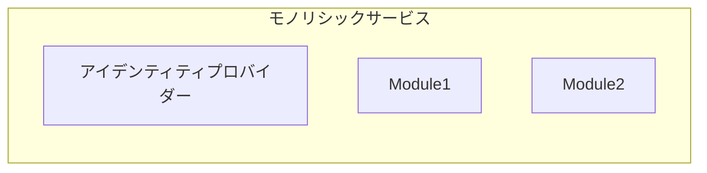

## アイデンティティプロバイダー (IdP) とは？

<Ref slug="iam" /> の領域では、アイデンティティプロバイダー (IdP) は、アイデンティティを管理するための中心的なサービスです。ユーザーの認証、アイデンティティトークンの発行、および <Ref slug="service-provider">サービスプロバイダー</Ref>（例：アプリケーション、サービス、API）にユーザー情報を提供する責任を持っています。

現代のアイデンティティプロバイダーは、<Ref slug="authentication" /> に加えて、<Ref slug="authorization" />（<Ref slug="access-control" /> ポリシーの強制）を担い、<Ref slug="single-sign-on" /> や <Ref slug="multi-tenancy" /> などの高度な機能をサポートします。

## アイデンティティプロバイダーの標準

アイデンティティ管理の性質と相互運用性の必要性から、標準なしでアイデンティティプロバイダーを構築することは非現実的で非効率です。典型的なシナリオは以下のとおりです：

- 2 つのアイデンティティプロバイダーがユーザー情報を交換するために通信する必要がある（例：ソーシャルログイン）。
- アプリケーションが複数のアイデンティティプロバイダーを使用してユーザーを認証する必要がある（例：フェデレーションアイデンティティ）。
- アイデンティティプロバイダーが複数のタイプのクライアントをサポートする必要がある（例：Web、モバイル、IoT）。

これらのシナリオに対処するために、業界ではアイデンティティプロバイダー向けにいくつかの人気のある標準が開発されました：

- <Ref slug="oauth-2.0" />: ユーザーやサービスに代わってアプリケーションがアクセスを取得できるようにする、広く使用されている認可フレームワーク。
- <Ref slug="openid-connect" />: 認証やユーザー情報を提供する OAuth 2.0 上に構築されたアイデンティティレイヤー。
- <Ref slug="saml" />: セキュリティドメイン間で認証および認可データを交換するための標準。

新しいアプリケーションには、アイデンティティプロバイダーの構築または既存のアイデンティティプロバイダーとの統合に OpenID Connect (OIDC) を使用することが推奨される標準です。

## アイデンティティプロバイダーのアーキテクチャ

「アイデンティティプロバイダー」という用語は、特定のアーキテクチャや実装を指しません。それはすなわち、アイデンティティプロバイダーはモノリシックアプリケーション、マイクロサービス、クラウドサービスにもなり得るということです。

アイデンティティ管理の複雑さと重要性により、現代のアプリケーションは、独立したサービスやベンダーソリューションとしての特化したアイデンティティプロバイダーを利用する傾向があります。

## アイデンティティプロバイダーの機能

現代のアイデンティティプロバイダーは、さまざまなユースケースや要件をサポートするために幅広い機能を提供しています。以下は一般的な機能です：

- <Ref slug="authentication" />: 様々な方法（例：ユーザー名/パスワード、ソーシャルログイン、<Ref slug="mfa" />）を使用してユーザーのアイデンティティを確認。
- <Ref slug="authorization" />: アクセスコントロールポリシーを強制し、ユーザーの権限を管理（例：<Ref slug="rbac" />、<Ref slug="abac" />）。
- **ユーザー管理**: ユーザーアカウントおよびプロファイルの作成、更新、削除。ユーザーデータを<Ref slug="service-provider">サービスプロバイダー</Ref>に提供。
- **トークン管理**: アイデンティティトークン（例：IDトークン、アクセストークン、リフレッシュトークン）の発行および管理。
- <Ref slug="single-sign-on" />: ユーザーが一度認証し、複数のアプリケーションにアクセスできるようにする。
- <Ref slug="multi-tenancy" />: 隔離されたユーザーデータや設定を持つ複数の組織やテナントをサポート。

<SeeAlso slugs={["service-provider", "iam", "openid-connect", "oauth-2.0"]} />

<Resources
  urls={[
    "https://blog.logto.io/secure-cloud-apps-with-oauth-and-openid-connect",
    "https://blog.logto.io/incorporate-identity-solution",
    "https://blog.logto.io/centralized-identity-system"
  ]}
/>
