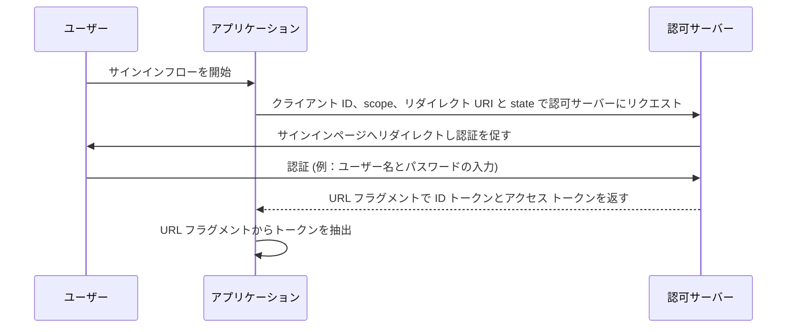

## インプリシットフロー (Implicit flow) とは

OIDC (OpenID Connect) のインプリシットフロー (implicit flow) は、主にブラウザでスクリプト言語を使用して実装されたクライアントアプリケーション、例えばシングルページアプリケーション (SPA) で使用される認証 (authentication) プロセスです。クライアントアプリケーションは、クライアント認証 (authentication) を行わずに認可サーバー (authorization server) から ID トークン (id token) やアクセス トークン (access token) を直接取得できます。

## インプリシットフロー (Implicit flow) はどのように動作するのか？

インプリシットフロー (implicit flow) の主なステップは以下の通りです：

1. **認証リクエストの送信**: ユーザーは通常、アプリケーション内のリンクやボタンをクリックしてサインインし、フローを開始します。アプリケーションは認可サーバー (authorization server) の認可エンドポイントに認証リクエストを送信します。認可サーバー (authorization server) はパラメーターを検証し、認可サーバーのサインインページでユーザーに認証 (authentication) を促すようリダイレクトします。
2. **ユーザー認証**: ユーザーは認可サーバー (authorization server) で認証を行います（例：ユーザー名とパスワードを入力）。
3. **認可サーバーが応答**: 認可サーバー (authorization server) は、クライアントアプリケーションに ID トークン (id token) および、要求された場合には、アクセス トークン (access token) を URL フラグメントとして返します。
4. **クライアントがトークンを処理**: クライアントアプリケーションは URL フラグメントからトークンを抽出します。



### 認証リクエスト (Authentication request)

リクエストパラメーターは以下の通りです：
- **client_id**: 必須。有効な OAuth 2.0 クライアント識別子であり、Logto ではアプリケーション ID (またはアプリ ID) として利用可能です。
- **scope**: 必須。ユーザーが認可サーバーから要求するリソースセットを指定する値です。例：`openid profile email`
- **response_type**: 必須。値は `id_token` または `id_token token` のいずれかです。値が `id_token` の場合、アクセス トークン (access token) は返されません。
- **redirect_uri**: 必須。認証レスポンスが送信される URI であり、クライアントが <Ref slug="openid-connect" headingId="openid-provider-op" /> に事前登録したリダイレクト URI と完全に一致する必要があります。例：Logto 管理コンソールの `Sign-in redirect URI`。
- **nonce**: 必須。再生攻撃を軽減するために使用されるランダムな文字列で、認証リクエストから ID トークンのクレームまで改変されずに渡されます。

### 認証リクエストの例

```bash
curl -X GET "https://authorization-server.com/auth" \
  -d "response_type=id_token token" \
  -d "client_id=YOUR_APPLICATION_ID" \
  -d "redirect_uri=https://yourapp.com/callback" \
  -d "scope=openid profile email" \
  -d "nonce=RANDOM_STRING"
```

## 制限事項

インプリシットフロー (implicit flow) は、ブラウザが広く Cross-Origin Resource Sharing (CORS) をサポートしていなかった時代に開発されました。そのため、異なるドメインにホストされた認可サーバー (authorization server) への POST リクエストの送信が禁止されています。

この制限のため、認可サーバー (authorization server) はトークンを URL フラグメントで直接返し、それをエンドユーザーやユーザーエージェントにアクセス可能なアプリケーションに露出させる可能性があります。

さらに、インプリシットフロー (implicit flow) ではクライアント認証 (authentication) が行われないため、ブラウザベースのアプリケーションではクライアント ID が常に露出しているため、任意のアプリケーションがそのクライアントになりすまして認証を要求することができます。

これらの制限により、インプリシットフロー (implicit flow) は通常、認可コードフロー (Authorization Code Flow) よりもセキュリティが低いと見なされます。

## インプリシットフロー (Implicit flow) の代替手段

インプリシットフロー (implicit flow) のセキュリティ上の制限を考慮すると、他のフローが推奨されることが多いです：
- **認可コードフロー (Authorization Code Flow)**: このフローでは、クライアントが認可コードをトークンに交換する追加のステップが含まれており、より高いレベルのセキュリティを提供します。
- **PKCE (Proof Key for Code Exchange)**: 認可コードフロー (Authorization Code Flow) に追加のセキュリティ層を追加する拡張機能であり、コードベリファイアとコードチャレンジを使用します。

<SeeAlso slugs={['device-flow', 'authorization-code-flow', 'client-credentials-flow']} />

<Resources
  urls={[
    "https://blog.logto.io/implicit-flow-is-dead",
    {
      url: "https://tools.ietf.org/html/rfc6749#section-4.2",
      result: {
        ogTitle: "The OAuth 2.0 Authorization Framework: Implicit Grant",
        ogDescription: "The implicit grant type is used to obtain access tokens (it does not support the issuance of refresh tokens) and is optimized for public clients known to operate a particular redirection URI. These clients are typically implemented in a browser using a scripting language such as JavaScript."
      }
    },
    "https://openid.net/specs/openid-connect-core-1_0.html",
  ]}
/>
