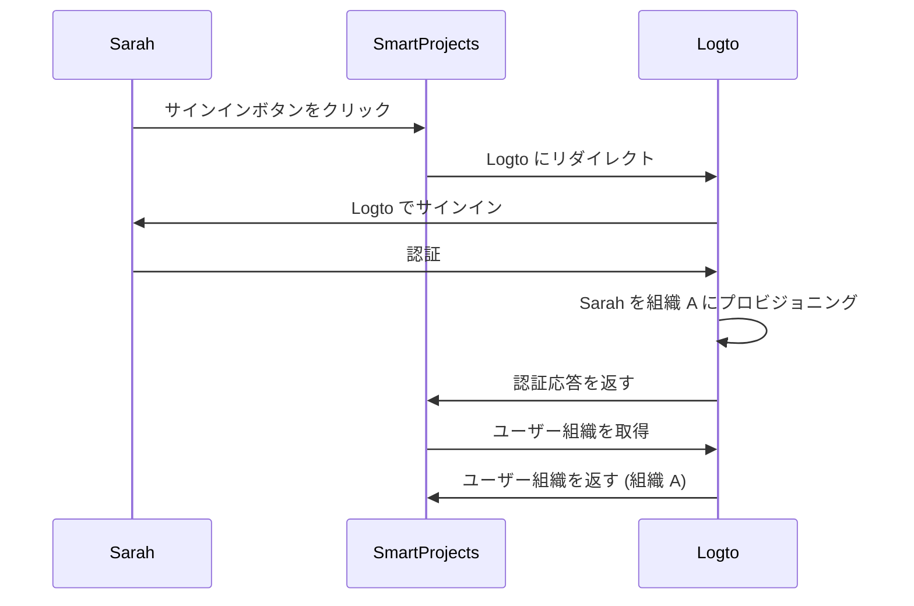
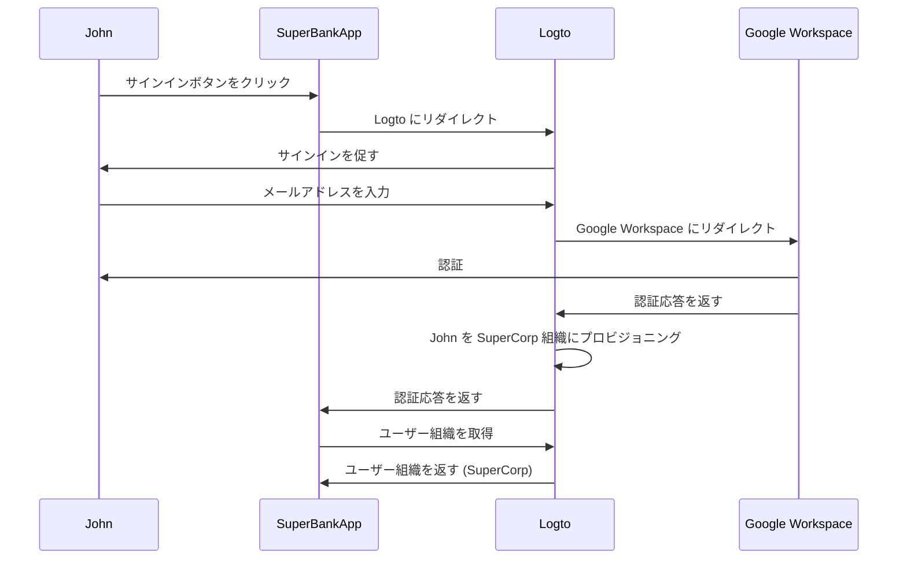

## ジャストインタイムプロビジョニングとは？

ジャストインタイム (JIT) プロビジョニングは、ユーザーが初めてサインインを試みる際に、ユーザーのアイデンティティとシステムの設定に基づいてオンザフライでユーザーアカウントがプロビジョニングされる<Ref slug="iam" />で使用されるプロセスです。

## ジャストインタイムプロビジョニングのユースケースは何ですか？

これらのケースは、マルチテナントアーキテクチャ、Enterprise SSO、またはチームのオンボーディング機能を必要とする B2B アプリを構築する際によく見られます。ここに、あなたやあなたのクライアントが遭遇する可能性のあるいくつかのシナリオを示します。

### 従業員のオンボーディング

クライアントの一つである*SuperFantasy*が頻繁に採用を行ったり急成長を遂げていると想像してください。JIT プロビジョニングを使用して新しい従業員のユーザーアカウントを迅速に設定できます。*SuperFantasy*はアイデンティティおよびアクセス管理に Logto を使用し、プロジェクト管理には SmartProjects を使用しています。新しい従業員である Sarah が SmartProjects に初めてサインインすると、彼女のアカウントは自動的に作成され、Logto の資格情報に基づいて設定されます。

上記の図によれば、Sarah が SmartProjects に初めてサインインすると、彼女のアカウントは Logto の組織 A に自動的にプロビジョニングされます。このプロセスにより、IT チームの手動介入を必要とせずに、Sarah が SmartProjects に必要なアクセスを確保できます。

### 企業顧客のオンボーディング

別のクライアントである*SuperBank*が顧客にオンラインバンキングサービスを提供する金融機関であると想像してください。*SuperBank*はアイデンティティおよびアクセス管理に Logto を使用し、オンラインバンキングには SuperBankApp を使用しています。*SuperBank*は最近、新しい企業顧客である*SuperCorp*と契約を結び、その従業員にオンラインバンキングサービスを提供することになりました。

*SuperCorp*は従業員アカウントに Google Workspace を使用しています。SuperBankApp は、*SuperCorp* の従業員が初めてサインインしたときに、そのアカウントが Logto の *SuperCorp* 組織に自動的に追加されることを確認する必要があります。

上記の図では、John が SuperBankApp に初めてサインインすると、彼のアカウントは Google Workspace のアイデンティティに基づいて Logto の SuperCorp 組織に自動的にプロビジョニングされます。

## これは SAML と Enterprise SSO に特有のものですか？

ジャストインタイム (JIT) プロビジョニングは、SAML 認証における<Ref slug="enterprise-sso" />と関連付けられることが多いですが、<Ref slug="saml" />に限定されるものではありません。JIT プロビジョニングは、<Ref slug="oauth-2.0" />や<Ref slug="openid-connect" />などの他の認証プロトコルでも使用でき、必ずしも<Ref slug="enterprise-sso" />のセットアップを必要としません。

例えば、メールベースの JIT プロビジョニングは、<Ref slug="identity-provider" />がこの機能をサポートしている場合に使用できます。この場合、プロビジョニングに必要な属性はユーザーのメールアドレスだけであり、認証プロトコルや SSO 構成に関係なく使用できます。

## これはアプリの新規ユーザーまたは既存ユーザーに適用されますか？

ジャストインタイム (JIT) プロビジョニングは一般的にアプリへの初回アクセスを指します。ただし、異なる製品はこの機能を異なる方法で認識します。あるものは JIT プロビジョニングをアイデンティティとアカウントの作成にのみ使用し、他のものは再プロビジョニングや属性同期などのジャストインタイムアカウント更新も含みます。

例えば、SAML JIT プロビジョニングは、プロビジョニングの一部としてグループメンバーシップの付与と取り消しを可能にします。また、プロビジョニングされたユーザーを更新して、<Ref slug="service-provider" />ストアの属性を<Ref slug="identity-provider" />ユーザーストアの属性と同期させることもできます。

既存ユーザーのサインインシナリオを考慮したい場合は、JIT システムと共に堅牢なプロビジョニングシステムを持つことを確認してください。例えば：

- **コンフリクト解決**: JIT プロセス中に IdP から提供された情報と異なる情報を持つアカウントが既に存在する場合、コンフリクトを処理するための戦略を持つべきです。これは、組織のポリシーと IdP 構成の詳細な管理を必要とするかもしれません。
- **監査証跡**: 新しいアカウントの作成と JIT プロセスを通じた既存アカウントの更新の両方のログを保持することは、セキュリティとコンプライアンスの理由から重要です。
- **パフォーマンス**: JIT プロビジョニングは迅速に行われますが、特に既存ユーザーの情報を各サインイン時に更新する場合、サインイン時間への潜在的な影響を考慮してください。
- **データの一貫性**: 特に既存のユーザーアカウントを更新する際に、JIT プロビジョニングプロセスがデータの一貫性を維持することを確認してください。

## JIT とシステム間アイデンティティ管理 (SCIM) の違いは何ですか？

SCIM は、異なるシステムやドメイン間でユーザーアイデンティティ管理を簡素化し自動化するために設計されたオープンスタンダードプロトコルです。ディレクトリ同期シナリオで一般的に使用されます。

JIT と SCIM の主な違いは、JIT はアプリへの初回アクセス (または新規ユーザーのオンボーディング) を指すことが多く、ユーザーアカウントを動的にプロビジョニングするプロセスを説明する広義の用語であるのに対し、SCIM はシステム間でのユーザーライフサイクル管理のための特定のプロトコルであり、初回サインインに限定されないことです。

さらに、JIT はシステム間で標準化された実装が欠けているのに対し、SCIM はアイデンティティ管理のために定義された標準化されたプロトコル [RFC 7644](https://datatracker.ietf.org/doc/html/rfc7644) です。

一部の大規模組織は、アカウントプロビジョニングに SCIM を使用し、自社のシステムと統合しています。これは非常に複雑で、ケースバイケースで異なる場合があります。ほとんどのユースケースでは、JIT プロビジョニングはよりシンプルで直接的なアプローチです。

<Resources urls={['https://blog.logto.io/jit-provisioning', 'https://datatracker.ietf.org/doc/html/rfc7644']} />