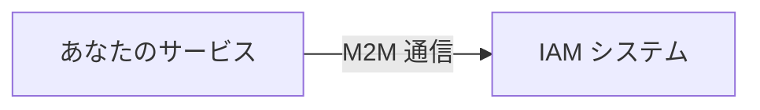
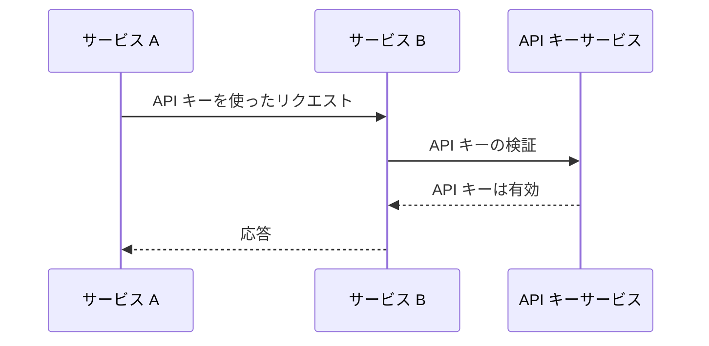
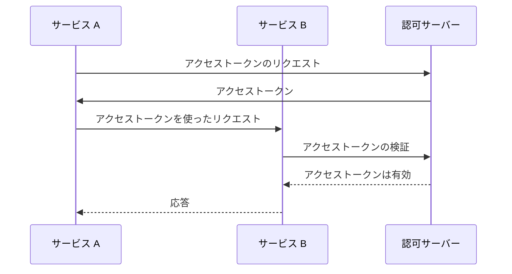
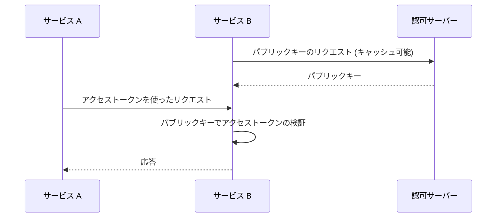

## マシン間通信とは何か？

マシン間通信 (Machine-to-machine, M2M) は、デバイス間で人間の介入なしに自動的にデータが交換されることを指します。認証 (Authentication) と認可の文脈では、M2M 通信にはリソースにアクセスする必要があるクライアントアプリケーションが関与することが多く、そのクライアントアプリケーションは機械 (サービス) であるか、ユーザーの代理として行動する機械です。

## なぜマシン間通信に対応する必要があるのか？

1つのサービスしかなく、依存関係がない場合は、他のサービスと通信する必要はないかもしれません。しかし、システムが成長したり、IDおよびアクセス管理システムと統合したい場合には、マシン間通信を処理する必要があります。

しかし、実際にはサービスを特定して認証 (Authentication) するだけではなく、以下のような複数の課題に対応しなければなりません。

### 1. 認証 (Authentication)

サービスをどのように認証 (Authentication) しますか？ユーザー名とパスワードを使用することはできません。なぜなら、それを入力する人間がいないからです。API キー (api key)、クライアント証明書、または OAuth クライアントクレデンシャル (client credentials) など、別のメカニズムを使用する必要があります。

### 2. 認可 (Authorization)

サービスを認証 (Authentication) した後、サービスが何をできるかをどのように判断しますか？ユーザーに対して定義するのと同様に、サービスに対する権限と役割 (role) を定義する必要があります。最終的に求められるのは、コードに権限をハードコードしないことです。

### 3. セキュリティ

サービス間の通信が安全であることをどのように保証しますか？資格情報は定期的に更新されますか？通信をどのように監視し、監査しますか？

### 4. スケーラビリティ

サービスの数が増えるにつれて、各サービスの認証 (Authentication) と認可をどのように管理しますか？

## マシン間通信への一般的なアプローチ

これらの課題を考慮し、業界ではいくつかの一般的なアプローチがあります。

### 1. API キー (api key)

<Ref slug="api-key">API キー</Ref> はサービスを認証 (Authentication) するためのシンプルな方法です。各サービスは1つ以上の API キーを持つことができ、認証 (Authentication) (および時には認可 (Authorization)) に使用されます。API キーをリクエストヘッダーに提供するように求められるサービスもあります。例えば `X-API-Key: your-api-key` のように。

API キーの動作の非標準的な例：

利点：

- 実装と使用が簡単。
- 安全なランダム生成と十分な長さが伴えば、API キーは推測が困難。
- 検証は動的なので、API キーをいつでも取り消せる。

欠点：

- API キーの検証にはネットワーク通信が必要。
- 自己完結型ではなく、トークン検査のためのサービスが必要。
- 他のサービスは API キーを保持するサービスと同じレベルのアクセス権を持つ（API ゲートウェイの使用で部分的に緩和可能）。
- 多くのサービス間で多数の API キーを管理するのは難しい。

### 2. OAuth クライアントクレデンシャル (client credentials)

OAuth (または OIDC、OpenID Connect は OAuth 2.0 に基づく) <Ref slug="client-credentials-flow" /> はサービスを認証 (Authentication) するためのより高度な方法です。これは広く使用されている OAuth 2.0 フレームワークに基づいており、ユーザーの認証 (Authentication) および認可 (Authorization) に使用されます。OAuth クライアントクレデンシャルを用いることで、サービスはクライアントIDとクライアントシークレットを認可 (Authorization) サーバーに提示することでアクセストークン (access token) を取得できます。

OAuth クライアントクレデンシャルの動作の非標準的な例：

通常、アクセストークン (access token) は JSON Web Token (JWT) であり、サービスとその権限に関する情報が含まれています。他のサービスは認可 (Authorization) サーバーと通信することなく、アクセストークン (access token) を検証できます（JWT 署名を検証するパブリックキーを持っている限り）。ワークフローは次のようになります：

JSON Web Tokens の詳細については、<Ref slug="jwt" /> を参照してください。

利点 (JWT を使用する場合)：

- 自己完結型であり、他のサービスが追加のネットワーク通信なしに権限などの必要な情報を即座に知ることができます。
- アクセストークン (access token) は短命にでき、悪用のリスクを減らします。
- 他のサービスはクライアントシークレットを知る必要はなく、JWT 署名を検証するためのパブリックキーのみが必要です。
- アクセストークン (access token) は、サービスのアクションを監査するのに使用できます(例えば、どのサービスがどのリソースにアクセスしたか)。
- 多数のサービスを管理しやすく、サービスと権限の間に明確な境界を設定します。

欠点：

- API キーよりも少し実装と使用が複雑。
- 他のサービスがオフライン検証のみを行う場合、アクセストークン (access token) が取り消されているかどうか分からないかもしれません。

### 3. Mutual TLS (mTLS)

Mutual TLS (mTLS) は、クライアント証明書を使用してサービスを認証 (Authentication) する方法です。mTLS では、各サービスがプライベートキー付きのクライアント証明書を保持し、他のサービスはパブリックキーを使用して証明書を検証します。しかし、mTLS は TLS レイヤーのみに焦点を当てているため、アプリケーションレベルの認証 (Authentication) と認可 (Authorization) には通常適していません。

高度なユースケースでは、mTLS を証明書にバインドされたアクセストークン (access token) と組み合わせて通信をさらに安全にすることができます。[RFC 8705: OAuth 2.0 Mutual-TLS Client Authentication and Certificate-Bound Access Tokens](https://datatracker.ietf.org/doc/html/rfc8705) を参照してください。

利点：

- パブリックキー暗号化に基づくため、強力な認証 (Authentication)。
- 通信はデフォルトで暗号化され、セキュア。
- クライアント証明書は、JWT が機能する方法と同様にサービスを識別するために使用できます。

欠点：

- API キーおよび OAuth クライアントクレデンシャル (client credentials) よりも複雑な実装と管理。
- クライアント証明書は定期的に更新する必要があります。
- クライアント証明書を適切に管理するためにはより高度な技術的知識が必要。
- 他のサービスが mTLS をサポートしていない場合、フォールバックメカニズムを用意する必要があります。

<SeeAlso slugs={["api-key", "client-credentials-flow", "jwt"]} />