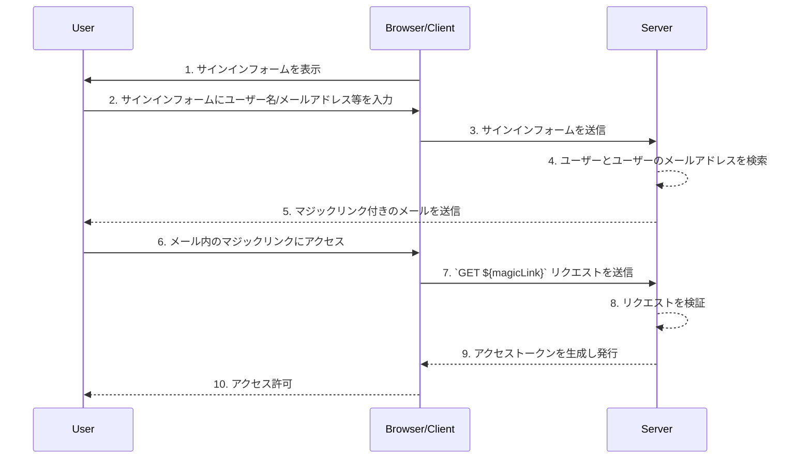

## マジックリンクとは何ですか？

マジックリンクは、認証プロセス中にユーザーに送信される一回限り使用可能なリンクです。

このリンクにアクセスすることで、ユーザーは目的のリソースにアクセスするために必要なauthorization (認可) フローを完了し、適切なリソースへのアクセス権が与えられます。その後、マジックリンクは無効になります。

## マジックリンクとワンタイムパスワード (OTP) の違いは何ですか？

ユーザーがメールを使用してマジックリンクやOTPを受信すると仮定します。

多くの場合、ユーザーはログインを確認したり、MFA (多要素認証) の追加の確認要素としてOTPを受信するためにメールを使用します。メールのマジックリンクを使用することと、メールのOTPを使用することの違いは何ですか？

OTPを使用する場合、ユーザーはメールを確認し、OTPを覚えてから、ログイン/確認プロセスにそれを入力する必要があります。これには、異なるアプリやページ間を手動で何度も切り替える必要があります。

メールのマジックリンクを使用すると、ユーザーはメールアプリでマジックリンクを含むメールを開き、リンクをクリックするだけで済みます。これにより、より簡単なユーザーエクスペリエンスが提供されます。

さらに、マジックリンクを使用すると、リンクでワンタイムトークン以上の情報（ログイン用のセッション関連情報など）を含めることができ、セキュリティとユーザーエクスペリエンスの両方が向上する可能性があります。

## マジックリンクはどのように機能しますか？

このシーケンス図では、ユーザーがサインインし、マジックリンクを使用して適切なリソースにアクセスする方法を示します。

このシーケンス図では、マジックリンクがメールで送信されると仮定していますが、マジックリンクを送信する他の可能な方法があります（たとえば、携帯電話にテキストメッセージで送信するなど）。これらの代替方法は、フローがほとんど同じであるため、ここでは取り上げません。

1. **サインインフォームを表示**
   ブラウザ/クライアントが認証プロセスを開始し、ユーザーにサインインフォームを表示します。
2. **ユーザーがサインインフォームに入力**
   ユーザーは、サインインフォームにユーザー名、メールアドレス、電話番号などの識別子を入力します。提供された情報は、システムが一意のユーザーを特定するのに十分である必要があります。たとえば、ほとんどのシステムでは、サインイン用のユーザー名は一意です。その場合、ユーザーはアカウントを一意に特定するためにユーザー名だけを提供すればよいです。
3. **サインインフォームの送信**
   ブラウザ/クライアントは、ステップ2で説明されたユーザー情報を含むフォームをサーバーに送信します。
4. **ユーザーとメールを検索**
   サーバーはリクエストを処理し、データベース内の一意のユーザーを見つけて、そのユーザーに関連付けられたメールアドレスを取得します。
5. **マジックリンクを含むメールの送信**
   サーバーはユーザーのメールアドレスにマジックリンクを含むメールを送信します。このメールには認証用のマジックリンクが含まれています。
6. **ユーザーがマジックリンクにアクセス**
   ユーザーはメールを受信し、そこに記載されたマジックリンクをクリックします。
7. **マジックリンクを使用してGETリクエストを送信**
   ブラウザ/クライアントは、マジックリンクのURLを使用してサーバーに`GET`リクエストを送信します。
8. **リクエストの検証**
   サーバーは、マジックリンクが有効で、未使用かつ未期限切れであることを確認するためにリクエストを検証します。
9. **アクセストークンの生成と発行**
   リクエストが検証されると、サーバーはアクセストークンを生成し、ブラウザ/クライアントに発行します。
10. **アクセス許可の付与**
    ブラウザ/クライアントはアクセストークンを受け取り、ユーザーに要求されたリソースへのアクセスを許可します。

## マジックリンクの利点は何ですか？

マジックリンクは、トークンベースのインタラクションモデルを採用することにより、認証システムのセキュリティアーキテクチャを強化します。各リンクは個別に暗号化されており、通常は有効期限を含んでいます。その一時的な性質のため、マジックリンクが傍受されたり漏洩したりしても、その短い有効期限により悪意のある利用の機会は制限されます。

さらに、マジックリンクを使用すると、信頼されたメールアドレスや電話番号などのユーザーが管理する受信方法が必要となり、ユーザー名やパスワードを超えた追加の検証方法が提供されます。これにより追加のアカウントセキュリティが提供されます。また、マジックリンクを使用することで、ユーザーは認証情報を入力する必要がなくなり、アカウントのセキュリティが向上し、プロセスがより便利になります。
