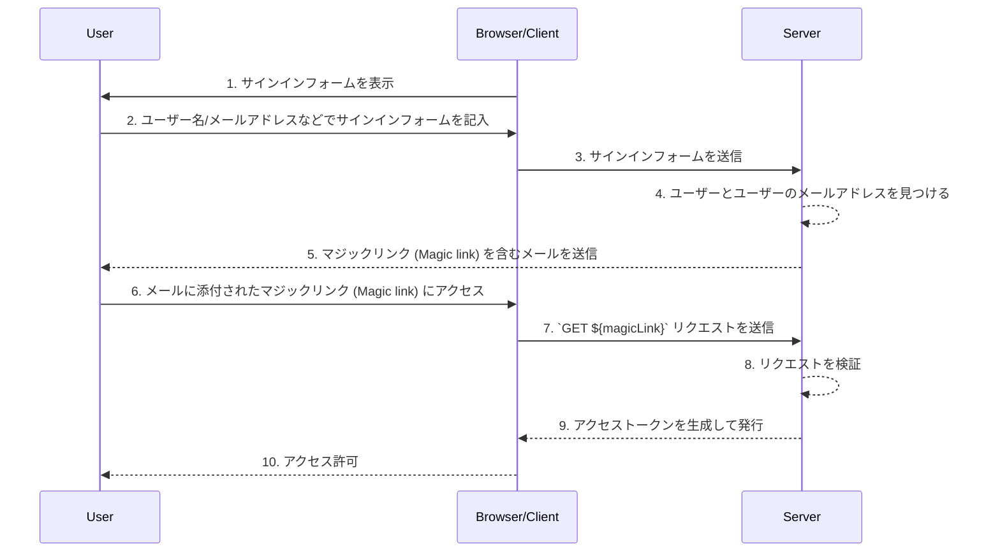

## マジックリンク (Magic link) とは何ですか？

マジックリンク (Magic link) は、認証プロセス中にユーザーに送信される一度限りのリンクです。

このリンクにアクセスすることで、ユーザーは目的のリソースにアクセスするために必要な認可フローを完了し、適切なリソースへのアクセスが許可されます。その後、マジックリンク (Magic link) は無効になります。

## マジックリンク (Magic link) とワンタイムパスワード (OTP) の違いは何ですか？

ユーザーがメールを使用してマジックリンク (Magic link) または <Ref slug='otp' /> を受け取ると仮定します。

多くの場合、ユーザーはログインを確認するため、または <Ref slug='mfa' /> の追加の確認要素として、OTP を受け取るためにメールを使用します。メールマジックリンク (Magic link) とメール OTP を使用する違いは何ですか？

OTP を使用する場合、ユーザーはメールを確認し、OTP を覚えてから、ログイン/確認プロセスでそれを入力する必要があります。これには、ユーザーが異なるアプリやページ間を手動で繰り返し切り替える必要があります。

メールマジックリンク (Magic link) を使用する場合、ユーザーはメールアプリでマジックリンク (Magic link) を含むメールを開き、リンクをクリックするだけで済みます。これにより、より簡単なユーザー体験が提供されます。

さらに、マジックリンク (Magic link) を使用すると、リンク内にワンタイムトークン以上の情報、たとえばログインのためのセッション関連情報を含めることができます。これにより、セキュリティとユーザー体験の両方が向上します。

## マジックリンク (Magic link) はどのように機能しますか？

このシーケンス図では、ユーザーがサインインし、マジックリンク (Magic link) を使用して適切なリソースにアクセスする方法を示しています。

このシーケンス図では、マジックリンク (Magic link) がメールで送信されると仮定しています。ただし、マジックリンク (Magic link) を送信する他の方法もあります。たとえば、携帯電話にテキストメッセージで送信する方法です。これらの代替方法は、フローがほぼ同じであるため、ここでは取り上げません。

1. **サインインフォームを表示**  
ブラウザ/クライアントが認証プロセスを開始し、ユーザーにサインインフォームを表示します。
2. **ユーザーがサインインフォームを記入**  
ユーザーは、ユーザー名、メールアドレス、電話番号などの識別子をサインインフォームに入力します。  
提供された情報は、システムが一意のユーザーを識別するのに十分である必要があります。たとえば、ほとんどのシステムでは、サインインに使用されるユーザー名は一意です。そのようなシステムでは、ユーザーはサインインしたいアカウントを一意に識別するために、ユーザー名を提供するだけで済みます。
3. **サインインフォームを送信**  
ブラウザ/クライアントは、ステップ2で説明されたユーザーの情報を含むフォームをサーバーに送信します。
4. **ユーザーとメールを見つける**  
サーバーは、データベース内の一意のユーザーを見つけ、ユーザーに関連付けられたメールアドレスを取得することでリクエストを処理します。
5. **マジックリンク (Magic link) を含むメールを送信**  
サーバーは、ユーザーのメールアドレスにメールを送信します。このメールには、認証のためのマジックリンク (Magic link) が含まれています。
6. **ユーザーがマジックリンク (Magic link) にアクセス**  
ユーザーはメールを受け取り、その中に提供されたマジックリンク (Magic link) をクリックします。
7. **マジックリンク (Magic link) で GET リクエストを送信**  
ブラウザ/クライアントは、マジックリンク (Magic link) のURLを使用してサーバーに `GET` リクエストを送信します。
8. **リクエストを検証**  
サーバーは、マジックリンク (Magic link) が有効で、使用されておらず、有効期限が切れていないことを確認するためにリクエストを検証します。
9. **アクセストークンを生成して発行**  
リクエストが検証されると、サーバーはアクセストークンを生成し、ブラウザ/クライアントに発行します。
10. **アクセス許可**  
ブラウザ/クライアントはアクセストークンを受け取り、ユーザーが要求されたリソースにアクセスできるようにします。

## マジックリンク (Magic link) の利点は何ですか？

マジックリンク (Magic link) は、トークンベースのインタラクションモデルを採用することで、認証システムのセキュリティアーキテクチャを強化します。各リンクは一意に暗号化されており、通常、有効期限のタイムスタンプが含まれています。その一時的な性質により、マジックリンク (Magic link) が傍受されたり漏洩したりしても、その短い有効期間が悪意のある利用の機会を制限します。

さらに、マジックリンク (Magic link) を使用するには、信頼できるメールアドレスや電話番号など、ユーザーが管理する受信方法が必要であるため、ユーザー名とパスワードを超えた追加の確認方法を提供し、アカウントのセキュリティを強化します。また、マジックリンク (Magic link) を使用することで、資格情報を入力する必要がなくなるため、ユーザーのアカウントセキュリティがより良く保護され、プロセスがより便利になります。