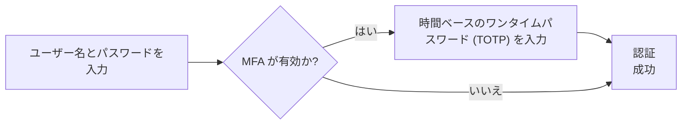
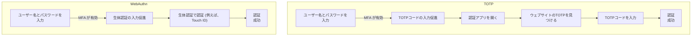

## マルチファクター認証 (MFA) とは？

マルチファクター認証 (MFA) は、ユーザーが自分の身元を確認するために複数の形式の識別を提供することを要求することでセキュリティを強化します。これは、<Ref slug="authentication" /> プロセスに追加のセキュリティ層を追加し、攻撃者が認可されていないアクセスを得ることをより困難にします。

以下はMFAの例です:

### 「ファクター」の定義

上記の例では、2つのファクターがあります:

1. ユーザー名とパスワード
2. モバイルアプリからの <Ref slug="totp" />

それぞれのファクターは、ユーザーを認証するために使用できる異なるカテゴリの資格情報を表します（あなたがあなたであることを証明する）。実際には、ファクターは主に3つのタイプに分類できます:

|            | 意味               | 検証ファクター                                                       |
| ---------- | ------------------ | -------------------------------------------------------------------- |
| 知識       | 知っていること     | パスワード、メール検証コード、バックアップコード                      |
| 所持       | 持っているもの     | SMS検証コード、認証アプリOTP、ハードウェアOTP (セキュリティキー)、スマートカード |
| 属性       | 自分自身であること | 指紋や顔IDなどの生体認証                                            |

一般的なMFAのセットアップでは、異なるカテゴリから2つのファクターを組み合わせます。例えば、パスワード (知識) と認証アプリからの <Ref slug="totp" /> (所持) などです。

### なぜMFAが重要なのか？

> 完璧なセキュリティというものは存在せず、不完全さのレベルが異なるだけです。 — サルマン・ラシュディ

MFAの重要性は、99.22%の全体的なリスク削減と漏洩された資格情報の98.56%削減に示されています[^1]。MFAの助けにより、機密データへのアクセスや金融取引の実行など、より重要な操作を自信を持って行うことができます。これは、単純なパスワードや単一ファクター認証よりもはるかに高いレベルのセキュリティを提供するシンプルで効果的な方法です。

## 現代アプリケーションにおけるMFA

名前が示すように、MFAは2つ以上のファクターを含むことがあります。ファクターの数が増えるにつれ、セキュリティレベルが向上し、認証プロセスの複雑さが増し、ユーザーフレンドリーでなくなる可能性があります。<Ref slug="totp" /> は近年人気の選択肢ですが、新しい技術である <Ref slug="passkey" /> はさらに安全でユーザーフレンドリーなMFA体験を提供するために出現しています。

例えば、現代のアプリケーションでは、<Ref slug="webauthn" /> API を使用して、パスキーを用いたMFAを実装することがあります。これらはフィッシングに強く、公開鍵暗号によって保護されています。Appleのような企業は、生体認証 (Touch ID, Face ID) を用いたパスキーの統合を提供しており、MFAプロセスに属性ファクターを追加し、セキュリティとユーザーの利便性を向上させています。

より良い理解のために、簡単に比較してみましょう。ユーザーが以下を持っていると仮定します:

1. スマホにインストールされた認証アプリで生成したTOTPコード。
2. デバイスの生体認証と統合されたパスキー。

彼らがラップトップにMFAを有効にしたウェブサイトにサインインするとき、2つのプロセスはこのようになります:

WebAuthnプロセスがより少ないステップで、ユーザーにとって非常に短時間であることが明らかです。さらに、Appleのような企業はデバイス間（例えば、iPhone、iPad、Mac）でのパスキーの同期をサポートしており、高いセキュリティレベルを維持しつつ、MFAプロセスをスムーズにしています。

## セキュリティ上の考慮事項

MFAを実装する際には、次のセキュリティ上の考慮事項を考慮する必要があります:

- 異なるカテゴリからのファクターを組み合わせて、より高いセキュリティレベルを確保します。例えば、パスワード (知識) とTOTPコード (所持) を組み合わせるなど。
- SMSをMFAファクターとして使用するのは避けます。SIMスワッピング攻撃に注意してください。
- リカバリーオプションはMFAをバイパスしてはいけません。例えば、ユーザーが認証アプリを失った場合、バックアップコードや他のMFAファクターを使用してアクセスを回復する必要があります。
- ブルートフォース攻撃を防ぐために、失敗したMFA試行の間にクールダウン期間を導入します。

[^1]: [マルチファクター認証はサイバー攻撃を抑止するのにどれほど効果的か？](https://query.prod.cms.rt.microsoft.com/cms/api/am/binary/RW166lD)

<SeeAlso slugs={["totp", "webauthn", "passkey"]} />

<Resources
  urls={[
    "https://blog.logto.io/elaborate-mfa",
    "https://blog.logto.io/web-authn-and-passkey-101",
    "https://blog.logto.io/webauthn-base-knowledge",
  ]}
/>
