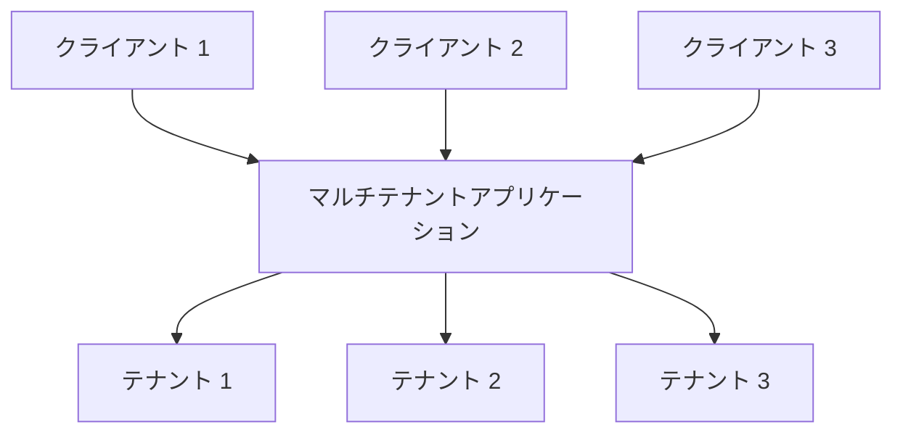
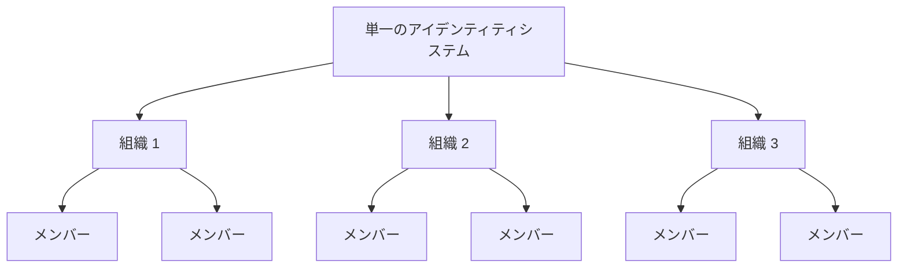

## マルチテナンシーとは？

ソフトウェアのマルチテナンシーは、単一のソフトウェアインスタンスがサーバー上で実行され、複数のテナントにサービスを提供するソフトウェアです。このように設計されたシステムは「共有」されており（「専用」や「分離」ではありません）。

テナントとは、特定の権限を持ってソフトウェアインスタンスに共通のアクセスを共有するユーザーのグループです。

例えば、CRM（顧客関係管理）システムは、すべてのクライアントに同じサービスを提供するために、マルチテナントアーキテクチャを使用することがよくあります。

マルチテナンシーの重要な原則は「共有」です。これは、ソリューションのすべての部分が共有されるという意味ではなく、少なくともいくつかのコンポーネントが複数のテナント間で再利用されることを意味します。この広範な概念を理解することで、クライアントのニーズにより適切に対応できるようになります。

## マルチテナント製品のユースケースは何ですか？

マルチテナントアプリは、生産性ツールやコラボレーションソフトウェアなどのソフトウェア・アズ・ア・サービス（SaaS）製品で一般的に使用されます。このセットアップでは、各「テナント」は通常、複数のユーザー（通常は従業員）を持つビジネス顧客を表します。異なる製品では、文脈に応じてテナント、ワークスペース、またはプロジェクトと呼ばれることがあります。単一の企業が異なる部門や組織を表すために複数のテナントを持つこともあります。

SaaSを超えたB2Bアプリケーションのようなより複雑なケースでは、マルチテナントアプリは、さまざまなチーム、ビジネスクライアント、パートナー企業がサービスにアクセスするための共有プラットフォームを提供します。

## SaaS製品にマルチテナンシーを採用すべき理由

### マルチテナンシーによるスケーリング

エンタープライズビジネスにとって、マルチテナンシーは可用性、リソース管理、コスト管理、データセキュリティの要件を効果的に満たすための鍵です。技術的なレベルでは、マルチテナントアプローチを採用することで、開発プロセスが合理化され、技術的な課題が最小限に抑えられ、シームレスな拡張が促進されます。

### 統一された体験の創造

SaaS製品のルーツを考えると、それはさまざまなアパートを持つ建物に似ています。すべてのテナントは水、電気、ガスなどの共通のユーティリティを共有していますが、自分のスペースとリソースを管理する独立したコントロールを維持しています。このアプローチは物件管理を簡素化します。

### テナント分離によるセキュリティの確保

マルチテナンシーアーキテクチャでは、「テナント」という用語が導入され、共有インスタンス内で異なるテナントのリソースとデータを分離して保護する境界を作成します。これにより、各テナントのデータと操作が別々で安全に保たれ、同じ基盤リソースを利用していても安全です。

## マルチテナンシーアーキテクチャでテナント分離を達成する方法は？

マルチテナントアプリケーションについて議論する際には、常に**テナント分離**を達成する必要があります。これは、異なるテナントのデータとリソースを共有システム（例えば、クラウドインフラストラクチャやマルチテナントアプリケーション）内で分離して安全に保つことを意味します。これにより、他のテナントのリソースへの不正なアクセス試行が防止されます。

### テナント分離はマルチテナンシーの「共有」概念と一致する

これは、テナント分離が必ずしもインフラストラクチャリソースレベルの構造ではないためです。マルチテナンシーと分離の領域では、一部の人々は分離を実際のインフラストラクチャリソース間の厳密な区分と見なしています。これは通常、各テナントが別々のデータベース、コンピューティングインスタンス、アカウント、またはプライベートクラウドを持つモデルにつながります。共有リソースのシナリオでは、マルチテナントアプリのように、分離を達成する方法は論理的な構造であることがあります。

### Authenticationとauthorizationは「分離」とは等しくない

SaaS環境へのアクセスを制御するためにauthenticationとauthorizationを使用することは重要ですが、それは「分離」を保証するものではありません。分離とは、異なるユーザーやデータセットを分けて、一人のユーザーのデータやアクションが他のユーザーに干渉したりアクセスされたりしないようにすることを意味します。

例えば、ユーザーがログインして権限を定義するトークンを受け取るauthenticationとauthorizationを設定しても、これによりセキュリティは向上しますが、ユーザーが完全に分離されていることを保証するものではありません。「分離」を達成するためには、別の文脈を導入する必要があります。

### SaaS製品のテナントを表す文脈として「組織」を使用し、テナント分離を達成する

Authenticationとauthorizationだけでは、適切なroleを持つユーザーが他のテナントのリソースにアクセスするのを防ぐことはできません。アクセスを制限するためには、「テナント」コンテキスト、例えばテナントID、組織ID、またはワークスペースIDを追加する必要があります。これらの識別子は、テナントを分ける壁、ドア、鍵のように機能します。

「組織」という用語は、テナント分離のためによく使用されます。多くの<Ref slug="identity-provider" />は、統一されたアイデンティティシステムを維持しながらテナントを分離するのに役立つ「組織」機能を含んでいます。組織内のユーザーは「メンバー」と呼ばれます。

## マルチテナントアプリでのアイデンティティ管理はどのように行われるか？

最初の重要な質問は、ビジネスや製品の一部が別々のアイデンティティシステムを必要とするかどうかを考えることです。これがシステム設計の指針となります。以下に2つの例を示します：

1. 単一のアイデンティティシステム：単一の人物が同じアイデンティティシステム内で2つのアイデンティティを持つことができます。例えば、サラは個人のメールを登録し、<Ref slug="enterprise-sso" />を通じて接続された企業のメールも使用することがあります。
2. 複数のアイデンティティシステム：ユーザーは、完全に無関係な製品のために別々のアイデンティティシステムで2つの異なるアイデンティティを持つこともできます。

ほとんどのマルチテナントアプリでは、アイデンティティは通常単一のプールで管理され、各テナントのリソースは分離されています。

## マルチテナントアプリの計画と構築に関する考慮事項

1. モデルに焦点を当てる：B2BまたはB2C。
2. アイデンティティ管理タスクを誰が担当するか：開発者、クライアントの管理者、またはエンドカスタマー？
3. B2Bの場合、クライアントが組織のアイデンティティを管理する必要があるか？
4. 組織のために定義する必要があるpermission (<Ref slug="scope" />) と<Ref slug="role" />を特定する。
5. クライアントが<Ref slug="enterprise-sso" />を必要とするか？
6. 招待状などのコラボレーション機能を追加することを検討する。

<Resources
  urls={[
    "https://blog.logto.io/implement-multi-tenancy",
    "https://blog.logto.io/multi-tenant-ultimate-guide",
    "https://blog.logto.io/case-study-multi-tenancy",
    "https://blog.logto.io/multi-tenancy-explained",
    "https://blog.logto.io/are-multi-tenant-apps-equal-saas",
    "https://blog.logto.io/tenancy-models",
    "https://blog.logto.io/do-you-need-multiple-tenants-identity-model",
  ]}
/>