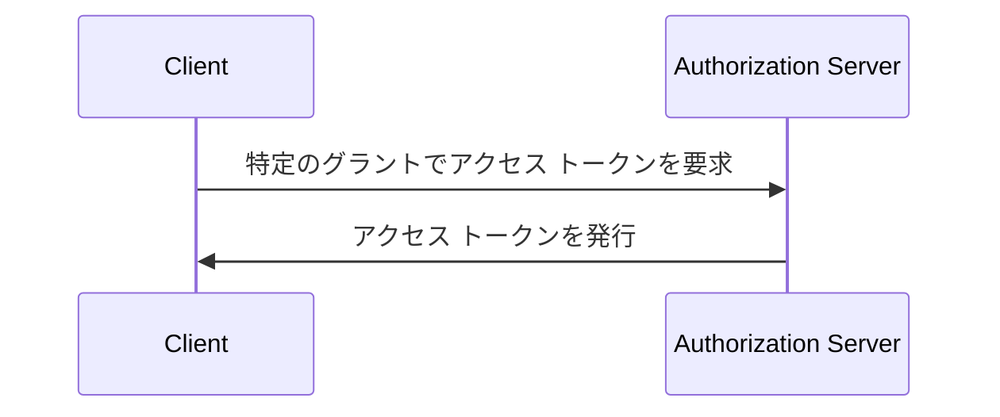

## OAuth 2.0 認可グラント (Grant)とは？

OAuth 2.0 認可グラント (Grant) は、<Ref slug="client" /> が <Ref slug="authorization-server" /> から <Ref slug="access-token" /> を要求する認可プロセスです。この概念に関連して他の用語も耳にすることがあるので、その詳細に入る前に明確にしておきましょう：

- **OAuth 2.0 グラント (Grant)**: "OAuth 2.0 grant type"、"OAuth 2.0 flow"、"OAuth 2.0 authorization grant" とも呼ばれることがあります。多くの文脈では、これらの用語は同じ概念を指します。
- <Ref slug="authorization-server" />: クライアントにアクセス トークンを発行するサーバーです。OpenID Connect (OIDC) では、認可サーバーは <Ref slug="openid-connect" headingId="openid-provider-op" /> と同じです。
- <Ref slug="authorization-request" />: クライアントがアクセス トークンを取得するために認可サーバーに対して行うリクエスト。OpenID Connect (OIDC) では、<Ref slug="authentication-request" /> とも呼ばれます。

明確化のために、この記事全体で上記の用語を一貫して使用します。

OAuth 2.0 認可グラント (Grant) の高レベルなプロセスは非常にシンプルです：

クライアントがアクセス トークンを受け取ると、ユーザーや自身を代表して保護されたリソース（例：API）にアクセスするために使用できます。

特定のグラントに応じて、クライアントと認可サーバーが追加の情報を交換し、プロセスにおいてより多くのステップを含む場合があることに注意してください。例えば、<Ref slug="authorization-code-flow">認可コード グラント</Ref> は、ユーザーの認証 (Authentication) と認可 (Authorization)、コードの生成、トークンの交換を含みます。

## 異なる OAuth 2.0 認可グラント (Grant)

基本的な OAuth 2.0 仕様は、クライアントがアクセス トークンを取得するために使用できる 4 つのグラントを定義しています：

1. <Ref slug="authorization-code-flow">認可コード グラント</Ref>: 大多数のアプリケーションにとって最も安全で推奨されるグラント。<Ref slug="oauth-2.1" /> ではすべてのクライアントに <Ref slug="pkce" /> の使用が強制されています。
2. <Ref slug="implicit-flow">インプリシット グラント</Ref>: セキュリティ上の理由から OAuth 2.1 で非推奨とされる簡略化されたグラント。
3. [リソースオーナーパスワード資格情報 (ROPC) グラント](https://datatracker.ietf.org/doc/html/rfc6749#section-4.3): ユーザーの資格情報が直接アクセス トークンに交換されるグラント。セキュリティリスクがあるため、ほとんどのアプリケーションには推奨されません。
4. <Ref slug="client-credentials-flow">クライアント資格情報グラント</Ref>: <Ref slug="client" headingId="confidential-clients" /> によってユーザー関与なしでアクセス トークンを取得するために使用されるグラント。

業界が進化するにつれて、インプリシットおよび ROPC グラントは、より安全で標準化されたフローに置き換えられつつあります。新しいアプリケーションの場合、選択肢は明確です：

- ユーザーの認証 (Authentication) および認可 (Authorization) には、PKCE を伴う認可コード グラントを使用します。
- <Ref slug="machine-to-machine" /> 通信には、クライアント資格情報グラントを使用します。

### その他の OAuth 2.0 認可グラント (Grant)

4 つの基本的なグラントに加えて、特定のユースケースのために新しいグラントを定義する他の拡張があります。例えば：

- <Ref slug="device-flow">デバイス認可グラント</Ref> は、スマートテレビや IoT デバイスのような入力能力が限られたデバイスのために設計されたグラントです。
- <Ref slug="hybrid-flow">ハイブリッド フロー</Ref> は、認可コード グラントとインプリシット グラントを組み合わせた OpenID Connect グラントです。

## OpenID Connect (OIDC) でのグラント

<Ref slug="openid-connect" /> では、グラントの概念が拡張され、アクセス トークンに加えてユーザーのアイデンティティ情報を表す <Ref slug="id-token">ID トークン</Ref> を含むようになります。OIDC は 2 つの OAuth 2.0 グラント（認可コードとインプリシット）を ID トークンを含むように拡張し、両者を組み合わせた新しいグラントである <Ref slug="hybrid-flow">ハイブリッド フロー</Ref> を導入しています。

> OAuth 2.0 と同様に、OIDC でもユーザーの認証 (Authentication) と認可 (Authorization) には PKCE を伴う認可コード グラントを使用することが推奨されています。

一方で、OIDC は OAuth 2.0 の上に構築されているため、クライアント資格情報グラントのような他のグラントも、サーバーがそれらをサポートしている限り、同じ認可サーバーで使用できます。

<SeeAlso slugs={["pkce", "oauth-2.1", "authorization-code-flow", "implicit-flow", "client-credentials-flow", "device-flow"]} />

<Resources
  urls={[
    "https://blog.logto.io/implicit-flow-is-dead",
    "https://datatracker.ietf.org/doc/html/rfc6749",
    "https://openid.net/specs/openid-connect-core-1_0.html"
  ]}
/>
