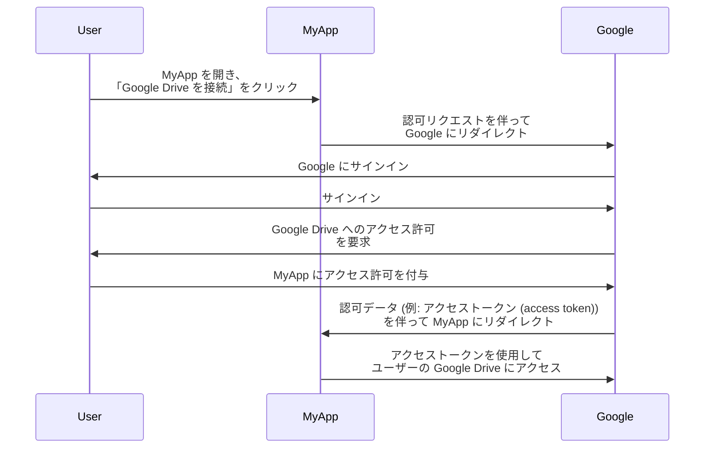
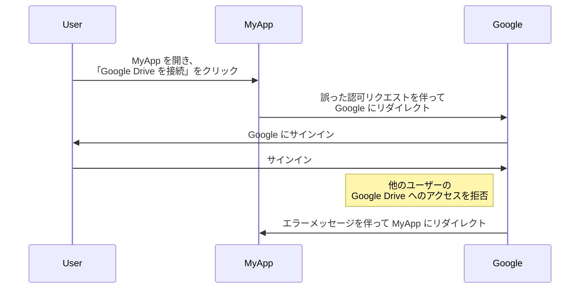
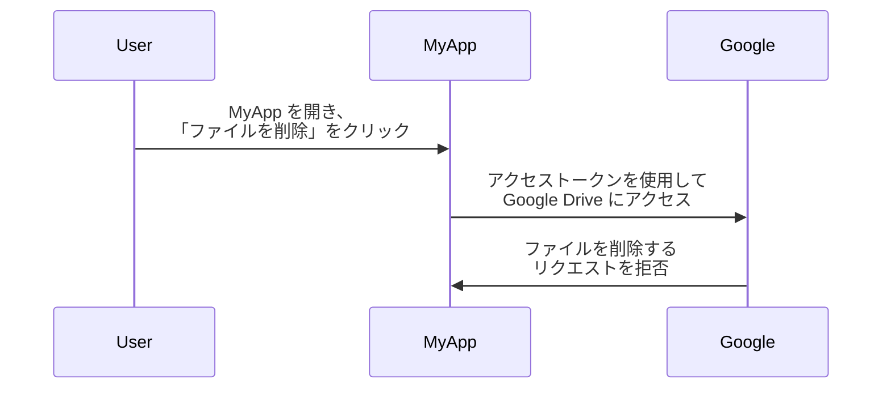

## OAuth 2.0 とは？

OAuth 2.0 は、認可の事実上の標準であり、Web 全体で広く使用されています。これは、アプリケーションが他のアプリケーション上の保護されたリソース (例えばユーザーのプロファイルやデータ) に対して、安全に限定的なアクセスを取得することを可能にします。パスワードのような資格情報を公開することなく利用できます。

より良く理解するために現実世界の例を見てみましょう。あなたが所有するウェブアプリケーション MyApp が、ユーザーの Google Drive にアクセスしたいと思っているとします。ユーザーに Google Drive の資格情報を共有させるのではなく、MyApp は OAuth 2.0 を使用してユーザーに代わって Google Drive へのアクセスをリクエストすることができます。以下に簡単なフローを示します:

このフローでは、MyApp はユーザーの Google Drive の資格情報を決して見ることはありません。その代わりに、ユーザーに代わって Google Drive にアクセスするための <Ref slug="access-token" /> が Google から発行されます。

### OAuth 2.0 の主要なコンポーネント

上記の例では、MyApp は <Ref slug="client" /> であり、Google は <Ref slug="authorization-server" /> と <Ref slug="resource-server" /> を兼ねており、ユーザーは <Ref slug="resource-owner" /> です。このフローは、OAuth 2.0 のすべての重要なコンポーネントが関与しています:

- **クライアント (Client)**: 保護されたリソースにアクセスしたいアプリケーション。「クライアント」と「アプリケーション」はしばしば交換可能に使用されます。
- **リソースオーナー (Resource owner)**: 保護されたリソースを所有するユーザー。リソースオーナーはクライアントに対するアクセスを許可 (authorize) または拒否することができます。
- **認可サーバー (Authorization server)**: 認可 (通常は認証と共に) を実行し、クライアントにアクセストークンを発行するサーバー。
- **リソースサーバー (Resource server)**: 保護されたリソースをホストするサーバー。アクセストークンを検証し、クライアントに保護されたリソースを提供します。

## OAuth 2.0 のグラント (フロー)

<Ref slug="oauth-2.0-grant">グラント</Ref> は OAuth 2.0 の基礎を築き、クライアントが認可サーバーからアクセストークンを取得する方法を定義します。基本的な OAuth 2.0 仕様は4つのグラントを定義しています:

- <Ref slug="authorization-code-flow">認可コードグラント</Ref>
- <Ref slug="implicit-flow">インプリシットグラント</Ref>
- [リソースオーナーパスワードクレデンシャル (ROPC) グラント](https://datatracker.ietf.org/doc/html/rfc6749#section-4.3)
- <Ref slug="client-credentials-flow">クライアントクレデンシャルグラント</Ref>

それぞれのグラントの詳細に立ち入ることなく、これらのグラントは2つのカテゴリに分類されます:

- **認可グラント**: クライアントがユーザーに代わってリソースにアクセスする必要がある場合に使用されます。すなわち、ユーザーの認可が必要です。
- **クライアントクレデンシャルグラント**: クライアント自身の代理としてリソースにアクセスする必要がある場合に使用されます。このグラントは <Ref slug="machine-to-machine" /> 通信に適しています。

### 認可グラント

グラントタイプに関係なく、認可グラントには以下の共通ステップがあります:

1. クライアントは認可サーバーに <Ref slug="authorization-request" /> を開始します。
2. 認可サーバーはユーザー (リソースオーナー) を認証し、リソースへのアクセス許可を要求します。
3. ユーザーはクライアントに対してアクセス許可を付与します。
4. 認可サーバーはクライアントにアクセストークンを発行します。
5. クライアントは<Ref slug="resource-server" /> 上の保護されたリソースにアクセスするためにアクセストークンを使用します。

ステップとパラメーターは、グラントタイプによって異なる場合があることに注意してください。例えば、<Ref slug="authorization-code-flow">認可コードグラント</Ref> には、コードの生成と交換などの追加ステップが含まれます。

### クライアントクレデンシャルグラント

<Ref slug="client-credentials-flow">クライアントクレデンシャルグラント</Ref> ははるかに簡単で、ユーザーの認可を含みません。以下のシンプルなフローを示します:

1. クライアントは認可サーバーに<Ref slug="token-request" /> を送信します。
2. 認可サーバーはクライアントを認証し、アクセストークンを発行します。
3. クライアントは<Ref slug="resource-server" /> 上の保護されたリソースにアクセスするためにアクセストークンを使用します。

---

OAuth 2.0 のグラントに関する詳細な議論については、<Ref slug="oauth-2.0-grant" /> と特定のグラントの記事を参照してください。

## OAuth 2.0 を用いたアクセス制御

クライアントが要求している権限を指定するために、OAuth 2.0 は<Ref slug="scope" /> パラメーターを定義します。認可サーバーは、要求されたスコープを完全にまたは部分的に無視し、その独自のアクセス制御ポリシーに基づいてアクセスを許可することがあります。

しかし、OAuth 2.0 は<Ref slug="access-control" /> をどのように執行するかについての自由裁量を認可サーバーに許しています。つまり、認可サーバーは、どのリソースに対して対象 (ユーザーまたはクライアント) がアクセスでき、どのアクションを実行できるかを決定することができます。

Google Drive の例を引き続き使用します。MyApp が誤って他のユーザーの Google Drive にアクセスするために認可リクエストを開始するかもしれません。この場合、Google の認可サーバーは、ユーザーが他のユーザーの Google Drive にアクセスするための必要な権限を持たないため、このリクエストを拒否するべきです。

別のケースとして、MyApp がユーザーの Google Drive のファイルを読み取ることができるアクセストークンを Google から取得した場合があります。ただし、MyApp はそれを読む代わりにファイルを削除しようとします。この場合、リソースサーバー (Google) はリクエストを拒否するべきです。

両方のケースは、OAuth 2.0 を実装する際に <Ref slug="access-control" /> が必要とされる理由を示しています。<Ref slug="authorization-server" /> と <Ref slug="resource-server" /> は、アクセス制御ポリシーを実施し、リソースを保護するために協力する必要があります。

### アクセス制御モデル

アクセス制御を適切に処理するためには、<Ref slug="rbac" /> や <Ref slug="abac" /> などの標準的なアクセス制御モデルを使用することをお勧めします。これらのモデルは業界での実績があり、将来の要求に対する拡張性を提供します。

## OAuth 2.1 (OAuth 2.1)

<Ref slug="oauth-2.1" /> は、業界の経験に基づいてセキュリティと使いやすさを向上させることを目的として提案されている OAuth 2.0 仕様のアップデートです。OAuth 2.1 はまだ最終決定されていませんが、提案された変更点を学び、現在の OAuth 2.0 の実装にどのように影響するかを理解することができます。OAuth 2.1 は、業界で広く採用されているベストプラクティスとセキュリティ推奨事項を公式化したものと見なすことができます。

## OAuth 2.0 と OpenID Connect (OIDC)

OAuth 2.0 は認可プロセスのみを定義し、ユーザー認証またはアイデンティティはカバーしていません。このため、<Ref slug="openid-connect" /> は OAuth 2.0 の上にアイデンティティ層として導入されました。OIDC は OAuth 2.0 を拡張して、<Ref slug="id-token" /> の形式でユーザー認証とアイデンティティ情報を提供します。

OpenID Connect は、ID トークンを含めるために 2 つの OAuth 2.0 グラント (認可コードとインプリシット) を拡張し、両方を組み合わせた新しいグラントである <Ref slug="hybrid-flow">ハイブリッドフロー</Ref> を導入します。

つまり、あなたのすべての OAuth 2.0 の知識と実践を OIDC に直接適用することができます。PKCE や <Ref slug="resource-indicator" /> などのすべての OAuth 2.0 拡張機能を OIDC でも使用することができます。

<SeeAlso slugs={["oauth-2.0-grant", "oauth-2.1", "openid-connect"]} />

<Resources
  urls={[
    "https://blog.logto.io/secure-cloud-apps-with-oauth-and-openid-connect",
    "https://blog.logto.io/oauth-2-1",
    "https://datatracker.ietf.org/doc/html/rfc6749",
    "https://datatracker.ietf.org/doc/draft-ietf-oauth-v2-1/",
  ]}
/>
