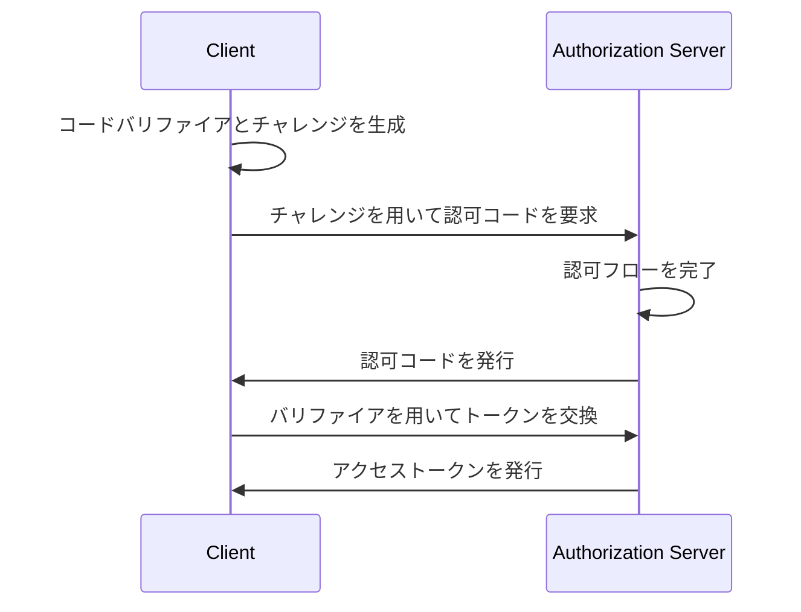

## OAuth 2.1 とは何ですか？

OAuth 2.1 は、<Ref slug="oauth-2.0" /> 認可フレームワークの更新提案です。これは、既存の OAuth 2.0 仕様に対する一連の変更と勧告を含んでおり、業界で広く採用されているベストプラクティスとセキュリティー改善を統合しています。

OAuth 2.1 の主な更新内容は次のとおりです：

1. セキュリティ上の懸念から、<Ref slug="implicit-flow">インプリシットグラント</Ref>および[リソースオーナーパスワードクレデンシャル (ROPC) グラント](https://datatracker.ietf.org/doc/html/rfc6749#section-4.3)を廃止。
2. <Ref slug="client" headingId="confidential-clients">コンフィデンシャル (プライベート) クライアント</Ref>を含むすべてのクライアントに<Ref slug="pkce" />の使用を強制。
3. <Ref slug="redirect-uri">リダイレクト URI</Ref>の正確な一致。
4. <Ref slug="client">クライアント</Ref>タイプの明確な定義 (パブリッククライアントとコンフィデンシャルクライアント)。
5. <Ref slug="refresh-token">リフレッシュトークン</Ref>のセキュリティ要件。

## インプリシットグラントの廃止

インプリシットグラントは、クライアントシークレットを安全に保存できないシングルページアプリケーション (SPA) およびブラウザベースのアプリケーション用に設計されていました。しかし、そのセキュリティリスクのために廃止されました。このグラントは、アクセス トークンをフロントチャネル (URL フラグメント) に返すため、ブラウザ履歴やリファラー ヘッダーを通じて攻撃者に露出される可能性があります。

OAuth 2.1 は、ブラウザベースのアプリケーションに<Ref slug="pkce" />を使用した<Ref slug="authorization-code-flow">認可コードグラント</Ref>の使用を推奨しています。

## ROPC グラントの廃止

ROPC グラントは、クライアントがユーザーの資格情報を直接アクセス トークンに交換できるようにするものです。これは、認可コードフローをサポートできないレガシー アプリケーション用に設計されました。しかし、このグラントは次の方法でセキュリティリスクをもたらします：

- クライアントにユーザーの資格情報を公開。
- 認可サーバーの同意画面をバイパス。
- <Ref slug="mfa" /> などの他のセキュリティ対策を認可サーバーが適用する能力に制限をかける。

OAuth 2.1 は、ユーザー認証と認可に<Ref slug="pkce" />を使用した<Ref slug="authorization-code-flow">認可コードグラント</Ref>の使用を推奨しています。

## すべてのクライアントに対する PKCE の強制

<Ref slug="pkce" />は、認可コードフローに対するセキュリティ拡張であり、認可コードインターセプション攻撃のリスクを軽減します。これには、クライアントがコードバリファイアとコードチャレンジを生成し、認可サーバーがトークン交換中にチャレンジを確認することが含まれます。

PKCE を使用した認可コードフローの簡略化されたシーケンス図です：

最初は、<Ref slug="client" headingId="public-clients">パブリッククライアント用</Ref>に PKCE の使用が推奨されていましたが、OAuth 2.1 はこの推奨をすべてのクライアント、<Ref slug="client" headingId="confidential-clients">コンフィデンシャル (プライベート) クライアント</Ref>を含むすべてのクライアントへの必須要件に拡張しています。

## リダイレクト URI の正確な一致

<Ref slug="redirect-uri">リダイレクト URI</Ref>は、認可サーバーからの認可応答を受信するためにクライアントによって使用されます。OAuth 2.1 は、認可リクエストで使用されるリダイレクト URI が、<Ref slug="authorization-server" />によってクライアントに登録されたリダイレクト URI とスキーム、ホスト、およびパスを含めて正確に一致する必要があるという新しい要件を導入しています。

いくつかの OAuth 2.0 実装では、リダイレクト URI の一致が緩やかで、部分一致やワイルドカード文字を許していました。しかし、この柔軟性は、オープンリダイレクト脆弱性などのセキュリティリスクを引き起こす可能性があります。

## クライアントタイプの明確な定義

OAuth 2.0 はクライアントタイプを明示的に定義していません。業界では、アクセスレベル (パブリック vs. コンフィデンシャル) やアプリケーションタイプ (ウェブアプリ vs. モバイルアプリ) などでさまざまなカテゴリ分けを目にすることがあります。OAuth フレームワークにとって、クライアントがどのように実装されているか (ビジネス属性に関するものであるため) は問題ではありませんが、アクセスレベルはセキュリティ要件に差を生じます。

そのため、OAuth 2.1 はクライアントタイプの明確な定義を導入しました：

- <Ref slug="client" headingId="public-clients" />: 資格情報の機密性を保持できないクライアント (例： SPA、モバイルアプリ)。
- <Ref slug="client" headingId="confidential-clients" />: 資格情報の機密性を保持できるクライアント (例： サーバーサイドウェブアプリ、ネイティブデスクトップアプリ)。

## リフレッシュトークンのセキュリティ要件

<Ref slug="refresh-token">リフレッシュトークン</Ref>は、クライアントがユーザーの操作なしに新しいアクセス トークンを取得するために使用される長期間有効なトークンです。同時に、攻撃者の高価値な標的でもあります。パブリッククライアントは資格情報を安全に保存できないため、OAuth 2.1 は、<Ref slug="authorization-server" />がリフレッシュトークンを次の方法のいずれかで保護することを指定しています：

- <Ref slug="refresh-token" headingId="sender-constrained-refresh-tokens">送信者制約付きリフレッシュトークン</Ref>を発行。
- リフレッシュトークンの使用可能性と有効期間を制限するために<Ref slug="refresh-token" headingId="refresh-token-rotation">リフレッシュトークンのローテーション</Ref>を使用。

## OAuth 2.1 と OpenID Connect (OIDC)

<Ref slug="openid-connect" />は OAuth 2.0 に基づいて構築されているため、OAuth 2.1 で導入された変更は OIDC にも適用されます。例えば、すべての OIDC クライアントはユーザー認証と認可に PKCE を伴う認可コードフローを使用する必要があります。

<SeeAlso slugs={["oauth-2.0", "authorization-code-flow", "pkce", "implicit-flow", "openid-connect"]} />

<Resources
  urls={[
    "https://datatracker.ietf.org/doc/draft-ietf-oauth-v2-1/",
    "https://blog.logto.io/oauth-2-1",
  ]}
/>
