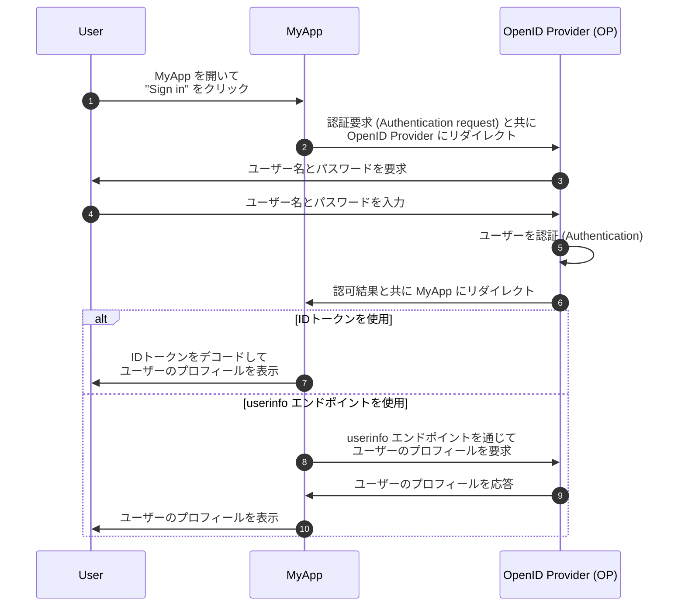
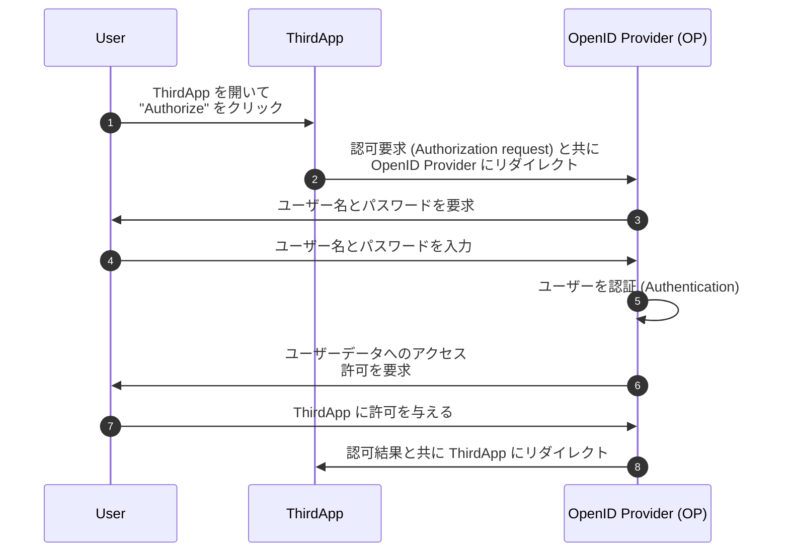

## OpenID Connect (OIDC) とは？

OpenID Connect (OIDC) は、<Ref slug="oauth-2.0" /> の上にアイデンティティレイヤーを導入することにより、認証 (Authentication) 機能を追加します。OIDC は、クライアントがユーザーを認証 (Authentication) し、<Ref slug="id-token">IDトークン</Ref> や <Ref slug="userinfo-endpoint" /> の応答の形でアイデンティティ情報を取得できるようにします。

例を見てみましょう。MyApp というウェブアプリケーションがあり、ユーザー名とパスワードを使用してサインインできます。サインイン後、ユーザーはプロフィール情報にアクセスできます。以下に簡単なフローを示します：



いくつかの用語は初めてかもしれませんので、少し説明します：

### OpenID Provider (OP)

OpenID Provider (OP) は、OIDC および OAuth 2.0 仕様を実装する<Ref slug="identity-provider" />です。つまり、OP は OAuth 2.0の <Ref slug="authorization-server" />でもあります。

OP はユーザーを認証 (Authentication) し、クライアントに ID トークンおよびアクセストークンを発行する責任があります。

### トークン

- <Ref slug="id-token">IDトークン</Ref> は、名前、メールアドレス、プロフィール画像など、ユーザーのアイデンティティ情報を表す <Ref slug="jwt">JSON Web トークン</Ref> です。
- <Ref slug="access-token">アクセストークン</Ref> は、ユーザーに代わって保護されたリソースにアクセスするために使用されます（OAuth 2.0 と同様に）、例えば、userinfo エンドポイントです。

### 認証要求 (Authentication request) と結果

- <Ref slug="authentication-request" /> は、クライアントがユーザーを認証 (Authentication) するために OP に行う要求です。特定の要件を指定するためのパラメータが含まれ、認証 (Authentication) 処理に影響を与えます。
- 認証要求 (Authentication request) に応じて、認証結果は異なる場合があります。現時点では、結果がクライアントがユーザーを識別するために必要な情報を運ぶということだけを知っておく必要があります。

### Userinfo エンドポイント

<Ref slug="userinfo-endpoint" /> は、クライアントがユーザーのプロフィール情報を取得できる OIDC 固有のエンドポイントです。userinfo エンドポイントは通常、ID トークンよりも詳細なユーザー情報を提供するため、ID トークンを使用する代わりの方法です。

OIDC は、ID トークンと userinfo の応答に含める情報を決定する権限を OpenID Provider (OP) に委ねています。そのため、ID トークンの解析や userinfo エンドポイントの呼び出しを行う前に、利用可能な情報を理解するために OP のドキュメントを確認してください。

## OAuth 2.0 と OIDC の用語の違い

OIDC は OAuth 2.0 の上に構築されているため、両方の仕様で共有される用語が多数あります。しかし、OAuth 2.0 が認可に焦点を当てているのに対し、OIDC は認証 (Authentication) とアイデンティティを導入し、OIDC の文脈ではいくつかの用語が不適切になることがあります。以下は注目すべき違いです：

| OAuth 2.0             | OpenID Connect (OIDC)  |
|-----------------------|------------------------|
| 認可サーバー         | OpenID Provider (OP)   |
| 認可リクエスト        | 認証要求 (Authentication request) |
| グラント               | フロー                   |

本質的に、上記の用語は同じ対象を指す可能性がありますが、OAuth 2.0 および OIDC の文脈で異なる意味を持っています：

- **OpenID Provider (OP)** は、ユーザーを認証 (Authentication) し、ID トークンを発行する能力を持つ OAuth 2.0 の <Ref slug="authorization-server" /> です。
- **<Ref slug="authentication-request" />** は、OIDC 固有のパラメータを使用してエンドユーザー認証 (Authentication) を要求し、ID トークンを取得する OAuth 2.0 の <Ref slug="authorization-request" /> です。
- **フロー** は、単一のリクエスト - 応答サイクルの代わりに、複数のステップや対話を含むことができるユーザーの認証 (Authentication) および認可プロセスを説明するために OIDC で使用される一般的な用語です。これは本質的に <Ref slug="oauth-2.0-grant" /> と同じです。

## OIDC フロー

上記の例が示すように、OIDC フローは OP に対する認証要求 (Authentication request) によってクライアント（例：MyApp）によって開始されます。認証要求 (Authentication request) は使用するフローを指定し、次のいずれかです：

- **<Ref slug="authorization-code-flow" />**: ユーザー認証 (Authentication) および認可のための最も安全で推奨されるフローです。すべてのクライアントに対して <Ref slug="pkce" /> が <Ref slug="oauth-2.1" /> で強制されます。
- **<Ref slug="implicit-flow" />**: 簡略化されたフローですが、セキュリティ上の理由から OAuth 2.1 で廃止されました。
- **<Ref slug="hybrid-flow" />**: 認可コードフローとインプリシットフローを組み合わせた OIDC フローです。セキュリティ考慮事項により、新しいアプリケーションには推奨されません。

認可コードフローとインプリシットフローは OAuth 2.0 から拡張され、ID トークンを含めるようになり、ハイブリッドフローは両方を組み合わせた OIDC 固有のフローです。各フローについてもっと学ぶには、上のリンクをクリックしてください。

## OIDC のスコープとクレーム (Claims)

OAuth 2.0 と同様に、OIDC はクライアントが要求する権限を指定するために <Ref slug="scope" /> 値を使用します。<Ref slug="id-token">ID トークン</Ref> が <Ref slug="jwt">JSON Web トークン</Ref> であるため、<Ref slug="authentication-request" /> の要求されたスコープに応じて、ユーザーのアイデンティティ情報を表す <Ref slug="claim">クレーム</Ref>（名前 - 値ペア）を含めることができます。これらのクレームも <Ref slug="userinfo-endpoint" /> の応答で返されます。

OIDC は、クライアントが認証要求 (Authentication request) で要求できるいくつかの標準スコープと対応するクレームを定義しています：

- **openid**: クライアントが OIDC クライアントであり、ID トークンを要求することを示します。
- **profile**: ユーザーのデフォルトのプロフィールクレームへのアクセスを要求します。これには、`name`、`family_name`、`given_name`、`middle_name`、`nickname`、`preferred_username`、`profile`、`picture`、`website`、`gender`、`birthdate`、`zoneinfo`、`locale`、および `updated_at` が含まれます。
- **email**: ユーザーの `email` および `email_verified` クレームへのアクセスを要求します。
- **address**: ユーザーの `address` クレームへのアクセスを要求します。
- **phone**: ユーザーの `phone_number` および `phone_number_verified` クレームへのアクセスを要求します。
- **offline_access**: クライアントがユーザーとの対話なしに新しいアクセストークンを取得できるようにするためのリフレッシュトークンを要求します。

スコープとクレームに関する詳細については、OIDC 仕様の [Standard Claims](https://openid.net/specs/openid-connect-core-1_0.html#StandardClaims) および [Requesting Claims using Scope Values](https://openid.net/specs/openid-connect-core-1_0.html#ScopeClaims) を参照してください。`offline_access` スコープの詳細な説明は <Ref slug="offline-access" /> を確認してください。

> [!Note]
> OpenID Providers (OPs) は、標準のもの以外に追加のスコープやクレームをサポートしている場合があります。詳細は OP のドキュメントを参照してください。

## OIDC における認可 (Authorization)

OAuth 2.0 に慣れている場合、上記の例には<Ref slug="authorization" />プロセスが含まれていないことに気付くかもしれません。例では MyApp が第一者アプリケーションであり、第三者によるユーザーデータへのアクセスが含まれていないと仮定しているため、ユーザーの同意部分は省略されています。認可は OP によって依然として実施されていますが、フローには明示的に示されていません。

第三者クライアント（OP によって所有されていないアプリケーションなど）がユーザーデータへのアクセスを要求する場合、ユーザーがクライアントに許可を与える前に OP はユーザーに要求します。例えば、ユーザーデータにアクセスしたい ThirdApp という第三者アプリケーションがあるとします：



認可プロセスが完了し、ThirdApp が認可結果（通常は <Ref slug="access-token" />）を受け取ると、<Ref slug="resource-server" /> からユーザーのデータにアクセスできます。

<Ref slug="oauth-2.0" /> で OAuth 2.0 と認可フローに関する詳細を確認してください。

### スコープ

OAuth 2.0 と同様に、OIDC は <Ref slug="scope" /> 値を使用してクライアントが要求する権限を指定します。[OIDC のスコープとクレーム](#oidc-scopes-and-claims)で標準スコープとクレームについて説明しました。これらのスコープとクレームは OIDC で予約された値として扱うべきであり、ビジネス固有の目的に使用してはなりません。

実際には、OpenID Provider (OP) はビジネスニーズに応じてカスタムスコープとクレームをサポートする場合があります。カスタムスコープとクレームに関する情報は OP のドキュメントを参照してください。カスタムスコープとクレームを定義しない場合、OP はそれを無視したり、エラー応答を返したりする可能性があります。

### リソースインディケーター

OIDC や OP のようなフレームワークが特定の目的のために特定のスコープやクレームを予約していることがあるため、カスタムスコープとクレームを定義する際には、予約された値との競合を避けるために、通常はプレフィックスまたは名前空間を使用することを推奨します。たとえば、`myapp:` でカスタムスコープをプレフィックスして、アプリケーション固有であることを示すことができます。

```json
{
  "scope": "myapp:custom_scope"
}
```

ただし、これでは将来予約される値との競合を完全に回避できるわけではなく、トークンのサイズを増大させる可能性があります。<Ref slug="resource-indicator">リソースインディケーター</Ref>と呼ばれる OAuth 2.0 の拡張機能は、同じ目標を達成するための柔軟でスケーラブルな方法を提供します。リソースインディケーターは、要求されたリソースを表す URI であり、実際の API エンドポイントとして使用して、現実世界のリソースを反映することができます。たとえば、`https://api.myapp.com` をリソースインディケーターとして使用して、クライアントがアクセスしたい API リソースを表すことができます。

再度、OIDC は OAuth 2.0 の上に構築されているため、適切に設定されていれば、OIDC の認証要求 (Authentication request) にリソースインディケーターを使用できます。こちらはリソースインディケーターを含む認証要求 (Authentication request) の非標準的な例です：

```http
GET /authorize?response_type=code
  &client_id=YOUR_CLIENT_ID
  &redirect_uri=https%3A%2F%2Fclient.example.com%2Fcallback
  &scope=openid%20profile
  &resource=https%3A%2F%2Fapi.example.com HTTP/1.1
Host: your-openid-provider.com
```

リソースインディケーターを使用するには、まず OP がこの拡張機能（RFC 8707）をサポートしていることを確認する必要があります。サポートされている場合、リソースインディケーター URI を OP に登録し、認証要求 (Authentication request) の `resource` パラメータにそれを使用してください。

リソースインディケーターに関する詳細は <Ref slug="resource-indicator" /> を確認してください。

## OIDC のセキュリティ考慮事項

### 安全な通信

クライアント、OP、およびリソースサーバー間のすべての通信は、HTTPS を使用してセキュリティを確保し、データの盗聴や改ざんを防止する必要があります。

### 安全なフローの選択

OIDC を実装する際には、以下を使用することをお勧めします：

- ユーザー認証 (Authentication) および認可のために、<Ref slug="authorization-code-flow" /> と <Ref slug="pkce" /> を使用します（<Ref slug="oauth-2.1" /> で強制されます）。
- 機械間通信のために、<Ref slug="client-credentials-flow" /> を使用します。

インプリシットフローとハイブリッドフローはセキュリティ上の懸念から廃止されているため、新しいアプリケーションにはそれらを使用せず、既存のアプリケーションをより安全なフローに移行することを検討してください。

### ID トークンの検証

OP から ID トークンを受け取ったら、クライアントはそのトークンの整合性と信憑性を確認するために検証を実施すべきです。検証プロセスには少なくとも以下のチェックを含めるべきです：

- **Issuer (発行者)**: `iss` クレームは、OP の発行者 (Issuer) URL と一致する必要があります。
- **Audience (オーディエンス)**: `aud` クレームは、クライアントのクライアント ID と一致する必要があります。
- **Expiration (有効期限)**: `exp` クレームは、将来のものでなければなりません。
- **Signature (署名)**: トークンは OP の <Ref slug="signing-key" /> で署名されている必要があります。

### アクセストークンの使用

アクセストークンは、ユーザーに代わって保護されたリソースにアクセスするために使用されます。クライアントはアクセストークンを機密情報として扱い、以下のベストプラクティスに従うべきです：

- **トークンの保存**: アクセストークンを安全に保存し、未承認の第三者に見せないようにします。
- **トークンの有効期限**: アクセストークンには短い有効期限（例：1 時間）を設定し、トークンが漏洩された場合の未承認アクセスのリスクを軽減します。
- **トークンの失効**: 必要に応じてアクセストークンを無効化するトークンの失効メカニズムを実装します。

### ユーザーの同意

第三者クライアントがユーザーデータへのアクセスを要求する場合、OP は要求された権限をユーザーに通知し、同意を取得する必要があります。ユーザーの同意プロセスは透明であり、アクセスされるデータとその使用方法についての明確な情報を提供するべきです。

<SeeAlso slugs={["oauth-2.0", "authorization-code-flow", "implicit-flow", "hybrid-flow", "pkce", "resource-indicator"]} />

<Resources
  urls={[
    "https://blog.logto.io/secure-cloud-apps-with-oauth-and-openid-connect",
    "https://openid.net/specs/openid-connect-core-1_0.html",
  ]}
/>
