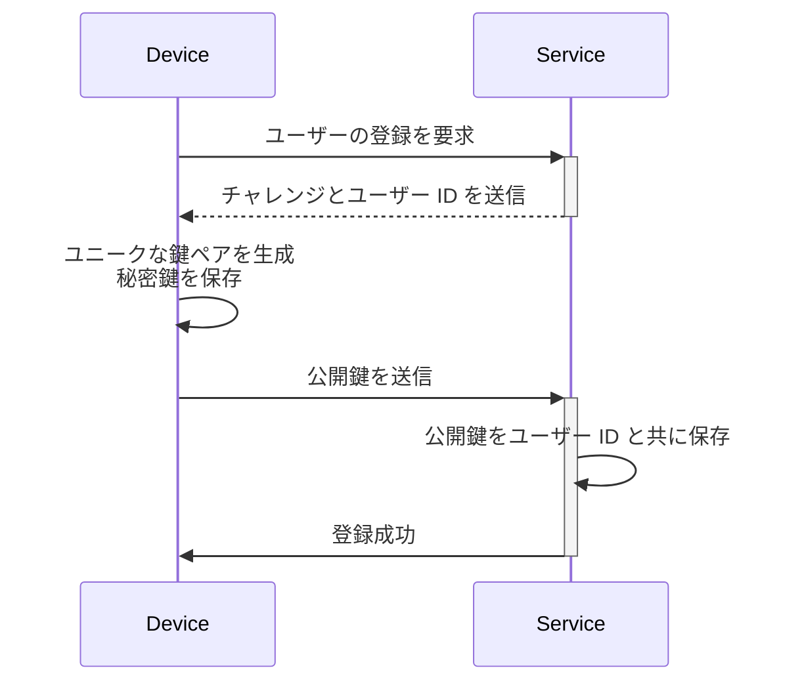
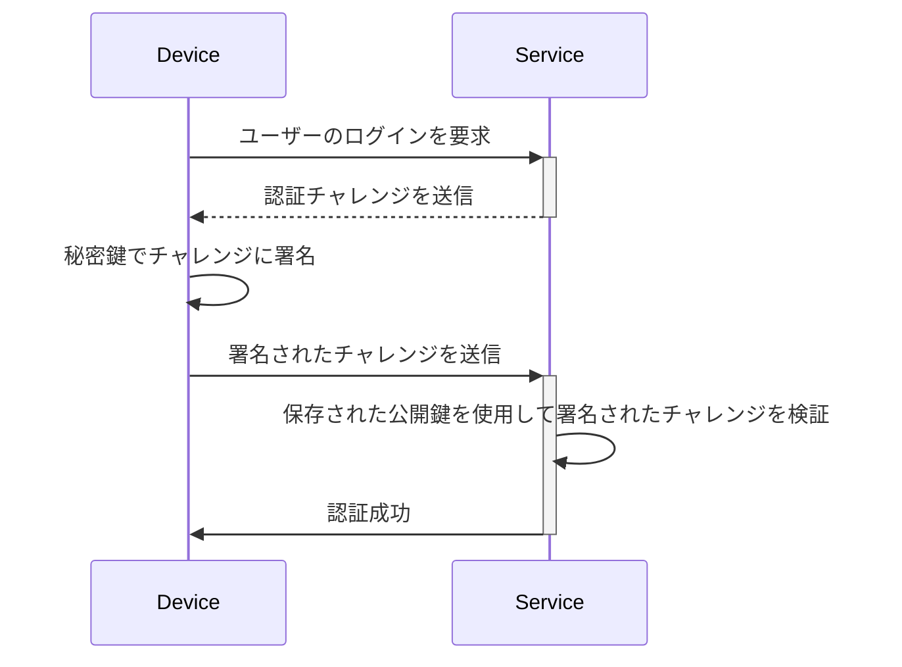

## パスキー (Passkey) とは何ですか？

**パスキー (Passkey)** は、従来のパスワードに代わる [FIDO](https://fidoalliance.org/) ベースの安全で便利なオプションです。高度な暗号技術を使用して、アカウントを [フィッシング](https://en.wikipedia.org/wiki/Phishing) 攻撃から保護します。

- **各サービスに固有**: サービスに登録すると、デバイスはその特定のサービスのドメインにリンクされたユニークなパスキーを作成します。
- **デバイスにリンク**: パスキーは通常、電話、ラップトップ、生体認証識別子、またはハードウェアセキュリティキーなどのデバイスにリンクされています。
- **公開鍵と秘密鍵のペア**: デバイスは秘密鍵を保持し、公開鍵をサービスと共有します。これらの暗号鍵ペアはパスキーと呼ばれます。（[FIDO](https://fidoalliance.org/how-fido-works/) より引用）
- **複数の認証方法**: 指紋スキャン、顔認識、デバイス PIN、QR コードスキャン、またはセキュリティキーを使用してパスキーで認証できます。
- **デバイス間の同期**: パスキーは安全なクラウドストレージ（例: Apple の iCloud キーチェーンや Google パスワードマネージャー）を使用してデバイス間で同期でき、サポートされている任意のデバイスからサインインできます。

## パスキー (Passkey) のワークフローはどのように見えますか？

ここに、より良く理解するための実際の例があります。あなたは MyApp という Web サービスを持っていて、パスワードベースのサインインの代わりにパスキーサインインを実装したいとします。ユーザーはパスキー認証方法として指紋スキャンを使用する現在のデバイスを選択します。

**パスキー (Passkey)** は公開鍵暗号を利用して安全な資格情報を提供します。

- **パスキー登録**
    - サービスに登録すると、デバイスはそのサービスにリンクされたユニークな暗号鍵ペアを生成します。
    - **秘密鍵** はデバイスに残り、**公開鍵** はサービスと共有されます。

- **パスキー認証**
    - サインインを試みると、サービスはデバイスに **チャレンジ** を送信します。
    - デバイスは **秘密鍵** を使用してチャレンジに基づいた暗号 **署名** を生成します。
    - **署名** はサービスに返送され、サービスは **公開鍵** を使用してそれを検証します。
    - 署名が有効であれば、認証は成功します。

パスキーを実装するための API である <Ref slug="webauthn" /> を読んで詳細を学びましょう。

## パスキー (Passkey) のエンドユーザーフローはどのように見えますか？

パスキーは、ローカルおよびクラウドで使用するための 2 種類の認証器を提供し、ユーザーはサービスに対して 1 つまたは両方を有効にすることができます。

- **プラットフォーム認証器 (内部認証器):** 特定のデバイス OS に結びついており（例: 電話、ラップトップ）、生体認証やデバイスパスコードを使用して認証します。迅速で便利です。
    - 例: Apple デバイスの iCloud キーチェーン（Touch ID、Face ID、またはデバイスパスコードで確認）、Windows Hello、Android の Google パスワードマネージャー。
- **ローミング認証器 (外部認証器):** ポータブルデバイスやソフトウェア、例: セキュリティキー、スマートフォン。複数のデバイスで使用できますが、QR コードスキャンや NFC/Bluetooth ペアリングなどの追加手順が必要な場合があります。
    - 例: YubiKey とスマートフォンのクラウドベースのアカウント。モバイル認証器は、デスクトップデバイスとリンクするために QR コードスキャンを必要とすることが多く、デバイス間認証は、認証器が近くにあることを確認するために Bluetooth、NFC、または USB を介して接続する必要があります。

## パスキー (Passkey) をいつ使用するべきですか？

パスキーは、第一または第二の要素として使用できる現代の認証要素です。

- **パスキーサインイン:** パスキーは、従来のパスワードと比較して、より高速で安全なパスワードレス認証方法を提供します。
    - 現代のアプリケーションは通常、サインインページに「パスキーでサインイン」ボタンを備えており、ユーザーにこのオプションを積極的にタップするよう促します。
    - さらに、サインインページは、ユーザーがパスキーを登録した同じデバイスとブラウザにアクセスしていることを認識すると、自動的にパスキーサインインのポップアップを表示することができます。
- **パスキー MFA:** パスキーは、MFA の第二要素としても機能します。
    - ユーザーがサインインを試みると、最初にメールアドレスとパスワード（または他の第一要素）を入力し、その後サービスはパスキーを使用して 2 段階認証を完了するよう促します。
    - ブラウザに既存のセッションがある場合、サービスはユーザーにパスワードを再入力させずにパスキーでサインインするよう直接促すことができます。このプロセスは、パスキーが現在のデバイスに結びつき、生体認証、PIN、または他のハードウェア方法を通じてユーザーを検証することによる高レベルのセキュリティであるため、MFA を完了することとして知られています。
- **セキュリティ検証**: 高セキュリティ環境では、パスキーはユーザーの身元を二重に確認するために使用されることがよくあります。たとえば、機密の金融情報にアクセスする場合や重要な操作を実行する場合（銀行、政府、企業システム）。

### なぜパスキーが最も安全な認証方法なのですか？

パスキーは、**公開鍵暗号** を使用するため、一般の顧客がサインインするための最も安全な方法の 1 つです。パスワードやワンタイムコード (TOTP) と異なり、秘密鍵はデバイスから離れることはありません。攻撃者が自由に利用可能な公開鍵を盗んだとしても、有効なログイン試行を偽造することはできません。

ここに、パスキーがなぜ著しく安全であるかを示す比較があります：

| 攻撃 | パスキー | ソフトウェア TOTP (Authenticator) |
| --- | --- | --- |
| **フィッシング攻撃** | フィッシングに対して非常に強く、秘密鍵はデバイスから離れたり、どこかに手動で入力されたりしないため、盗むのが難しい。 | フィッシングに対して脆弱で、ソフトウェア TOTP は画面に表示されるため、攻撃者が偽のウェブサイトであなたを騙して明かさせることができる。 |
| **中間者攻撃 (MitM)** | MitM に対して強力な保護を提供し、強力な暗号プロトコルにより秘密鍵はデバイスにのみ留まる。 | MitM に対して脆弱で、TOTP は MitM 攻撃者によって傍受され、それを使用してあなたとしてサインインすることができる。 |
| **リプレイ攻撃** | リプレイ攻撃に対して強力な保護を提供し、各パスキー要求はユニークであり、攻撃者がキャプチャして後でリプレイしても無意味。 | リプレイ攻撃が可能で、TOTP は定期的に変わるが、有効期限が切れる前に傍受されると、不正アクセスのために再利用される可能性がある。 |

<SeeAlso slugs={["webauthn", "authentication", "authorization"]} />

<Resources
  urls={[
    "https://fidoalliance.org/passkeys/",
    "https://webauthn.io/"
  ]}
/>