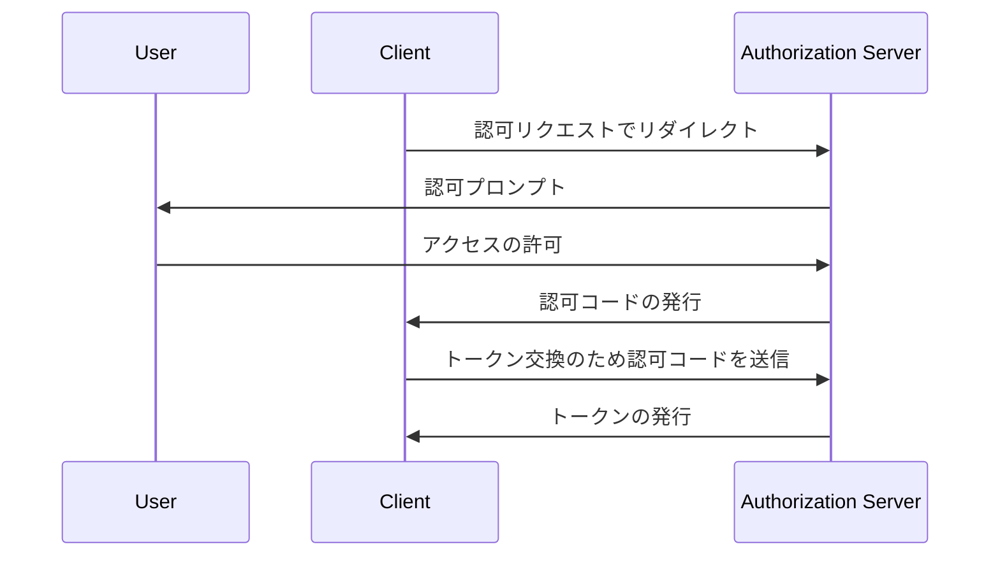

## Proof Key for Code Exchange (PKCE) とは何ですか？

Proof Key for Code Exchange (PKCE) は、<Ref slug="oauth-2.0" /> における <Ref slug="authorization-code-flow" /> のセキュリティ拡張として機能します。特にクライアントシークレットが安全でないパブリッククライアントにおいて、認可コードを傍受と不正使用から守るよう設計されています。

<Ref slug="oauth-2.1" /> から、PKCE は <Ref slug="client" headingId="public-clients" /> および <Ref slug="client" headingId="confidential-clients">機密 (プライベート) クライアント</Ref> を含むすべての種類のクライアントに適用されます。

## PKCE はどのように機能しますか？

PKCE は、<Ref slug="authorization-code-flow" /> に追加のステップを導入して、認可コードを交換する <Ref slug="client" /> がフローを開始したクライアントと同じであることを確認します。

> [!Note]
> PKCE は、認可コードフローに依存する <Ref slug="openid-connect" /> フローにも適用されます。簡単のため、OAuth 2.0 の実装に焦点を当てます。

まず、PKCE に進む前に標準の認可コードフローを簡単に確認しましょう：



では、PKCE がどのように認可コードフローを強化するのか見ていきましょう。

### 1. 認可リクエストの準備

#### 1.1. クライアントがコードベリファイアを生成

<Ref slug="authorization-request" /> を開始する前に、クライアントは **コードベリファイア** と呼ばれるランダムな文字列を生成する必要があります。この文字列は、高エントロピーの暗号学的なランダムなURLセーフ文字列であり、最小43文字、最大128文字の長さであるべきです。

JavaScript でコードベリファイアを生成する例です：

```javascript
// `js-base64` は Node.js とブラウザの両方で使える汎用ライブラリです
import { fromUint8Array } from 'js-base64';

// 第二引数 `true` は出力を URL セーフにすることを示します
const codeVerifier = fromUint8Array(crypto.getRandomValues(new Uint8Array(64)), true);
```

#### 1.2. クライアントがコードチャレンジを作成

クライアントは、暗号ハッシュ関数（例: SHA-256）を使用して **コードベリファイア** をハッシュし、そのハッシュをURLセーフなBase64文字列にエンコードする必要があります。この結果得られる文字列を **コードチャレンジ** と呼びます。

JavaScript でコードチャレンジを作成する例です：

```javascript
// `js-base64` は Node.js とブラウザの両方で使える汎用ライブラリです
import { fromUint8Array } from 'js-base64';

const encodedCodeVerifier = new TextEncoder().encode(codeVerifier);
const codeChallenge = new Uint8Array(await crypto.subtle.digest('SHA-256', encodedCodeVerifier));

// 第二引数 `true` は出力を URL セーフにすることを示します
return fromUint8Array(codeChallenge, true);
```

#### 1.3. クライアントが認可リクエストにコードチャレンジを含める

クライアントが認可リクエストを開始する際には、リクエストに `code_challenge` と `code_challenge_method` のパラメータを含めます。`code_challenge` パラメータには、前のステップで生成された **コードチャレンジ** が含まれ、`code_challenge_method` パラメータには**コードチャレンジ**を作成するために使用されたハッシュアルゴリズム（例：SHA-256の `S256`）が指定されます。

サポートされている `code_challenge_method` の値は `plain` と `S256` であり、`plain` は **コードチャレンジ** がハッシュされずそのまま送信されることを示します。通常、セキュリティ向上のために `S256` が推奨されます。

PKCE を用いた認可リクエストの非規範的な例です：

```http
GET /authorize?response_type=code
  &client_id=YOUR_CLIENT_ID
  &redirect_uri=https%3A%2F%2Fclient.example.com%2Fcallback
  &scope=openid%20profile
  &code_challenge=YOUR_CODE_CHALLENGE
  &code_challenge_method=S256
  &state=abc123
  &nonce=123456 HTTP/1.1
```

### 2. 認可コードをトークンに交換

クライアントは後で使用するために **コードベリファイア** を保存して、認可フローを通常通り続行します。クライアントが認可コードを受け取ると、**コードベリファイア** と共に <Ref slug="token-request" /> を認可サーバに送信します。

PKCE を用いたトークンリクエストの非規範的な例です：

```http
POST /token HTTP/1.1
Host: your-authorization-server.com
Content-Type: application/x-www-form-urlencoded

grant_type=authorization_code
  &code=YOUR_AUTHORIZATION_CODE
  &redirect_uri=https%3A%2F%2Fclient.example.com%2Fcallback
  &client_id=YOUR_CLIENT_ID
  &code_verifier=YOUR_CODE_VERIFIER
```

認可サーバは、**コードベリファイア** に対して **コードチャレンジ** を検証し、クライアントがフローを開始した同一のエンティティであることを確認します。検証が失敗した場合、認可サーバはトークンリクエストを拒否します。

## PKCE はどのようにセキュリティを向上させるか

PKCE の主なセキュリティメリットは、パブリッククライアントにおいて発生し得る認可コードインターセプション攻撃を防ぐことです。たとえば、攻撃者が認可コードを傍受しても、**コードベリファイア** なしではトークンに交換することはできません。PKCE は、フローを開始したクライアントだけがトークン交換を完了できることを保証します。

<SeeAlso slugs={['oauth-2.1', 'authorization-code-flow']} />

<Resources
  urls={[
    "https://blog.logto.io/how-pkce-protects-the-authorization-code-flow-for-native-apps",
    "https://datatracker.ietf.org/doc/html/rfc7636",
  ]}
/>
