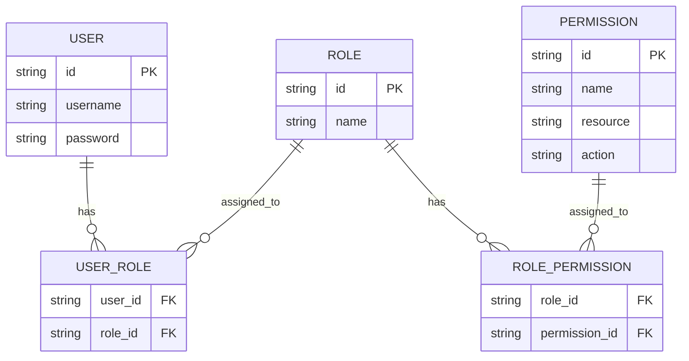
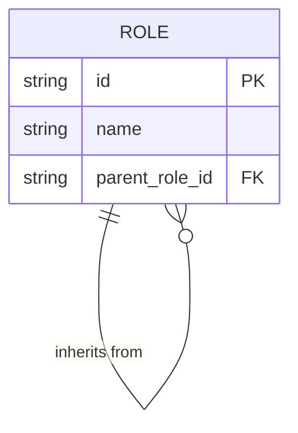
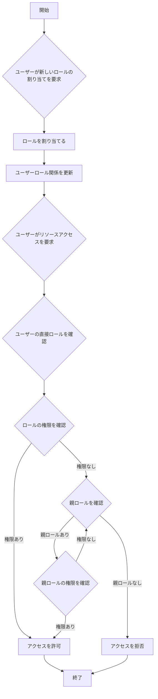
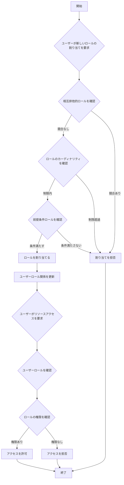

## ロールベースのアクセス制御 (RBAC) とは？

ロールベースのアクセス制御 (RBAC) は、ユーザーと権限を切り離すために「ロール」という概念を導入し、柔軟で効率的な権限管理システムを実現する広く採用されているアクセス制御モデルです。

RBAC の基本的な考え方はシンプルでありながら強力です。ユーザーに直接権限を割り当てるのではなく、権限をロールに割り当て、そのロールをユーザーに割り当てます。この間接的な権限の割り当て方法により、アクセス権の管理プロセスが大幅に簡素化されます。

## RBAC の主要な概念は何ですか？

RBAC モデルは、次の4つの主要な要素を中心に展開されます：

1. ユーザー: システム内の個人、通常は実在の人物。
2. ロール: 組織内の職務や責任を表すもの。
3. 権限: 特定のリソースに対して特定の操作を行うための許可。
4. セッション: ユーザーが特定のロールをアクティブにする動的な環境。

RBAC の基本的なワークフローは次のように要約できます：
1. 組織構造やビジネス要件に基づいてロールを定義します。
2. 各ロールに適切な権限を割り当てます。
3. ユーザーの責任に基づいて1つ以上のロールを割り当てます。
4. ユーザーがリソースにアクセスしようとすると、システムは割り当てられたロールが必要な権限を持っているかどうかを確認します。

## RBAC は実際のアプリケーションでどのように使用されますか？

典型的なビジネスアプリケーションで RBAC を使用する場合、次の3つの基本的な質問に答えることから始めることができます：

1. システム内で保護する必要があるリソースは何ですか？
2. これらのリソースに対して制御する必要がある操作は何ですか？
3. 実際のシナリオでは、これらのリソースと操作を実行する責任を持つロールはどれですか？

e コマースシステムを例にとってみましょう。

まず、保護する必要があるリソースを特定できます：

- 商品
- 注文

次に、これらのリソースに対して制御する必要がある操作、すなわちこれらのリソースの権限を定義できます：

- 商品
  - `read:product`
  - `create:product`
  - `delete:product`
- 注文
  - `read:order`
  - `create:order`
  - `delete:order`

上記の権限を使用して、実際のシナリオに基づいて次の権限管理モデルを定義できます：

- 商品管理者
  - 商品
    - `read:product`
    - `create:product`
    - `delete:product`
- 注文管理者
  - 注文
    - `read:order`
    - `create:order`
    - `delete:order`

最後に、ユーザーの責任に基づいてロールを割り当てます：

- アリス: 商品管理者
- ボブ: 注文管理者

ユーザーがリソースにアクセスするとき、システムはユーザーに割り当てられたロールが必要な権限を持っているかどうかを確認します。

例えば、アリスが商品情報を読み取ろうとすると、システムはまず彼女のロール情報を取得し、彼女が商品管理者のロールを持っていることを発見します。

次に、システムはそのロールに関連付けられた権限を照会し、`read:product`、`create:product`、`delete:product` が含まれていることを確認します。

システムは、必要な `read:product` 権限が彼女の権限リストに存在するかどうかを確認します。

この権限が存在するため、システムはアリスに商品リストへのアクセスを許可します。必要な権限がリストにない場合、システムはアクセス要求を拒否します。

## なぜロールを直接アクセス制御に使用すべきでないのか

RBAC の実装でよくある間違いは、ロールを直接アクセス制御に使用することです：

```typescript
// ❌ 問題のあるアプローチ
if (user.hasRole('product_admin')) {
  await deleteProduct(productId);
}
```

このアプローチは一見シンプルに見えますが、システムが成長するにつれて問題を引き起こします。例えば：
- マーケティングチームが商品説明を更新する必要がある場合、マーケティングロールをチェックするためにコードを変更する必要があります。
- 特定の商品管理者が商品を削除せずに公開するだけにしたい場合、関連する操作のために新しいロールチェックを作成する必要があります。
- 新しいコンテンツチームが部分的な商品アクセスを必要とする場合、再びコードを更新する必要があります。

代わりに、常に特定の権限をチェックするべきです：

```typescript
// ✅ 推奨されるアプローチ
if (user.hasPermission('delete:product')) {
  await deleteProduct(productId);
}
```

この権限ベースのアプローチにはいくつかの利点があります：

1. 細かい権限制御: 権限は特定のリソース操作に正確にマッピングできます：

- 商品の作成: `create:product`
- 商品の更新: `update:product`
- 商品の削除: `delete:product`
- 商品の公開: `publish:product`

2. 柔軟なロール構成: 権限はコードの変更なしにロールに自由に組み合わせることができます：

```typescript
const roles = {
  product_admin: ['create:product', 'update:product', 'delete:product', 'publish:product'],
  content_editor: ['update:product'],
  publisher: ['publish:product']  // 新しいロールは簡単に追加できます
};
```

この設計により、システムはビジネスの成長に適応できます：
- 新しいロールの追加は権限の設定のみで済みます
- ロールの権限調整は設定を通じて行われます
- 新機能は新しい権限エントリを追加するだけで済みます

覚えておいてください：ロールは権限のコンテナであるべきであり、アクセス制御の決定の基礎ではありません。この設計により、RBAC は最大の価値を提供できます。

## RBAC モデルとその進化

### RBAC0: 基礎

RBAC0 は、ユーザー、ロール、権限、セッションのコア概念を定義する基本モデルです。これは他のすべての RBAC モデルの基礎となります。

主な特徴：
- ユーザーとロールの関連付け: 多対多の関係
- ロールと権限の関連付け: 多対多の関係



この図は、RBAC0 の基本構造を示し、ユーザー、ロール、権限の関係を示しています。

主な操作：
1. ユーザーへのロールの割り当て
2. ロールへの権限の割り当て
3. ユーザーが特定の権限を持っているかどうかの確認

RBAC0 は堅固な出発点を提供しますが、いくつかの制限があります：
1. ロールの爆発: システムの複雑さが増すと、ロールの数が急速に増加する可能性があります。
2. 権限の冗長性: 異なるロールが類似した権限セットを必要とする場合、重複が発生します。
3. 階層の欠如: ロール間の継承関係を表現できません。

### RBAC1: ロール階層の導入

RBAC1 は、ロールの継承という概念を追加することで RBAC0 を拡張します。

```plaintext
RBAC1 = RBAC0 + Role Inheritance
```

主な特徴：
- ロール階層: ロールは親ロールを持つことができます
- 権限の継承: 子ロールは親ロールからすべての権限を継承します



この図は、RBAC1 におけるロールが他のロールから継承できることを示しています。

主な操作：



このフローチャートは、RBAC1 におけるロールの割り当てと権限の確認プロセスを示しており、ロールの継承の側面を含んでいます。

RBAC1 はいくつかの利点を提供します：
1. ロールの数の削減: 継承を通じて少ない基本ロールを作成できます
2. 権限管理の簡素化: 組織の階層を反映しやすくなります

しかし、RBAC1 にはまだいくつかの制限があります：
1. 制約メカニズムの欠如: 潜在的に競合するロールを同時に保持することを制限できません
2. パフォーマンスの考慮: 権限の確認にはロール階層全体をたどる必要があるかもしれません

### RBAC2: 制約の実装

RBAC2 は、RBAC0 に基づいていますが、制約の概念を導入します。

```plaintext
RBAC2 = RBAC0 + Constraints
```

主な特徴：
1. 相互排他的ロール: ユーザーはこれらのロールを同時に割り当てられません
2. ロールのカーディナリティ: 特定のロールに割り当てられるユーザーの数を制限します
3. 前提条件ロール: 他のロールに割り当てられる前に特定のロールを持っている必要があります



このフローチャートは、RBAC2 におけるロールの割り当てとアクセス制御のプロセスを示しており、さまざまな制約を組み込んでいます。

RBAC2 は、過剰な権限の集中を防ぎ、より正確なアクセス制御を可能にすることでセキュリティを強化します。しかし、各ロールの割り当てに対して複数の制約条件を確認する必要があるため、システムの複雑さが増し、パフォーマンスに影響を与える可能性があります。

### RBAC3: 包括的なモデル

RBAC3 は、RBAC1 と RBAC2 の機能を組み合わせ、ロールの継承と制約メカニズムの両方を提供します：

```plaintext
RBAC3 = RBAC0 + Role Inheritance + Constraints
```

この包括的なモデルは最大の柔軟性を提供しますが、実装とパフォーマンスの最適化において課題を提示します。

## RBAC (ロールベースのアクセス制御) の利点は何ですか？

1. 権限管理の簡素化: ロールを通じた一括承認により、個々のユーザー権限の管理の複雑さが軽減されます。
2. セキュリティの強化: ユーザー権限をより正確に制御することで、セキュリティリスクを低減します。
3. 管理コストの削減: ロール権限を変更すると、関連するすべてのユーザーに自動的に影響します。
4. ビジネスロジックとの整合性: ロールはしばしば組織構造やビジネスプロセスに対応しているため、理解しやすく管理しやすいです。
5. 職務分離のサポート: 相互排他的ロールのような制約を通じて重要な責任を分離できます。

## 実際の実装における考慮事項は何ですか？

実際のシナリオで RBAC を実装する際、開発者は次の重要な側面を考慮する必要があります：

1. データベース設計: RBAC 構造を効果的に保存および照会するためにリレーショナルデータベースを利用します。
2. パフォーマンスの最適化: キャッシュ戦略を実装し、特に複雑な RBAC3 モデルの権限チェックを最適化します。
3. API とフロントエンドの統合: ユーザー、ロール、権限を管理するための明確な API を設計し、フロントエンドアプリケーションで RBAC をどのように使用するかを考慮します。
4. セキュリティと監査: RBAC システム自体のセキュリティを確保し、詳細なログ記録と監査機能を実装します。
5. スケーラビリティ: 将来の拡張を考慮して設計し、より複雑な権限ルールのサポートや他のシステムとの統合を考慮します。
6. ユーザーエクスペリエンス: システム管理者が RBAC 構造を簡単に構成および維持できる直感的なインターフェースを設計します。

<SeeAlso slugs={['abac', 'access-control']} />

<Resources
  urls={[
    "https://blog.logto.io/rbac-and-abac",
    "https://blog.logto.io/mastering-rbac",
    "https://blog.logto.io/organization-and-role-based-access-control",
    "https://docs.logto.io/docs/recipes/rbac/",
    "https://en.wikipedia.org/wiki/Role-based_access_control"
  ]}
/>