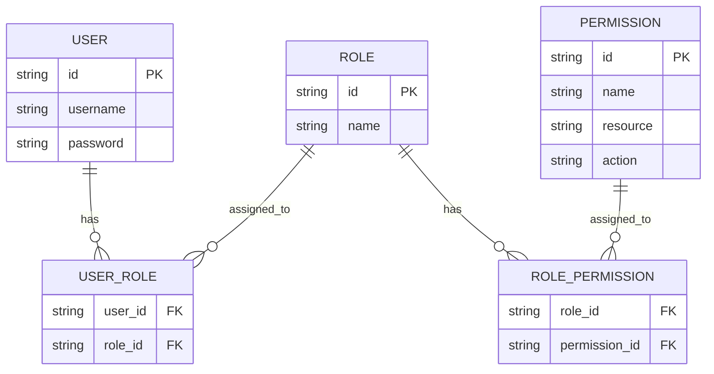
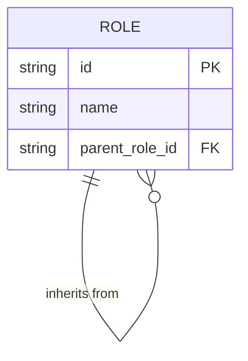
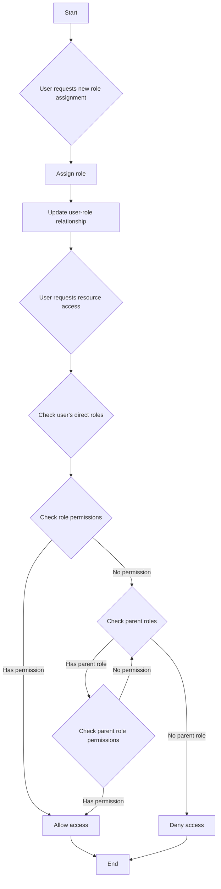
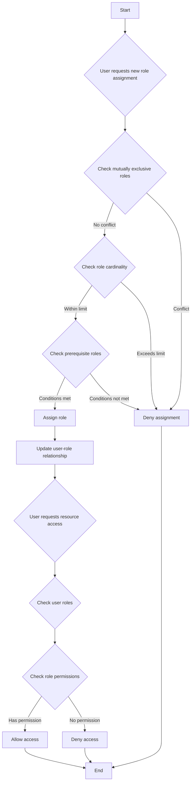

## 役割ベースのアクセス制御 (RBAC) とは？

役割ベースのアクセス制御 (RBAC) は、ユーザーと許可を分離するために「役割」という概念を導入した、広く採用されているアクセス制御モデルであり、柔軟で効率的な許可管理システムを実現します。

RBAC の基本的な考え方はシンプルでありながら強力です：ユーザーに直接許可を割り当てるのではなく、許可を役割に割り当て、それをユーザーに割り当てます。この許可配分の間接的な方法により、アクセス権管理のプロセスが大幅に簡素化されます。

### RBAC の主要な概念

RBAC モデルは、次の4つの主要な要素を中心に展開します：

1. ユーザー: システム内の個人、通常は実際の人間です。
2. 役割: 組織内の職務や責任を表現します。
3. 許可: 特定のリソース上で特定の操作を行うための認可です。
4. セッション: ユーザーが特定の役割をアクティブにする動的な環境です。

RBAC の基本的なワークフローは次のように要約できます:
1. 組織構造やビジネス要件に基づいて役割を定義する。
2. 各役割に適切な許可を割り当てる。
3. ユーザーの責任に基づいて1つ以上の役割を割り当てる。
4. ユーザーがリソースにアクセスしようとしたとき、システムは割り当てられた役割に必要な許可があるかを確認する。

### RBAC の種類

#### RBAC0: 基礎

RBAC0 は、ユーザー、役割、許可、およびセッションの核心概念を定義する基本モデルです。すべての他の RBAC モデルの基礎として機能します。

主要な特徴：
- ユーザーと役割の関連付け: 多対多の関係
- 役割と許可の関連付け: 多対多の関係



この図は、ユーザー、役割、および許可の関係を示す RBAC0 の基本構造を示しています。

主要な操作:
1. ユーザーへの役割の割り当て
2. 役割への許可の割り当て
3. ユーザーが特定の許可を持っているかの確認

RBAC0 は堅実なスタート地点を提供しますが、いくつかの制限があります:
1. 役割の爆発: システムの複雑さが増すにつれて、役割の数が急増する可能性があります。
2. 許可の冗長性: 異なる役割が同様の許可セットを必要とする場合があり、重複が発生する可能性があります。
3. 階層の欠如: 役割間の継承関係を表現できません。

#### RBAC1: ロール階層の導入

RBAC1 は RBAC0 に基づいて、役割継承の概念を追加します。

```plaintext
RBAC1 = RBAC0 + Role Inheritance
```

主要な特徴：
- 役割階層: 役割は親役割を持つことができる
- 許可継承: 子役割は親役割からすべての許可を継承する



この図は、RBAC1 における役割が他の役割を継承できる方法を示しています。

主要な操作：



このフローチャートは、ロールの割り当てと RBAC1 での許可チェックのプロセス、特に役割継承の側面を示しています。

RBAC1 はいくつかの利点を提供します:
1. 役割の数の減少: 継承を通じて少ない基礎役割を作成可能
2. 許可管理の簡素化: 組織の階層構造を反映しやすくなる

しかし、RBAC1 にもいくつかの制限があります:
1. 制約メカニズムの欠如: 潜在的に衝突する役割を同時に保持するユーザーを制限できない
2. パフォーマンスの考慮: 許可チェックは役割階層全体をたどる必要があるかもしれない

#### RBAC2: 制約の導入

RBAC2 は RBAC0 に基づきますが、制約の概念を導入します。

```plaintext
RBAC2 = RBAC0 + Constraints
```

主要な特徴:
1. 相互排他の役割: ユーザーは同時にこれらの役割には割り当てられない
2. 役割のカーディナリティ: 特定の役割に割り当てられることができるユーザーの数の制限
3. 前提条件の役割: ある役割が割り当てられる前に特定の役割を持っている必要がある



このフローチャートは、RBAC2 における役割の割り当てとアクセス制御のプロセスを示し、さまざまな制約を取り入れています。

RBAC2 は、過度の許可の集中を防ぐことでセキュリティを強化し、より正確なアクセス制御を可能にします。しかし、複数の制約条件をチェックする必要があるため、システムの複雑さが増し、パフォーマンスに影響を与える可能性があります。

### RBAC3: 包括的モデル

RBAC3 は RBAC1 と RBAC2 の特徴を組み合わせ、役割継承と制約メカニズムの両方を提供します：

```plaintext
RBAC3 = RBAC0 + Role Inheritance + Constraints
```

この包括的モデルは最大の柔軟性を提供しますが、実装とパフォーマンスの最適化において課題を伴います。

## RBAC (役割ベースのアクセス制御) の利点は何ですか？

1. 許可管理の簡素化: 役割を通じた一括認可により、個々のユーザー許可管理の複雑さを軽減します。
2. セキュリティの向上: ユーザー許可をより正確に制御することで、セキュリティリスクを低減します。
3. 管理コストの削減: 役割許可の変更は関連ユーザー全員に自動的に反映されます。
4. ビジネスロジックとの整合性: 役割は組織構造やビジネスプロセスを反映することが多いため、理解しやすく管理しやすくなります。
5. 職務分離のサポート: 相互排他的な役割などの制約により、重要な責任を分離することができます。

## 実際の実装における考慮事項は何ですか？

実際のシナリオで RBAC を実装する際には、開発者は次の重要な側面を考慮すべきです：

1. データベース設計: RBAC 構造を効果的に保存およびクエリするためにリレーショナルデータベースを利用します。
2. パフォーマンスの最適化: キャッシング戦略を実施し、特に複雑な RBAC3 モデルの場合において許可チェックを最適化します。
3. API およびフロントエンド統合: ユーザー、役割、許可を管理するための明確な API を設計し、フロントエンドアプリケーションで RBAC をどのように使用するかを考慮します。
4. セキュリティと監査: RBAC システム自体のセキュリティを確保し、詳細なログ記録と監査機能を実施します。
5. スケーラビリティ: より複雑な許可ルールのサポートや他のシステムとの統合など、将来の拡張を考慮して設計します。
6. ユーザーエクスペリエンス: システム管理者が RBAC 構造を簡単に構成および維持できる直感的なインターフェースを設計します。

<SeeAlso slugs={['abac', 'access-control']} />

<Resources
  urls={[
    "https://blog.logto.io/rbac-and-abac",
    "https://blog.logto.io/mastering-rbac",
    "https://blog.logto.io/organization-and-role-based-access-control",
    "https://docs.logto.io/docs/recipes/rbac/",
    "https://en.wikipedia.org/wiki/Role-based_access_control"
  ]}
/>
