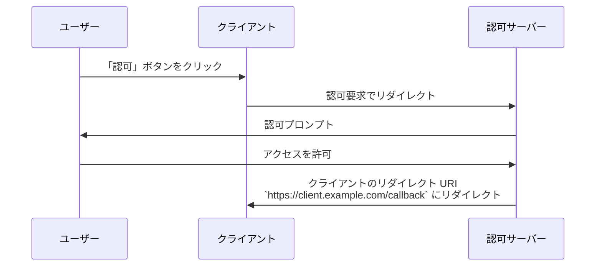

## リダイレクト URI とは何ですか？

リダイレクト URI は、コールバック URL またはリダイレクト URL とも呼ばれ、<Ref slug="authorization-request" /> が完了した後に <Ref slug="authorization-server" /> がユーザーエージェントをリダイレクトする場所を示すための URI です。

> ユニバーサルリソース識別子 (URI) は、URL (Uniform Resource Locator) と混同されることがよくあります。詳細については、[Unveiling URI, URL, and URN](https://blog.logto.io/unveiling-uri-url-and-urn) をご覧ください。

リダイレクト URI を含む認可要求 (authorization request) の例を見てみましょう：

```http
GET /authorize?response_type=code
  &client_id=YOUR_CLIENT_ID
  &redirect_uri=https%3A%2F%2Fclient.example.com%2Fcallback
  &scope=openid%20profile%20email
  &state=abc123
  &nonce=123456 HTTP/1.1
```

この例では、`redirect_uri` パラメーターの生の値は `https%3A%2F%2Fclient.example.com%2Fcallback` であり、これは URL エンコードされています。実際の値は `https://client.example.com/callback` です。

## リダイレクト URI はどのように機能しますか？

> <Ref slug="openid-connect" /> のコンテキストでは、OAuth 2.0 の <Ref slug="authorization-request" /> および <Ref slug="authorization-server" /> のワークフローが同様に適用されます。リダイレクト URI は、<Ref slug="authentication-request" /> および <Ref slug="openid-connect" headingId="openid-provider-op" /> においても OAuth 2.0 と同様の方法で機能します。

<Ref slug="client" /> が URL `https://client.example.com` から認可要求 (authorization request) を開始したとしましょう。ユーザーが認可プロセスを完了すると、認可サーバー (authorization server) はユーザーエージェント（ブラウザ）を `https://client.example.com/callback` にリダイレクトします。



リダイレクト URI が、認可プロセスが完了するときにユーザーエージェントをリダイレクトするために認可サーバーが必要であることは明らかです。加えて、リダイレクト URI は、フローによっては認可コードまたはトークンを受け取るために使用されます。

<Ref slug="authorization-code-flow" /> における実際のリダイレクトの非規範的な例は以下の通りです：

```http
HTTP/1.1 302 Found
Location: https://client.example.com/callback?code=AUTHORIZATION_CODE&state=abc123
```

認可サーバーによって追加される URL パラメーター `code` および `state` は、リダイレクト URI に含まれることに注意してください。クライアントは、認可プロセスを続行するために URL から `code` および `state` パラメーターを抽出する必要があります。

## なぜリダイレクト URI が必要なのか？

前述の例からわかるように、認可サーバー (authorization server) は認可要求 (authorization request) が成功した後にどこにリダイレクトするかを知る必要があります。複数のクライアント（例：<Ref slug="single-sign-on" />）があり、各クライアントに異なるリダイレクト URI がある場合に特に役立ちます。

<Ref slug="authorization-code-flow" /> では、リダイレクト URI は、フロントチャンネル（ブラウザ）を使用してトークンを攻撃にさらさないようにし、認可コードをクライアントに返すためにも使用されます。

[Resource Owner Password Credentials (ROPC) grant](https://datatracker.ietf.org/doc/html/rfc6749#section-4.3) を使用して、リダイレクト URI なしでユーザーのトークンを取得することも可能でしたが、<Ref slug="oauth-2.1" /> ではセキュリティ上の懸念から廃止されました。

## セキュリティ上の考慮事項

リダイレクト URI は重要なパラメーターであり、攻撃者の一般的なターゲットとなります。以下は考慮すべきセキュリティのポイントです：

- **ホワイトリストリダイレクト URI**：クライアントは、認可サーバーに登録されたリダイレクト URI のみを受け入れるべきです。これは、攻撃者がユーザーを悪意のあるサイトにリダイレクトするのを防ぎます。
- **HTTPS を使用する**：クライアントと認可サーバー間の通信を保護するために、常にリダイレクト URI に HTTPS を使用してください。
- **完全一致**：リダイレクト URI は登録済みの URI と正確に一致するべきです。認可サーバーは、広範な一致パターンを許可しない厳格な一致ルールを強制する場合があります。
- **状態パラメーター**：<Ref slug="csrf" /> の攻撃を防ぐために `state` パラメーターを使用してください。クライアントは認可要求で送信した値と一致することを確認するために `state` パラメーターを検証するべきです。

<SeeAlso slugs={["csrf", "oauth-2.1", "authorization-code-flow"]} />

<Resources
  urls={[
    "https://blog.logto.io/oauth-2-1",
    "https://blog.logto.io/csrf",
    "https://blog.logto.io/redirect-uri-in-authorization-code-flow",
  ]}
/>
