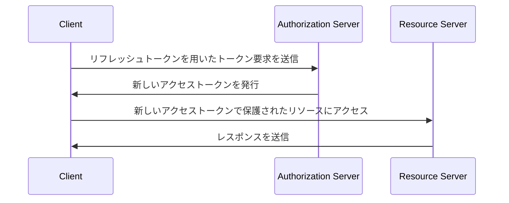

## リフレッシュトークンとは？

リフレッシュトークンは、通常ランダムな文字列で構成される長期間有効な認証情報で、ユーザーが再認証することなく新しい<Ref slug="access-token">アクセストークン</Ref>を取得するために使用されます。OAuth 2.0 と OpenID Connect (OIDC) のコンテキストでは、<Ref slug="authorization-server">認可サーバー</Ref>はクライアント（アプリケーション）が<Ref slug="offline-access" />を要求した際にリフレッシュトークンを発行することがあります。

[OAuth 2.0 RFC](https://datatracker.ietf.org/doc/html/rfc6749#section-1.5)はリフレッシュトークンの高レベルのライフサイクルを定義していますが、実装の詳細は認可サーバーやクライアントによって異なる場合があります。これについては、次のセクションで詳しく説明します。

## リフレッシュトークンはどのように機能するのか？

リフレッシュトークンは通常、クライアントが<Ref slug="offline-access" />を要求した際にアクセストークンと一緒に発行されます。業界の標準としては、`offline_access` スコープを<Ref slug="authorization-request" />に含めることでオフラインアクセスを要求しますが、<Ref slug="openid-connect" />はこの目的のために公式に `offline_access` スコープを定義しています（<Ref slug="authentication-request" />で利用可能です）。

以下は、`offline_access` スコープを含む認可要求の非標準的な例です：

```http
GET /authorize?response_type=code
  &client_id=YOUR_CLIENT_ID
  &redirect_uri=https%3A%2F%2Fclient.example.com%2Fcallback
  &scope=openid%20profile%20email%20offline_access
  &state=abc123
  &nonce=123456 HTTP/1.1
```

クライアントがリフレッシュトークンを受け取った後、それを使用して現在のアクセストークンが失効した際に新しいアクセストークンを要求することができます。以下は、リフレッシュトークンを使用した簡略化された例です：



シーケンス図が示すように、リフレッシュトークンの使用はクライアントと認可サーバーの両方でサポートされる必要があります：

- クライアントはリフレッシュトークンを安全に保管し、<Ref slug="token-request" />で使用して新しいアクセストークンを取得する必要があります。
- 認可サーバーはリフレッシュトークンを検証し、クライアントが有効なリフレッシュトークンを提示した際に新しいアクセストークンを発行する必要があります。

リフレッシュトークンは<Ref slug="resource-server" />と共有することを意図していません。アクセスが許可されるべきトークンは、リソースサーバーが確認すべき唯一のトークンです。

以下は、リフレッシュトークンを使用したトークン要求の非標準的な例です：

```http
POST /token HTTP/1.1
Host: your-authorization-server.com
Content-Type: application/x-www-form-urlencoded

grant_type=refresh_token
  &refresh_token=YOUR_REFRESH_TOKEN
  &client_id=YOUR_CLIENT_ID
  &client_secret=YOUR_CLIENT_SECRET
  &scope=openid%20profile%20email
```

## セキュリティ考慮事項 ||security-considerations||

リフレッシュトークンは長期間有効で（例：日単位、週単位）、ユーザーの操作なしで新しいアクセストークンを取得できるため、アクセストークンよりも高いセキュリティリスクを伴います（例：分単位、時間単位）。リフレッシュトークンの使用は慎重に検討され、潜在的なセキュリティ脅威を軽減するように実装されるべきです。以下は考慮すべきベストプラクティスです：

### 安全な保管

リフレッシュトークンをクライアント側で安全に保管し、不正アクセスを防ぐ。以下の保管機構が含まれます：

- **HTTP-only クッキー**: クライアント側の JavaScript によるアクセスを防ぐために、トークンを HTTP-only クッキーに保存します。
- **暗号化されたストレージ**: モバイルデバイスでは Keychain (iOS) や KeyStore (Android) などの安全なストレージ、Web アプリケーションでは暗号化されたデータベースを使用します。

### リフレッシュトークンのローテーション ||refresh-token-rotation||

リフレッシュトークンは長期間有効ですが、定期的にまたは特定の条件に基づいて（例：成功したトークン交換後）ローテーションさせることで、不正アクセスのリスクを大幅に削減できます。具体的なローテーションの戦略は、アプリケーションのセキュリティ要件や認可サーバーの機能によって異なる場合があります。

以下は一般的なトークンローテーションの戦略です：

- **時間ベースのローテーション**: 一定期間ごとに（例：毎週 7 日）リフレッシュトークンをローテーションします。
- **イベントベースのローテーション**: 特定のイベント（例：成功したトークン交換、パスワード変更）後にリフレッシュトークンをローテーションします。

リフレッシュトークンがローテーションされる際、以前のリフレッシュトークンは再利用を防ぐために無効化されるべきです。これらの戦略はしばしばセッション TTL（有効期間）と組み合わせて、リフレッシュトークンの有効性に関わらず一定期間が経過した後にユーザーが再認証を求められることを保証します。

### 送信者制約付きリフレッシュトークン ||sender-constrained-refresh-tokens||

送信者制約付きリフレッシュトークンは、リフレッシュトークンをリクエストしたクライアントにバインドするためのセキュリティメカニズムで、クライアントが<Ref slug="client" headingId="confidential-clients">信頼されたクライアント</Ref>でない場合に使用されます。一般的な方法として [DPoP](https://datatracker.ietf.org/doc/html/rfc9449) と [mTLS](https://datatracker.ietf.org/doc/html/rfc8705) があります。

### クライアントタイプ

リフレッシュトークンの使用を<Ref slug="client" headingId="confidential-clients">信頼された（プライベート）クライアント</Ref>に制限することをお勧めします。

- パブリッククライアント（例：シングルページアプリケーション）は、ソースコードをクライアント側に公開するため、攻撃者がリフレッシュトークンを抽出して悪用しやすくなります。リフレッシュトークンの使用が必要な場合、通常は<Ref slug="pkce" />やリフレッシュトークンのローテーションなどのより安全なメカニズムが使用されます。
- 対照的に、信頼されたクライアントは安全なサーバー環境で実行され、ソースコードや環境がクライアント側に公開されません。リフレッシュトークンはそのような環境でより安全に使用することができます。

### トークンの失効

リフレッシュトークンは通常<Ref slug="opaque-token">不透明トークン</Ref>（すなわち、クライアントにとって意味を持たない）であり、認可サーバーによって検証される必要があるため、認可サーバーは必要に応じてリフレッシュトークンを無効化するトークン失効メカニズムを容易に実装できます。これは例えばユーザーログアウト、アカウントの危険性、トークンの誤用などのシナリオで役立ちます。

<SeeAlso slugs={["access-token", "id-token", "jwt", "opaque-token"]} />

<Resources urls={[
  "https://blog.logto.io/understanding-refresh-token-rotation",
  "https://blog.logto.io/understanding-tokens-in-oidc",
  {
    url: "https://openid.net/specs/openid-connect-core-1_0.html#OfflineAccess",
    result: {
      ogTitle: "Offline Access in OpenID Connect Core 1.0",
    }
  },
  {
    url: "https://datatracker.ietf.org/doc/html/rfc6749#section-1.5",
    result: {
      ogTitle: "Refresh Token in OAuth 2.0",
      ogDescription: "Refresh tokens are credentials used to obtain access tokens."
    },
  },
]} />
