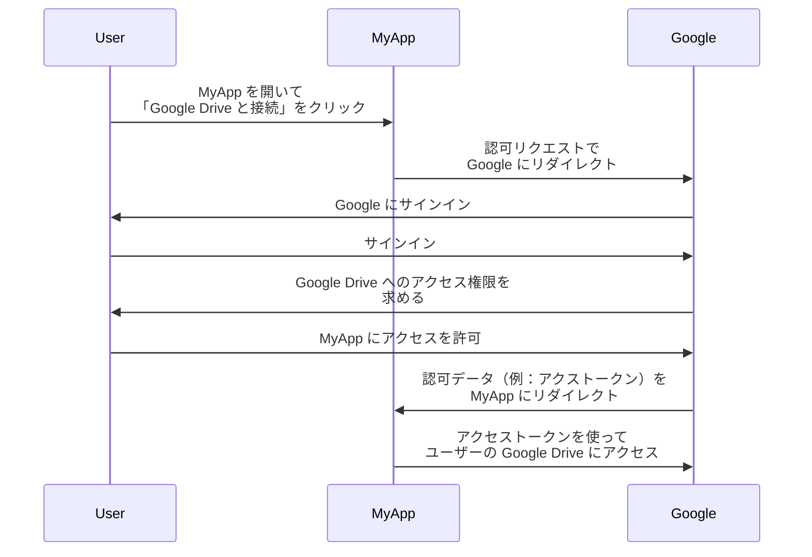

## リソース所有者とは何か？

<Ref slug="oauth-2.0" /> のコンテキストでは、リソース所有者とは、保護されたリソース（例えばデータ、ファイル、サービスなど）へのアクセスを許可する能力を持つアイデンティティ（通常はユーザー）です。

例えば、ユーザーの Google Drive にアクセスしたい Web アプリケーション MyApp があるとします。以下は典型的な OAuth 2.0 のフローです：

このフローでは、**ユーザー**が**リソース所有者**であり、自分の Google Drive へのアクセス権を MyApp に許可します。一方、**MyApp** は保護されたリソースにアクセスしたい <Ref slug="client" /> であり、**Google** は <Ref slug="authorization-server" /> であり、同時に <Ref slug="resource-server" /> でもあります。

名前が示すように、リソース所有者は <Ref slug="resource-server" /> においていくつかのリソースを所有し、<Ref slug="oauth-2.0" /> コンテキストでクライアントが代理でそれらにアクセスすることを許可できます。

## リソース所有者はなぜ重要か？

<Ref slug="authorization" /> プロセスにおいて、リソース所有者は、自分のリソースへのアクセスを明示的に許可または拒否する唯一の人物であるため、欠かせない存在です。リソース所有者の同意は、技術的およびコンプライアンスの両方の理由で必須です：

- **技術的**：リソース所有者の同意により、クライアントがリソースにアクセスするために必要な権限を持つことが保証されます。すべてまたは何もないアクセスではなく、リソース所有者はクライアントのリクエストに従って部分的なアクセスを許可することがあります。一方で、リソース所有者はいつでもアクセスを明示的に取り消すこともできます。この方法により、<Ref slug="access-control" /> のための明確で監査可能な手段が提供されます。
- **コンプライアンス**：リソース所有者の同意は、特に機密データを扱う場合、多くの法管轄地で法的要件です。例えば、一般データ保護規則（GDPR）は、データ主体（リソース所有者）がデータ処理活動に対して明示的な同意を提供することを義務付けています。

## リソース所有者 vs. リソースサーバー

<Ref slug="resource-server">リソースサーバー</Ref>は、**保護されたリソース**をホスティングおよび提供する責任を負います。彼らはアクセストークンを確認し、クライアントにリソースを提供する関門になります。

一方、リソース所有者は、<Ref slug="access-control" /> ポリシーに従って、リソースサーバー内の保護されたリソースに対して完全または部分的なコントロールを持つことがあります。

<SeeAlso slugs={["resource-server", "oauth-2.0", "resource-indicator", "access-control"]} />

<Resources
  urls={[
    "https://tools.ietf.org/html/rfc6749",
  ]}
/>
