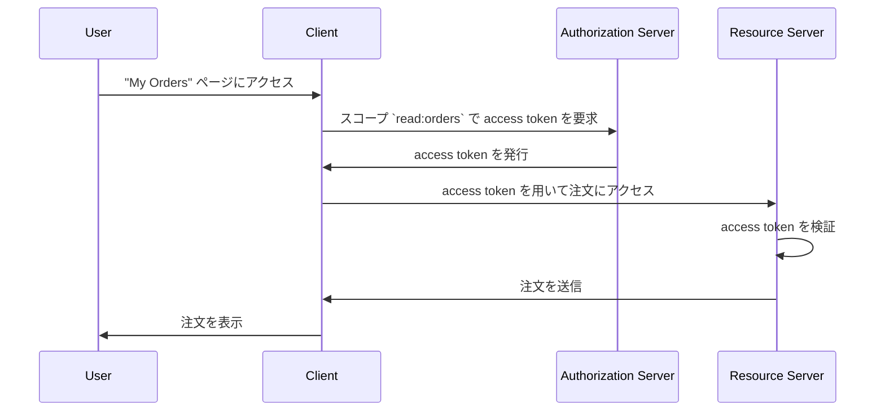

## リソースサーバーとは？

<Ref slug="oauth-2.0" /> の文脈において、**リソースサーバー**は、<Ref slug="client" /> がアクセスしたい**保護されたリソース**をホストするサーバーです。リソースサーバーはまた、<Ref slug="access-token" /> を検証し、<Ref slug="access-control" /> ポリシーに従ってクライアントに保護されたリソースを提供する責任を持っています。

例えば、ウェブアプリケーション MyApp がユーザーの Google ドライブにアクセスしたいと考えている場合、このシナリオでは：

- **MyApp** は保護されたリソースにアクセスしたいクライアントです。
- **Google** はユーザーの Google ドライブをホストするリソースサーバーです。
- **Google** はまた、MyApp に access token を発行する <Ref slug="authorization-server" /> でもあります。

別の例として、ある E コマースウェブサイトが内部の注文サービスからユーザーの注文履歴にアクセスしたい場合を考えてみましょう。この場合：

- **E コマースウェブサイト** は保護されたリソースにアクセスしたいクライアントです。
- **注文サービス** はユーザーの注文履歴をホストするリソースサーバーです。
- E コマースウェブサイトが OAuth 2.0 サービスや OpenID プロバイダーと統合している場合、そのサービス（プロバイダー）が authorization server として機能します。

## リソースサーバーはどのように機能するのか？

OAuth 2.0 はリソースサーバーと authorization server の役割を明確に分離するために個別に定義しています。しかし、フレームワーク内でリソースサーバーの具体的な表現を定義せず、保護されたリソースをホストする仮想的な概念として参照しています。<Ref slug="client" /> は、アクセスしたい保護されたリソースに対して <Ref slug="scope">scope</Ref> を指定する必要があります。

クライアントが注文サービスからユーザーの注文履歴にアクセスしたいとしましょう。注文にアクセスするための <Ref slug="token-request" /> を送信する非規範的な例は次のようになります：



上記のシーケンス図では、クライアントは authorization server から `read:orders` スコープで access token を要求しています。`read:orders` スコープの意味はすべての関係者で一致していると仮定します：クライアントがリソースサーバーによって提供される `orders` に対して `read` アクションを行いたいことを指定しています。その後、クライアントは access token を使用してリソースサーバーから注文にアクセスします。

> [!Note]
> スコープの意味と構造は OAuth 2.0 によって定義されておらず、クライアント、authorization server、およびリソースサーバーによって合意されるべきです。

リソースサーバーは access token を検証し、クライアントが要求されたリソースにアクセスするための必要な権限を持っているかどうかを <Ref slug="access-control" /> ポリシーに従って判断します。実装によっては、access token は <Ref slug="opaque-token" /> または <Ref slug="jwt" /> である場合があります。

## 命名規則

リソースサーバーをアプリケーションのコンテキストに応じて柔軟に命名できます。OAuth 2.0 は <Ref slug="scope" /> パラメータにおいてリソースサーバーの具体的な表現を定義していないため、業界ではさまざまな命名規則が見られます：

- リソースサーバー名を省略し、アクションのみを使用する：例えば、`read` や `write`。
- `[verb]:[resource]`：一般的な規則として、`verb` と `resource` の組み合わせを使用して、クライアントがリソースに対して実行できるアクションを指定します。例えば、`read:orders` や `write:profile`。時々、これらは `orders:read` や `profile:write` のように逆になります。
- `[uri]:[action]`：別の規則として、リソースの URI およびクライアントが実行できるアクションを使用します。例えば、`https://api.example.com/orders:read` や `https://api.example.com/profile:write`。

## リソースインジケーター

<Ref slug="authentication-request" />（デコード済み）のスコープパラメータの例を見てみましょう：

```plaintext
openid profile email https://api.example.com/orders:read
```

この例では、`scope` パラメータに `openid`、`profile`、`email` スコープが含まれており、これらは <Ref slug="openid-connect" /> の標準スコープであり、また、`https://api.example.com/orders:read` スコープが含まれており、これはリソースサーバーの位置とリソースを読む許可を指定しています。

この特定のケースでは問題ないように見えますが、リソースやスコープの数が増えるにつれて、スコープを管理および理解することが難しくなる可能性があります。この問題に対処するために、OAuth 2.0 は <Ref slug="resource-indicator">リソースインジケーター</Ref>（RFC 8707）と呼ばれる拡張機能を導入しており、クライアントがアクセスしたいリソースを明示的に指定するために URI を使用できるようにし、リソースサーバーをプロセス内でより明示的にします。

認証リクエストにリソースインジケーターパラメータを追加した後（`resource=https://api.example.com/orders`）、スコープパラメータは次のように簡略化できます：

```plaintext
openid profile email read
```

これにより、よりクリーンで管理しやすくなります。

> [!Note]
> すべての authorization server（OpenID プロバイダー）がリソースインジケーターの拡張をサポートしているわけではありません。使用する前に authorization server のドキュメントを必ず確認してください。

<SeeAlso slugs={["access-control", "resource-indicator", "resource-owner", "client"]} />

<Resources
  urls={[
    "https://datatracker.ietf.org/doc/html/rfc8707",
  ]}
/>
