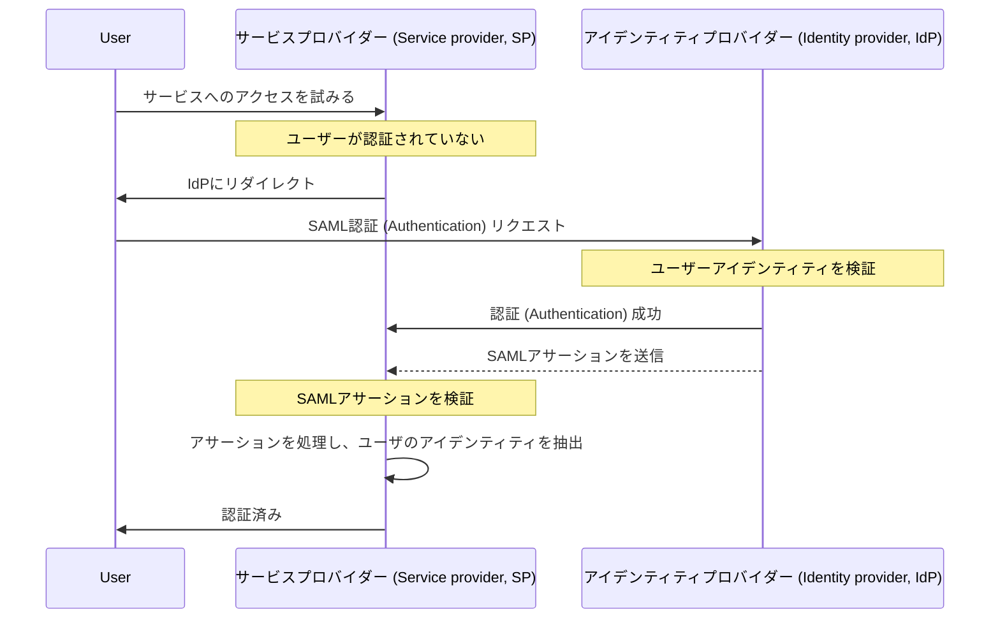

## SAMLとは？

SAML（通常はSAML 2.0と呼ばれます）は、<Ref slug="identity-provider" /> と <Ref slug="service-provider" /> の2者間で認証 (Authentication) と認可データを交換するためのXMLベースの標準です。これはアイデンティティフェデレーションおよび<Ref slug="enterprise-sso" /> ソリューションで広く使用されています。

名前が示すように、SAMLはユーザーのアイデンティティと属性に関するアサーションを伝達します。これらのアサーションはデジタル署名され、オプションで暗号化されて、その整合性と機密性を確保します。

## SAMLはどのように機能するのか？

SAML認証 (Authentication) フローに進む前に、アイデンティティプロバイダーとサービスプロバイダーがどのようにお互いを認識し信頼することができるかを理解する必要があります。この信頼はメタデータ交換を通じて確立され、双方が以下の情報を共有します:

- **エンティティID**: アイデンティティプロバイダーまたはサービスプロバイダーのためのユニークな識別子。
- **公開鍵**: SAMLアサーションのデジタル署名を検証するために使用されます。
- **エンドポイント**: 認証 (Authentication) リクエストやレスポンスなど、さまざまなSAML操作のためのURL。

信頼が確立されると、SAML認証 (Authentication) フローを進めることができます:

### RelayState

SAMLフローでは、`RelayState` パラメータは認証 (Authentication) プロセス中にユーザーの状態を維持するために使用されます。これは、ユーザーがアイデンティティプロバイダーにリダイレクトされる前に行った元のリクエストへの参照として機能します。サービスプロバイダーは、このパラメータを使用して認証 (Authentication) に成功した後、ユーザーを元のページまたはリソースにリダイレクトできます。

RelayStateは、<Ref slug="csrf" /> 攻撃を防ぐためにも使用され、認証 (Authentication) 後にユーザーが正しいページにリダイレクトされることを保証します。

### SAMLアサーション

SAMLアサーションは、SAMLプロトコルの中心的なコンポーネントです。これはユーザーのアイデンティティ、属性、および認証 (Authentication) ステータスに関する情報を含みます。SAMLアサーションには3種類あります:

- **認証 (Authentication) アサーション**: ユーザーがアイデンティティプロバイダーによって認証 (Authentication) されたことを示します。
- **属性アサーション**: 役割、許可、およびプロファイルデータなど、ユーザーに関する追加情報を含みます。
- **認可 (Authorization) 決定アサーション**: 特定のリソースへのユーザーのアクセス権を指定します。

## SAMLを採用する際の考慮事項

SAMLは2000年代初頭の登場以来、企業環境で広く採用されています。アプリケーションにSAMLを採用する際の主な考慮事項を以下に示します:

- 複雑さ: 特に<Ref slug="oauth-2.0" /> や<Ref slug="openid-connect" /> のような現代のフレームワークと比較して、アプリケーションへの統合が複雑になる可能性があります。
- 転送効率: XML形式のため、SAMLメッセージは大きくなる可能性があり、ネットワークのパフォーマンスに影響を与えることがあります。
- セキュリティ: SAMLアサーションは改ざんや盗聴から保護されなければなりません。SAML実装が暗号化とデジタル署名のベストプラクティスに従うようにしてください。

これらの点を考慮しても、SAMLは企業環境におけるセキュアなアイデンティティフェデレーションおよびシングルサインオーンソリューションのための強力で広く使用されている標準です。しかし、新しいアプリケーションやサービスの場合、認証 (Authentication) と認可をより軽量で開発者フレンドリーなアプローチで行うために、OAuth 2.0 や OpenID Connect のような現代的な代替手段を検討することをお勧めします。

<SeeAlso slugs={["enterprise-sso", "oauth-2.0", "openid-connect"]} />

<Resources
  urls={[
    "https://blog.logto.io/saml-security-cheat-sheet",
    "https://blog.logto.io/picking-your-sso-method",
    "https://blog.logto.io/differences-between-saml-and-oidc",
  ]}
/>