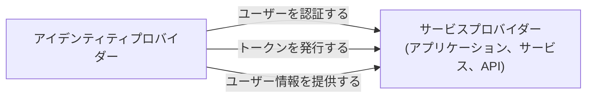

## サービスプロバイダー (SP) とは？

<Ref slug="iam" /> の領域において、サービスプロバイダー (SP)（または <Ref slug="openid-connect" /> の文脈における**依存パーティ**）は、認証 (Authentication) および認可のために <Ref slug="identity-provider" /> に依存するアプリケーションまたはサービスです。サービスプロバイダーは、ユーザーにサービスを提供し、アイデンティティプロバイダーによって発行されたトークンに基づいて <Ref slug="access-control" /> ポリシーを強制します。

## サービスプロバイダーの標準

サービスプロバイダーには厳格な標準はありませんが、アイデンティティ管理を必要とする任意のタイプのアプリケーションやサービスになることがあります。しかし、サービスプロバイダーは依存するアイデンティティプロバイダーによって設定された標準に従うことがよくあります。例えば、アイデンティティプロバイダーが <Ref slug="openid-connect" /> をサポートしている場合、サービスプロバイダーは通常、認証 (Authentication) および認可に OIDC を使用します。

## サービスプロバイダーのアーキテクチャ

「サービスプロバイダー」という用語は、特定のアーキテクチャや実装を指定するものではありません。通常、サービスプロバイダーは信頼を確立し、安全な通信を可能にするためにアイデンティティプロバイダーに登録する必要があります。登録プロセスには通常、メタデータとクライアント認証情報の交換が含まれます。

例えば、OpenID Connect の文脈では、サービスプロバイダーのメタデータには通常以下が含まれます：

- **クライアント ID**: サービスプロバイダーのための一意の識別子。
- **クライアントシークレット**: サービスプロバイダーを認証するために使用される共通の秘密。
- **<Ref slug="redirect-uri">リダイレクト URI</Ref>**: アイデンティティプロバイダーが認証 (Authentication) および認可の後にユーザーを戻す URI。

登録が完了すると、サービスプロバイダーはユーザーをアイデンティティプロバイダーの指定したエンドポイントにリダイレクトすることにより、<Ref slug="authentication" /> プロセスを開始できます。

対話を伴わないユースケースのために構築されたサービスプロバイダーは、<Ref slug="machine-to-machine" /> 通信を必要とする <Ref slug="client">クライアント</Ref> と呼ばれることがよくあります。

<SeeAlso slugs={["identity-provider", "openid-connect", "oauth-2.0"]} />

<Resources
  urls={[
    "https://blog.logto.io/secure-cloud-apps-with-oauth-and-openid-connect",
    "https://blog.logto.io/incorporate-identity-solution",
    "https://blog.logto.io/centralized-identity-system"
  ]}
/>
