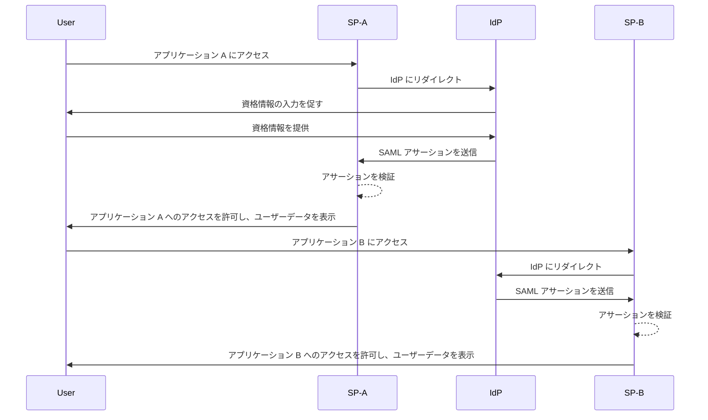
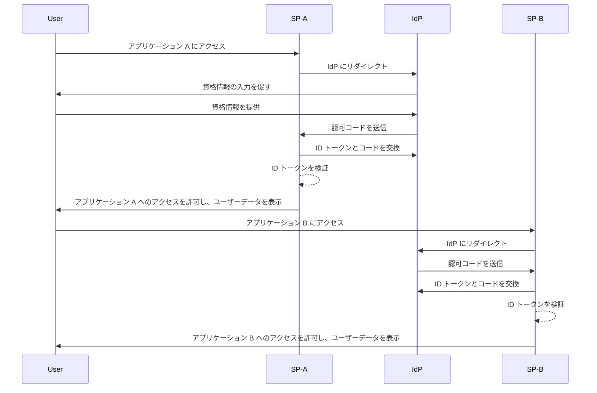

## シングルサインオン (Single sign-on, SSO) とは？

シングルサインオン (Single sign-on, SSO) は、ユーザーが単一の資格情報で複数のアプリケーションやサービスにアクセスできる<Ref slug="authentication" />方法です。各システムごとに別々のログインを管理する代わりに、ユーザーは一度認証されると、すべての接続されたプラットフォームに自動的にサインインされます。

SSO は、特に企業環境で、従業員やリモートワーカーがさまざまな SaaS アプリケーションに依存して仕事をする場合に、個人およびビジネスの両方の設定で一般的に使用されます。SSO を実装することで、組織はセキュリティを強化し、アクセス管理を合理化し、ユーザーの生産性を向上させることができます。

SSO のよく知られた例として、Google のサービススイート、例えば Gmail、Google ドライブ、Google カレンダーがあります。Google アカウントにサインインした後、ユーザーは資格情報を再入力することなく、これらすべてのサービスに簡単にアクセスできます。

## シングルサインオンはどのように機能するのか？

SSO は、<Ref slug="service-provider" />として知られるアプリケーションまたはサービスと、<Ref slug="identity-provider" />との間の信頼関係に依存しています。IdP はユーザー認証を処理し、必要な情報を SP に安全に共有してアクセスを許可します。この信頼は、フェデレーションと呼ばれるプロセスを通じて確立され、SP と IdP が認証データを安全に交換するための特定の標準とプロトコルに合意します。

ユーザーが SSO 対応アプリケーションにアクセスしようとすると、SP は認証のために IdP にリダイレクトします。IdP はユーザーに資格情報の提供を促し、ユーザーの身元を確認し、そのシステム内で認証されたセッションを確立します。このセッションは通常、IdP のドメインに安全に保存されたセッションクッキーを使用して維持されます。

ユーザーが認証されると、IdP はユーザー情報を含むセキュリティトークンまたはアサーションを生成し、SP と共有することに同意された情報を含みます。このトークンまたはアサーションは安全に SP に送信され、SP はそれを検証し、ユーザーにアクセスを許可します。

ユーザーが別の SSO 対応アプリケーションにアクセスする場合、このプロセスは追加のログインを必要とせずにスムーズに行われます。この利便性は、IdP によって維持されるユーザー認証セッションによって可能になり、IdP はユーザーの身元を自動的に確認し、再度資格情報を求めることなく新しいセキュリティトークンを発行します。

<Ref slug="saml" /> や <Ref slug="openid-connect" /> などのプロトコルは、SSO を実装するために広く使用されています。これらの標準は、IdP と SP 間で認証データが安全に交換される方法を定義し、アプリケーション間でのユーザーのシームレスな体験を維持しながら、信頼性と安全な通信を確保します。

### SAML ベースの SSO

SAML ベースの SSO では、ユーザーが IdP によって認証されると、XML ベースの SAML アサーションが生成され、署名され、安全に SP に送信されます。SP はアサーションを検証し、ユーザーの身元に基づいてアクセスを許可します。

### OIDC ベースの SSO

OIDC は、<Ref slug="oauth-2.0" /> の上に構築され、SSO に対するより現代的なアプローチを提供します。IdP と SP 間でのアイデンティティ情報の交換に <Ref slug="jwt" /> を使用し、セキュリティを強化し、柔軟性を高めます。

## シングルサインオンの利点

1. **セキュリティの強化**: SSO は、ユーザーが覚える必要のある資格情報の数を最小限に抑えることで、パスワード関連のセキュリティ侵害のリスクを軽減します。また、<Ref slug="mfa" /> などのより強力な認証方法を組織が導入できるようにし、ユーザーアカウントを保護します。

2. **ユーザーエクスペリエンスの向上**: ユーザーは、繰り返しログインする必要なく、複数のアプリケーションにシームレスにアクセスでき、生産性が向上し、フラストレーションが軽減されます。SSO はログインプロセスを簡素化し、異なるプラットフォーム間で一貫したユーザーエクスペリエンスを提供します。

3. **集中管理されたアクセス管理**: 組織は、IdP を通じてユーザーアクセスと権限を集中管理し、すべての接続されたアプリケーションで一貫したセキュリティポリシーとアクセス制御を確保します。これにより、ユーザーのプロビジョニング、デプロビジョニング、および監査プロセスが簡素化されます。

## シングルサインオンを使用する場面

1. **企業および組織環境**: SSO は、ワークフローを合理化するために複数のアプリケーションやサービスに依存する企業に特に有益です。ユーザーアクセスを簡素化し、IT チームが個々のユーザーアカウントを管理する負担を軽減します。例えば、CRM、HR、コラボレーションツールなどの複数の SaaS アプリケーションを使用する企業。
2. **顧客向けアプリケーション**: SSO は、オンラインサービスや e コマースプラットフォームにアクセスする顧客のユーザーエクスペリエンスを向上させることもできます。例えば、ユーザーが新しいアカウントを作成する代わりに、ソーシャルメディアアカウントやメールアドレスでログインできるようにすること。
3. **マルチプロダクトサービス**: 相互接続された製品やサービスのスイートを提供する企業は、SSO を活用して、提供する製品間でシームレスなユーザーエクスペリエンスを提供できます。ユーザーは、繰り返しログインする手間なく、異なるアプリケーション間を移動できます。例えば、Google の G Suite。ユーザーは Chrome ブラウザで一度ログインすると、資格情報を再入力することなく、複数の Google サービスにアクセスできます。

SSO の使用はこれらのシナリオに限定されず、組織やアプリケーションの特定のニーズに基づいてさまざまなユースケースに適応できます。現代のデジタル環境において、セキュリティ、ユーザーエクスペリエンス、および運用効率を向上させるためのベストプラクティスと広く見なされています。

<SeeAlso slugs={["enterprise-sso"]} />