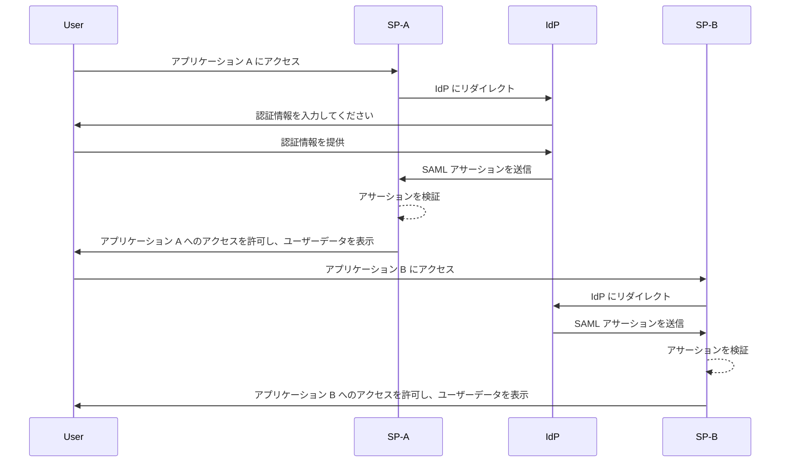
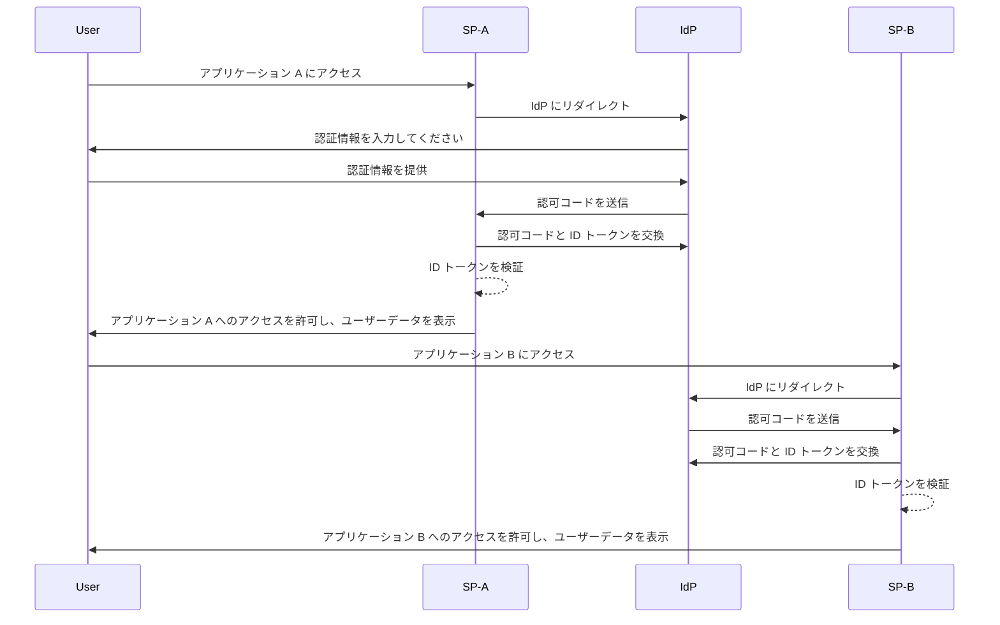

## シングルサインオン (SSO) とは？

シングルサインオン (SSO) は、ユーザーが単一の認証情報セットを使用して複数のアプリケーションやサービスにアクセスできるようにする認証 (authentication) 方法です。各システム用に別々のログインを管理する代わりに、ユーザーは一度認証されれば、自動的にすべての接続されたプラットフォームにサインインされます。

SSO は、個人用およびビジネス環境で一般的に使用されており、特に従業員やリモートワーカーがさまざまな SaaS アプリケーションに依存して仕事を行う企業環境でよく見られます。SSO を導入することで、組織はセキュリティを強化し、アクセス管理を簡素化し、ユーザーの生産性を向上させることができます。

SSO のよく知られた例としては、Google のサービススイート、例えば Gmail、Google ドライブ、Google カレンダーがあります。ユーザーは Google アカウントにサインインすることで、認証情報を再入力することなく、これらのサービスすべてに簡単にアクセスできます。

## シングルサインオンはどのように機能するか？

SSO は、<Ref slug="service-provider" /> と <Ref slug="identity-provider" /> として知られるアプリケーションまたはサービスの間の信頼関係に基づいて運営されています。IdP はユーザーの認証を行い、SP にアクセスを許可するために必要な情報を安全に共有します。この信頼はフェデレーションと呼ばれるプロセスを通じて確立され、SP と IdP は認証データを安全に交換するための特定の標準とプロトコルに同意します。

ユーザーが SSO 対応のアプリケーションにアクセスしようとすると、SP はユーザーを認証のために IdP にリダイレクトします。IdP はユーザーに認証情報の入力を促し、ユーザーのアイデンティティを確認し、ユーザーの情報を含むセキュリティトークンまたはアサーションを生成します。このトークンは SP に送り返され、SP はそれを用いてアクセスを許可します。

ユーザーが別の SSO 対応アプリケーションにアクセスしようとすると、再度ログインを必要とせずに自動的にプロセスが繰り返されます。IdP は必要な認証データを直接 SP に送信し、ユーザーが新しいアプリケーションにシームレスにアクセスできるようにします。

SAML (Security Assertion Markup Language) と OIDC (OpenID Connect) は、SSO を実装するために広く使用されている 2 つのプロトコルです。これらの標準は、認証データが IdP と SP 間でどのように交換されるかを定義し、セキュアで信頼性のある通信を保証します。

### SAML ベースの SSO

SAML ベースの SSO では、ユーザーが IdP によって認証されると、XML ベースの SAML アサーションが生成され、署名された後、安全に SP に送信されます。SP はアサーションを検証し、ユーザーのアイデンティティに基づいてアクセスを許可します。

### OIDC ベースの SSO

OIDC は、OAuth 2.0 の上に構築されており、SSO によりモダンなアプローチを提供します。IdP と SP 間でアイデンティティ情報を交換するために JSON Web Tokens (JWT) を使用し、セキュリティを強化し、より柔軟性を提供します。

## シングルサインオンの利点

1. **セキュリティの強化**: SSO はユーザーが覚える必要のある認証情報の数を最小限に抑えることで、パスワードに関連するセキュリティ違反のリスクを軽減します。また、多要素認証 (MFA) などのより強力な認証方法を組織が導入することを可能にし、ユーザーアカウントを保護します。

2. **ユーザーエクスペリエンスの向上**: ユーザーは何度もログインする必要なく、複数のアプリケーションにシームレスにアクセスでき、生産性が向上し、フラストレーションが減少します。SSO はログインプロセスを簡素化し、異なるプラットフォーム間で一貫したユーザーエクスペリエンスを提供します。

3. **一元化されたアクセス管理**: 組織は IdP を通じてユーザーのアクセスと権限を一元管理でき、すべての接続されたアプリケーション全体で一貫したセキュリティポリシーとアクセス制御を確保します。これにより、ユーザープロビジョニング、デプロビジョニング、および監査プロセスが簡素化されます。

## シングルサインオンを使用するタイミング

1. **企業や組織の環境**: SSO は、複数のアプリケーションやサービスに依存してワークフローを合理化する必要がある企業にとって特に有益です。ユーザーアクセスを簡素化し、IT チームに個別のユーザーアカウントを管理する負担を軽減します。例えば、CRM、HR、コラボレーションツールなどの複数の SaaS アプリケーションを使用している企業。
2. **顧客向けアプリケーション**: SSO は、オンラインサービスや e コマースプラットフォームにアクセスする顧客に対しても、ユーザーエクスペリエンスを向上させることができます。例えば、ユーザーがそれぞれのサービスごとに新しいアカウントを作成する代わりに、ソーシャルメディアアカウントやメールアドレスを使用してログインできるようにします。
3. **複数製品サービス**: 企業が相互接続された製品やサービスのスイートを提供している場合、SSO を活用してオファリング全体でシームレスなユーザーエクスペリエンスを提供できます。ユーザーは、何度もログインする手間なく、異なるアプリケーション間をナビゲートできます。例えば、Google の G Suite。Chrome ブラウザで一度ログインすることで、Google の複数のサービスに認証情報を再入力することなくアクセスすることができます。

SSO の使用はこれらのシナリオに限定されるわけではなく、組織やアプリケーションの特定のニーズに基づいてさまざまなユースケースに適応させることができます。これは、現代のデジタル環境において、セキュリティ、ユーザーエクスペリエンス、運用効率を向上させるためのベストプラクティスとして広く認識されています。

<SeeAlso slugs={['enterprise-sso']} />
