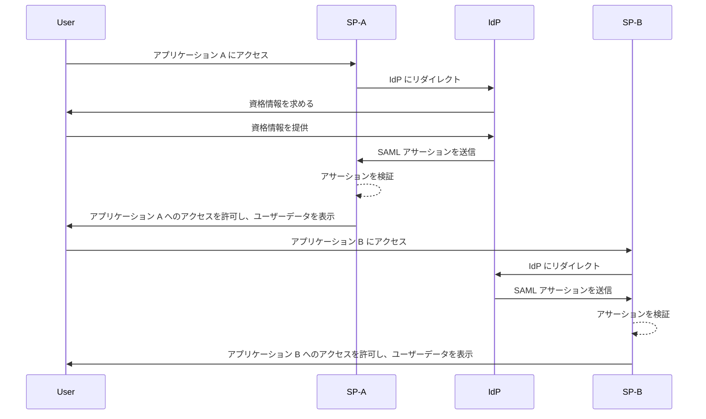
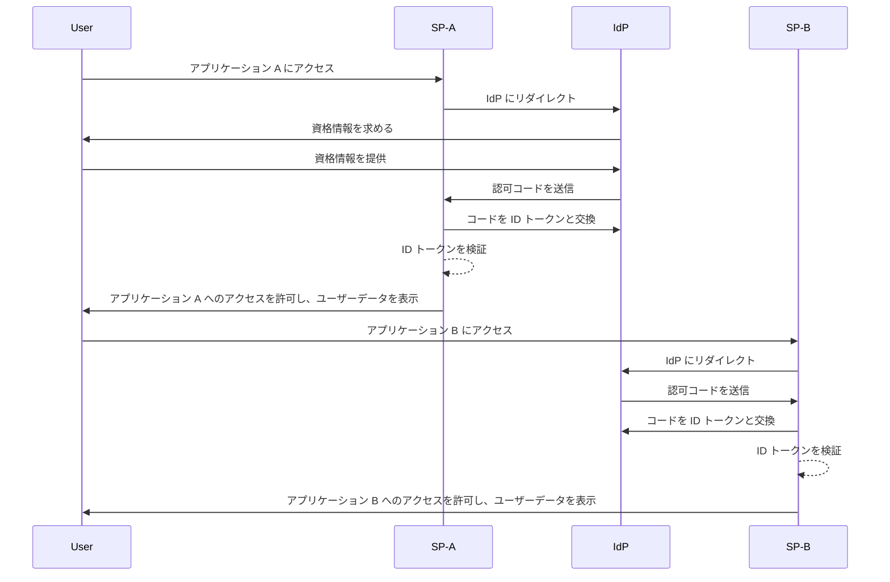

## シングルサインオン (Single sign-on, SSO) とは何か？

シングルサインオン (Single sign-on, SSO) は、<Ref slug="authentication" /> 方法で、ユーザーが1つの資格情報セットで複数のアプリケーションやサービスにアクセスできるようにします。各システムのログインを個別に管理する代わりに、ユーザーは一度認証するだけで、すべての接続されたプラットフォームに自動的にサインインされます。

SSO は、個人およびビジネス環境、特に従業員やリモートワーカーがさまざまな SaaS アプリケーションに依存して業務を行う企業環境で一般的に使用されます。SSO を導入することで、組織はセキュリティを強化し、アクセス管理を簡素化し、ユーザーの生産性を向上させることができます。

SSO のよく知られた例としては、Google のサービススイート、例えば Gmail、Google ドライブ、Google カレンダーが挙げられます。Google アカウントにサインインした後、ユーザーはこれらのサービスに再度の資格情報入力なしで簡単にアクセスできます。

## シングルサインオン (Single sign-on, SSO) の仕組み

SSO は、<Ref slug="service-provider" /> と <Ref slug="identity-provider" /> と呼ばれるアプリケーションやサービス間の信頼関係に基づいて動作します。IdP はユーザー認証を処理し、必要な情報を安全に SP に共有してアクセスを許可します。この信頼関係は、フェデレーションと呼ばれるプロセスを通じて確立され、SP と IdP は特定の標準とプロトコルに合意して認証データを安全に交換します。

ユーザーが SSO 対応アプリケーションにアクセスしようとすると、SP はユーザーを認証のために IdP にリダイレクトします。IdP はユーザーに資格情報を求め、ユーザーの身元を確認し、ユーザー情報を含むセキュリティトークンやアサーションを生成します。このトークンは SP に返送され、SP はそれを使用してアクセスを許可します。

ユーザーが別の SSO 対応アプリケーションにアクセスしようとすると、ユーザーの再ログインを必要とせず、自動的にプロセスが繰り返されます。IdP は必要な認証データを直接 SP に送信し、ユーザーはシームレスに新しいアプリケーションにアクセスできます。

<Ref slug="saml" /> および <Ref slug="openid-connect" /> は、SSO を実装するためによく使用される2つのプロトコルです。これらの標準は、IsP と SP 間で認証データがどのように交換されるかを定義し、安全かつ信頼性のある通信を保証します。

### SAML ベースの SSO

SAML ベースの SSO では、ユーザーが IdP によって認証されると、XML ベースの SAML アサーションが生成され、署名され、SP に安全に送信されます。SP はアサーションを検証し、ユーザーのアイデンティティに基づいてアクセスを許可します。

### OIDC ベースの SSO

OIDC は、<Ref slug="oauth-2.0" /> 上に構築され、SSO に対してより現代的なアプローチを提供します。<Ref slug="jwt" /> を使用して IdP と SP 間でアイデンティティ情報を交換し、セキュリティを強化し、柔軟性を高めています。

## シングルサインオン (Single sign-on) の利点

1. **セキュリティの向上**: SSO は、ユーザーが覚える必要のある資格情報の数を最小限に抑えることで、パスワード関連のセキュリティ侵害のリスクを軽減します。また、<Ref slug="mfa" /> などの強力な認証方法を適用することにより、ユーザーアカウントを保護できます。

2. **ユーザーエクスペリエンスの向上**: ユーザーは繰り返しログインする必要がなく、複数のアプリケーションにシームレスにアクセスでき、生産性が向上し、ストレスが軽減されます。SSO はログインプロセスを簡素化し、異なるプラットフォーム間で一貫したユーザーエクスペリエンスを提供します。

3. **集中管理されたアクセス管理**: 組織は IdP を通じてユーザーアクセスと権限を集中管理でき、すべての接続されたアプリケーション間で一貫したセキュリティポリシーとアクセスコントロールを保証します。これにより、ユーザーのプロビジョニング、デプロビジョニング、および監査のプロセスが簡素化されます。

## シングルサインオン (Single sign-on) を使用すべきタイミング

1. **企業および組織環境**: SSO は、多くのアプリケーションやサービスに依存してワークフローを効率化する企業に特に有益です。ユーザーアクセスを簡素化し、IT チームが個々のユーザーアカウントを管理する負担を軽減します。例えば、CRM、HR、コラボレーションツールなど、複数の SaaS アプリケーションを使用する企業。
2. **顧客向けアプリケーション**: SSO は、オンラインサービスや e コマースプラットフォームへのアクセスする顧客のユーザーエクスペリエンスも向上させることができます。例えば、ユーザーが各サービスごとに新しいアカウントを作成する代わりに、ソーシャルメディアアカウントやメールアドレスでログインできるようにすること。
3. **マルチプロダクトサービス**: 相互接続された製品やサービスのスイートを提供する企業は、SSO を活用して自社製品間でシームレスなユーザーエクスペリエンスを提供できます。ユーザーは繰り返しのログインの手間なく、異なるアプリケーション間を移動できます。例として、Google の G Suite。ユーザーは Chrome ブラウザで一度ログインすれば、資格情報を再入力することなく複数の Google サービスにアクセスできます。

SSO の使用はこれらのシナリオに限定されず、組織やアプリケーションの特定のニーズに基づいてさまざまなユースケースに適応できます。現代のデジタル環境でセキュリティ、ユーザーエクスペリエンス、運用効率を向上させるためのベストプラクティスと広く見なされています。

<SeeAlso slugs={["enterprise-sso"]} />