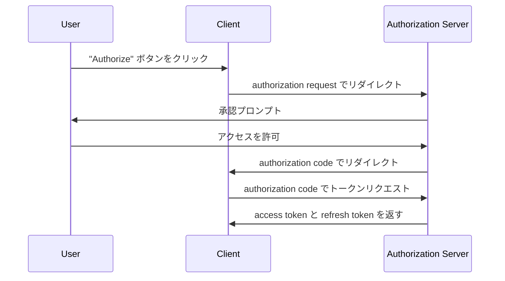
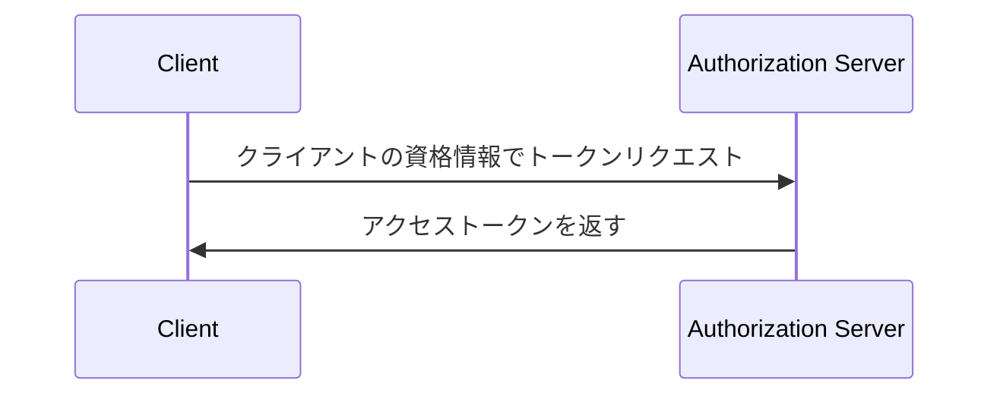

## トークンリクエスト (Token request) とは？

<Ref slug="oauth-2.0" /> や <Ref slug="openid-connect" /> において、トークンリクエスト (Token request) は資格情報（例：authorization code や refresh token）を一連のトークンと交換するための <Ref slug="authorization-server" />（OIDC における <Ref slug="openid-connect" headingId="openid-provider-op" />）へのリクエストです。トークンセットには通常、以下の1つまたは複数が含まれます。

- <Ref slug="access-token" />: 保護されたリソースにアクセスするためのトークン。
- <Ref slug="id-token" />: ユーザー情報を含むトークン（OIDC 特有）。
- <Ref slug="refresh-token" />: ユーザーの操作なしに新しい access token を取得するために使用できるトークン。

使用される <Ref slug="oauth-2.0-grant">grant type</Ref> に応じて、リクエストには異なるパラメータが含まれ、異なるトークンが返されることがあります。

例えば、<Ref slug="client-credentials-flow" /> では、<Ref slug="client" /> がクライアントの資格情報を使用して直接 <Ref slug="access-token" /> を要求します。ここにトークンリクエストの非標準的な例があります。

```http
POST /token HTTP/1.1
Host: authorization-server.example.com
Content-Type: application/x-www-form-urlencoded

grant_type=client_credentials
  &client_id=client-id
  &client_secret=client-secret
  &scope=read
```

リクエストが成功した場合、authorization server は access token を返します。

```http
HTTP/1.1 200 OK
Content-Type: application/json

{
  "access_token": "eyJhbGci...zHg",
  "token_type": "Bearer",
  "expires_in": 3600,
  "scope": "read"
}
```

## トークンリクエスト (Token request) の動作方法

上記の例が示すように、トークンリクエスト (Token request) 自体は単純です。クライアントは、必要なパラメータを含む HTTP リクエストを authorization server のトークンエンドポイントに送信します。authorization server はリクエストを検証し、処理し、レスポンスでトークンを返します。

しかし、使用される特定の grant type（フロー）に応じて、トークンリクエストにはより多くの準備が必要になる場合があります。

### Authorization code flow

<Ref slug="authorization-code-flow" /> では、クライアントはまず authorization server に対し <Ref slug="authorization-request" />（OIDC では <Ref slug="authentication-request" />）を開始して authorization code を取得します。ユーザーが許可を与えると、クライアントはトークンリクエストを通じて authorization code を access token とオプションで refresh token に交換します。

以下は authorization code flow の簡略化されたシーケンス図です。



### Client credentials flow

最初のセクションの例が示すように、<Ref slug="client-credentials-flow" /> は非常に簡単です。クライアントはクライアントの資格情報を使用して直接 access token を要求します。authorization server はクライアントの資格情報を検証し、成功した場合は access token を発行します。

以下は client credentials flow の非標準的なシーケンス図です。



### Refresh token

一部の grant types では、クライアントは authorization request に `offline_access` scope を含めることで <Ref slug="offline-access" /> を要求することができます。許可された場合、authorization server は access token と共に refresh token を発行します。クライアントはトークンリクエストを通じてユーザーの操作なしに refresh token を使用して新しい access token を取得できます。

以下は新しい access token を取得するために refresh token を使用する非標準的な例です。

```http
POST /token HTTP/1.1
Host: authorization-server.example.com
Content-Type: application/x-www-form-urlencoded

grant_type=refresh_token
  &refresh_token=refresh-token
  &client_id=client-id
  &client_secret=client-secret
```

---

他の <Ref slug="oauth-2.0-grant">grant types</Ref> もトークンリクエストを含むことがありますが、基本的な考え方は変わりません。

## トークンリクエスト (Token request) の主要パラメータ

トークンリクエスト (Token request) で一般的に使用される主要なパラメータを以下に示します。

- **`grant_type`**: リクエストされている grant の種類。一般的な値には `authorization_code`、`client_credentials`、`refresh_token` などがあります。
- **`client_id`**: authorization server によって発行されるクライアント識別子。
- **`client_secret`**: authorization server によって発行されるクライアントの秘密（機密クライアント用）。
- **`code`**: authorization server から取得した authorization code（authorization code flow 用）。
- **`refresh_token`**: authorization server から取得した refresh token（アクセストークンの更新用）。
- **`scope`**: access token のために要求される <Ref slug="scope">scopes</Ref>（権限）。
- **`redirect_uri`**: authorization server がレスポンスを送信する URI（authorization code flow 用）。
- **`code_verifier`**: <Ref slug="pkce" /> 拡張で使用される code verifier（authorization code flow 用）。

実際のパラメータとその値は grant type およびアプリケーションの特定の要件に依存します。トークンリクエストを行う前に、使用している特定の grant type のためのパラメータの完全なリストを参照する必要があります。

<SeeAlso slugs={["oauth-2.0", "openid-connect", "authorization-request", "authentication-request"]} />