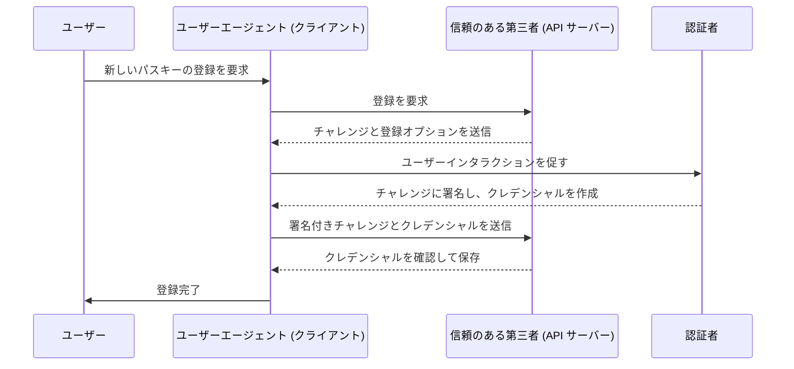
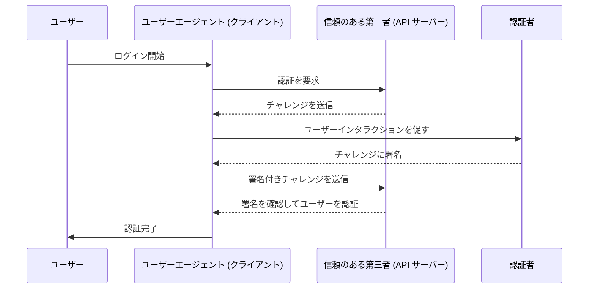

## WebAuthn とは何ですか？

WebAuthn (Web Authentication (ウェブ認証) API) は、[W3C](https://www.w3.org/) と [FIDO Alliance](https://fidoalliance.org/) によって開発された、FIDO2 標準を使用した安全なウェブ認証のための仕様です。WebAuthn は、公開鍵暗号によって保護されたフィッシング耐性のあるクレデンシャルである <Ref slug="passkey" /> をウェブサイトが実装できるようにする API を提供します。パスキーは、パスワードレスログインや多要素認証 (MFA) においてパスワードの代替として使用できます。

## WebAuthn のワークフローはどのように見えますか？

詳細な説明を提供するために、このプロセスを登録と認証の2つのフェーズに分けることができます。まず、WebAuthn フローに関与する4つの主要なエンティティを理解することが重要です。

### 4つの主要なエンティティ

1. **ユーザー:** ウェブアプリケーションにアクセスしようとする個人。
2. **ユーザーエージェント:** WebAuthn API の呼び出しを処理し、ユーザー、信頼のある第三者、および認証者の間で認証プロセスを管理するウェブブラウザ。
3. **信頼のある第三者:** ユーザーがアクセスを求めるサービス、アプリケーション、または API サーバー。
4. **認証者:** ユーザーの身元を検証するために使用されるハードウェアまたはソフトウェアのコンポーネント。これは、セキュリティキー (Yubikey など)、Bluetooth、NFC、または USB を介して接続される電話やタブレット、デバイスベースの生体認証や PIN など、プラットフォームやブラウザの機能に応じてさまざまな形を取ることができます。

### WebAuthn登録

非対称公開鍵暗号が中核のプロセスです。

1. **鍵ペア生成:**
ユーザーエージェントが公開および秘密鍵ペアを生成します。
    - **公開鍵:** 信頼のある第三者と共有されます。
    - **秘密鍵:** ユーザーの認証者で安全に保存されます。
2. **登録チャレンジ:**
ユーザーがパスキーの登録を試みると、信頼のある第三者からユーザーエージェントに登録チャレンジが送信されます。
3. **ユーザー検証:**
ユーザーエージェントはチャレンジを認証者に転送し、ユーザーに検証 (例: 生体認証やハードウェアセキュリティキー) を促します。
4. **暗号署名:** 
認証者はその秘密鍵を使用してチャレンジに署名し、暗号署名を作成します。
5. **検証とアクセス:**
ユーザーエージェントは署名されたチャレンジを信頼のある第三者に送信し、公開鍵を使用して署名を検証し、登録プロセスを完了します。



### WebAuthn認証

1. **認証チャレンジ:**
ユーザーがサインインしようとすると、信頼のある第三者からユーザーエージェントに認証チャレンジが送信されます。
2. **ユーザー検証:**
ユーザーエージェントはチャレンジを認証者に送信し、ユーザーに検証 (例: 生体認証やハードウェアセキュリティキー) を促します。
3. **暗号署名:**
認証者はその秘密鍵を使用してチャレンジに署名し、暗号署名を作成します。
4. **検証とアクセス:**
ユーザーエージェントは公開鍵を使用して署名を検証し、信頼のある第三者に認証が成功したことを通知します。検証が成功するとアクセスが許可されます。



## WebAuthn をどのように使用しますか？

WebAuthn API は、パスキーサインインまたは2段階認証を実装するために使用できます。詳細を知るには、パスキー経験を参照してください。

Web Authentication API (WebAuthn) を使って安全な認証を行うには、登録と認証の2つのメインプロセスを処理する必要があります。ここでは、JavaScript を使用してこれらのプロセスを実装する方法の簡単なコード例を示します。

**登録**

信頼のある第三者 (あなたのウェブアプリケーション) は、`navigator.credentials.create()` メソッドを呼び出して登録プロセスを開始します。

```jsx
// 登録
navigator.credentials.create({
  publicKey: {
    rp: {
      name: "Your Relying Party Name",
      id: "your-relying-party-id"
    },
    user: {
      id: "user-id",
      displayName: "User Name",
      name: "User Name"
    },
    challenge: "your-challenge-value",
    timeout: 60000 // 60 seconds
  }
}).then(credential => {
  // 認証用にクレデンシャルの id を保存
  localStorage.setItem("credentialId", credential.id);
}).catch(error => {
  console.error("Registration error:", error);
});
```

信頼のある第三者は、`navigator.credentials.get()` メソッドを呼び出して認証プロセスを開始します。

```jsx
// 認証
navigator.credentials.get({
  publicKey: {
    rp: {
      name: "Your Relying Party Name",
      id: "your-relying-party-id"
    },
    challenge: "your-challenge-value",
    timeout: 60000 // 60 seconds
  }
}).then(credential => {
  // クレデンシャルの id と他のプロパティを確認
  if (credential.id === localStorage.getItem("credentialId")) {
    // 認証成功
    console.log("User authenticated successfully");
  } else {
    console.error("Invalid credential");
  }
}).catch(error => {
  console.error("Authentication error:", error);
});
```

詳細については、仕様を参照してください: https://fidoalliance.org/specifications/download/.

注意: WebAuthn の操作では、登録または認証いずれの場合も、「rp ID」(信頼のある第三者 ID) は必須項目です。これは現在のウェブページのドメインホスト名を表します。これが現在のドメインと一致しない場合、ブラウザはリクエストを拒否します。つまり、パスキーは特定のドメインに紐付けられ、現在のところ既存のパスキーを別のドメインに移行する方法はありません。さらに、パスキーは異なるドメイン間で使用することはできません。

## WebAuthn と CTAP2 の違いは何ですか？

**WebAuthn** と **CTAP2** はどちらも FIDO2 標準の重要なコンポーネントですが、それぞれ異なる目的を果たしています:

- **CTAP2 (Client to Authenticator Protocol 2):** このプロトコルは、セキュリティキーやスマートフォンなどのデバイスがウェブアプリケーションと通信する方法を定義します。これは **認証者** と **ユーザーのデバイス** の間に安全なチャネルを確立し、認証に関する機密データを保護します。
- **WebAuthn (Web Authentication (ウェブ認証) API):** この API は、CTAP2 に準拠した認証者と連携するための標準化された方法をウェブアプリケーションに提供します。これにより、**ユーザーのデバイス** と **信頼のある第三者** の間で認証データを交換する認証プロセスが処理されます。

## 知っておくべき用語

- <Ref slug="passkey" />
- FIDO
- FIDO2
- CTAP2
- MFA
- Authenticator (認証者)

<Resources
  urls={[
    "https://fidoalliance.org/specs/fido-v2.0-id-20180227/fido-client-to-authenticator-protocol-v2.0-id-20180227.html",
    "https://blog.logto.io/webauthn-nextjs",
    "https://blog.logto.io/webauthn-base-knowledge"
  ]}
/>