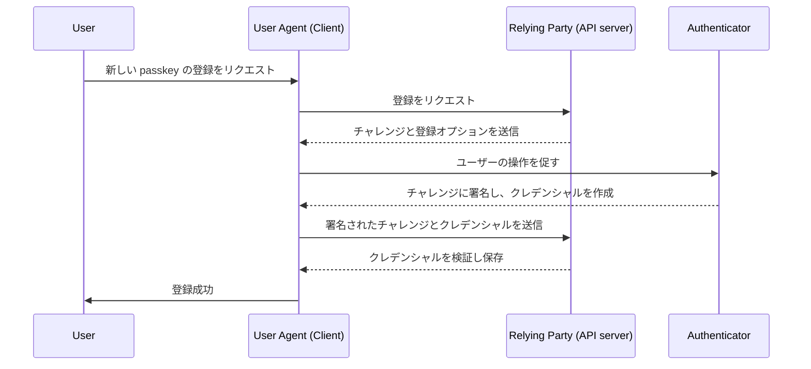
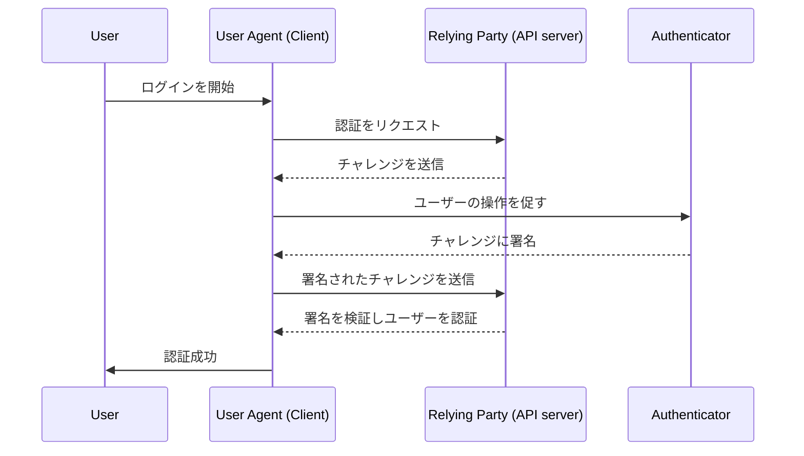

## WebAuthn とは何ですか？

WebAuthn (Web Authentication API) は、[W3C](https://www.w3.org/) と [FIDO Alliance](https://fidoalliance.org/) によって開発された、FIDO2 標準を使用した安全なウェブ認証のための仕様です。WebAuthn は、フィッシングに強いクレデンシャルである <Ref slug="passkey" /> を公開鍵暗号によって保護し、ウェブサイトがこれを実装するための API を提供します。Passkey は、パスワードレスログインや <Ref slug="mfa" /> においてパスワードを置き換えることができます。

## WebAuthn のワークフローはどのように見えますか？

よりよく理解するために、実際の例を見てみましょう。あなたのウェブアプリケーション MyApp が、Passkey を用いた多要素認証を実装するために WebAuthn API を統合したいと考えています。

**登録フェーズ:** メール確認と新しいパスワードの設定後、このユーザーは Passkey を作成するように促されます。彼らは指紋を使用してデバイスをリンクすることを選びます。これにより、Passkey がデバイス上に安全に確立されます。

**認証フェーズ:** 次回のサインイン時に、ユーザーはパスワードを入力した後に Passkey を確認するよう求められます。指紋を素早くスキャンするだけで、認証プロセスを簡単に完了できます。


より詳細な説明を提供するために、プロセスを登録と認証の2つのフェーズに分けることができます。まず、WebAuthn フローに関与する4つの主要なエンティティを理解することが重要です。

### 4つの主要なエンティティ

1. **ユーザー:** ウェブアプリケーションにアクセスしようとしている個人。
2. **ユーザーエージェント:** WebAuthn API 呼び出しを処理し、ユーザー、リライングパーティ、認証者の間で認証プロセスを管理するウェブブラウザ。
3. **リライングパーティ:** ユーザーがアクセスしようとしているサービス、アプリケーション、または API サーバー。
4. **認証者:** ユーザーのアイデンティティを確認するために使用されるハードウェアまたはソフトウェアコンポーネント。プラットフォームやブラウザの機能に応じて、セキュリティキー（Yubikey など）、Bluetooth、NFC、USB で接続された電話やタブレット、デバイスベースの生体認証や PIN など、さまざまな形式を取ることができます。

### WebAuthn 登録

非対称公開鍵暗号がコアプロセスです。

1. **鍵ペアの生成**:
ユーザーエージェントは公開鍵と秘密鍵のペアを生成します。
    - **公開鍵**: リライングパーティと共有されます。
    - **秘密鍵**: ユーザーの認証者に安全に保存されます。
2. **登録チャレンジ**:
ユーザーが passkey を登録しようとすると、リライングパーティは登録チャレンジをユーザーエージェントに送信します。
3. **ユーザー確認**:
ユーザーエージェントはチャレンジを認証者に転送し、ユーザーに確認を促します（例：生体認証やハードウェアセキュリティキー）。
4. **暗号署名**:
認証者は秘密鍵を使用してチャレンジに署名し、暗号署名を作成します。
5. **検証とアクセス**:
ユーザーエージェントは署名されたチャレンジをリライングパーティに送り返し、リライングパーティは公開鍵を使用して署名を検証し、登録プロセスを完了します。



### WebAuthn 認証

1. **認証チャレンジ:**
ユーザーがサインインしようとすると、リライングパーティは認証チャレンジをユーザーエージェントに送信します。
2. **ユーザー確認:**
ユーザーエージェントはチャレンジを認証者に送り、ユーザーに確認を促します（例：生体認証やハードウェアセキュリティキー）。
3. **暗号署名:**
認証者は秘密鍵を使用してチャレンジに署名し、暗号署名を作成します。
4. **検証とアクセス:**
ユーザーエージェントは公開鍵を使用して署名を検証し、リライングパーティに認証の成功を通知します。検証が成功するとアクセスが許可されます。



## WebAuthn の使い方は？

WebAuthn API は、passkey サインインや 2 段階認証を実装するために使用できます。詳細を知るには、Passkey の体験を参照してください。

安全な認証のために Web Authentication API (WebAuthn) を使用するには、登録と認証の2つの主要なプロセスを処理する必要があります。以下に、JavaScript を使用してこれらのプロセスを実装する方法の簡単なコード例を示します。

**登録**

リライングパーティ（あなたのウェブアプリケーション）は、`navigator.credentials.create()` メソッドを呼び出して登録プロセスを開始します。

```jsx
// 登録
navigator.credentials.create({
  publicKey: {
    rp: {
      name: "Your Relying Party Name",
      id: "your-relying-party-id"
    },
    user: {
      id: "user-id",
      displayName: "User Name",
      name: "User Name"
    },
    challenge: "your-challenge-value",
    timeout: 60000 // 60 秒
  }
}).then(credential => {
  // 将来の認証のためにクレデンシャルの id を保存
  localStorage.setItem("credentialId", credential.id);
}).catch(error => {
  console.error("登録エラー:", error);
});
```

リライングパーティは、`navigator.credentials.get()` メソッドを呼び出して認証プロセスを開始します。

```jsx
// 認証
navigator.credentials.get({
  publicKey: {
    rp: {
      name: "Your Relying Party Name",
      id: "your-relying-party-id"
    },
    challenge: "your-challenge-value",
    timeout: 60000 // 60 秒
  }
}).then(credential => {
  // クレデンシャルの id と他のプロパティを検証
  if (credential.id === localStorage.getItem("credentialId")) {
    // 認証成功
    console.log("ユーザーが正常に認証されました");
  } else {
    console.error("無効なクレデンシャル");
  }
}).catch(error => {
  console.error("認証エラー:", error);
});
```

詳細を学ぶには、仕様を読む: https://fidoalliance.org/specifications/download/。

注意: WebAuthn のアクションでは、登録または認証のいずれの場合でも、「rp ID」（リライングパーティ ID）は必須フィールドです。これは現在のウェブページのドメインホスト名を表します。現在のドメインと一致しない場合、ブラウザはリクエストを拒否します。これは、passkey が特定のドメインに結び付けられていることを意味し、現在のところ既存の passkey を別のドメインに移行する方法はありません。また、passkey は異なるドメイン間で使用することはできません。

## WebAuthn と OpenID Connect (OIDC)

WebAuthn の強力なセキュリティと OIDC の標準化されたアイデンティティプロトコルを組み合わせることで、より安全でユーザーフレンドリーな認証体験を作り出すことができます。

その仕組みについて学びましょう:

- **登録フェーズ**: ユーザーは標準的な <Ref slug="openid-connect" /> 登録プロセス（例：メール確認とパスワード作成）を完了します。WebAuthn は公開鍵と秘密鍵のペアを生成し、公開鍵を OIDC <Ref slug="identity-provider" /> に保存し、秘密鍵をユーザーのデバイスに保持します。
- **認証フェーズ**: ユーザーは OIDC で保護されたリソースにアクセスし、サインインページにリダイレクトされます。基本的なクレデンシャル（例：メールとパスワード）を提供した後、システムは passkey 認証のために WebAuthn を呼び出します。Passkey が確認されると、OIDC はユーザーアクセスのための Access Token または ID Token を発行します。

## WebAuthn と CTAP2 の違いは何ですか？

**WebAuthn** と **CTAP2** はどちらも FIDO2 標準の重要なコンポーネントですが、それぞれ異なる目的を持っています:

- **CTAP2 (Client to Authenticator Protocol 2):** このプロトコルは、セキュリティキーやスマートフォンなどのデバイスがウェブアプリケーションと通信する方法を定義します。これは、**認証者**と**ユーザーのデバイス**の間に安全なチャネルを確立し、機密の認証データを保護します。
- **WebAuthn (Web Authentication API):** この API は、CTAP2 に準拠した認証者とウェブアプリケーションが対話するための標準化された方法を提供します。これは、**ユーザーのデバイス**と**リライングパーティ**の間で認証データを交換する認証プロセスを処理します。

<SeeAlso slugs={["passkey", "mfa", "openid-connect"]} />

<Resources
  urls={[
    "https://fidoalliance.org/specs/fido-v2.0-id-20180227/fido-client-to-authenticator-protocol-v2.0-id-20180227.html",
    "https://blog.logto.io/webauthn-nextjs",
    "https://blog.logto.io/webauthn-base-knowledge"
  ]}
/>