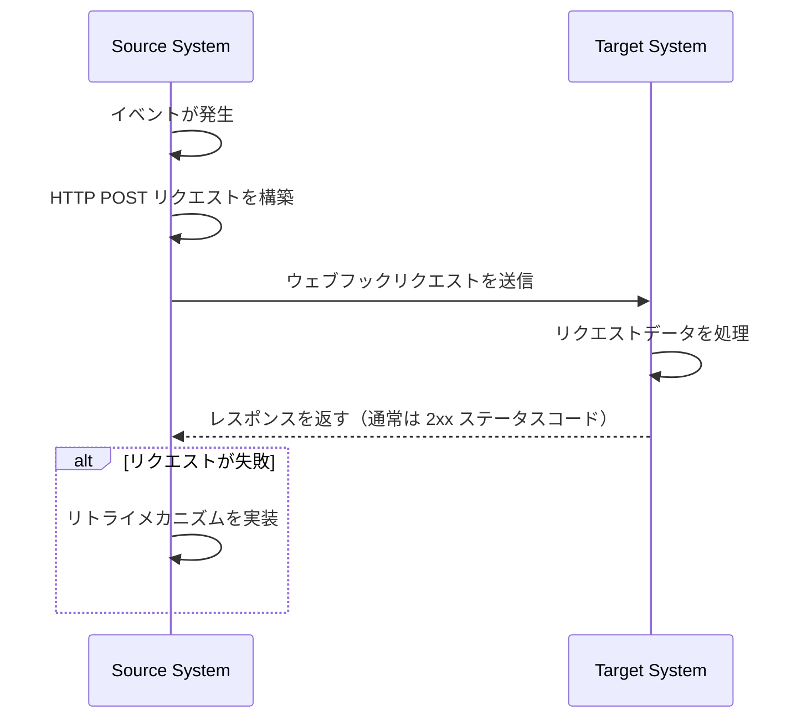
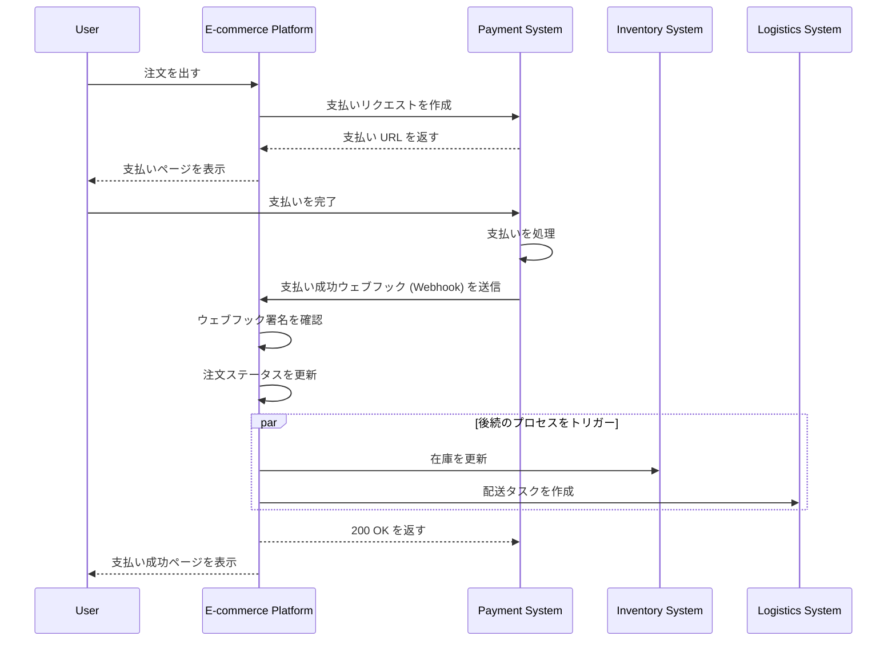

## ウェブフック (Webhook) とは？

ウェブフック (Webhook) は、特定のイベントが発生したときに事前に定義された URL へアプリケーションがリアルタイム通知を送信できる HTTP コールバックメカニズムです。このメカニズムにより、システム間での自動データ交換とリアルタイム通信が可能になります。

## ウェブフック (Webhooks) はどのように機能しますか？



1. ソースシステムで特定のイベントが発生
2. ソースシステムがイベントデータを含む HTTP POST リクエストを構築
3. ソースシステムが事前に設定されたターゲットシステムの URL へリクエストを送信
4. ターゲットシステムがリクエストを受信し、データを処理
5. ターゲットシステムがソースシステムにレスポンスを返す
6. リクエストが失敗した場合、ソースシステムはリトライメカニズムを実装する場合があります

## ウェブフック (Webhooks) の一般的な使用例は？

1. 支払いシステム：注文ステータスの変更を通知
2. バージョン管理システム：コードコミット、マージリクエスト、およびその他のイベントを通知
3. CRM システム：顧客情報の更新通知
4. IoT デバイス：デバイスステータスの変更通知
5. ソーシャルメディアプラットフォーム：新しいメッセージやコメントの通知

## ウェブフック (Webhooks) が実際の場面でどのように機能するか？

e コマースプラットフォームがサードパーティの支払いシステムと統合するシナリオを見てみましょう：

### シナリオ

e コマースプラットフォームはサードパーティの支払いシステムを使用して注文の支払いを処理します。ユーザーが支払いを完了すると、支払いシステムはウェブフック (Webhook) を介してリアルタイムで支払いステータスを e コマースプラットフォームに通知し、プラットフォームは注文ステータスを更新し、その後のプロセスをトリガーできるようにする必要があります。

### ウェブフック (Webhook) 実装フロー



1. 注文作成と支払いリクエスト：
   - ユーザーが e コマースプラットフォームで注文を行う。
   - プラットフォームが支払いシステムに支払いリクエストを送信。
   - 支払いシステムが支払い URL を返し、プラットフォームがユーザーに表示。

2. ユーザー支払い：
   - ユーザーが支払いシステムで支払いを完了。

3. ウェブフックトリガー：
   - 支払いシステムが「支払い成功」イベントを検出。
   - 支払いの詳細を含むウェブフックペイロードを構築。

4. ウェブフック送信：
   - 支払いシステムが事前に設定された e コマースプラットフォームの URL へ POST リクエストを送信。

5. 受信側処理：
   - e コマースプラットフォームがウェブフックを受信し、まずリクエスト署名を確認してセキュリティを確保。
   - 確認後、対応する注文ステータスを「支払い済み」に更新。
   - プラットフォームは、在庫の更新や配送タスクの作成など、後続のプロセスをトリガー。

6. レスポンス処理：
   - e コマースプラットフォームはウェブフックを受信するとすぐに 200 OK を返す。
   - 処理中にエラーが発生した場合、バックグラウンドで再試行するか、手動介入が行われる。

7. ユーザーエクスペリエンス：
   - e コマースプラットフォームはユーザーに支払い成功ページを表示。

この例は、サードパーティの支払いシステムと e コマースプラットフォーム間でウェブフックを使用してリアルタイム通信を可能にする方法を示しています。ウェブフックを通じて、支払いシステムは支払いが完了した瞬間に即座に e コマースプラットフォームに通知し、迅速な注文ステータスの更新とその後のビジネスプロセスの即時トリガーを可能にします。これにより、システムの全体的な応答性と効率が向上し、ユーザーにとってより良いショッピング体験を提供します。

## ウェブフック (Webhooks) を実装する際のベストプラクティスは？

ウェブフック (Webhook) の送信側（プロデューサー）である場合、次の側面を考慮してください：

### ウェブフック設計

明確で一貫性のあるウェブフック構造を設計：

- 明確なイベントタイプを定義：例えば、`order.created`、`user.updated`など。
- 標準的な JSON 形式を使用：データ構造が明確で解析しやすいことを保証。
- バージョン管理：リクエストヘッダーまたはペイロードにバージョン情報を含めます。例えば：

  ```javascript
  // リクエストヘッダー内で
  headers: {
    'Content-Type': 'application/json',
    'X-Webhook-Version': '1.0'
  }
  
  // またはペイロード内で
  {
    "version": "1.0",
    "event_type": "order.created",
    "data": {
      // イベントの詳細
    }
  }
  ```

- 十分なコンテキストを提供：イベントが発生したタイムスタンプや関連するリソースのユニークな識別子を含めます。
- 一貫性を保つ：すべてのイベントタイプで一貫した命名規則とデータ構造を使用。

### 送信メカニズム

信頼性の高いウェブフック送信メカニズムを実装：

- 非同期タスクキューを使用：メインプログラムをブロックせず、システムの応答性を向上。
- リトライメカニズムを実装：ネットワーク障害や受信側の一時的な利用不可に対応。

### リトライ戦略

適切なリトライ戦略を設計：

- 指数バックオフを実装：システムと受信者を圧迫する頻繁な再試行を避けます。
- 最大リトライ回数を設定：無限再試行がシステムリソースを消費するのを防ぎます。
- 手動リトライメカニズムを提供：最終的に失敗したウェブフックに対して手動で再試行できるインターフェースを提供。

### セキュリティ実装

受信側がリクエストの真正性を確認できるよう、署名メカニズムを実装：

```javascript
const crypto = require('crypto');

function generateSignature(payload, secret) {
  return crypto.createHmac('sha256', secret)
    .update(JSON.stringify(payload))
    .digest('hex');
}

function sendWebhookWithSignature(url, payload, secret) {
  const signature = generateSignature(payload, secret);
  return axios.post(url, payload, {
    headers: { 'X-Webhook-Signature': signature }
  });
}
```

### パフォーマンス最適化

ウェブフック送信のパフォーマンスを最適化：

- コネクションプールを使用：接続確立のオーバーヘッドを削減し、パフォーマンスを向上させます。
- バッチ処理を実装：適切な場合にウェブフックをバッチで送信し、ネットワークの相互作用回数を減らします。

### ドキュメントとテストツール

ウェブフックユーザーをサポート：

- 詳細な API ドキュメント：すべての可能なイベントタイプ、リクエスト形式、フィールドの説明を含めます。
- テストツールの提供：ウェブフック通知の受信をシミュレートできるウェブフックテストエンドポイントを実装。
- サンプルコード：さまざまなプログラミング言語での統合例を提供。

## ウェブフック (Webhooks) を使用する際のベストプラクティスは？

ウェブフックを受信する側（コンシューマー）である場合、次の側面を考慮してください：

### セキュリティ

ウェブフック受信エンドポイントは一般的に公開されているため、セキュリティは主要な関心事です。次の点に注意してください：

- リクエストの真正性を確認：署名確認メカニズムを実装し、リクエストが予期される送信者からのものであることを確認。

  ```javascript
  const crypto = require('crypto');

  function verifySignature(payload, signature, secret) {
    const expectedSignature = crypto
      .createHmac('sha256', secret)
      .update(JSON.stringify(payload))
      .digest('hex');
    
    return crypto.timingSafeEqual(
      Buffer.from(signature),
      Buffer.from(expectedSignature)
    );
  }
  ```

- HTTPS を使用：ウェブフック受信エンドポイントに HTTPS を使用し、データが傍受または改ざんされるのを防ぎます。
- IP ホワイトリストを実装：信頼できる IP アドレスからのみウェブフックリクエストを受け入れ、攻撃のリスクを低減。

### 信頼性

受信したウェブフックを確実に処理するために：

- 冪等処理を実装：送信者が失敗したリクエストを再試行することがあるため、重複したウェブフック通知を正しく処理するようシステムを設計。
- 迅速に応答：ウェブフックリクエストを受信したらすぐに（通常は 2xx ステータスコードで）応答を返し、送信者がリクエストが失敗したと見なして再試行をトリガーするのを防ぐ。

### パフォーマンス

効率的なシステム運用を維持：

- 非同期処理：ウェブフックを受信後、実際のデータ処理をバックグラウンドで行い、レスポンスをブロックしないようにします。
- タイムアウト制限を設定：ウェブフック処理のタイムアウト期間を合理的に設定し、長時間のタスクがシステムパフォーマンスに影響を与えないようにします。

### エラーハンドリング

潜在的なエラー状況を適切に処理：

- ロギング：受信したウェブフックリクエストと処理手順の詳細な記録を保持し、問題の調査を容易に。
- 優雅な劣化：ウェブフックを処理できない場合に適切なエラーハンドリングメカニズムを備え、システムの他の部分に影響を与えないようにする。

### バージョン互換性

ウェブフックの形式は時間とともに変化する可能性があるため：

- バージョン情報を処理：異なるバージョンのウェブフック形式を処理できる準備をします。バージョン情報は通常、URL またはリクエストヘッダーに提供されます。
- 後方互換性：ウェブフック処理ロジックを更新するとき、古い形式バージョンのサポートを継続。

### モニタリング

ウェブフックの受信と処理を継続的に監視：

- アラートを設定：異常事態（例：高い失敗率や異常なトラフィック）のリアルタイム監視とアラートを実装。
- パフォーマンス指標：レスポンスタイムや成功率など、ウェブフック処理のパフォーマンス指標を追跡。

<Resources
  urls={[
    "https://docs.logto.io/docs/recipes/webhooks/",
    "https://docs.logto.io/docs/recipes/webhooks/securing-your-webhooks/",
    "https://en.wikipedia.org/wiki/Webhook"
  ]}
/>