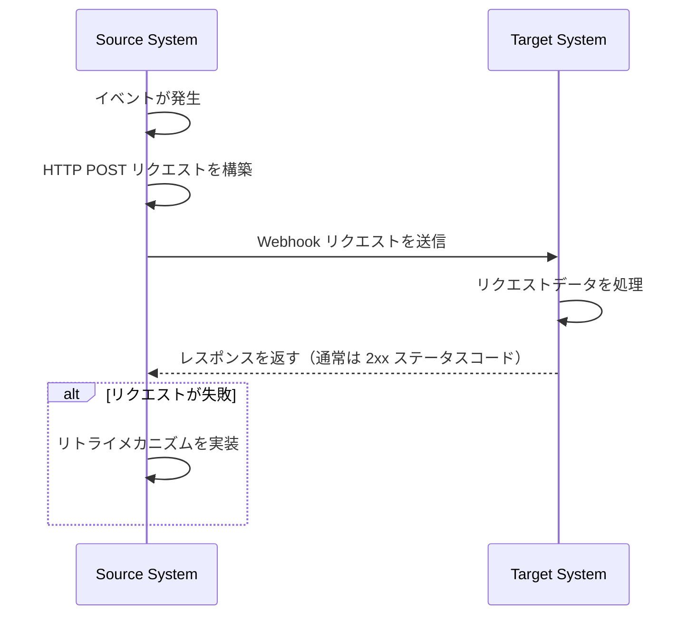
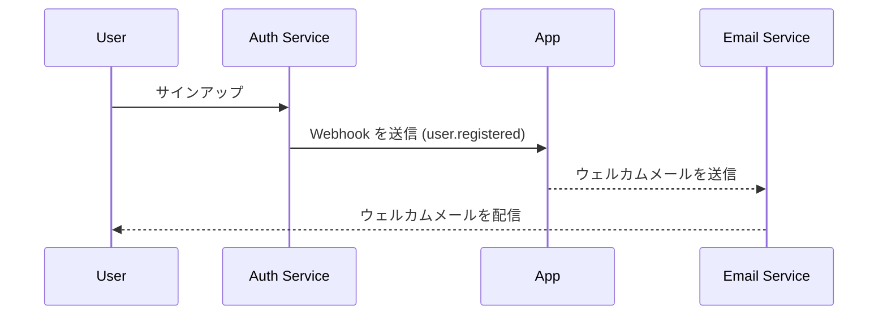

## Webhook とは何ですか？

Webhook は、特定のイベントが発生したときに、アプリケーションが事前に定義された URL にリアルタイムで通知を送信するための HTTP コールバックメカニズムです。このメカニズムにより、システム間での自動データ交換とリアルタイム通信が可能になります。

## Webhook はどのように機能しますか？



1. ソースシステムで特定のイベントが発生
2. ソースシステムがイベントデータを含む HTTP POST リクエストを構築
3. ソースシステムが事前に設定されたターゲットシステムの URL にリクエストを送信
4. ターゲットシステムがリクエストを受信し、データを処理
5. ターゲットシステムがソースシステムにレスポンスを返す
6. リクエストが失敗した場合、ソースシステムはリトライメカニズムを実装することがあります

## Webhook は実際のシナリオでどのように機能しますか？

認証 (auth) サービスと統合されたアプリケーションを例にとってみましょう。新しいユーザーがサインアップすると、アプリケーションはユーザーにウェルカムメールを送信します。

通常、認証 (auth) サービスは、新しいユーザーが登録を完了したときにトリガーされる `user.registered` webhook イベントを提供します。

Webhook イベントのペイロードには、メールやユーザー名などのユーザー情報が含まれており、ウェルカムメールを送信するために使用できます。

```json
// 注意: 実際のペイロード構造は認証 (auth) サービスによって異なります。
{
  "event": "user.registered",
  "timestamp": "2024-03-21T08:00:00Z",
  "data": {
    "user_id": "u_1234567890",
    "email": "john@example.com",    // ウェルカムメールを送信するためのメールアドレス
    "username": "johndoe",          // メールをパーソナライズするためのユーザー名
    "registered_at": "2024-03-21T08:00:00Z"
  }
}
```

Webhook フローは次のように機能します：



## Webhook を実装するためのベストプラクティスは何ですか？

Webhook の送信者（プロデューサー）である場合、次の点を考慮してください：

### Webhook の設計

明確で一貫性のある webhook 構造を設計します：

- 明確なイベントタイプを定義する：例えば、`order.created`、`user.updated` など。
- 標準の JSON フォーマットを使用する：データ構造が明確で解析しやすいことを確認します。
- バージョン管理：リクエストヘッダーまたはペイロードにバージョン情報を含めます。例えば：

  ```javascript
  // リクエストヘッダーで
  headers: {
    'Content-Type': 'application/json',
    'X-Webhook-Version': '1.0'
  }
  
  // またはペイロードで
  {
    "version": "1.0",
    "event_type": "order.created",
    "data": {
      // イベントの詳細
    }
  }
  ```

- 十分なコンテキストを提供する：イベントが発生したタイムスタンプ、関連リソースの一意の識別子などを含めます。
- 一貫性を保つ：すべてのイベントタイプで一貫した命名規則とデータ構造を使用します。

### 送信メカニズム

信頼性のある webhook 送信メカニズムを実装します：

- 非同期タスクキューを使用する：メインプログラムをブロックせず、システムの応答性を向上させます。
- リトライメカニズムを実装する：ネットワーク障害や受信者の一時的な利用不可を処理します。

### リトライ戦略

適切なリトライ戦略を設計します：

- 指数バックオフを実装する：頻繁なリトライを避け、システムと受信者に負担をかけないようにします。
- 最大リトライ回数を設定する：無限リトライがシステムリソースを消費しないようにします。
- 手動リトライメカニズムを提供する：最終的に失敗した webhook に対して手動でリトライするためのインターフェースを提供します。

### セキュリティ実装

受信者がリクエストの正当性を確認できるように署名メカニズムを実装します：

```javascript
const crypto = require('crypto');

function generateSignature(payload, secret) {
  return crypto.createHmac('sha256', secret)
    .update(JSON.stringify(payload))
    .digest('hex');
}

function sendWebhookWithSignature(url, payload, secret) {
  const signature = generateSignature(payload, secret);
  return axios.post(url, payload, {
    headers: { 'X-Webhook-Signature': signature }
  });
}
```

### パフォーマンス最適化

Webhook 送信のパフォーマンスを最適化します：

- コネクションプールを使用する：接続の確立にかかるオーバーヘッドを削減し、パフォーマンスを向上させます。
- バッチ処理を実装する：適切な場合に webhook をバッチで送信し、ネットワークインタラクションの回数を減らします。

### ドキュメントとテストツール

Webhook ユーザーをサポートします：

- 詳細な API ドキュメント：すべての可能なイベントタイプ、リクエストフォーマット、フィールドの説明を含めます。
- テストツールを提供する：ユーザーが webhook 通知の受信をシミュレートできるように webhook テストエンドポイントを実装します。
- サンプルコード：さまざまなプログラミング言語での統合例を提供します。

## Webhook を使用するためのベストプラクティスは何ですか？

Webhook を受信者（コンシューマー）として使用する場合、次の点を考慮してください：

### セキュリティ

Webhook を受信するエンドポイントは一般的に公開されているため、セキュリティが最優先事項です。次の点に注意してください：

- リクエストの正当性を確認する：期待される送信者からのリクエストであることを確認するために署名検証メカニズムを実装します。

  ```javascript
  const crypto = require('crypto');

  function verifySignature(payload, signature, secret) {
    const expectedSignature = crypto
      .createHmac('sha256', secret)
      .update(JSON.stringify(payload))
      .digest('hex');
    
    return crypto.timingSafeEqual(
      Buffer.from(signature),
      Buffer.from(expectedSignature)
    );
  }
  ```

- HTTPS を使用する：Webhook 受信エンドポイントが HTTPS を使用して、データが送信中に傍受されたり改ざんされたりしないようにします。
- IP ホワイトリストを実装する：信頼できる IP アドレスからの webhook リクエストのみを受け入れ、攻撃のリスクを減らします。

### 信頼性

受信した webhook を確実に処理するために：

- 冪等性のある処理を実装する：送信者が失敗したリクエストをリトライする可能性があるため、重複した webhook 通知を正しく処理するようにシステムを設計します。
- 迅速に応答する：Webhook リクエストを受信したらすぐにレスポンス（通常は 2xx ステータスコード）を返し、送信者がリクエストが失敗したと考えてリトライをトリガーしないようにします。

### パフォーマンス

効率的なシステム運用を維持する：

- 非同期処理：Webhook を受信した後、実際のデータ処理をバックグラウンドで行い、レスポンスをブロックしないようにします。
- タイムアウト制限を設定する：Webhook 処理のタイムアウト期間を適切に設定し、長時間実行されるタスクがシステムパフォーマンスに影響を与えないようにします。

### エラーハンドリング

潜在的なエラー状況を適切に処理します：

- ロギング：受信した webhook リクエストと処理手順の詳細な記録を保持し、問題の調査を容易にします。
- 優雅な劣化：Webhook を処理できない場合に適切なエラーハンドリングメカニズムを持ち、システムの他の部分に影響を与えないようにします。

### バージョン互換性

Webhook フォーマットは時間とともに変化する可能性があります：

- バージョン情報を処理する：異なるバージョンの webhook フォーマットを処理できるように準備します。バージョン情報は通常、URL またはリクエストヘッダーで提供されます。
- 後方互換性：Webhook 処理ロジックを更新する際に、古いフォーマットバージョンのサポートを継続します。

### 監視

Webhook の受信と処理を継続的に監視します：

- アラートを設定する：異常な状況（高い失敗率や異常なトラフィックなど）に対するリアルタイムの監視とアラートを実装します。
- パフォーマンス指標：Webhook 処理のパフォーマンス指標（応答時間や成功率など）を追跡します。

<Resources
  urls={[
    "https://docs.logto.io/docs/recipes/webhooks/",
    "https://docs.logto.io/docs/recipes/webhooks/securing-your-webhooks/",
    "https://en.wikipedia.org/wiki/Webhook"
  ]}
/>