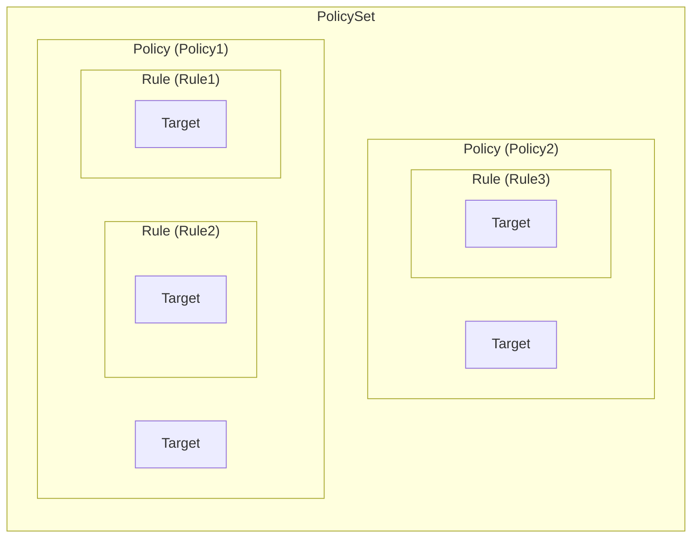
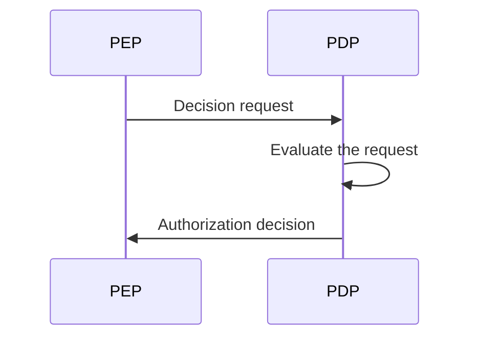
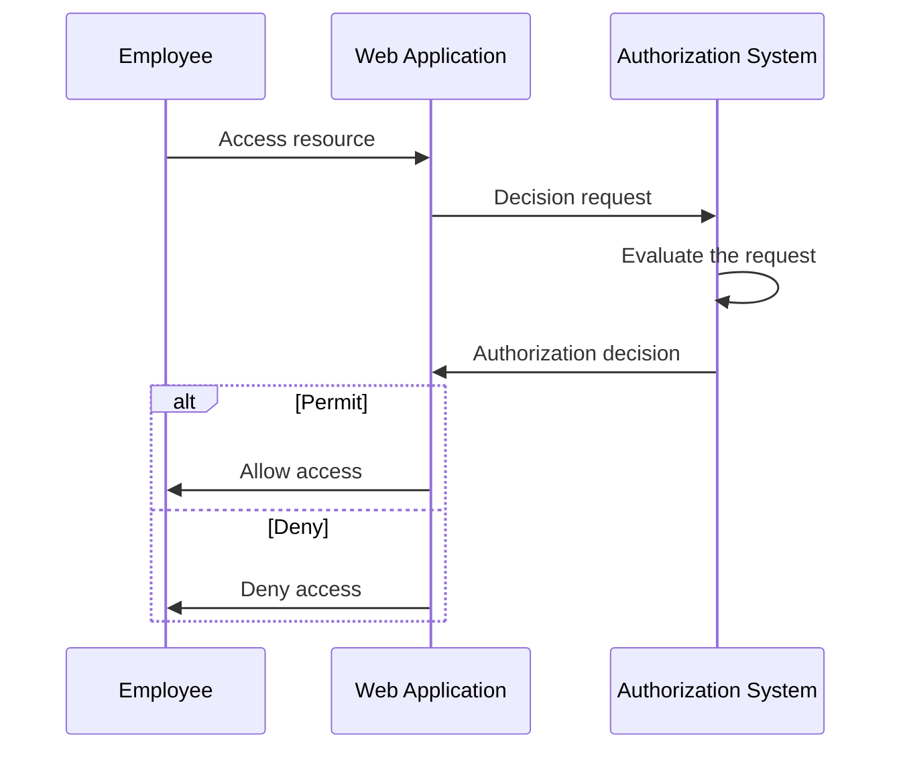
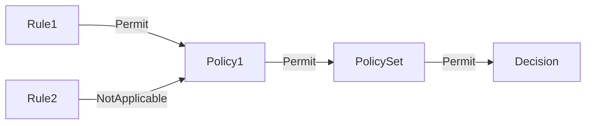
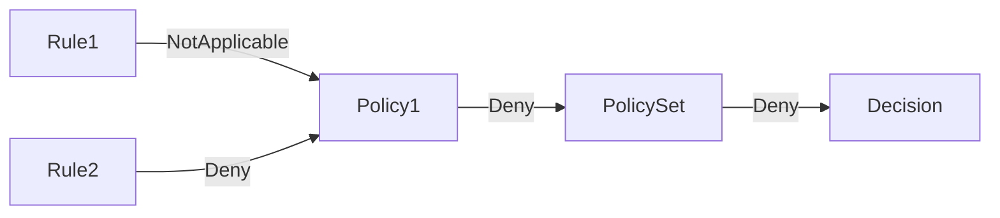

## XACMLとは？

その名が示す通り、eXtensible Access Control Markup Language (XACML) は、主にアクセス制御に使用される XML ベースの言語です。これは、Organization for the Advancement of Structured Information Standards (OASIS) によって定義された標準です。

[XACML 3.0](https://docs.oasis-open.org/xacml/3.0/xacml-3.0-core-spec-os-en.html) は、この標準の最新バージョンであり、2013年にリリースされました。特定のアクセスコントロールモデルを指定しているわけではありませんが、XACMLはしばしば<Ref slug="abac" />ポリシーの実装に利用されます。XACMLを使用して ABAC ポリシーを表現する簡単な例を見てみましょう：

```xml
<PolicySet PolicySetId="ABAC_Policies" PolicyCombiningAlgId="urn:oasis:names:tc:xacml:3.0:policy-combining-algorithm:deny-overrides">
  <Description>ABAC Policies</Description>
  <Policy PolicyId="Policy1" RuleCombiningAlgId="urn:oasis:names:tc:xacml:3.0:rule-combining-algorithm:deny-overrides">
    <Description>Employees can read data</Description>
    <Target>
      <AnyOf>
        <AllOf>
          <Match MatchId="urn:oasis:names:tc:xacml:1.0:function:string-equal">
            <AttributeValue DataType="http://www.w3.org/2001/XMLSchema#string">read</AttributeValue>
            <AttributeDesignator
              AttributeId="urn:oasis:names:tc:xacml:1.0:action:action-id"
              Category="urn:oasis:names:tc:xacml:3.0:attribute-category:action"
              DataType="http://www.w3.org/2001/XMLSchema#string"
              MustBePresent="true"
            />
          </Match>
        </AllOf>
      </AnyOf>
    </Target>
    <Rule RuleId="Rule1" Effect="Permit">
      <Target>
        <AnyOf>
          <AllOf>
            <Match MatchId="urn:oasis:names:tc:xacml:1.0:function:string-equal">
              <AttributeValue DataType="http://www.w3.org/2001/XMLSchema#string">employee</AttributeValue>
              <AttributeDesignator
                AttributeId="urn:oasis:names:tc:xacml:1.0:subject:subject-id"
                Category="urn:oasis:names:tc:xacml:1.0:subject-category:access-subject"
                DataType="http://www.w3.org/2001/XMLSchema#string"
                MustBePresent="true"
              />
            </Match>
          </AllOf>
        </AnyOf>
      </Target>
    </Rule>
    <Rule RuleId="Rule2" Effect="Deny">
      <Target>
        <AnyOf>
          <AllOf>
            <Match MatchId="urn:oasis:names:tc:xacml:1.0:function:string-equal">
              <AttributeValue DataType="http://www.w3.org/2001/XMLSchema#string">user</AttributeValue>
              <AttributeDesignator
                AttributeId="urn:oasis:names:tc:xacml:1.0:subject:subject-id"
                Category="urn:oasis:names:tc:xacml:1.0:subject-category:access-subject"
                DataType="http://www.w3.org/2001/XMLSchema#string"
                MustBePresent="true"
              />
            </Match>
          </AllOf>
        </AnyOf>
      </Target>
    </Rule>
  </Policy>
  <!-- ...other policies... -->
</PolicySet>
```

XACMLは、自己説明的な命名規則をうまく行っていると言えます。この言語は人間に読みやすく、理解しやすいように設計されています。

要するに、このポリシーは、従業員がデータを読むことが許可されており、ユーザーがデータを読むことが拒否されることを述べています。キーコンポーネントを分析することによってポリシーを分解してみましょう：

- `<PolicySet>`: ポリシーセットのルート要素。`PolicySet` は、複数の `Policy` や `PolicySet` 要素を含めることができ、ポリシーの階層を形成します。
- `<Policy>`: 1つ以上のルールを含むポリシー。各ポリシーは以下を持つことができます：
  - ポリシーが適用される条件を指定する`Target`要素。
  - アクセス制御ルールを定義する複数の`Rule`要素。
  - ルールを組み合わせて判断を下す方法を指定する `RuleCombiningAlgId` 属性。
- `<Rule>`: アクセスが許可されるまたは拒否される条件を定義するルール。各ルールは以下を持ちます：
  - ルールが適用される条件を指定する `Target` 要素。
  - ルールがアクセスを許可するか拒否するかを指定する `Effect` 属性。

> [!Note]
> XACMLの利用可能なコンポーネントと属性は、ここで述べたものに限られていません。要素と属性の完全なリストについては、[XACML 3.0 の仕様](https://docs.oasis-open.org/xacml/3.0/xacml-3.0-core-spec-os-en.html)を参照してください。

以下に、さまざまなキーコンポーネント間の関係を示す図を示します：



例における他の要素や属性の詳細な説明は、次のセクションで提供されます。

## XACMLの仕組み

簡単にするために、上記のポリシーセットで定義されているポリシーが1つだけあると仮定します。ポリシー評価プロセスをトリガーするために、**決定リクエスト**を**ポリシー適用ポイント (PEP)**から**ポリシー決定ポイント (PDP)**に送信する必要があります。PDPはリクエストをポリシーと照合して評価し、PEPに**認可決定**を返します。



- PEP: 決定リクエストを PDP に送信し、<Ref slug="access-control" />を実行して、認可決定を適用するコンポーネント。
- PDP: 決定リクエストをポリシーと照合して評価し、認可決定を返すコンポーネント。

シェイクスピア風の言葉を置き換えるために、実世界の例を使用しましょう。従業員が特定のリソースにアクセスすることを許可する Web アプリケーションがあり、そのアプリケーションが XACML ベースの認可システムと統合されていると仮定します。

従業員がリソースにアクセスしようとすると、Web アプリケーション(**PEP**)は認可システム(**PDP**)に**決定リクエスト**を送信します。認可システムが XACML ポリシーと照合してリクエストを評価した後、Web アプリケーションに**認可決定**を返します。



## 決定リクエスト

XACMLにおける決定リクエストは、次の重要なコンポーネントで構成されます：

- **Subject**: リソースへのアクセスを要求するエンティティ。ユーザー、デバイス、またはその他のエンティティである可能性があります。
- **Resource**: アクセスされるリソース。ファイル、データベース、API エンドポイント、またはその他のリソースである可能性があります。
- **Action**: リソース上で実行されるアクション。読み取り、書き込み、削除、またはその他のアクションである可能性があります。
- **Environment**: アクセスリクエストが行われるコンテキスト。時間帯、場所、またはその他のコンテキスト情報を含むことができます。

以下は、XACMLでの決定リクエストの例です：

```xml
<Request>
  <Attributes Category="urn:oasis:names:tc:xacml:3.0:attribute-category:resource">
    <Attribute AttributeId="urn:oasis:names:tc:xacml:1.0:resource:resource-id" DataType="http://www.w3.org/2001/XMLSchema#string">
      <AttributeValue>http://example.com/data</AttributeValue>
    </Attribute>
  </Attributes>
  <Attributes Category="urn:oasis:names:tc:xacml:3.0:attribute-category:action">
    <Attribute AttributeId="urn:oasis:names:tc:xacml:1.0:action:action-id" DataType="http://www.w3.org/2001/XMLSchema#string">
      <AttributeValue>read</AttributeValue>
    </Attribute>
  </Attributes>
  <Attributes Category="urn:oasis:names:tc:xacml:3.0:attribute-category:subject">
    <Attribute AttributeId="urn:oasis:names:tc:xacml:1.0:subject:subject-id" DataType="http://www.w3.org/2001/XMLSchema#string">
      <AttributeValue>employee</AttributeValue>
    </Attribute>
  </Attributes>
</Request>
```

## 評価プロセス

PDPがポリシーセットを取得すると、以下の手順で決定リクエストが評価されます：

1. **ターゲットマッチング**: 各ポリシーに対して、PDPはリクエストがポリシーのターゲットと一致するかどうかを確認します。リクエストがターゲットと一致する場合、PDPはルールを評価します。
2. **ルール評価**: PDPはポリシー内の各ルールを評価します。ルールのターゲットがリクエストと一致すると、PDPはルールの条件を評価します。条件が `true` の場合、PDPはルールの効果（許可または拒否）を返します。条件が `false` の場合、PDPは次のルールの評価を続行します。
3. **ルール組み合わせ**: PDPは、ポリシーの `RuleCombiningAlgId` 属性に基づいて、ポリシー内のすべてのルールの効果を組み合わせます。その組み合わされた効果がポリシーの決定として返されます。
4. **ポリシー組み合わせ**: ポリシーセットに複数のポリシーが含まれている場合、PDPはポリシーセットの `PolicyCombiningAlgId` 属性に基づいて、すべてのポリシーの決定を組み合わせます。その組み合わされた決定が最終的な認可決定として返されます。

### 例1

たとえば、例のポリシーセットで、決定リクエストが上記のようであると仮定します。PDPは`Policy1`ポリシーに対してリクエストを次のように評価します：

#### ターゲットマッチング

ポリシーの `Target` は、アクションIDが `read` であるすべてのサブジェクトがポリシーによって評価されるべきであると指定しています。リクエストのアクションが `read` であるため、リクエストはポリシーのターゲットと一致します。

#### ルール評価

ポリシーには2つのルールがあります：

1. `Rule1`: リクエストのサブジェクトIDが `employee` であるため、ルールの条件は `true` と評価され、ルールの効果は `Permit` です。
2. `Rule2`: リクエストのサブジェクトIDが `user` でないため、ルールの条件は `false` と評価され、ルールの効果は `NotApplicable` です。

#### ルールとポリシーの組み合わせ

- `Policy1`は`deny-overrides`ルール結合アルゴリズムを使用しているため、`Rule1`が許可するため、ポリシー決定は`Permit`です。
- ポリシーセットも`deny-overrides`ポリシー結合アルゴリズムを使用しているため、最終決定も`Permit`です。

評価プロセスの非公式の図を以下に示します：



### 例2

次に、すべての属性が同じで、サブジェクトIDが `employee` でなく `user` の場合の別の決定リクエストを検討します。

#### ターゲットマッチング

アクションは変更されていないため、リクエストはまだポリシーのターゲットと一致します。

#### ルール評価

- `Rule1`: リクエストのサブジェクトIDが `employee` でないため、ルールの条件は `false` と評価され、ルールの効果は `NotApplicable` です。
- `Rule2`: リクエストのサブジェクトIDが `user` であるため、ルールの条件は `true` と評価され、ルールの効果は `Deny` です。

#### ルールとポリシーの組み合わせ

- `Rule2`がアクセスを拒否するため、ポリシー決定は `Deny` になり、その効果は `Rule1`の `NotApplicable` 効果を上書きします。
- ポリシーセットの `deny-overrides` ポリシー結合アルゴリズムは、最も厳格な決定を返すため、最終決定は `Deny` になります。

評価プロセスの非公式の図を以下に示します：



### 例3

最後に、アクションが `read` ではなく `write` である場合の決定リクエストを考慮します。その他の属性は例1と同じです。

#### ターゲットマッチング

リクエストは、アクションが `write` であり `read` ではないため、ポリシーのターゲットと一致しません。したがって、ポリシーは評価されません。

#### ルールとポリシーの組み合わせ

ポリシーが評価されないため、最終決定は `NotApplicable` です。

評価プロセスの非公式の図を以下に示します：


## 結合アルゴリズム

XACMLは、複数のルールやポリシーの効果を組み合わせて決定を下す方法を決定するいくつかの標準的な結合アルゴリズムを定義しています。上記の例では、ルールとポリシーの両方で `deny-overrides` 結合アルゴリズムを示しました。

その名が示す通り、`deny-overrides` アルゴリズムは `Deny` の決定を `Permit` の決定よりも優先します。以下は、`deny-overrides` アルゴリズムの簡略化された説明です：

- いずれかのルールまたはポリシーがアクセスを拒否する場合、最終決定は `Deny` です。
- いずれのルールやポリシーもアクセスを拒否せず、少なくとも1つのルールやポリシーがアクセスを許可する場合、最終決定は `Permit` です。
- いずれのルールやポリシーもアクセスを拒否せず、許可もしていない場合、最終決定は `NotApplicable` です。

実際のアルゴリズムはより複雑で、`Indeterminate{D}` や `Indeterminate{P}` などの他の「未確定」の決定も考慮に入れます。

> [!Note]
> このアルゴリズムは、どのルールやポリシーもリクエストにマッチしない場合の「フォールバック」決定を提供しません。そのような場合の決定は `NotApplicable` です。

結合アルゴリズムの完全なリストとその動作については、[XACML 3.0 の仕様](https://docs.oasis-open.org/xacml/3.0/xacml-3.0-core-spec-os-en.html#_Toc325047268)を参照してください。

## 実装における考慮事項

XACMLは、属性ベースのアクセス制御ポリシーを表現するための強力な言語です。システムに XACML を導入する前に、次のことを考慮してください：

- アクセス制御設計: XACML は柔軟で表現力豊かですが、複雑なポリシーセットを含むことがあるため、慎重な設計が必要です。それにより意図しない結果を招くことがあります。
- 複雑さ: XACML ポリシーはしばしば複雑で、管理が難しい場合があります。ほとんどのアプリケーションでは、<Ref slug="rbac" />のようなよりシンプルなアクセス制御モデルが適しているでしょう。
- パフォーマンス: 大規模なポリシーセットを扱う場合、XACML ポリシーの評価は計算コストが高くなる可能性があります。システムで XACML を使用する際のパフォーマンスへの影響を考慮してください。

<SeeAlso slugs={['abac', 'rbac', 'access-control', 'authorization']} />

<Resources
  urls={[
    'https://docs.oasis-open.org/xacml/3.0/xacml-3.0-core-spec-os-en.html',
  ]}
/>