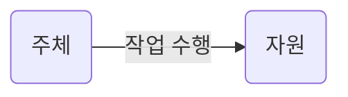
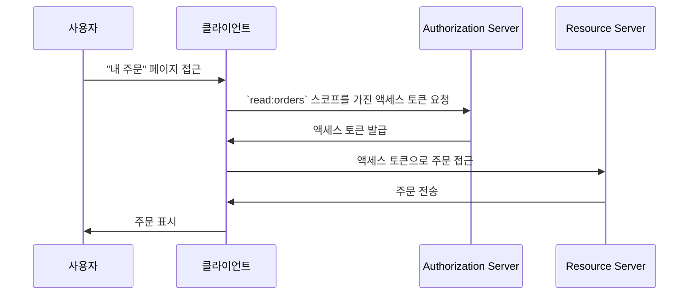

## 액세스 제어란 무엇인가?

액세스 제어는 세 가지 주요 구성 요소로 이루어집니다:

- **주체 (Subject)**: 자원에 대해 작업을 수행하는 엔터티입니다. 주체는 사용자, 서비스 또는 장치일 수 있습니다.
- **자원 (Resource)**: 액세스 제어로 보호되는 엔터티입니다. 자원은 파일, 데이터베이스, API 또는 기타 디지털 자산일 수 있습니다.
- **작업 (Action)**: 주체가 자원에 대해 수행할 수 있는 작업입니다. 작업은 읽기, 쓰기, 실행 또는 기타 작업일 수 있습니다.

> 액세스 제어는 **주체**와 **작업**을 기반으로 **자원**에 대한 선택적 접근 제한을 정의합니다.

다음은 액세스 제어의 실생활 예시입니다:

- 사용자가 (주체) 전자상거래 시스템에서 자신의 주문서 (자원)를 **읽을 수** 있습니다 (작업).
- 사용자가 (주체) 소셜 네트워크에서 다른 사용자의 프로필 (자원)을 **삭제할 수 없습니다** (작업).
- 서비스가 (주체) 마이크로서비스 아키텍처에서 데이터베이스 (자원)에 데이터를 **쓸 수** 있습니다 (작업).

때때로 기술 구현에서는 자원을 무시하고 주체가 어떤 작업을 수행할 수 있는지를 제한하는 것으로 액세스 제어를 정의하기도 합니다. 예를 들어, 기본 OAuth 2.0 프레임워크는 작업을 스코프 (권한)을 사용하여 지정할 뿐 자원을 정의하지 않습니다.

액세스 제어에 대한 지원은 <Ref slug="authorization-server" />나 <Ref slug="identity-provider" />에 따라 다를 수 있습니다. 일부 시스템은 클라이언트가 접근하려는 자원을 명시할 수 있는 OAuth 2.0 확장 기능인 [OAuth 2.0을 위한 리소스 인디케이터](https://datatracker.ietf.org/doc/html/rfc8707)을 지원할 수 있습니다.

## 액세스 제어 모델 ||access-control-models||

적은 수의 주체와 자원 간에 제한을 결정하는 것은 간단하지만, 확장성이 부족합니다. 따라서 산업계에서는 이를 효과적으로 관리하기 위해 다양한 액세스 제어 모델을 개발했습니다. <Ref slug="iam" />의 맥락에서 다음은 일반적인 액세스 제어 모델입니다:

- <Ref slug="rbac" />: 권한을 역할에 할당한 다음, 역할을 주체에 할당하는 모델입니다. 예를 들어, 관리자 역할에는 모든 자원에 접근할 수 있는 권한이 있을 수 있으며, 사용자 역할에는 제한된 자원에 접근할 수 있는 권한이 있을 수 있습니다.
- <Ref slug="abac" />: 주체, 자원, 환경의 속성(속성)을 사용하여 액세스 제어 결정을 내리는 모델입니다. 예를 들어, 속성이 "부서=엔지니어링"인 사용자는 엔지니어링 자원에 접근할 수 있습니다.

또한, [정책 기반 액세스 제어 (PBAC)](https://csrc.nist.gov/glossary/term/policy_based_access_control)와 같은 다른 액세스 제어 모델도 있습니다. 각 모델은 각자의 강점과 약점이 있으며, 모델의 선택은 사용 사례와 요구 사항에 따라 달라집니다.

## OAuth 2.0의 액세스 제어

OAuth 2.0의 맥락에서는 일반적으로 <Ref slug="scope">스코프</Ref>를 사용하여 액세스 제어가 구현됩니다. 일반적으로 스코프의 값은 자원과 작업을 결합한 문자열입니다. 예를 들어, `read:orders` 또는 `write:profile`.

> [!Note]
> 대부분의 경우 "스코프"는 "권한"과 상호 호환 가능합니다.

OAuth 2.0은 스코프의 구조와 의미를 정의하지 않음을 주목할 필요가 있습니다. 스코프의 해석은 <Ref slug="resource-server" />에 맡겨져 있으며, 스코프의 발급은 <Ref slug="authorization-server" />에 맡겨져 있습니다.

예를 들어, 사용자가 (주체) 전자상거래 시스템에서 자신의 주문 (자원)에 접근해야 할 때, OAuth 2.0을 활용하여 `read:orders`라는 스코프를 정의하고 웹 애플리케이션 (클라이언트)이 이 스코프를 authorization server에서 요청할 수 있습니다. 다음은 단순화된 흐름입니다:

이 흐름에서, 기술 아키텍처에 따라 자원 서버는 API 서비스일 수도 있고, 직접 자원(주문)에 접근할 수 있는 역량을 가진 클라이언트 (웹 애플리케이션) 자체일 수도 있습니다.

### 자원 인디케이터 매개변수

사람들은 종종 스코프를 자원과 작업으로 정의하지만 (예: `read:orders`에서는 `orders`가 자원이고 `read`가 작업임), 이 접근 방식의 확장성은 자원과 작업의 수가 증가함에 따라 제한됩니다. RFC 8707은 클라이언트가 접근하려는 자원을 명시할 수 있도록 하는 OAuth 2.0의 `resource` 매개변수 (즉, <Ref slug="resource-indicator">리소스 인디케이터</Ref>)를 소개합니다.

RFC는 `resource` 매개변수가 자원을 나타내는 URI여야 한다고 명시합니다. 예를 들어, 단순히 `orders`를 사용하는 대신 `https://api.example.com/orders`를 사용할 수 있습니다. 이 방법은 실제 자원 URL을 사용하여 이름 충돌을 방지하고 자원 매칭의 정밀성을 향상시킵니다.

### Authorization server 지원

OAuth 2.0은 authorization server가 어떻게 액세스 제어를 수행해야 하는지를 정의하지 않습니다. 구현 세부 사항은 authorization server의 재량에 맡겨져 있습니다. 따라서 authorization server의 선택은 액세스 제어 메커니즘에 큰 영향을 미칠 수 있습니다. 예를 들어, 일부 authorization server는 리소스 인디케이터를 지원할 수 있지만, 다른 서버는 지원하지 않을 수 있습니다. 비즈니스 요구 사항에 따라 어떤 액세스 제어 모델을 사용할지 결정하고, 해당 모델을 지원하는 authorization server를 선택하는 것이 중요합니다. 액세스 제어 모델에 대해 확신이 없다면, 대부분의 경우 <Ref slug="rbac" />가 충분히 좋습니다.

<SeeAlso slugs={["rbac", "abac", "resource-indicator", "authorization"]} />

<Resources
  urls={[
    "https://blog.logto.io/mastering-rbac",
    "https://blog.logto.io/rbac-and-abac",
    "https://datatracker.ietf.org/doc/html/rfc8707",
    "https://blog.logto.io/organization-and-role-based-access-control",
  ]}
/>
