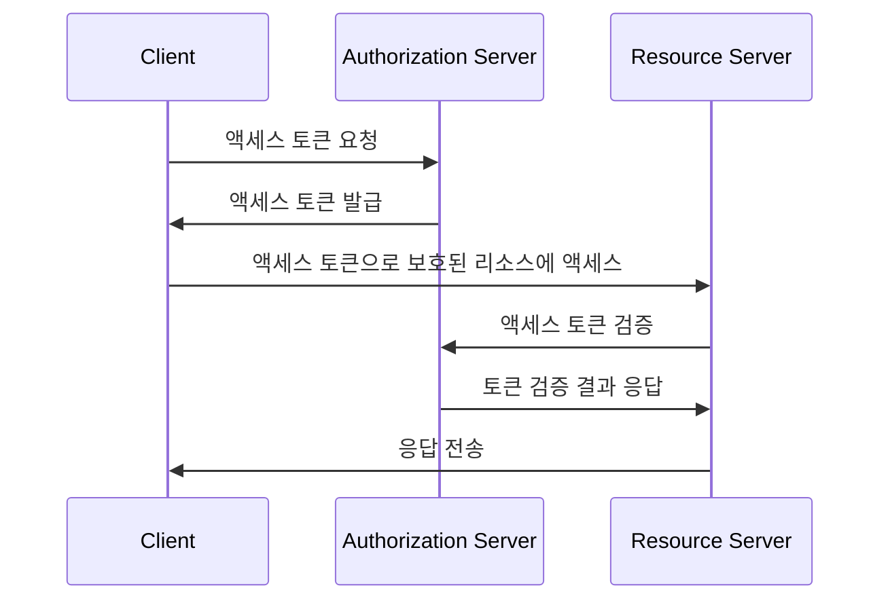
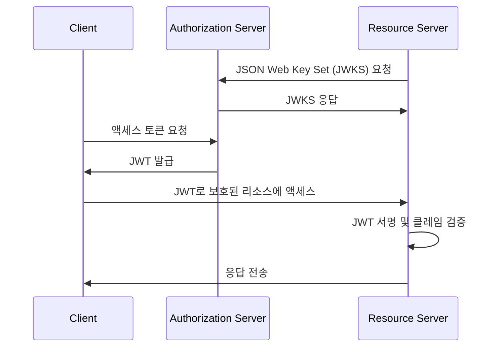
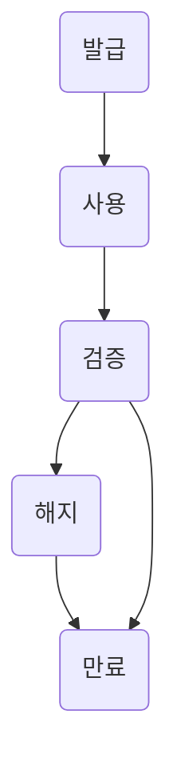

## 액세스 토큰이란 무엇인가?

액세스 토큰은 보호된 리소스에 액세스하기 위해 사용되는 자격 증명으로, 일반적으로 일련의 문자입니다. OAuth 2.0 및 OpenID Connect (OIDC) 상황에서, <Ref slug="authorization-server">authorization 서버</Ref>는 인증 및 인가가 성공적으로 이루어진 후 클라이언트 (애플리케이션)에게 액세스 토큰을 발행할 수 있습니다.

OAuth 2.0과 OIDC의 RFC에서는 액세스 토큰의 구현 세부 사항을 명시하지 않지만, 실제 사용에서는 두 가지 일반적인 유형의 액세스 토큰이 있습니다:

- <Ref slug="opaque-token" />: 클라이언트에게 의미가 없는 ("불투명한") 임의의 문자열. 클라이언트는 리소스 서버에 토큰을 제시하며, 리소스 서버는 authorization 서버와 함께 토큰을 검증합니다.
- <Ref slug="jwt" />: 디지털 서명이 된 <Ref slug="claim">클레임</Ref> (예: 사용자 ID, 만료 시간)을 포함하는 자급 토큰. 리소스 서버는 authorization 서버에 추가 요청을 하지 않고도 토큰을 검증할 수 있습니다.

## 액세스 토큰은 어떻게 작동하나요?

액세스 토큰의 유형에 따라 액세스 토큰을 사용하는 흐름은 다를 수 있습니다.

다음은 불투명한 액세스 토큰을 사용하는 간단한 예입니다:

여기은 JWT를 사용하는 간단한 예입니다:

두 종류의 액세스 토큰 차이점은 리소스 서버가 토큰을 검증하는 방법입니다:

- 리소스 서버는 불투명한 토큰을 받을 때마다 그 토큰을 검증하기 위해 추가로 authorization 서버에 요청해야 합니다.
- 리소스 서버는 JWT가 필요한 모든 정보를 포함하고 있어서 authorization 서버에 추가 요청 없이 자체적으로 토큰을 검증할 수 있습니다. 리소스 서버는 authorization 서버의 JSON Web Key Set (JWKS)에서 공개 키를 캐시할 수 있습니다.

액세스 토큰은 보통 짧은 수명을 가지고 있으며 만료 시간이 있습니다 (예: 1시간). 클라이언트는 현재 사용 중인 토큰이 만료되면 새로운 액세스 토큰을 요청해야 합니다.

## 어떤 토큰 유형을 사용해야 하나요?

불투명한 토큰과 JWT 중에서 선택하는 것은 응용 프로그램의 사용 사례와 보안 요구 사항에 따라 달라집니다. 두 토큰 유형을 비교한 표는 다음과 같습니다:

|                | 불투명한 토큰                   | JWT                                                           |
|----------------|--------------------------------|---------------------------------------------------------------|
| 형식           | 임의의 문자열                    | 자급 JSON 오브젝트                                            |
| 성능           | 추가 요청이 필요                 | 더 빠른 검증                                                   |
| 자급형         | 아니오                          | 예                                                            |
| 토큰 크기      | 더 작음                         | 더 큼                                                         |
| 해지           | 즉시                           | 토큰 만료 또는 authorization 서버와 상호작용 필요              |
| 확장성         | 제한적                          | 사용자 정의 클레임                                            |
| 무상태         | 아니오                          | 예                                                            |
| 보안           | 토큰 검증 요구                  | 서명 검증 요구                                               |
| 표준           | 아니오                          | 예 (RFC 7519)                                                 |

두 토큰 유형 간의 선택에 대한 자세한 정보는 [불투명한 토큰 vs JWT](https://blog.logto.io/opaque-token-vs-jwt)를 참조하세요.

## authorization 서버와 리소스 서버의 역할

대부분의 경우, <Ref slug="authorization-server" />는 다음과 같은 책임을 가지고 있습니다:

- 인증 및 인가가 성공적으로 완료된 후 클라이언트에게 액세스 토큰을 발행합니다. authorization 서버는 액세스 제어 정책 (예: 사용자 동의, <Ref slug="rbac" />, <Ref slug="abac" />)에 따라 토큰 요청을 축소 (스코프를 부분집합으로 줄임)하거나 거부할 수 있습니다.
- 액세스 토큰이 authorization 서버에 의해 발행되었으며 만료되거나 해지되지 않았는지 확인합니다 (<Ref slug="token-introspection" />).
- 토큰에 대한 정보 (예: 스코프, 만료 시간)를 token introspection 또는 <Ref slug="userinfo-endpoint" />를 통해 제공합니다.

authorization 서버는 액세스 토큰의 의미를 해석하지 않는다는 점을 유의해야 합니다. 예를 들어, 액세스 토큰에는 스코프 `read:orders`가 포함될 수 있지만, authorization 서버는 그 스코프가 무슨 뜻인지 알지 못합니다. 리소스 서버는 액세스 토큰을 해석하고 토큰의 스코프에 기반하여 <Ref slug="access-control" />를 시행하는 책임이 있습니다. 즉, <Ref slug="resource-server" />는 일반적으로 다음과 같은 책임을 가지고 있습니다:

- 액세스 토큰의 <Ref slug="claim">클레임</Ref>을 검증합니다 (예: 만료 시간, resource indicator, 스코프).
- 토큰의 클레임 (주로 스코프)에 기반하여 액세스 제어를 시행합니다.
- 액세스 토큰이 유효한 경우 보호된 리소스를 제공합니다.

## 액세스 토큰 수명 주기

액세스 토큰의 수명 주기는 일반적으로 다음 단계로 구성됩니다:

<SeeAlso slugs={['opaque-token', 'jwt', 'token-introspection', 'userinfo-endpoint', 'access-control']} />

<Resources
  urls={[
    "https://blog.logto.io/opaque-token-vs-jwt",
    "https://blog.logto.io/oauth2-token-introspection",
    "https://blog.logto.io/understanding-tokens-in-oidc",
    {
      url: "https://datatracker.ietf.org/doc/html/rfc6749#section-1.4",
      result: {
        ogTitle: "OAuth 2.0 Access Token",
      },
    },
    "https://datatracker.ietf.org/doc/html/rfc7662",
  ]}
/>
