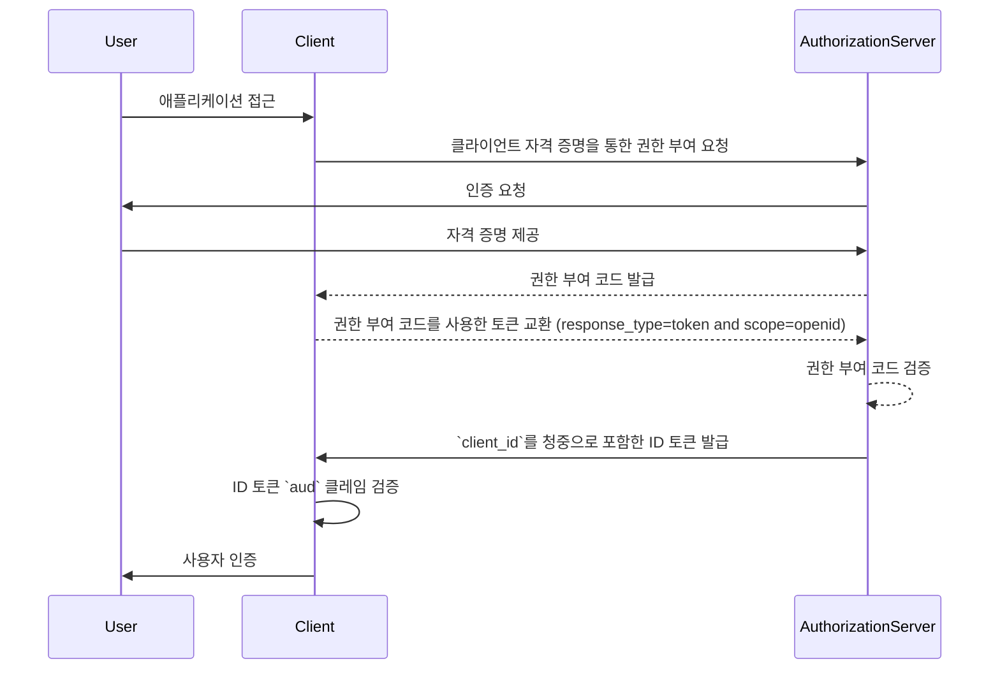
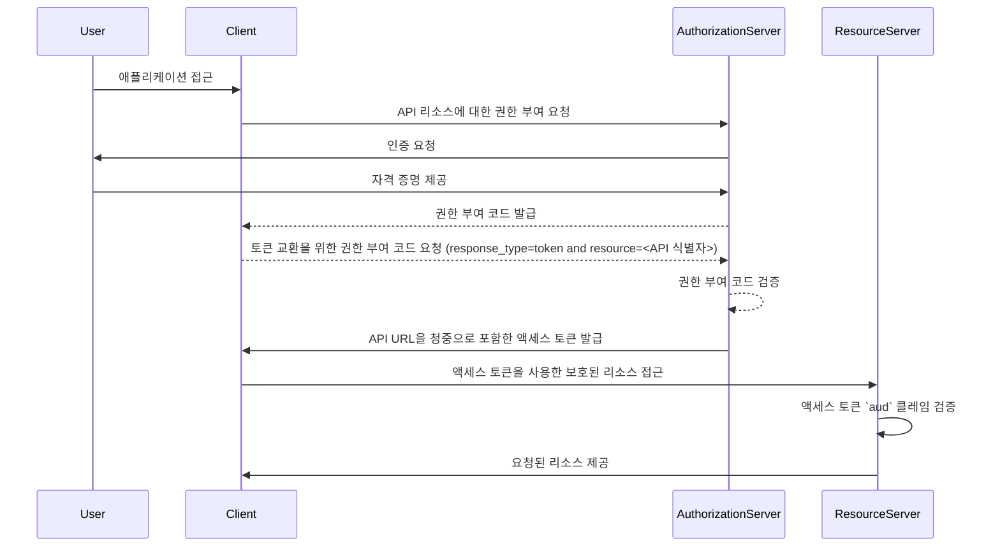

## 청중 (Audience)이란 무엇인가?

<Ref slug="authentication" /> 및 <Ref slug="authorization" />의 맥락에서 청중 (audience)은 인증 토큰의 의도된 수신자를 정의하는 핵심 구성 요소입니다. <Ref slug="jwt" />에서 [aud](https://datatracker.ietf.org/doc/html/rfc7519#section-4.1.3) 클레임으로 언급되며, 이 클레임은 지정된 서비스나 애플리케이션에서만 토큰이 수락되도록 보장합니다. 일반적으로 청중 클레임은 토큰이 의도된 애플리케이션의 client_id나 토큰이 액세스할 수 있도록 허가된 API 또는 리소스를 나타내는 URL을 포함합니다. 청중을 지정함으로써, 무단 서비스나 사용자가 남용하지 않도록 보안 제어 역할을 합니다.

## 청중 (Audience)은 어떻게 작동하는가?

클라이언트가 <Ref slug="access-token" />을 인증 서버에서 요청할 때, 청중 클레임은 토큰 응답에 포함됩니다. 이 청중 값은 리소스 서버가 토큰을 제시받을 때 검증됩니다. 리소스 서버는 토큰의 청중 클레임이 자신의 식별자나 자신이 보호하는 서비스의 식별자와 일치하는지 확인합니다. 일치하지 않을 경우 토큰이 거부되어, 특히 여러 마이크로서비스나 API가 관련된 시나리오에서 분산 시스템의 보안을 강화합니다. 청중 클레임을 제어함으로써, 개발자들은 토큰이 올바른 맥락에서 사용되도록 보장할 수 있으며, 애플리케이션의 인증 및 권한 부여 워크플로우에 추가적인 보호 계층을 더할 수 있습니다.

- **요청자**: 클라이언트 애플리케이션이 토큰을 요청할 때 청중 값을 지정합니다.
- **발급자**: 인증 서버는 토큰 응답에 청중 클레임을 포함합니다.
- **검증자**: 토큰의 수신자는 자신의 식별자와 청중 클레임을 대조합니다. 청중 클레임이 수신자의 식별자와 일치하면 토큰은 유효한 것으로 간주됩니다. 그렇지 않으면 거부됩니다.

## JWT의 청중 (Audience) 예제

### OpenID Connect (OIDC) ID 토큰의 청중 클레임

```json
{
  "header": {
    "alg": "RS256",
    "typ": "JWT",
    "kid": "abc123"
  },
  "payload": {
    "iss": "https://auth.logto.io",
    "sub": "test_user",
    "aud": "client_id_foo",
    "exp": 1516239022,
    "iat": 1516239022,
    "nonce": "n-0S6_WzA2Mj",
    "primary_email": "foo@logto.io",
    "email_verified": true,
    "username": "foo"
  },
  "signature": "..."
}
```

<Ref slug="openid-connect" />의 <Ref slug="id-token" />은 인증된 사용자에 대한 정보를 포함하는 보안 토큰으로, 성공적인 인증 후 클라이언트 애플리케이션에 전달됩니다. 리소스에 대한 액세스를 허가하는 액세스 토큰과 달리, ID 토큰은 사용자 식별 정보를 의존 당사자(클라이언트)에게 전달하기 위해 설계되었습니다. 이러한 토큰은 일반적으로 JWT로 인코딩되며 사용자 식별자(sub 클레임), 발급자(iss 클레임), 청중(aud 클레임) 등을 포함합니다.

이 경우, `aud` 클레임은 ID 토큰의 의도된 청중, 즉 클라이언트 애플리케이션을 지정합니다. `aud` 클레임의 값은 토큰을 요청한 애플리케이션의 `client_id`와 일치합니다. 클라이언트 애플리케이션이 ID 토큰을 수신하면, 청중 클레임을 검증하여 해당 토큰이 자신의 사용을 위해 발행되었음을 확인할 수 있습니다. 이러한 검증 단계는 토큰 남용 및 사용자 정보에 대한 무단 액세스를 방지하며, 인증 과정의 보안을 강화합니다.



### 액세스 토큰의 청중 클레임

```json
{
  "header": {
    "alg": "RS256",
    "typ": "JWT",
    "kid": "abc123"
  },
  "payload": {
    "iss": "https://auth.logto.io",
    "sub": "test_user",
    "aud": "https://example.logto.app/api/users",
    "exp": 1516239022,
    "iat": 1516239022,
    "scope": "read write",
    "client_id": "client_id_foo"
  },
  "signature": "..."
}
```

ID 토큰과 달리, <Ref slug="access-token" />은 API나 서비스 등 보호된 리소스에 대한 액세스를 허가하는 데 사용됩니다. 액세스 토큰의 `aud` 클레임은 일반적으로 토큰이 액세스하도록 허가된 API나 서비스를 나타내는 의도된 수신자를 지정합니다. 보통, API를 호스팅하는 리소스 서버는 토큰을 요청한 클라이언트 애플리케이션과 다른 도메인을 가지고 있습니다. 이 경우, `client_id` 대신 `aud` 클레임은 토큰이 의도된 API 엔드포인트의 URL을 포함합니다. 이 URL은 종종 리소스 지시자나 API 식별자로 불리며, 목표 리소스를 고유하게 식별합니다.

리소스 서버가 액세스 토큰을 수신하면, `aud` 클레임을 검증하여 해당 토큰이 자신의 소비를 위해 의도된 것임을 확인합니다. 청중을 확인함으로써 리소스 서버는 리소스에 대한 무단 액세스를 방지하고 토큰의 의도된 청중을 기반으로 액세스 제어 정책을 집행할 수 있습니다. 이 메커니즘은 민감한 데이터를 보호하고 액세스 토큰이 적절한 맥락에서 사용되도록 보장하여 전체 시스템의 보안을 강화합니다.



## 자주 묻는 질문

### 토큰 검증에서 청중 (Audience) 클레임이 중요한 이유는 무엇인가?

청중 클레임은 토큰이 의도된 수신자에 의해서만 수락되도록 보장하기 때문에, 토큰 검증에서 매우 중요합니다. 청중 클레임을 검증함으로써, 수신자는 토큰 남용 및 리소스에 대한 무단 액세스를 방지할 수 있습니다. 이 보안 제어는 여러 서비스가 서로 상호작용하는 분산 시스템에서 특히 중요하며, 액세스 제어 정책을 집행하고 민감한 데이터를 보호하는 데 도움이 됩니다.

### 토큰에 여러 청중이 있을 수 있는가?

보안상의 이유로, 토큰이 명확성을 보장하고 올바른 맥락에서 사용되도록 단일 청중을 가지는 것이 권장됩니다. 그러나, 토큰이 동일한 도메인 내 여러 서비스나 API를 대상으로 할 때와 같은 일부 시나리오에서는 여러 청중이 필요한 경우도 있습니다. 이러한 경우, 개발자는 다중 청중 토큰 사용의 영향을 신중히 고려하고 잠재적 위험을 완화하기 위한 적절한 보안 조치를 구현해야 합니다.

### 청중 클레임에 내 API 식별자로 무엇을 사용해야 하는가?

API나 서비스를 나타내는 액세스 토큰에서 청중 클레임을 지정할 때, 자원을 고유하게 식별하는 절대 URI를 사용하는 것이 권장됩니다. 이 URI는 API 엔드포인트의 기본 URL이거나 토큰이 액세스할 수 있도록 허가된 특정 리소스 경로일 수 있습니다. URI를 API 식별자로 사용함으로써, 청중 클레임이 명확하고 토큰의 의도된 수신자를 정확히 나타내도록 할 수 있습니다.