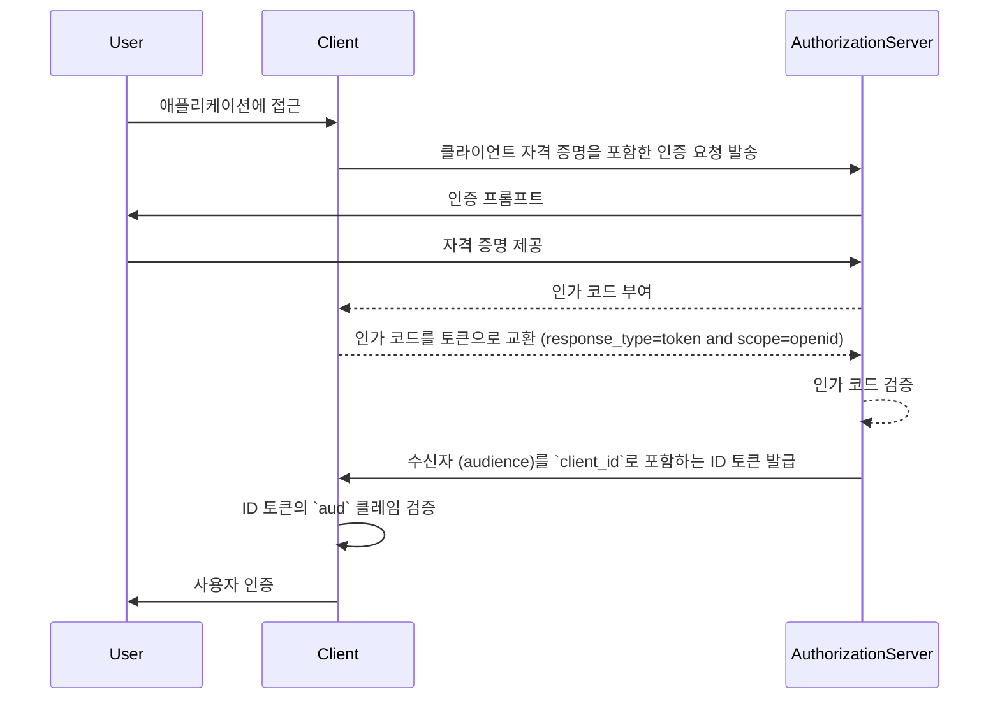
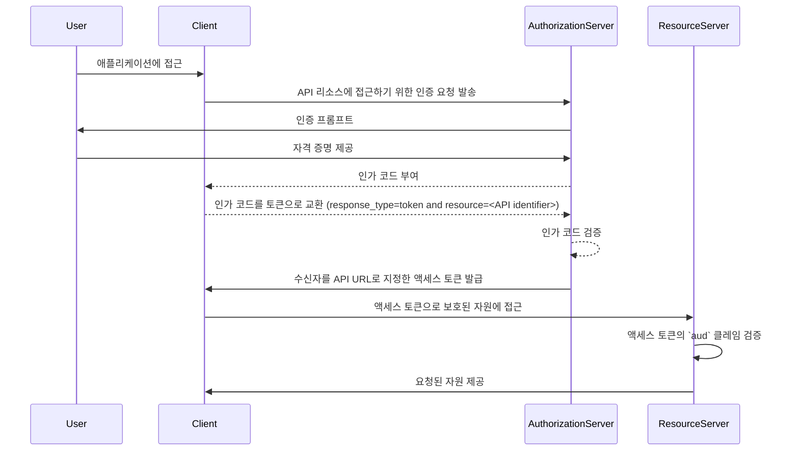

## 수신자 (Audience)란 무엇인가?

인증 (Authentication)과 인가 (Authorization)라는 맥락에서 수신자 (audience)는 인가 토큰의 대상 수신자를 정의하는 핵심 구성 요소입니다. <Ref slug="jwt" />에서 [aud](https://datatracker.ietf.org/doc/html/rfc7519#section-4.1.3) 클레임으로 언급되는 이 클레임은 토큰이 지정된 서비스 또는 애플리케이션에서만 수용되도록 보장합니다. 일반적으로 수신자 클레임에는 토큰이 의도된 애플리케이션의 client_id 또는 토큰이 접근하도록 권한이 있는 API 또는 리소스를 나타내는 URL이 포함됩니다. 이러한 수신자를 지정함으로써 비인가된 서비스 또는 사용자가 토큰을 부적절하게 사용하는 것을 방지하는 보안 제어로 작용합니다.

## 수신자 (Audience)는 어떻게 작동하나요?

클라이언트가 인가 서버로부터 액세스 토큰을 요청할 때, 수신자 (audience) 클레임이 토큰 응답에 포함됩니다. 이 수신자 값은 토큰이 제출될 때 리소스 서버에 의해 검증됩니다. 리소스 서버는 토큰의 수신자 클레임이 자신의 식별자 또는 보호하는 서비스의 식별자와 일치하는지 확인합니다. 일치하지 않으면, 토큰은 거부되어 특히 여러 마이크로서비스나 API가 포함된 시나리오에서 분산 시스템의 보안을 강화합니다. 수신자 클레임을 제어함으로써 개발자는 토큰이 올바른 컨텍스트에서 사용되도록 하여 애플리케이션의 인증 (Authentication) 및 인가 (Authorization) 워크플로우에 추가적인 보호 층을 제공할 수 있습니다.

- **요청자**: 클라이언트 애플리케이션은 토큰 요청 시 수신자 값을 지정합니다.
- **발급자 (Issuer)**: 인가 서버는 토큰 응답에 수신자 클레임을 포함합니다.
- **검증자**: 토큰 수신자는 자신의 식별자와 비교하여 수신자 클레임을 확인합니다. 수신자 클레임이 수신자의 식별자와 일치하면 토큰이 유효한 것으로 간주됩니다. 그렇지 않으면, 거부됩니다.

## JWT에서 수신자 (Audience) 예시

### OpenID Connect (OIDC) ID 토큰의 수신자 클레임

```json
{
  "header": {
    "alg": "RS256",
    "typ": "JWT",
    "kid": "abc123"
  },
  "payload": {
    "iss": "https://auth.logto.io",
    "sub": "test_user",
    "aud": "client_id_foo",
    "exp": 1516239022,
    "iat": 1516239022,
    "nonce": "n-0S6_WzA2Mj",
    "primary_email": "foo@logto.io",
    "email_verified": true,
    "username": "foo"
  },
  "signature": "..."
}
```

OpenID Connect (OIDC)에서 <Ref slug="id-token" />은 인증된 사용자에 대한 정보를 포함하는 보안 토큰이며, 성공적인 인증 후 클라이언트 애플리케이션에 전달됩니다. 자원에 대한 접근 권한을 부여하는 데 사용되는 액세스 토큰과는 달리, ID 토큰은 주로 신원 제공자 (relying party, 클라이언트)에게 사용자 신원 정보를 전달하도록 설계되었습니다. 이러한 토큰은 일반적으로 JWTs (JSON Web Tokens)로 인코딩되어 있으며, 사용자 식별자 (sub 클레임), 발급자 (iss 클레임), 수신자 (aud 클레임)와 같은 클레임을 포함합니다.

이 경우, `aud` 클레임은 ID 토큰의 의도된 수신자를 지정하며, 클라이언트 애플리케이션이 됩니다. `aud` 클레임의 값은 보통 토큰을 요청한 애플리케이션의 `client_id`와 일치합니다. 클라이언트 애플리케이션이 ID 토큰을 수신할 때, 토큰이 자신을 위해 발급되었는지 확인하기 위해 수신자 클레임을 검증할 수 있습니다. 이 검증 단계는 토큰 오용과 사용자 정보에 대한 무단 접근을 방지하여 인증 프로세스의 보안을 강화합니다.



### 액세스 토큰의 수신자 클레임

```json
{
  "header": {
    "alg": "RS256",
    "typ": "JWT",
    "kid": "abc123"
  },
  "payload": {
    "iss": "https://auth.logto.io",
    "sub": "test_user",
    "aud": "https://example.logto.app/api/users",
    "exp": 1516239022,
    "iat": 1516239022,
    "scope": "read write",
    "client_id": "client_id_foo"
  },
  "signature": "..."
}
```

ID 토큰과 달리, 액세스 토큰은 API나 서비스와 같은 보호된 자원에 대한 접근을 인가하는 데 사용됩니다. 액세스 토큰의 `aud` 클레임은 일반적으로 토큰이 접근하도록 인가된 API나 서비스의 대상 수신자를 지정합니다. 일반적으로, API를 호스팅하는 리소스 서버는 토큰을 요청한 클라이언트 애플리케이션과 다른 도메인을 가집니다. 이 경우, `client_id` 대신, `aud` 클레임에는 토큰이 의도된 API 엔드포인트의 URL이 포함됩니다. 이 URL은 종종 대상 리소스를 고유하게 식별하는 리소스 지시자 또는 API 식별자로 알려져 있습니다.

리소스 서버가 액세스 토큰을 수신하면, 토큰이 자신을 위해 의도된 것인지 확인하기 위해 `aud` 클레임을 검증합니다. 수신자를 확인함으로써 리소스 서버는 자원에 대한 무단 접근을 방지하고, 토큰의 의도된 수신자에 기반하여 접근 제어 정책을 시행할 수 있습니다. 이 메커니즘은 민감한 데이터를 보호하고 액세스 토큰이 적절한 컨텍스트에서 사용되도록 하여 전체 시스템의 보안을 강화합니다.



## 자주 묻는 질문

### 왜 수신자 (audience) 클레임은 토큰 검증에서 중요한가요?

수신자 (audience) 클레임은 토큰이 의도된 수신자에게만 수용되도록 보장하므로 토큰 검증에서 중요합니다. 수신자 클레임을 검증함으로써, 수신자는 토큰 오용과 자원에 대한 무단 접근을 방지할 수 있습니다. 이 보안 제어는 여러 서비스가 상호작용하는 분산 시스템에서 특히 중요하며, 접근 제어 정책을 시행하고 민감한 데이터를 보호하는 데 도움을 줍니다.

### 토큰이 여러 수신자를 가질 수 있나요?

보안상의 이유로 토큰은 단일 수신자를 가질 것을 권장하여 모호성을 방지하고 토큰이 올바른 컨텍스트에서 사용되도록 보장합니다. 그러나 동일한 도메인 내의 여러 서비스나 API에 토큰이 필요할 경우처럼, 여러 수신자를 가진 토큰이 필요한 시나리오가 있을 수 있습니다. 이러한 경우, 개발자는 다중 수신자 토큰을 사용할 때의 영향을 신중히 고려하고 잠재적 위험을 완화하기 위한 적절한 보안 조치를 구현해야 합니다.

### 수신자 (audience) 클레임에 API 식별자로 무엇을 사용해야 하나요?

API나 서비스를 나타내는 액세스 토큰 내의 수신자 클레임을 지정할 때, 절대 URI를 사용하여 리소스를 고유하게 식별하는 것이 권장됩니다. 이 URI는 API 엔드포인트의 기본 URL이나 토큰이 접근하도록 인가된 특정 리소스 경로일 수 있습니다. API 식별자로 URI를 사용하여 수신자 클레임이 모호하지 않으며 토큰의 의도된 수신자를 정확히 나타낼 수 있습니다.