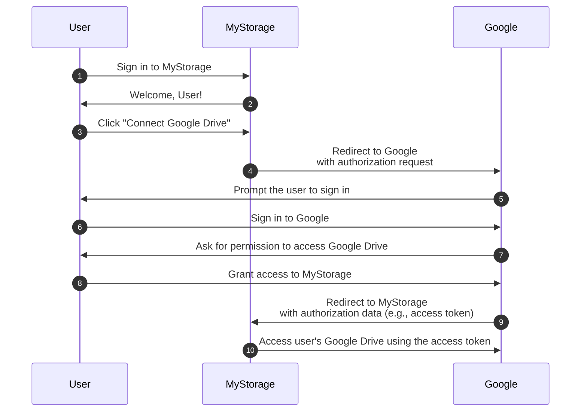

## 인증 (Auth)

이 페이지는 "auth"라는 용어에 대한 명확한 설명을 제공합니다. 이는 종종 다음의 약어로 사용됩니다:

- <Ref slug="authentication" />: 신원 소유권(예: 사용자 또는 서비스)을 확인하는 과정입니다. "어떤 신원을 소유하고 있습니까?"라는 질문에 답합니다.
- <Ref slug="authorization" />: 신원이 자원에 대해 수행할 수 있는 작업을 결정하는 과정입니다. "무엇을 할 수 있습니까?"라는 질문에 답합니다.

> [!Note]
> 때때로 인증 (authentication)과 인가 (authorization)는 각각 "AuthN"과 "AuthZ"로 불립니다.

이 두 개념은 <Ref slug="iam" /> 영역에서 모두 중요하지만 근본적으로 다릅니다. 예를 들어 보겠습니다: 웹 애플리케이션 MyStorage는 파일을 업로드하고 Google Drive에 연결할 수 있습니다. 일반적인 사용자 흐름은 다음과 같습니다:

이 흐름에서 사용자는 두 번의 인증 (auth) 단계를 수행합니다: 하나는 MyStorage와 함께(1단계) 그리고 다른 하나는 Google과 함께(6단계)이며; 하나의 인가 (authorization) 단계: Google Drive에 대한 접근 권한을 부여합니다(8단계).

## 어떤 뜻인가요?

"auth"라는 용어를 볼 때, 그것이 인증 (authentication)을 의미하는지 인가 (authorization)를 의미하는지 명확히 하는 것이 중요합니다. 그렇지 않으면 두 프로세스 모두를 포함한다고 예상할 수 있습니다 (이 웹사이트가 하는 것처럼).

<SeeAlso slugs={["authentication", "authorization", "iam", "oauth-2.0", "openid-connect"]} />
