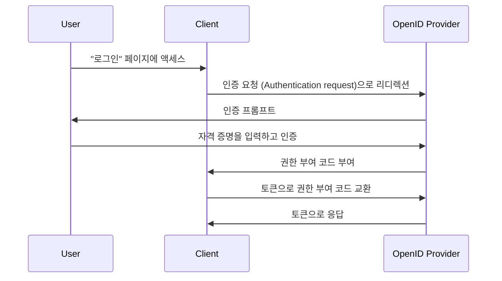

## 인증 요청 (Authentication request)이란 무엇인가?

인증 요청 (Authentication request)의 의미는 문맥에 따라 달라질 수 있지만, 여기서는 OpenID Connect (OIDC) 명세의 정의에 초점을 맞추겠습니다. OIDC에서 인증 요청 (Authentication request)은 사용자를 인증하기 위한 <Ref slug="authorization-request" />로 권한 부여 서버 (authorization server)에 보내집니다.

표준 정의는 "authorization request"와 같은 유사한 용어가 사용되기 때문에 매우 혼란스러울 수 있습니다. 이는 OIDC가 주로 권한 부여를 위해 설계된 OAuth 2.0 위에 구축되었기 때문에, OIDC가 OAuth 2.0 용어를 상속받아 이를 확장하여 인증을 지원하기 때문입니다.

정확히 하기 위해 정의에 약간의 문맥을 추가해 보겠습니다:

> (OpenID Connect) 인증 요청 (Authentication request)은 사용자를 인증하기 위한 (OAuth 2.0 authorization) 요청을 (OpenID Connect authorization) 서버에 보내는 것입니다.

조금 더 길어졌습니다! 이제 모든 괄호를 제거해 보겠습니다:

> 인증 요청 (Authentication request)은 사용자를 인증하기 위해 서버에 보내는 요청입니다.

모든 속성을 제거하고 나면 정의가 간단해집니다. 용어의 분석은 다음과 같습니다:

- **인증 요청 (Authentication request)**: OIDC 명세에서의 용어.
- <Ref slug="authorization-request" />: OAuth 2.0 명세에서의 용어. OIDC는 이 명세를 재사용하고 확장합니다.
- <Ref slug="authorization-server" />: OAuth 2.0 명세에서의 용어. OIDC는 또한 사용자 인증을 수행할 수 있는 동일한 엔티티를 지칭하는 용어로 <Ref slug="openid-connect" headingId="openid-provider-op" />를 사용합니다.

다음 섹션에서는 OIDC를 지원하는 권한 부여 서버를 지칭하기 위해 "OpenID 공급자 (OP)"라는 용어를 사용하겠습니다.

## 인증 요청 (Authentication request)은 어떻게 작동하나요?

클라이언트 애플리케이션이 사용자를 인증하고자 할 때, OpenID 공급자 (OP)에 인증 요청 (Authentication request)을 시작합니다. 앞서 언급한 대로, 인증 요청 (Authentication request)은 OAuth 2.0의 권한 부여 요청 (authorization request)이기도 하므로, 특정 OAuth 2.0 grant types (flows)을 사용하여 인증 프로세스를 완료할 수 있습니다.

OIDC는 인증을 지원하기 위해 세 가지 grant types (flows)을 정의합니다:

1. <Ref slug="authorization-code-flow" />: 가장 권장되는 인증 플로우입니다. 더 나은 보안을 위해 <Ref slug="pkce" />와 함께 사용하는 것이 일반적이며 대부분의 애플리케이션에 적합합니다.
2. <Ref slug="implicit-flow" />: 간소화된 플로우로, 보안 문제로 인해 <Ref slug="oauth-2.1" />에서 더 이상 사용되지 않습니다.
3. <Ref slug="hybrid-flow" />: 권한 부여 코드 플로우와 암시적 플로우를 결합한 것입니다.

인증 요청 (Authentication request)은 OIDC 인증 플로우의 첫 번째 단계입니다. 포함할 실제 매개변수와 수행할 단계는 선택한 플로우에 따라 다릅니다. 위의 플로우 이름을 클릭하여 각 플로우에 대해 자세히 알아보세요.

다음은 권한 부여 코드 플로우를 사용한 인증 요청 (Authentication request)의 단순한 예입니다:

클라이언트가 토큰을 수신하면, 사용자를 대신하여 보호된 리소스(예: API)에 액세스하기 위해 토큰(예: <Ref slug="access-token" />)을 사용할 수 있습니다.

### 인증 요청 (Authentication request)의 주요 매개변수

다음은 인증 요청 (Authentication request)의 몇 가지 주요 매개변수입니다:

- **`response_type`**: 클라이언트가 권한 부여 서버로부터 기대하는 응답 유형입니다. 권한 부여 코드 플로우의 경우 `code`, 암시적 플로우의 경우 `id_token`, 하이브리드 플로우의 경우 `code id_token`일 수 있습니다.
- **`client_id`**: OpenID 공급자 (OP)가 발행한 클라이언트 식별자입니다.
- **`redirect_uri`**: 인증 요청이 완료된 후 권한 부여 서버가 사용자 에이전트를 리디렉션할 URI입니다.
- **`scope`**: 요청된 <Ref slug="scope">스코프</Ref> (권한)입니다. <Ref slug="id-token" /> 및 <Ref slug="access-token" />에 적용됩니다.
- **`resource`**: 요청된 리소스를 위한 <Ref slug="resource-indicator" />를 지정하는 선택적 매개변수입니다. 이 매개변수를 사용하려면 권한 부여 서버가 [RFC 8707](https://datatracker.ietf.org/doc/html/rfc8707)을 지원해야 합니다.

위에서 언급한 매개변수는 포괄적이지 않으므로 인증 요청을 시작하기 전에 사용 중인 특정 플로우에 대한 매개변수 목록을 참조해야 합니다.

<SeeAlso slugs={["openid-connect", "oauth-2.0", "authorization-code-flow", "implicit-flow", "hybrid-flow"]} />

<Resources
  urls={[
    "https://openid.net/specs/openid-connect-core-1_0.html",
  ]}
/>
