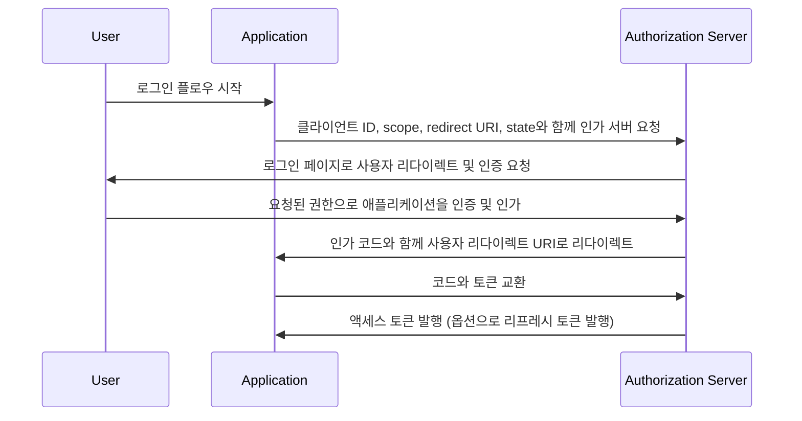

## 인가 코드 플로우 (Authorization code flow)란?

인가 코드 플로우 (Authorization code flow, a.k.a authorization code grant)는 [OAuth 2.0 RFC 6749, section 4.1](https://datatracker.ietf.org/doc/html/rfc6749#section-4.1)에 정의된 널리 사용되는 OAuth 2.0 인가 메커니즘으로, 사용자 대신 애플리케이션이 액세스 토큰을 획득할 수 있게 합니다. 이 플로우는 클라이언트 시크릿을 안전하게 저장할 수 있는 기밀 애플리케이션(예: 전통적인 서버측에서 실행되는 웹 애플리케이션)에 특히 적합합니다.

인가 코드 플로우는 OAuth 2.0에서 액세스 토큰을 얻는 견고하고 안전한 방법으로, 많은 웹 애플리케이션에서 선호되는 선택입니다. 이 플로우를 이해하는 것은 OAuth 2.0 및 API 통합 작업을 하는 개발자에게 필수적입니다.

## 인가 코드 플로우는 어떻게 작동하나요?

인가 코드 플로우는 다음 단계를 포함합니다:

1. **플로우 시작**: 사용자는 일반적으로 애플리케이션에서 로그인 링크나 버튼을 클릭하여 플로우를 시작합니다. 애플리케이션은 클라이언트 ID, 요청된 scope, redirect URI, 상태(state) 매개 변수를 전달하며 사용자를 인가 서버의 인가 엔드포인트로 리다이렉트합니다. 인가 서버는 매개 변수를 검증하고 인가 서버의 로그인 페이지에서 사용자가 인증하도록 요청합니다.
2. **사용자 인증 (Authentication) 및 인가**: 사용자는 인가 서버에서 인증을 받고 애플리케이션이 요청한 리소스에 대한 접근 권한을 부여합니다.
3. **코드 생성 및 리다이렉션**: 인가 서버는 인가 코드를 생성하고 사용자를 이전에 제공된 redirect URI로 다시 애플리케이션에 리다이렉트합니다. 인가 코드는 redirect URI의 쿼리 문자열에 포함됩니다.
4. **코드 교환**: 애플리케이션은 쿼리 문자열에서 인가 코드를 추출하고 인가 서버의 토큰 엔드포인트로 POST 요청을 하여 인가 코드를 액세스 토큰과 교환합니다. 요청에는 클라이언트 ID, 클라이언트 시크릿, redirect URI, 인가 코드도 포함되어야 합니다.
5. **액세스 토큰 획득**: 인가 서버는 인가 코드를 검증하고 성공적으로 검증되면 애플리케이션에 액세스 토큰 (옵션으로 리프레시 토큰)을 발행합니다. 애플리케이션은 이제 사용자 대신 권한 있는 API 요청을 수행하기 위해 액세스 토큰을 사용할 수 있습니다.

이 단계를 다음의 시퀀스 다이어그램으로 설명할 수 있습니다:



## 인증 요청 (Authentication request)

요청 매개 변수는 다음과 같습니다:

- **client_id**: 필수. 유효한 OAuth 2.0 클라이언트 식별자.
- **scope**: 필수. 사용자가 인가 서버에서 요청하는 리소스를 지정합니다. 예: `openid profile email`.
- **response_type**: 필수. 애플리케이션이 인가 코드를 기대한다는 것을 나타내기 위해 값은 `code` 여야 합니다.
- **redirect_uri**: 필수. 인증 응답이 전송될 URI이며, 인가 서버에 클라이언트가 사전 등록한 redirect URI와 정확히 일치해야 합니다.
- **state**: 권장. 요청과 콜백 간 상태를 유지하는 데 사용되는 불투명한 값입니다. <Ref slug="csrf" /> 공격을 방지하는 데도 사용됩니다.
- **nonce**: 선택적. ID 토큰과 클라이언트 세션을 연결하고 재생 공격을 완화하기 위해 사용되는 임의의 문자열.
- **prompt**: 선택적. 인가 서버가 최종 사용자에게 재인증 및 동의를 요청할지 여부를 지정하는 문자열 값들의 공백 구분 및 대소문자 구분 목록. 정의된 값은:
  - **none**: 인가 서버는 인증 또는 동의 사용자 인터페이스 페이지를 표시해서는 안 됩니다. 최종 사용자가 이미 인증되지 않았거나 클라이언트가 요청된 Claims에 대한 사전 구성된 동의를 갖고 있지 않거나 요청을 처리할 다른 조건을 충족하지 못하는 경우 오류가 반환됩니다. 오류 코드는 일반적으로 `login_required`, `interaction_required`입니다. 이는 기존 인증 및/또는 동의를 확인하는 방법으로 사용할 수 있습니다.
  - **login**: 인가 서버는 최종 사용자에게 재인증을 요청해야 합니다. 최종 사용자를 재인증할 수 없는 경우 오류를 반환해야 하며, 일반적으로 `login_required`입니다.
  - **consent**: 인가 서버는 정보를 클라이언트에 반환하기 전에 최종 사용자에게 동의를 요청해야 합니다. 동의를 얻을 수 없는 경우 오류를 반환해야 하며, 일반적으로 `consent_required`입니다.
  - **select_account**: 인가 서버는 최종 사용자에게 사용자 계정을 선택하라고 요청해야 합니다. 이는 인가 서버에 여러 계정을 가진 최종 사용자가 현재 세션인 여러 계정을 선택할 수 있게 합니다. 최종 사용자가 선택한 계정 선택 옵션을 얻을 수 없는 경우 일반적으로 `account_selection_required` 오류를 반환해야 합니다.

[전체 요청 매개 변수 정의](https://openid.net/specs/openid-connect-core-1_0.html#AuthRequest)

### 인증 요청 (Authentication request) 예시

```bash
curl -X GET "https://authorization-server.com/auth" \
  -d "response_type=code" \
  -d "client_id=YOUR_APPLICATION_ID" \
  -d "redirect_uri=https://yourapp.com/callback" \
  -d "scope=openid profile email" \
  -d "state=RANDOM_STRING_FOR_STATE"
```

일반적인 성공적인 응답:

```http
HTTP/1.1 302 Found
Location: https://yourapp.com/callback?
  code=YOUR_AUTHORIZATION_CODE
  &state=RANDOM_STRING_FOR_STATE
```

## 토큰 교환 요청

위의 인증 요청이 성공적으로 응답되면, 클라이언트는 URI 매개 변수로 코드와 함께 자동으로 callback URI `https://yourapp.com/callback`로 리다이렉트됩니다.

클라이언트는 액세스 토큰을 교환하기 위해 후속 토큰 교환 요청을 통해 `code`를 획득하고 처리해야 합니다.

### 토큰 교환 요청 예시

```bash
curl -X POST "https://authorization-server.com/token" \
  -H "Content-Type: application/x-www-form-urlencoded" \
  -d "client_id=YOUR_CLIENT_ID" \
  -d "code=YOUR_AUTHORIZATION_CODE" \
  -d "redirect_uri=https://yourapp.com/callback" \
  -d "grant_type=authorization_code" \
```

## 이점

- **강화된 보안**: 클라이언트 시크릿이 사용자의 브라우저에 노출되지 않아 클라이언트 위장 위험이 줄어듭니다.
- **일회성 인가 코드**: 인가 코드는 짧은 수명(일반적으로 1시간)과 단 한 번만 사용할 수 있어 가로채기 및 재생 공격 위험이 줄어듭니다.
- **단명 토큰**: 이 플로우에서 발행된 액세스 토큰은 수명이 짧아 토큰이 유출되는 경우의 무단 액세스 위험이 줄어듭니다.
- **리프레시 토큰**: 인가 서버는 리프레시 토큰을 옵션으로 발행할 수 있어, 애플리케이션이 사용자 상호 작용 없이 새 액세스 토큰을 얻을 수 있습니다.

## 인가 코드 플로우와 암시적 플로우의 차이점은 무엇인가요?

인가 코드 플로우와 암시적 플로우의 주요 차이점은 액세스 토큰을 획득하는 방법입니다:

- **인가 코드 플로우**: 클라이언트 애플리케이션은 먼저 인가 엔드포인트로부터 인가 코드를 받은 후, 후속 POST 요청을 통해 토큰 엔드포인트에 액세스 토큰을 교환합니다.
- **암시적 플로우**: 클라이언트 애플리케이션은 인가 엔드포인트로부터 직접 액세스 토큰을 받습니다.

## 인가 코드 플로우와 클라이언트 크리덴셜 플로우의 차이점은 무엇인가요?

인가 코드 플로우와 클라이언트 크리덴셜 플로우의 주요 차이점은 플로우가 사용되는 맥락입니다:

- **인가 코드 플로우**: 클라이언트 애플리케이션이 사용자 대신 리소스에 액세스할 필요가 있을 때 사용되며, 사용자 인증 (Authentication) 및 인가가 포함됩니다.
- **클라이언트 크리덴셜 플로우**: 클라이언트 애플리케이션이 자체적으로 리소스에 액세스할 필요가 있을 때 사용되며, 클라이언트 인증만 포함되고 사용자 인증은 포함되지 않습니다. 기계 대 기계 (Machine to Machine) 통신에 적합합니다.

## 인가 코드 플로우의 일반적인 사용 사례는 무엇인가요?

- 사용자 인증 (Authentication) 및 API 액세스를 요구하는 전통적 웹 애플리케이션.
- 제3자 서비스로부터 사용자 데이터를 안전하게 액세스해야 하는 애플리케이션.

<SeeAlso slugs={['device-flow', 'implicit-flow', 'client-credentials-flow']} />

<Resources urls={['https://datatracker.ietf.org/doc/html/rfc6749']} />