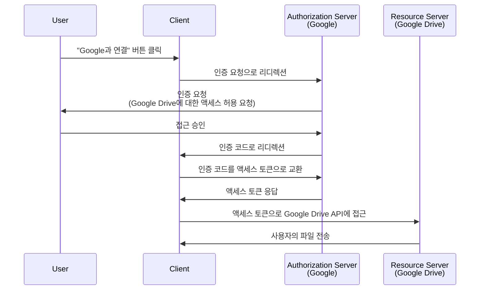

## 인증 요청 (Authorization request)이란 무엇인가?

문맥에 따라 "인증 요청 (Authorization request)"이라는 용어는 서로 다른 의미를 가질 수 있습니다. 이 글에서는 <Ref slug="oauth-2.0" /> 명세서에 정의된 내용을 중점적으로 다룰 것입니다.

OAuth 2.0에서는 <Ref slug="client" />가 사용자의 보호된 리소스에 액세스할 권한을 얻는 방법을 정의하는 몇 가지 인증 유형(흐름)이 있습니다.

> ![참고]
> "인증 요청 (Authorization requests)"은 <Ref slug="openid-connect" /> 문맥에서 "인증 요청 (Authentication requests)"과 혼동되는 경우가 많습니다. OIDC에 대한 구체적인 내용은 <Ref slug="authentication-request" />를 참조하세요.

## 인증 요청 (Authorization request)은 어떻게 작동하나요?

클라이언트(애플리케이션)가 사용자 대신 보호된 리소스에 액세스하려고 할 때, <Ref slug="authorization-server" />에 인증 요청을 시작합니다. 클라이언트는 필요한 매개변수와 함께 요청된 인증 유형을 명시해야 합니다.

OAuth 2.0에서 최종 사용자 인증을 위한 일반적인 인증 유형(흐름)은 다음과 같습니다:

- <Ref slug="authorization-code-flow" />: 최종 사용자 인증을 위한 가장 추천되는 흐름입니다. 보안을 강화하기 위해 일반적으로 <Ref slug="pkce" />와 함께 사용되며 대부분의 애플리케이션에 적합합니다.
- <Ref slug="implicit-flow" />: 보안 문제로 인해 <Ref slug="oauth-2.1" />에서 사용 중단된 간소화된 흐름입니다.
- [리소스 소유자 비밀번호 자격증명 (ROPC) 인증](https://datatracker.ietf.org/doc/html/rfc6749#section-4.3): 사용자의 자격 증명을 직접 액세스 토큰으로 교환하는 흐름입니다. 보안 위험으로 인해 권장되지 않습니다.

제한된 입력 기능을 가진 장치를 위한 <Ref slug="device-flow" /> 같은 다른 확장 기능도 있습니다. 각 흐름은 고유한 특성과 용도가 있습니다. 대부분의 웹 애플리케이션에서는 인증 코드 플로우가 권장됩니다.

> <Ref slug="machine-to-machine" /> 인증은 일반적으로 사용자 상호작용을 포함하지 않는 <Ref slug="client-credentials-flow" />로 수행됩니다.

예를 들어, 클라이언트(애플리케이션)는 사용자의 Google Drive 파일에 액세스하기 위한 인증을 요청할 수 있습니다. 아래는 인증 코드 흐름의 간단한 순서도입니다:

<Ref slug="access-token" /> 획득 후, 클라이언트는 사용자 대신 Google Drive 파일에 접근할 수 있습니다.

### 인증 요청 (Authorization request)의 주요 매개변수

OAuth 2.0 인증 요청은 일반적으로 다음 매개변수를 포함합니다:

- **`response_type`**: 클라이언트가 기대하는 응답 유형입니다. 일반적인 값은 authorization code flow를 위한 `code`와 implicit flow를 위한 `token`입니다.
- **`client_id`**: 인증 서버에서 발급한 클라이언트 식별자입니다.
- **`redirect_uri`**: 인증 과정이 끝난 후 사용자를 보내는 URI입니다.
- **`scope`**: 액세스 토큰에 대한 요청된 <Ref slug="scope">스코프(권한)</Ref>입니다.
- **`resource`**: 요청된 리소스에 대한 <Ref slug="resource-indicator" />를 지정하는 선택적 매개변수입니다. 이 매개변수를 사용하려면 인증 서버가 [RFC 8707](https://datatracker.ietf.org/doc/html/rfc8707)을 지원해야 합니다.

위의 매개변수는 포괄적이지 않습니다. 실제 매개변수와 그 값은 인증 유형과 애플리케이션의 구체적인 요구 사항에 따라 달라집니다.

<SeeAlso slugs={["oauth-2.0", "authentication-request", "authorization-code-flow", "implicit-flow", "device-flow"]} />

<Resources
  urls={[
    { url: "https://datatracker.ietf.org/doc/html/rfc6749#section-4", result: {
      ogTitle: "OAuth 2.0에서 허가 얻기",
      ogDescription: "액세스 토큰을 요청하기 위해, 클라이언트는 리소스 소유자에게서 허가를 얻습니다."
    } }
  ]}
/>