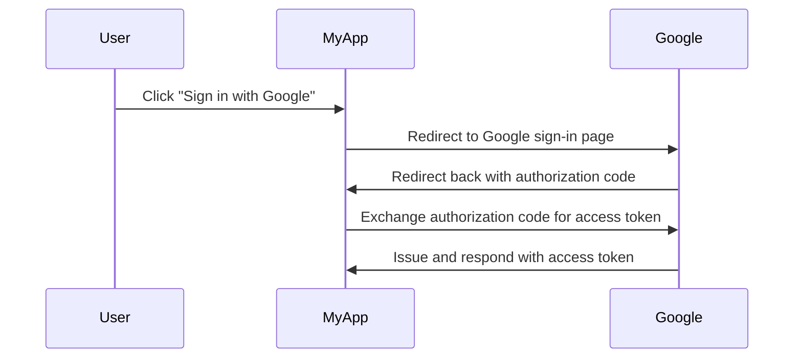

## 인증 서버 (Authorization server)란 무엇인가?

"인증 서버 (Authorization server)"라는 용어는 인증을 수행하는 모든 서버를 지칭하는 일반적인 용어일 수 있습니다. 여기서는 <Ref slug="oauth-2.0" /> 및 <Ref slug="openid-connect" /> 프레임워크에서의 정의에 초점을 맞춥니다.

OAuth 2.0에서는 인증 서버가 인증 및 인가에 성공한 후 <Ref slug="access-token">access token</Ref>을 <Ref slug="client">클라이언트</Ref>에게 발급하는 구성 요소입니다. 클라이언트는 사용자를 대신하여 보호된 리소스에 접근하기 위해 access token을 사용합니다.

용어가 너무 많나요? 실제 예를 살펴보겠습니다: 사용자가 "MyApp"이라는 애플리케이션에서 "Sign in with Google"을 클릭합니다. 이 애플리케이션은 구글 로그인에 <Ref slug="authorization-code-flow" />를 사용합니다.

이 예에서 구글은 사용자가 성공적으로 로그인한 후 **access token**을 **클라이언트**(MyApp)에게 발급하는 **인증 서버 (Authorization server)**로 작동합니다. 클라이언트는 이후 Google에서 사용자의 프로필(보호된 리소스)을 가져오기 위해 **access token**을 사용할 수 있습니다.

### OpenID Connect (OIDC)에서의 인증 서버 (Authorization server)

OpenID Connect는 OAuth 2.0을 기반으로 구축되었기 때문에 OAuth 2.0의 용어와 개념 일부를 재사용합니다. OIDC는 OAuth 2.0 인증 서버에 인증 기능을 추가하여 인증 서버가 <Ref slug="openid-connect" headingId="openid-provider-op" /> 역할도 하게 합니다. 혼동을 피하기 위해 OIDC에서 인증 서버를 언급할 때는 항상 "OpenID 제공자"라는 용어를 사용할 것을 권장합니다.

OIDC의 OpenID 제공자(인증 서버)는 access token 발급과 더불어 <Ref slug="id-token">ID token</Ref>도 클라이언트에게 발급합니다. ID token은 사용자 정보를 포함하며 사용자를 인증하는 데 사용됩니다.

## 인증 서버 (Authorization server)는 어떻게 작동하나요?

인증 서버는 클라이언트에게 access token을 발급하기 위해 <Ref slug="oauth-2.0-grant">OAuth 2.0 grant (flow)</Ref>를 지원해야 합니다. grant 유형은 일반적으로 클라이언트와 인증 서버가 access token을 얻기 위해 따라야 하는 일련의 단계로 구성됩니다.

- 사용자 인가의 경우, 대부분의 grant 유형에서는 클라이언트가 인증 서버에 <Ref slug="authorization-request" />를 시작해야 합니다. 위의 구글 로그인 예에서, "Google 로그인 페이지로 리디렉션" 단계는 클라이언트가 시작한 인증 요청입니다.
- <Ref slug="machine-to-machine" /> 인가의 경우, 클라이언트는 <Ref slug="client-credentials-flow" />를 사용하여 인증 서버에 직접 <Ref slug="token-request" />를 보낼 수 있습니다.

인증 서버는 클라이언트 요청을 검증하고, 클라이언트를 인증하며, 사용자의 신원을 확인해야 access token을 발급할 수 있습니다. 또한 <Ref slug="authorization-code-flow" />에 대한 <Ref slug="pkce" />와 같은 추가적인 보안 조치를 실행할 수 있습니다.

## 인증 서버 (Authorization server) 사용 사례

이름이 시사하듯이, 인증 서버는 <Ref slug="authorization" />을 처리하는 데 사용됩니다. 인증 서버는 다음과 같은 1차 및 3차 기관을 포함할 수 있습니다:

- 앞서 설명한 구글 로그인 예시.
- 전자 상거래 웹사이트(클라이언트)가 다른 웹사이트에서 사용자의 결제 정보(보호된 리소스)에 접근을 요청하는 경우.
- 모바일 앱(클라이언트)이 위치 서비스 제공자에게 사용자의 위치 데이터(보호된 리소스)에 접근을 요청하는 경우.

또는, 내부 인증에만 사용될 수 있습니다. 예를 들어:

- 사용자가 전자 상거래 웹사이트(클라이언트)에서 자신의 주문(보호된 리소스)에 접근해야 하는 경우.
- 특정 서비스(클라이언트)가 마이크로서비스 아키텍처의 데이터베이스(보호된 리소스)에 접근해야 하는 경우.

현대 애플리케이션에서는, 인증 서버가 <Ref slug="openid-connect" />를 통한 사용자 인증도 지원하는 <Ref slug="identity-provider" /> 역할을 할 수 있습니다.

<SeeAlso slugs={["oauth-2.0", "authorization-request", "access-token"]} />
 
<Resources
  urls={[
    "https://blog.logto.io/ciam-102-authz-and-rbac",
    "https://tools.ietf.org/html/rfc6749",
  ]}
/>