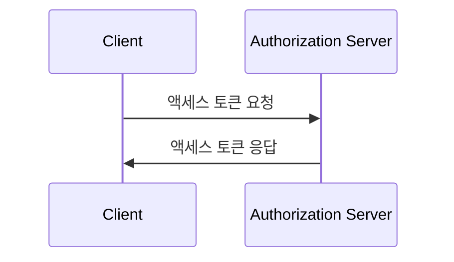
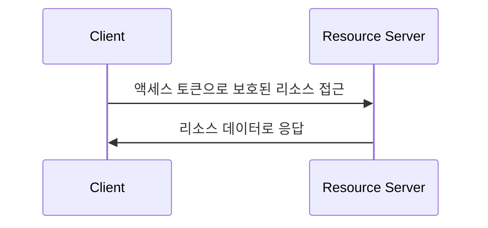

## 클라이언트 자격 증명 흐름 (Client credentials flow)이란?

클라이언트 자격 증명 흐름 (Grant)은 기밀 클라이언트가 보호된 리소스에 접근할 수 있도록 <Ref slug="access-token">access tokens (액세스 토큰)</Ref>을 받을 수 있는 <Ref slug="oauth-2.0-grant" /> 유형입니다. 일반적으로 이 흐름은 클라이언트가 서버나 서비스인 <Ref slug="machine-to-machine" /> 통신에 사용됩니다.

> [!Note]
> 클라이언트 자격 증명 흐름은 최종 사용자 인증(authorization)에는 적합하지 않습니다. 최종 사용자 인증(authorization)을 위해서는 <Ref slug="authentication-request" /> 또는 <Ref slug="authorization-request" />를 사용해야 합니다.

## 클라이언트 자격 증명 흐름 (Client credentials flow)은 어떻게 작동하나요?

클라이언트 자격 증명 흐름은 두 단계로 이루어진 간단한 프로세스입니다:

1. **토큰 요청**: 클라이언트는 <Ref slug="token-request" />와 클라이언트 자격 증명 (클라이언트 ID 및 클라이언트 비밀), 요청된 <Ref slug="scope">scopes (스코프)</Ref>와 함께 보냅니다.
2. **토큰 응답**: <Ref slug="authorization-server" />는 클라이언트 자격 증명을 검증하고 클라이언트가 인증되었다면 액세스 토큰을 발행합니다.

다음은 클라이언트 자격 증명 흐름의 간단한 순서도입니다:



다음은 클라이언트 자격 증명 흐름의 토큰 요청에 대한 비표준 예제입니다:

```http
POST /token HTTP/1.1
Host: your-authorization-server.com
Content-Type: application/x-www-form-urlencoded

grant_type=client_credentials
  &client_id=YOUR_CLIENT_ID
  &client_secret=YOUR_CLIENT_SECRET
  &scope=read write
```

인증 서버는 클라이언트 자격 증명을 검증하고 클라이언트가 인증되었다면 액세스 토큰을 발행합니다. 클라이언트가 액세스 토큰을 받으면 이를 사용하여 스스로 보호된 리소스(예: API)에 접근할 수 있습니다. 클라이언트가 액세스 토큰을 사용하여 API에 접근하는 방법의 예는 다음과 같습니다:



<Ref slug="resource-server" />는 액세스 토큰을 검증하고 <Ref slug="access-control" /> 정책을 시행하여 클라이언트가 리소스에 접근할 수 있는 필요한 권한을 가지고 있는지 확인해야 합니다.

### 클라이언트 자격 증명 흐름의 토큰 요청에서의 주요 매개변수

기타 OAuth 2.0 흐름과는 달리, 클라이언트 자격 증명 흐름은 다음과 같은 핵심 매개변수와 함께 간단한 <Ref slug="token-request" />을 가지고 있습니다:

- **`grant_type`**: 클라이언트 자격 증명 흐름을 나타내기 위해 `client_credentials`로 설정해야 합니다.
- **`client_id`**: 인증 서버에서 발급한 클라이언트 식별자입니다.
- **`client_secret`**: 인증 서버에서 발급한 클라이언트 비밀입니다.
- **`scope`**: 액세스 토큰에 대한 요청된 <Ref slug="scope">scopes (스코프)</Ref> (권한)입니다.
- **`resource`**: 요청된 리소스에 대한 <Ref slug="resource-indicator" />를 지정하는 선택적 매개변수입니다. 이 매개변수를 사용하려면 인증 서버가 [RFC 8707](https://datatracker.ietf.org/doc/html/rfc8707)을 지원해야 합니다.

## 보안 고려 사항

### 기밀 클라이언트

클라이언트 자격 증명 흐름은 클라이언트 비밀을 안전하게 저장할 수 있는 <Ref slug="client" headingId="confidential-clients" /> (기밀 클라이언트)에 적합합니다. 클라이언트가 공개 클라이언트(예: 단일 페이지 응용 프로그램)인 경우 클라이언트 자격 증명 흐름을 사용해서는 안되며, 이는 클라이언트 비밀이 노출될 수 있기 때문입니다.

### 토큰 만료

클라이언트 자격 증명 흐름에서 얻은 액세스 토큰은 긴 만료 시간을 가질 수 있지만, 토큰이 훼손되었을 때의 비인가 접근 위험을 줄이기 위해 단기 만료 토큰(예: 1시간)을 사용하는 것이 좋습니다.

### 클라이언트 비밀 회전

보안을 강화하기 위해 클라이언트 비밀을 주기적으로 회전시키는 것이 좋습니다. 인증 서버는 클라이언트가 액세스 토큰을 받는 능력에 영향을 미치지 않고 클라이언트 비밀 회전을 지원해야 합니다. 예를 들어, 인증 서버는 회전 과정에서 하위 호환성을 위해 여러 개의 클라이언트 비밀을 지원해야 합니다.

<SeeAlso slugs={["machine-to-machine", "token-request", "access-token", "scope", "resource-indicator"]} />

<Resources
  urls={[
    "https://blog.logto.io/programmatic-authentication-methods",
    { 
      url: "https://datatracker.ietf.org/doc/html/rfc6749#section-4.4",
      result: {
        ogTitle: "Client Credentials Grant",
        ogDescription: "클라이언트는 인증 서버와 미리 합의한 보호 리소스 또는 다른 리소스 소유자에게 접근을 요청할 때, 클라이언트 자신만의 자격 증명(또는 지원되는 다른 인증 방법)을 사용하여 액세스 토큰을 요청할 수 있습니다."
      }
    }
  ]}
/>
