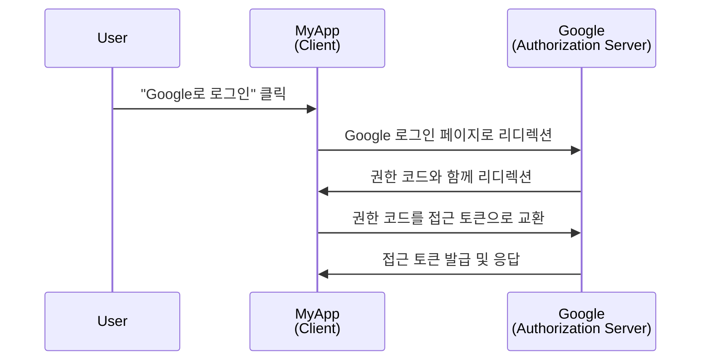
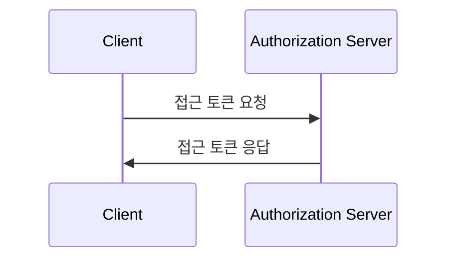

## 클라이언트란?

<Ref slug="oauth-2.0" /> 및 <Ref slug="openid-connect" />의 맥락에서 클라이언트는 인증 (Authentication)이나 권한 부여 (Authorization)를 요청하는 애플리케이션입니다. 예를 들어, 사용자가 애플리케이션에서 "Google로 로그인"을 클릭하면, 애플리케이션은 Google로부터 권한 부여를 요청하는 **클라이언트**로 동작합니다.

> <Ref slug="iam" /> 컨텍스트에서 "클라이언트"와 "애플리케이션"은 종종 상호 교환적으로 사용됩니다.

클라이언트는 그들의 능력 및 신뢰 수준에 따라 여러 분류가 있지만, 프레임워크에서 중요한 구분은 공용 클라이언트와 비밀 클라이언트 사이의 구분입니다. 이는 클라이언트가 토큰을 얻는 방법과 사용할 수 있는 승인 유형에 영향을 미칩니다.

### 공용 클라이언트 ||public-clients||

공용 클라이언트는 자격 증명을 기밀로 유지할 수 없는 애플리케이션으로, 리소스 소유자 (사용자)가 이를 접근할 수 있습니다. 공용 클라이언트의 예는 다음과 같습니다:

- 단일 페이지 애플리케이션 (SPA)
- 모바일 앱
- 데스크탑 앱

모바일 및 데스크탑 앱이 보안 저장 기능을 가지고 있다고 주장할 수 있지만, 대부분의 프레임워크는 이를 엔드 유저에게 배포함으로써 공용 클라이언트로 간주하며, 엔드 유저가 자격 증명에 접근할 수 있다고 추정합니다.

### 비밀 클라이언트 ||confidential-clients||

비밀 (개인) 클라이언트는 리소스 소유자 (엔드 유저)에게 노출되지 않고 민감한 정보를 기밀로 저장할 수 있는 애플리케이션입니다. 비밀 클라이언트의 예는 다음과 같습니다:

- 웹 서버
- 백엔드 서비스

## 클라이언트는 어떻게 작동하나요?

### 사용자 인증 및 권한 부여

클라이언트가 사용자를 인증 (Authentication)하고자 할 때, 클라이언트는 <Ref slug="authorization-request" />를 <Ref slug="authorization-server" />에 전달하여 <Ref slug="access-token" />을 얻습니다. 클라이언트는 클라이언트 ID, redirect URI, 권한 범위와 같은 필요한 매개변수를 요청에 포함해야 합니다. 다음은 권한 부여 코드 흐름의 간단한 순서도입니다:

이 예시에서 Google은 사용자가 성공적으로 로그인한 후 클라이언트 (MyApp)에 접근 토큰을 발행하는 **권한 부여 서버**로 역할을 합니다. 클라이언트는 그 후에 **접근 토큰**을 사용하여 Google에서 사용자의 프로필 (보호된 리소스)을 가져올 수 있습니다.

OpenID Connect (OIDC) 클라이언트의 경우, 클라이언트는 사용자를 인증 (Authentication)하기 위해 <Ref slug="authentication-request" />를 시작해야 합니다. 이는 권한 요청과 같은 엔드포인트를 사용하지만, 매개변수와 응답은 다릅니다.

### 기계 간 통신

<Ref slug="machine-to-machine" /> 통신의 경우, 클라이언트는 <Ref slug="client-credentials-flow" />를 사용하여 직접 <Ref slug="token-request" />를 권한 부여 서버에 보낼 수 있습니다. 클라이언트는 요청에 클라이언트 ID, 클라이언트 비밀, 권한 범위를 포함해야 합니다. 다음은 클라이언트 자격 흐름의 간단한 순서도입니다:

권한 부여 서버는 클라이언트 자격 증명을 검증하고 클라이언트가 승인된 경우 접근 토큰을 발행하게 됩니다. 클라이언트 비밀을 보내야 하기 때문에, 클라이언트 자격 흐름은 비밀 클라이언트에만 사용해야 합니다.

## 보안 고려사항

### 클라이언트 유형

클라이언트 유형 (공용 또는 비밀)은 클라이언트의 보안 고려사항에 영향을 미칩니다.

- 공용 클라이언트는 클라이언트 자격 흐름을 사용해서는 안 됩니다. 대신 사용자를 인증하기 위해 <Ref slug="pkce" />와 함께 <Ref slug="authorization-code-flow" />를 사용하는 것이 좋습니다.
- 비밀 클라이언트는 기계 간 통신을 위해 클라이언트 자격 흐름을 사용할 수 있습니다. 클라이언트 비밀을 안전하게 저장하고 안전한 환경에서만 사용해야 합니다.

### 토큰 저장

클라이언트는 가능한 최고 수준의 보안을 사용하여 토큰을 저장해야 합니다. 예를 들어, 웹 애플리케이션에서는 XSS 공격을 방지하기 위해 HTTP-Only 쿠키에 접근 토큰을 저장하는 것이 권장됩니다.

### 토큰 만료

접근 토큰은 비인가된 접근의 위험을 줄이기 위해 제한된 수명을 가집니다. 클라이언트는 새로운 접근 토큰을 얻기 위해 <Ref slug="refresh-token">리프레시 토큰</Ref>을 사용하여 토큰 만료를 우아하게 처리해야 합니다.

### 토큰 철회

클라이언트는 토큰 철회를 처리할 준비가 되어 있어야 합니다. 사용자가 로그아웃하거나 권한 부여 서버가 토큰을 철회할 경우, 클라이언트는 클라이언트 측 저장소에서 토큰을 지워야 합니다.

<SeeAlso slugs={["oauth-2.0", "oauth-2.0-grant", "openid-connect", "authorization-request", "authentication-request"]} />

<Resources
  urls={[
    "https://blog.logto.io/secure-cloud-apps-with-oauth-and-openid-connect",
    "https://datatracker.ietf.org/doc/html/rfc6749",
    "https://openid.net/specs/openid-connect-core-1_0.html"
  ]}
/>
