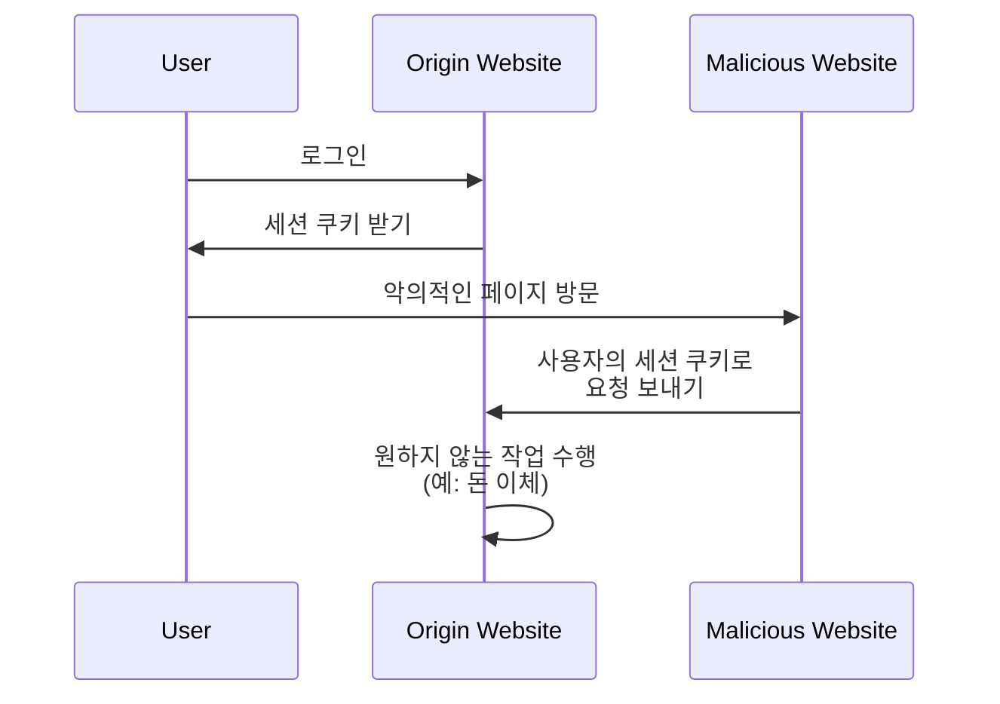

## 크로스 사이트 요청 위조 (CSRF)란 무엇인가?

웹 애플리케이션을 개발할 때, CSRF는 개발자와 보안 전문가에게 두려움을 주는 흔히 들리는 용어입니다. 이는 인증된 사용자를 속여서 동의 없이 웹 애플리케이션에서 원하지 않는 작업을 실행하게 하는 공격 유형입니다.

CSRF는 사용자의 활성 세션을 악의적인 작업 수행에 이용하기 때문에 "한 번 클릭 공격" 또는 "세션 라이딩"이라고도 알려져 있습니다.

## CSRF는 어떻게 작동하는가?

CSRF 공격은 웹 애플리케이션이 사용자 브라우저에 대한 신뢰를 이용하여 작동합니다. 일반적인 작동 방식은 다음과 같습니다:



이 순서에 관해 몇 가지 질문이 있을 수 있습니다. 그 이유를 살펴봅시다.

### 왜 악의적인 웹사이트가 원래 웹사이트에 요청을 보낼 수 있는가?

동일 출처 정책(Same-Origin Policy, SOP)은 웹 브라우저의 보안 기능으로, 한 출처에서 로드된 문서나 스크립트가 다른 출처의 리소스(예: 쿠키, DOM)와 상호 작용하는 것을 제한합니다. 그러나 SOP는 브라우저가 다른 출처로 요청을 보내는 것을 막지 않습니다.

따라서, 악의적인 웹사이트는 직접적으로 세션 쿠키를 읽거나 수정할 수는 없지만, 사용자의 활성 세션을 사용하여 원래 웹사이트에 요청을 보낼 수 있습니다.

대부분의 웹 애플리케이션이 [CORS](https://developer.mozilla.org/en-US/docs/Web/HTTP/CORS)를 사용하여 무단 크로스 출처 요청을 방지한다고 주장할 수 있지만, CSRF는 여전히 이를 우회할 방법이 있습니다:

1. GET 기반 공격: 악의적인 웹사이트는 사용자를 원래 웹사이트에서 동작을 수행하는 URL로 방문하도록 속일 수 있습니다:

    - `https://example.com/transfer?amount=1000&to=attacker`로 리디렉션.
    - 이미지를 로드하는 태그 ``.

    이것이 GET 요청이 부수적인 효과를 가져서는 안 되는 중요한 이유입니다.

2. 폼 기반 공격: 악의적인 웹사이트는 원래 웹사이트로 데이터를 제출하는 숨겨진 폼을 생성할 수 있습니다. 예를 들어, 숨겨진 폼 필드로 POST 요청 `https://example.com/transfer`발송.

### 왜 악의적인 웹사이트는 사용자의 세션 쿠키를 가지는가?

사용자의 브라우저는 요청을 할 때 자동으로 세션 쿠키를 원래 웹사이트에 보냅니다. 이것이 원래 웹사이트가 사용자가 인증됐으며, 그들의 이름으로 작업을 수행할 수 있다는 것을 아는 방법입니다.

사실, 악의적인 웹사이트는 "세션 쿠키를 갖고 있는 게 아니라", 단순히 브라우저의 동작을 악용하여 요청과 함께 쿠키를 보냅니다.

## CSRF 공격을 방지하는 방법?

CSRF 공격을 방지하기 위해서는 서버와 클라이언트 모두를 포함하는 다층적인 접근 방식이 필요합니다. CSRF 취약점을 완화하기 위한 일반적인 기술은 다음과 같습니다:

### CSRF 방지 토큰 사용

CSRF 방지 토큰은 서버에 의해 생성되어 웹 애플리케이션의 폼에 내장된 랜덤 값입니다. 폼이 제출될 때 서버는 요청이 합법적인지 확인하기 위해 토큰을 검증합니다.

예를 들어, HTML 폼에서 숨겨진 입력 필드:

```html
<form action="/transfer" method="post">
  <input type="hidden" name="csrf_token" value="random_token_here" />
  <!-- Other form fields -->
  <button type="submit">Transfer</button>
</form>
```

이 접근 방식으로 악의적인 웹사이트는 CSRF 방지 토큰을 알 수 없기 때문에 요청을 조작할 수 없습니다. <Ref slug="redirect-uri" />의 `state` 파라미터는 유사한 개념입니다.

### SameSite 쿠키 사용

쿠키의 `SameSite` 속성은 쿠키가 서버로 전송되는 시기를 제한하여 CSRF 공격을 방지할 수 있습니다:

| `SameSite` 값  | 설명                                                                    |
|----------------|------------------------------------------------------------------------|
| `Strict`       | 쿠키는 오직 첫 번째 당사자 문맥에서만 전송됩니다.                       |
| `Lax`          | 쿠키는 첫 번째 당사자 문맥과 외부 사이트에서의 GET 요청과 함께 전송됩니다.|
| `None`         | 쿠키는 모든 문맥에서 전송됩니다. `Secure` 속성이 필요합니다.             |

`SameSite` 속성을 `Strict` 또는 부수적인 효과가 없는 `Lax`로 설정함으로써 CSRF 공격을 방지할 수 있습니다.

또한, 쿠키가 오직 HTTPS 연결에서만 전송되도록 `Secure` 속성은 항상 설정되어야 합니다.

### 헤더 체크

1. **Origin 헤더**: `Origin` 헤더는 요청의 출처를 나타내기 위해 브라우저에서 전송됩니다. 서버는 이 헤더를 확인하여 요청이 예상된 출처에서 오는 것인지 확인할 수 있습니다.
2. **Referer 헤더**: `Referer` 헤더는 이전 페이지의 URL을 포함합니다. 이는 위조될 수 있지만, 추가적인 보호 계층으로 사용할 수 있습니다.

<SeeAlso slugs={["authorization-code-flow", "redirect-uri"]} />

<Resources
  urls={[
    'https://blog.logto.io/csrf',
    "https://cheatsheetseries.owasp.org/cheatsheets/Cross-Site_Request_Forgery_Prevention_Cheat_Sheet.html",
  ]}
/>
