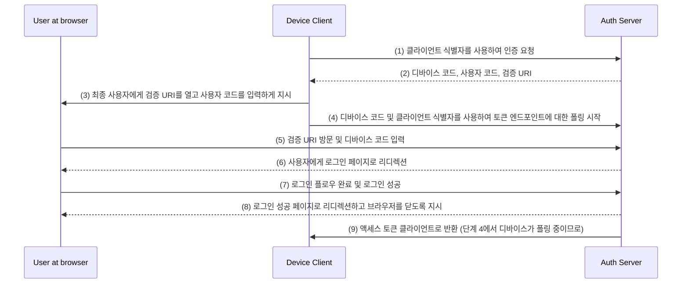

## 디바이스 플로우 (Device flow)란 무엇인가?

[OAuth 디바이스 인증 플로우](https://www.rfc-editor.org/rfc/rfc8628), 또는 디바이스 플로우로 알려진 것은 입력 기능이 제한된 장치(예: 스마트 TV, IoT 장치, 게임 콘솔) 또는 헤드리스 앱(예: CLI 도구)을 위한 [OAuth 2.0](https://oauth.net/2/) 구현입니다. 사용자가 이러한 장치에서 인증 요청을 시작하고, 스마트폰이나 노트북과 같은 입력 기능이 더 나은 장치를 사용해 프로세스를 완료할 수 있도록 합니다.

## 디바이스 플로우를 언제 사용해야 하는가?

1. **입력이 제한된 장치**
    - 스마트 TV에서의 로그인 (예: 미디어 앱)
    - 게임 콘솔에서의 로그인 (예: 게임 시스템 또는 미디어 앱)
    - 회의 장치에서의 로그인 (예: 공식 앱 또는 화상 회의 앱)
    - 웨어러블 장치에서의 로그인 (예: 입력이 제한된 스마트워치)
    - IoT 장치에 액세스 (예: 프린터, 비디오 인코더 또는 스피커)
2. **헤드리스 애플리케이션**
    - 명령줄 인터페이스 로그인 (예: GitHub CLI 또는 Stripe CLI)
3. **데스크톱 애플리케이션을 위한 QR 코드 로그인**
    - 스마트폰으로 QR 코드를 스캔하여 데스크톱 애플리케이션에 빠르고 안전하게 로그인 (예: Telegram, 데스크톱에서의 Steam 로그인). 이 QR 코드 로그인 플로우는 전통적인 OAuth 2.0 디바이스 플로우의 변형으로 간주될 수 있습니다.

## 디바이스 플로우 최종 사용자 흐름은 어떻게 보이는가?

QR 코드 로그인 변형을 제외하고, 표준 OAuth 2.0 디바이스 플로우에 초점을 맞추겠습니다. 두 가지 유형의 장치가 관련됩니다:

### 디바이스 코드 표시 장치

이것은 사용자가 액세스를 승인해야 하는 입력 제한 장치 또는 헤드리스 애플리케이션입니다. [디바이스 코드와 검증 URI](#what-does-device-flow-workflow-look-like)를 표시하며 사용자가 어떻게 진행해야 할지를 안내합니다.

기본 UI는 다음과 같습니다:


사용자 경험을 향상시키기 위해 서비스는 검증 URL에 대한 QR 코드를 생성하는 경우가 많습니다:


심지어 더 효율적으로 하기 위해, `verification_uri`의 QR 코드 자원을 `verification_uri_complete`와 교체할 수 있습니다 (예: `https://example.com/device?user_code=WDJB-MJHT`), 이는 URL에 디바이스 코드를 포함하여 사용자가 필드를 미리 채울 수 있도록 도와줍니다.

### 인증 장치

로그인 대상 장치에서의 지시에 따라, 사용자는:

1. 브라우저 접속 및 입력 기능이 있는 다른 장치를 사용하여 검증 URL을 엽니다.
2. 표시된 디바이스 코드를 입력하고 (미리 채워질 수도 있음) 계속 진행합니다.
3. 브라우저에서 기존 세션이 없는 경우, 사용자는 먼저 서비스에 로그인합니다.
4. 동의 페이지가 사용자가 디바이스 로그인 인증서를 허용하도록 프롬프트 합니다.
5. 마침내 인증 후 성공 페이지가 표시됩니다.

여기 시험해볼 수 있는 몇 가지 기기 플로우 검증 URL이 있는 확립된 제품들이 있습니다:

- [스마트 TV에서 Youtube 로그인](https://www.youtube.com/watch?v=yTcuazSy5Cs): [youtube.com/activate](https://youtube.com/activate)
- 스마트 TV에서 Disney+ 로그인: [disneyplus.com/begin](https://disneyplus.com/begin)
- [Samsun Galaxy Watch에서 Shopify 로그인](https://www.drmare.com/spotify-music/spotify-on-galaxy-watch.html): [spotify.com/pair](https://spotify.com/pair)
- [회의 장치에서 Zoom 로그인](https://developers.zoom.us/blog/device-authorization/): [zoom.us/oauth_device](https://zoom.us/oauth_device)
- [GitHub CLI 로그인](https://docs.github.com/en/apps/oauth-apps/building-oauth-apps/authorizing-oauth-apps#device-flow): [github.com/login/device](https://github.com/login/device)
- [Google 디바이스 플로우 활용](https://www.oauth.com/oauth2-servers/device-flow/user-flow/): https://www.google.com/device

## 디바이스 플로우 워크플로우는 어떻게 이루어지는가?

먼저, 디바이스 코드 표시 장치에 표시된 정보를 처리하기 위한 디바이스 승인 응답의 매개변수를 이해해야 합니다:

| 매개변수                                     | 설명                                                                                                                                                                              |
| ----------------------------------------- | ---------------------------------------------------------------------------------------------------------------------------------------------------------------------------- |
| `device_code`                             | 디바이스 인증 코드.                                                                                                                                                                    |
| `user_code`                               | 최종 사용자 인증 코드.                                                                                                                                                                  |
| `verification_uri`                        | 인증 서버의 최종 사용자 검증 URI. URI는 최종 사용자가 사용자 에이전트에 수동으로 입력해야 하므로 짧고 기억하기 쉬워야 합니다.                                                                                           |
| `verification_uri_complete` (선택 사항) | "user_code" (또는 "user_code"와 같은 기능을 하는 기타 정보)를 포함하는 검증 URI로, 비텍스트 전송을 위해 설계되었습니다.                                                                          |
| `expires_in`                              | "device_code" 및 "user_code"의 유효 기간(초 단위).                                                                                                                                           |
| `interval`                                | 클라이언트가 토큰 엔드포인트에 대한 폴링 요청 사이에 기다려야 하는 최소 시간(초 단위). 값이 제공되지 않은 경우, 기본값은 5로 사용해야 합니다.                                                          |

```json
{
    "device_code": "GmRhmhcxhwAzkoEqiMEg_DnyEysNkuNhszIySk9eS",
    "user_code": "WDJBMJHT",
    "verification_uri": "https://custom.domain.com/device",
    "verification_uri_complete":
        "https://custom.domain.com/device?user_code=WDJB-MJHT",
    "expires_in": 900,
    "interval": 5
}
```

사용자가 인증을 위해 디바이스 플로우를 사용할 때, 주로 다음 단계를 포함합니다:



1. 디바이스 클라이언트는 클라이언트 식별자(보통 인증 서버 플랫폼의 클라이언트 ID)를 사용하여 인증 서버에서 인증을 요청합니다.
2. 인증 서버는 디바이스 코드, 사용자 코드 및 검증 URI와 함께 디바이스 클라이언트에 응답합니다.
3. 디바이스 클라이언트는 텍스트 (또는 QR 코드 등) 형태로 사용자에게 검증 URI와 사용자 코드를 표시하고, URI를 방문하여 코드를 입력하라고 지시합니다.
4. 3단계와 동시에, 디바이스 클라이언트는 인증 서버에서 디바이스 코드 및 클라이언트 식별자를 사용하여 액세스 토큰에 대한 폴링을 시작하고, 사용자가 인증 요청을 검토하여 사용자 승인을 완료할 때까지 기다립니다.
5. 사용자는 다른 장치의 브라우저를 통해 인증 서버에 호스트된 검증 URI를 방문하고, 사용자 코드를 입력합니다.
6. 인증 서버는 사용자를 로그인 페이지로 리디렉션하고, 로그인을 완료하라고 지시합니다.
7. 사용자는 로그인 플로우를 완료하고, 성공적으로 로그인합니다.
8. 인증 서버는 사용자를 로그인 성공 페이지로 리디렉션하고, 브라우저를 닫도록 지시합니다.
9. 8단계와 동시에, 인증 서버는 디바이스 클라이언트에 액세스 토큰을 반환합니다. 클라이언트는 4단계부터 폴링 중이기 때문입니다.

이러한 프로세스를 거친 후, 디바이스 클라이언트는 향후 서비스를 위한 액세스 토큰을 얻을 수 있게 됩니다!

자세한 내용은 [RFC 8628 OAuth 2.0 디바이스 인증 그랜트](https://datatracker.ietf.org/doc/html/rfc8628#autoid-3)를 참조하세요.

<SeeAlso slugs={['authorization-code-flow', 'implicit-flow', 'client-credentials-flow']} />

<Resources urls={['https://blog.logto.io/a-brief-introduction-to-oauth2-device-flow', 'https://datatracker.ietf.org/doc/html/rfc8628']} />