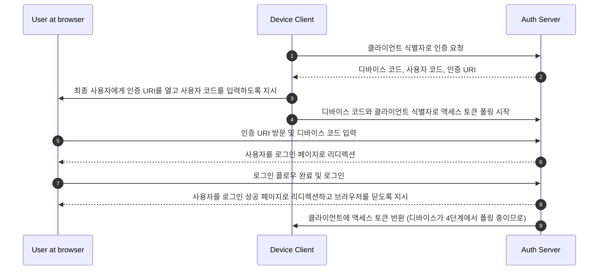

## 디바이스 플로우란 무엇인가?

[OAuth 디바이스 인증 플로우](https://www.rfc-editor.org/rfc/rfc8628), 또는 디바이스 플로우는 입력 기능이 제한된 디바이스(예: 스마트 TV, IoT 디바이스, 게임 콘솔)나 헤드리스 앱(예: CLI 도구)을 위해 설계된 <Ref slug="oauth-2.0-grant" />입니다. 사용자가 이러한 디바이스에서 <Ref slug="authorization-request">인증 요청</Ref>을 시작하고, 스마트폰이나 노트북과 같은 더 많은 입력 기능을 가진 디바이스를 사용하여 프로세스를 완료할 수 있도록 합니다.

## 디바이스 플로우는 언제 사용해야 하는가?

1. **입력이 제한된 디바이스**
    - 스마트 TV에서 로그인 (예: 미디어 앱)
    - 게임 콘솔에서 로그인 (예: 게임 시스템 또는 미디어 앱)
    - 미팅 디바이스에서 로그인 (예: 공식 앱 또는 비디오 미팅 앱)
    - 웨어러블 디바이스에서 로그인 (예: 입력이 제한된 스마트워치)
    - IoT 디바이스에 접근 (예: 프린터, 비디오 인코더, 스피커)
2. **헤드리스 애플리케이션**
    - 명령줄 인터페이스 로그인 (예: GitHub CLI 또는 Stripe CLI)
3. **데스크톱 애플리케이션을 위한 QR 코드 로그인**
    - 스마트폰으로 QR 코드를 스캔하여 데스크톱 애플리케이션에 빠르고 안전하게 로그인 (예: Telegram, Steam 데스크톱 로그인). 이 QR 코드 로그인 플로우는 전통적인 OAuth 2.0 디바이스 플로우의 변형으로 간주될 수 있습니다.

## 디바이스 플로우 최종 사용자 플로우는 어떻게 보이는가?

QR 코드 로그인 변형을 무시하고, 표준 OAuth 2.0 디바이스 플로우에 집중해 봅시다. 두 가지 유형의 디바이스가 관련됩니다:

### 디바이스 코드 표시 디바이스

이는 사용자가 접근을 인증해야 하는 입력이 제한된 디바이스나 헤드리스 애플리케이션입니다. [디바이스 코드와 인증 URI](#what-does-device-flow-workflow-look-like)를 표시하여 사용자가 어떻게 진행해야 하는지 안내합니다.

기본 UI는 다음과 같습니다:


사용자 경험을 향상시키기 위해, 서비스는 종종 인증 URL에 대한 QR 코드를 생성합니다:


더욱 효율적으로 하기 위해, `verification_uri`의 QR 코드 리소스를 `verification_uri_complete`로 대체할 수 있습니다 (예: `https://example.com/device?user_code=DSHP-SNCT`), 이는 URL에 디바이스 코드를 포함하여 사용자가 필드에 디바이스 코드를 미리 입력할 수 있도록 돕습니다.

### 인증 디바이스

로그인 대상 디바이스의 지침에 따라 사용자는:

1. 브라우저 접근 및 입력 기능이 있는 다른 디바이스를 사용하여 인증 URL을 엽니다.
2. 표시된 디바이스 코드를 입력하고 (미리 입력될 수 있음) 계속 진행합니다.
3. 브라우저에 기존 세션이 없으면, 사용자는 먼저 서비스에 로그인합니다.
4. 동의 페이지가 사용자에게 디바이스 로그인 인증을 요청합니다.
5. 마지막으로, 인증 후 성공 페이지가 표시됩니다.


다음은 테스트를 위한 몇 가지 제품의 디바이스 플로우 인증 URL입니다:

- [스마트 TV에서 Youtube 로그인](https://www.youtube.com/watch?v=yTcuazSy5Cs): [youtube.com/activate](https://youtube.com/activate)
- 스마트 TV에서 Disney+ 로그인: [disneyplus.com/begin](https://disneyplus.com/begin)
- [Samsun Galaxy Watch에서 Shopify 로그인](https://www.drmare.com/spotify-music/spotify-on-galaxy-watch.html): [spotify.com/pair](https://spotify.com/pair)
- [미팅 디바이스에서 Zoom 로그인](https://developers.zoom.us/blog/device-authorization/): [zoom.us/oauth_device](https://zoom.us/oauth_device)
- [GitHub CLI 로그인](https://docs.github.com/en/apps/oauth-apps/building-oauth-apps/authorizing-oauth-apps#device-flow): [github.com/login/device](https://github.com/login/device)
- [Google 디바이스 플로우 활용](https://www.oauth.com/oauth2-servers/device-flow/user-flow/): https://www.google.com/device

## 디바이스 플로우 워크플로우는 어떻게 보이는가?

먼저, 디바이스 코드 표시 디바이스에 표시되는 정보를 처리하는 데 사용되는 디바이스 인증 응답의 매개변수를 이해해야 합니다:

| 매개변수                              | 설명                                                                                                                                                                    |
| -------------------------------------- | ------------------------------------------------------------------------------------------------------------------------------------------------------------------------------ |
| `device_code`                          | 디바이스 인증 코드.                                                                                                                                                  |
| `user_code`                            | 최종 사용자 인증 코드.                                                                                                                                                |
| `verification_uri`                     | 인증 서버의 최종 사용자 인증 URI. URI는 최종 사용자가 사용자 에이전트에 수동으로 입력해야 하므로 짧고 기억하기 쉬워야 합니다. |
| `verification_uri_complete` (선택 사항) | "user_code" (또는 "user_code"와 동일한 기능을 가진 다른 정보)를 포함하는 인증 URI로, 비텍스트 전송을 위해 설계되었습니다.             |
| `expires_in`                           | "device_code"와 "user_code"의 수명(초 단위).                                                                                                                  |
| `interval`                             | 클라이언트가 토큰 엔드포인트에 대한 폴링 요청 사이에 대기해야 하는 최소 시간(초 단위). 값이 제공되지 않으면, 클라이언트는 기본값으로 5를 사용해야 합니다. |

```json
{
    "device_code": "GmRhmhcxhwAzkoEqiMEg_DnyEysNkuNhszIySk9eS",
    "user_code": "WDJBMJHT",
    "verification_uri": "https://custom.domain.com/device",
    "verification_uri_complete":
        "https://custom.domain.com/device?user_code=WDJB-MJHT",
    "expires_in": 900,
    "interval": 5
}
```

사용자가 인증을 위해 디바이스 플로우를 사용할 때, 주로 다음 단계가 포함됩니다:



1. 디바이스 클라이언트는 클라이언트 식별자(일반적으로 인증 서버 플랫폼의 클라이언트 ID)로 인증 서버에 인증을 요청합니다.
2. 인증 서버는 디바이스 코드, 사용자 코드 및 인증 URI를 디바이스 클라이언트에 응답합니다.
3. 디바이스 클라이언트는 텍스트(또는 QR 코드 등) 형태로 사용자에게 인증 URI와 사용자 코드를 표시하여, URI를 방문하고 코드를 입력하도록 지시합니다.
4. 3단계와 동시에, 디바이스 클라이언트는 인증 서버에서 디바이스 코드와 클라이언트 식별자로 액세스 토큰 폴링을 시작하고 사용자가 <Ref slug="authorization-request" />를 검토하고 사용자 인증을 완료할 때까지 대기합니다.
5. 사용자는 다른 디바이스의 브라우저를 통해 인증 서버가 호스팅하는 인증 URI를 방문하고 사용자 코드를 입력합니다.
6. 인증 서버는 사용자를 로그인 페이지로 리디렉션하고 로그인 완료를 지시합니다.
7. 사용자는 로그인 플로우를 완료하고 성공적으로 로그인합니다.
8. 인증 서버는 사용자를 로그인 성공 페이지로 리디렉션하고 브라우저를 닫도록 지시합니다.
9. 8단계와 동시에, 인증 서버는 디바이스 클라이언트에 액세스 토큰을 반환합니다. 클라이언트는 4단계부터 폴링 중이기 때문입니다.

이러한 프로세스 후, 디바이스 클라이언트는 후속 서비스를 위한 <Ref slug="access-token" />을 얻을 수 있습니다.

자세한 내용은 [RFC 8628 OAuth 2.0 디바이스 인증 부여](https://datatracker.ietf.org/doc/html/rfc8628#autoid-3)를 참조하세요.

## 디바이스 플로우의 보안 고려 사항은 무엇인가?

디바이스 플로우는 두 개의 디바이스 간 상호작용을 포함하므로, 디바이스 코드 노출, 무차별 공격, 중간자(MitM) 공격과 같은 잠재적인 보안 위험에 노출될 수 있습니다.

디바이스 코드만으로는 즉시 인증을 부여하지 않지만(사용자가 여전히 인증하고 승인해야 함), 공격자는 유효 기간 동안 디바이스 코드 요청을 재생하려고 시도할 수 있습니다. 이는 허가되지 않은 반복적인 접근을 초래할 수 있습니다. 보안을 강화하기 위해 다음과 같은 예방 조치를 고려하세요:

- **`expires_in` 기간 단축:** 디바이스 코드의 유효 기간을 최소화하여 공격의 기회를 줄입니다.
- **실패한 시도 제한:** 무차별 공격을 방지하기 위해 잘못된 코드 입력 횟수를 제한합니다.
- **HTTPS 강제:** 디바이스와 인증 서버 간의 모든 통신이 HTTPS를 사용하여 암호화되도록 하여 중간자 공격을 방지합니다.
- **단일 사용 디바이스 코드 제한:** 각 디바이스 코드를 **단일 세션**으로 제한하여 허가되지 않은 당사자에 의한 재사용을 방지합니다.

디바이스 코드의 단일 사용은 OAuth 2.0 디바이스 플로우의 내장 요구 사항이 아닙니다. 이는 선택적 모범 사례입니다. 일부 개발자는 동일한 코드로 여러 디바이스에서 동시 디바이스 인증을 의도적으로 설계할 수 있지만(예: 수백 대의 디바이스에서), 이 접근 방식은 보안 위험을 증가시키며 신중하게 평가해야 합니다.

## OIDC 공급자는 디바이스 플로우를 지원하는가?

디바이스 플로우는 전통적으로 OAuth와 관련이 있지만, <Ref slug="openid-connect" /> 공급자도 이를 지원할 수 있습니다. OIDC는 OAuth의 주된 초점인 인증을 넘어 추가적인 이점을 제공합니다. 이는 인증으로 확장되어 애플리케이션이 단일 플로우에서 <Ref slug="access-token" />과 <Ref slug="id-token" />을 모두 얻을 수 있게 합니다.

OIDC의 강력한 통합 아이덴티티 관리, 토큰 검증 및 <Ref slug="refresh-token">갱신</Ref>을 포함하여, 특히 입력 기능이 제한된 디바이스와 애플리케이션 간의 안전하고 신뢰할 수 있는 <Ref slug="authentication" /> 및 <Ref slug="authorization" />에 적합합니다.

<SeeAlso slugs={['oauth-2.0-grant', 'authorization-code-flow', 'implicit-flow', 'client-credentials-flow']} />

<Resources urls={['https://blog.logto.io/a-brief-introduction-to-oauth2-device-flow', 'https://datatracker.ietf.org/doc/html/rfc8628']} />