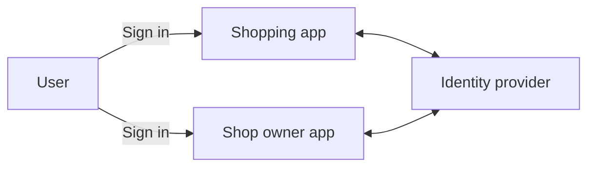
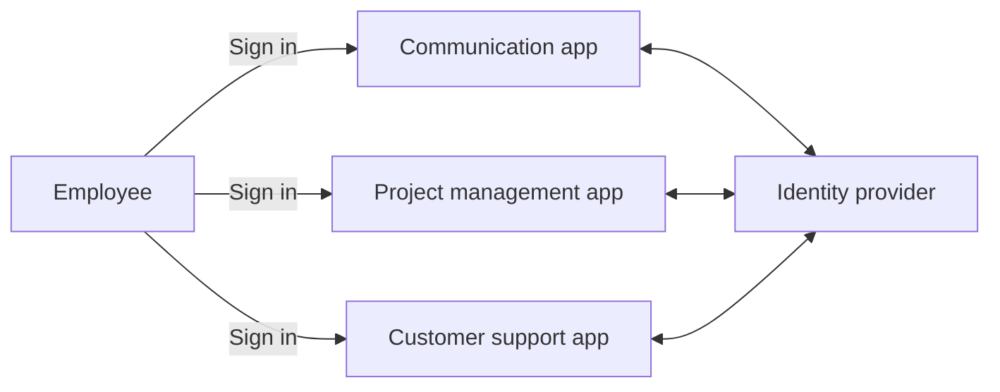
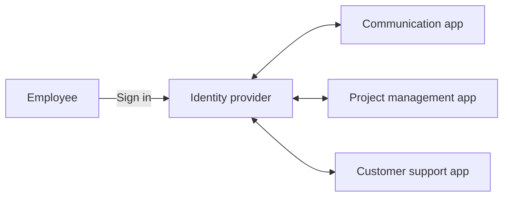
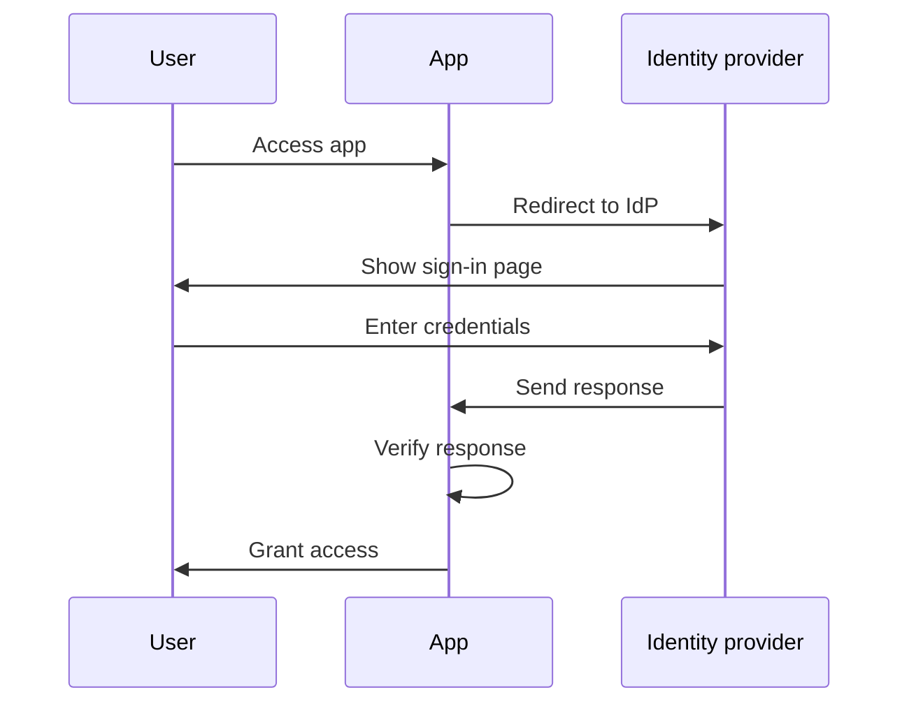
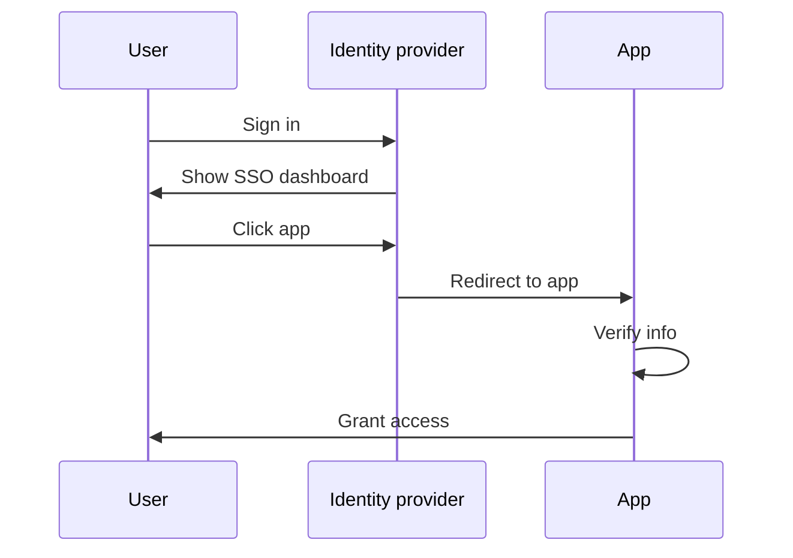
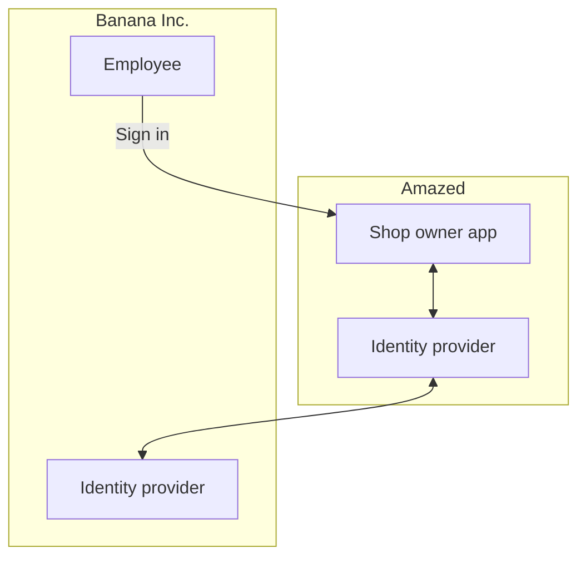

## 기업 SSO란 무엇인가?

정의로 들어가기 전에 SSO와 기업 SSO의 차이를 명확히 하는 것이 중요합니다. 이는 종종 혼란을 초래할 수 있습니다.

- <Ref slug="single-sign-on" />는 사용자가 한 번 로그인하여 여러 애플리케이션이나 리소스에 추가 로그인 없이 접근할 수 있는 일반적인 용어입니다.
- 기업 SSO는 조직 내 직원들을 위해 설계된 특정 유형의 SSO입니다.

아직 확실하지 않나요? 예를 들어보겠습니다:

_아메이즈드_라는 온라인 쇼핑 웹사이트에는 고객을 위한 웹 애플리케이션과 상점 주인을 위한 웹 애플리케이션이 두 개 있습니다. 고객은 쇼핑 앱에 로그인하여 제품을 구매하고, 상점 주인은 자신의 상점을 관리하기 위해 상점 주인 앱에 로그인합니다. 두 애플리케이션 모두 동일한 identity provider를 사용하여 인증(Authentication)을 수행합니다. 이로 인해 사용자는 두 애플리케이션에 접근하기 위해 한 번만 로그인하면 되며 Single Sign-On 경험을 제공합니다.

내부적으로, _아메이즈드_는 팀 커뮤니케이션, 프로젝트 관리 및 고객 지원을 위한 여러 애플리케이션을 사용합니다. 일상적인 워크플로우를 간소화하기 위해, _아메이즈드_는 직원들을 위해 기업 SSO를 구현합니다. 기업 SSO를 사용하면, 직원들은 단일 로그인으로 모든 내부 애플리케이션에 접근할 수 있습니다.

일반적으로 기업 SSO 솔루션은 직원들이 한 번의 클릭으로 모든 애플리케이션에 접근할 수 있는 중앙화된 대시보드를 제공하기도 합니다. 이 대시보드를 종종 SSO 대시보드라고 부릅니다.

간단히 말해, 두 시나리오는 모두 싱글 사인 온의 예시입니다. 차이점은 첫 번째 예시는 일반적인 SSO이며 두 번째는 기업 SSO입니다. 각각 Customer IAM (Identity and Access Management)과 Workforce IAM의 전형적인 사용 사례입니다.

## 기업 SSO는 어떻게 작동하나요?

기업 SSO는 여러 애플리케이션을 중앙화된 identity provider에 연결함으로써 작동합니다. 이 연결은 one-way (애플리케이션에서 identity provider로) 또는 two-way (애플리케이션과 identity provider 간)일 수 있습니다. SAML, OpenID Connect 및 OAuth 2.0과 같은 다양한 표준 및 프로토콜이 이러한 연결에 사용됩니다.

프로토콜에 관계없이 기본 워크플로우는 보통 유사합니다:

1. 사용자가 인증(Authentication)이 필요한 애플리케이션(예: 커뮤니케이션 앱)에 접근합니다.
2. 애플리케이션은 사용자를 인증(Authentication)하기 위해 identity provider로 리디렉션합니다.
3. 사용자는 identity provider에 로그인합니다.
4. identity provider는 인증 응답을 애플리케이션으로 보냅니다.
5. 애플리케이션은 응답을 확인하고 사용자에게 접근 권한을 부여합니다.

사용자가 동일한 identity provider에 연결된 다른 애플리케이션(예: 프로젝트 관리 앱)에 접근할 때, 별도의 자격 증명 입력 없이 자동으로 로그인이 됩니다. 이 경우 3단계는 생략되며, 2, 4, 5단계가 백그라운드에서 발생하기 때문에 사용자는 인증(Authentication) 프로세스를 거의 인식하지 못할 수 있습니다.

이 프로세스를 서비스 제공자 (SP) 시작 SSO라고 하며, 애플리케이션(SP)이 인증(Authentication) 프로세스를 시작합니다.

다른 시나리오에서는 identity provider가 사용자가 연결된 모든 애플리케이션에 접근할 수 있는 중앙화된 대시보드를 제공합니다. 간소화된 워크플로우는:

1. 사용자가 identity provider에 로그인합니다.
2. identity provider는 사용자가 접근할 수 있는 애플리케이션 목록을 표시합니다.
3. 사용자는 접근하려는 애플리케이션(예: 고객 지원 앱)을 클릭합니다.
4. identity provider는 인증(Authentication) 정보를 제공하며 사용자를 애플리케이션으로 리디렉션합니다.
5. 애플리케이션은 정보를 확인하고 사용자에게 접근 권한을 부여합니다.

이 프로세스를 아이덴티티 제공자 (IdP) 시작 SSO라고 하며, identity provider (IdP)가 인증(Authentication) 프로세스를 시작합니다.

## 왜 기업 SSO가 중요한가?

### Workforce IAM에서의 기업 SSO

#### 중앙 관리

기업 SSO의 주요 장점은 직원들의 편리함 뿐만 아니라 조직을 위한 향상된 보안 및 준수를 제공합니다. 서로 다른 애플리케이션에 대한 여러 자격 증명을 관리하고 각 애플리케이션에 대해 별도로 인증(Authentication)과 권한 부여(Authorization)를 설정하는 대신, 조직은 사용자 정체성 관리, 접근 통제 정책 및 감사 로그를 중앙화할 수 있습니다.

예를 들어, 직원이 회사를 떠날 때 IT 부서는 identity provider에서 해당 직원의 계정을 비활성화하여 모든 애플리케이션에 대한 접근을 즉시 철회할 수 있습니다. 이는 허가되지 않은 접근과 데이터 유출을 방지하는 데 중요하며, 이를 라이프사이클 관리라고 합니다.

#### 접근 제어

기업 SSO 솔루션은 종종 역할 기반 접근 제어 (RBAC) 및 속성 기반 접근 제어 (ABAC)와 같은 접근 통제 기능을 포함합니다. 이러한 기능을 통해 조직은 사용자 역할, 속성 및 기타 상황 요소를 기반으로 상세한 접근 정책을 정의하여 직원들이 적절한 수준의 자원에 접근할 수 있도록 합니다.

RBAC과 ABAC의 상세 비교는 [RBAC 및 ABAC: 알아야 할 접근 제어 모델](https://blog.logto.io/rbac-and-abac)을 참조하세요.

#### 향상된 보안

또 다른 장점은 모든 애플리케이션에 강력한 인증(Authentication) 방법을 적용할 수 있는 능력입니다. 예를 들어, 다단계 인증(MFA), 비밀번호 없는 인증(Passwordless), 적응형 인증(Authentication) 등이 있습니다. 이러한 방법들은 민감한 데이터를 보호하고 산업 규정을 준수하는 데 도움을 줍니다.

MFA에 대한 더 많은 정보는 [MFA 탐색: 제품 관점에서 본 인증](https://blog.logto.io/elaborate-mfa)을 참고하세요.

### 고객 IAM에서의 기업 SSO

"기업 SSO"라는 용어는 고객 IAM 솔루션에서도 사용됩니다. 이 맥락에서 무엇을 의미할까요? _아메이즈드_ 예를 다시 살펴보겠습니다: 일부 상점 주인들은 법인으로 등록되어 있습니다. 하나의 상점 주인, _바나나 Inc._는 직원들을 위해 기업 SSO를 구현합니다. 계약의 일환으로, _바나나 Inc._는 상점 주인 앱에 접근할 때 모든 _바나나 Inc._ 이메일 주소(예: `*@banana.com`)에 대해 기업 SSO를 강제하도록 _아메이즈드_에 요구합니다.

이 경우, _아메이즈드_는 _바나나 Inc._의 identity provider와 자신의 identity provider를 통합하여 _바나나 Inc._ 직원들을 위한 기업 SSO를 활성화해야 합니다. 이 통합은 대개 SAML, OpenID Connect 또는 OAuth와 같은 표준 프로토콜을 통해 이루어지며, 일반적으로 기업 SSO 연결, 기업 SSO 커넥터 또는 SSO 페더레이션이라고 불립니다.

고객 IAM에 대한 심층 설명은 CIAM 시리즈를 확인하세요:

- [CIAM 101: 인증(Authentication), 정체성, SSO](https://blog.logto.io/ciam-101-intro-authn-sso)
- [CIAM 102: 권한 부여(Authorization) 및 역할 기반 접근 제어](https://blog.logto.io/ciam-102-authz-and-rbac)

#### 기업 준비 완료

B2B (기업 대 기업) 시나리오에서, SaaS 제공업체인 _아메이즈드_와 같은 기업 고객을 지원하기 위해 기업 SSO는 필수 기능입니다. 이는 단지 편리함에 관한 것이 아니라, 양 당사자의 보안 및 준수에 관한 것입니다. 기업 SSO는 모든 정체성이 기업 identity provider를 통해 인증하도록 강제하여 기업 고객이 사용자의 데이터를, 접근 및 보안 정책을 제어할 수 있게 합니다.

기업 SSO는 _기업 준비_를 달성하는 데 중요한 요소이며, 이는 기업 고객의 요구를 충족할 수 있는 능력을 의미합니다. 그러나 Identity 및 접근 관리, 특히 기업 고객의 맥락에서, 복잡하며 시간, 자원 및 전문 지식에 상당한 투자를 필요로 합니다. 현대의 SaaS 제공업체는 종종 IAM 플랫폼을 선택하여 이러한 복잡성을 처리합니다.

<SeeAlso slugs={['single-sign-on']} />
