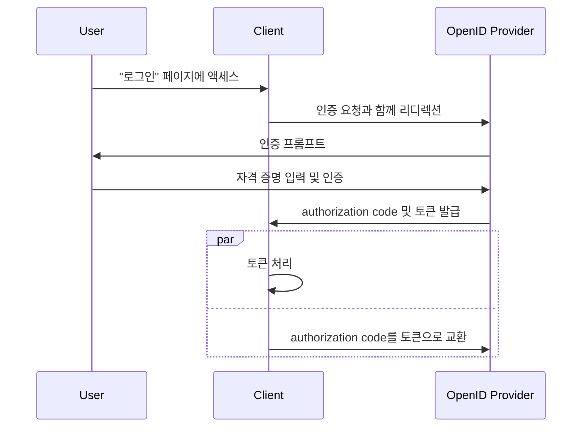

## 하이브리드 플로우 (Hybrid flow)란 무엇인가?

하이브리드 플로우 (Hybrid flow)는 <Ref slug="authorization-code-flow" />와 <Ref slug="implicit-flow" />의 특성을 결합한 인증 (Authentication) 프로세스입니다. 하이브리드 플로우 (Hybrid flow)는 <Ref slug="oauth-2.0" /> 사양의 일부가 아니며, <Ref slug="openid-connect" />가 제공하는 확장이라는 점을 유의해야 합니다.

이 플로우는 사용자 인증 (Authentication)에서 보안과 사용성의 균형을 제공하도록 설계되었습니다. 그러나, 하이브리드 플로우 (Hybrid flow)는 implicit flow와 관련된 [보안 고려 사항](#security-considerations)으로 인해 새로운 애플리케이션에서는 권장되지 않습니다. 하이브리드 플로우 (Hybrid flow)의 인기 있는 대안은 더 나은 보안을 위해 <Ref slug="pkce" />를 사용하는 authorization code flow입니다.

## 하이브리드 플로우 (Hybrid flow) 작동 방식

하이브리드 플로우 (Hybrid flow)의 주요 단계를 살펴보겠습니다:

1. 다른 OIDC 플로우와 유사하게, 하이브리드 플로우 (Hybrid flow)는 <Ref slug="client" />가 <Ref slug="openid-connect" headingId="openid-provider-op" />에 <Ref slug="authentication-request" />를 시작함으로써 시작됩니다.

    참고: 클라이언트는 `response_type` 매개변수에 `code` 및 최소 하나의 `id_token` 또는 `token`의 조합을 포함해야 하며, 세 가지 가능한 조합이 있습니다:

      - `code id_token`: 클라이언트는 authorization code와 ID 토큰을 기대합니다.
      - `code token`: 클라이언트는 authorization code와 access token을 기대합니다.
      - `code id_token token`: 클라이언트는 authorization code, ID 토큰, 및 access token을 기대합니다.

    요구 사항은 명확합니다: 클라이언트는 authorization code 및 하나 이상의 토큰을 기대하며, 이는 각각 authorization code flow와 implicit flow에 해당합니다.
2. 사용자는 <Ref slug="openid-connect" headingId="openid-provider-op" />에서 인증 (Authentication)합니다.
3. <Ref slug="openid-connect" headingId="openid-provider-op" />는 사용자에게 authorization code와 요청된 토큰을 클라이언트 애플리케이션으로 리디렉션합니다.
4. 클라이언트 애플리케이션은 토큰을 처리하여 사용자를 대신해 보호된 리소스에 접근할 수 있으며, <Ref slug="token-request" />를 통해 추가 토큰을 얻기 위해 authorization code를 사용할 수 있습니다.

다음은 하이브리드 플로우 (Hybrid flow)의 간단한 시퀀스 다이어그램입니다:



다음은 하이브리드 플로우 (Hybrid flow) 인증 (Authentication) 요청의 비규범적 예제입니다:

```http
GET /authorize?response_type=code%20id_token
  &client_id=YOUR_CLIENT_ID
  &redirect_uri=https%3A%2F%2Fclient.example.com%2Fcallback
  &scope=openid%20profile%20email
  &nonce=123456
  &state=abc123 HTTP/1.1
Host: your-openid-provider.com
```

### 하이브리드 플로우 (Hybrid flow) 인증 (Authentication) 요청의 주요 매개변수

하이브리드 플로우 (Hybrid flow) 인증 (Authentication) 요청에는 다음과 같은 주요 매개변수가 포함됩니다:

- **`response_type`**: 값은 `code`와 최소 하나의 `id_token` 또는 `token`의 조합이어야 합니다. 예를 들어, `code id_token` 또는 `code token`.
- **`client_id`**: <Ref slug="openid-connect" headingId="openid-provider-op" /> (authorization server)가 발급한 클라이언트 식별자.
- **`redirect_uri`**: 인증 (Authentication) 프로세스 후에 authorization server가 사용자를 보내는 URI.
- **`scope`**: 토큰에 대한 요청된 <Ref slug="scope">스코프</Ref> (권한).
- **`resource`**: 요청된 리소스에 대한 <Ref slug="resource-indicator" />를 지정하는 선택적 매개변수입니다. 이 매개변수를 사용하려면 authorization server가 [RFC 8707](https://datatracker.ietf.org/doc/html/rfc8707)을 지원해야 합니다.

전체 매개변수 목록과 설명은 [하이브리드 플로우 (Hybrid flow)를 사용한 인증](https://openid.net/specs/openid-connect-core-1_0.html#HybridFlowAuth)을 참조하세요.

## 보안 고려사항

하이브리드 플로우 (Hybrid flow)에는 보안 한계로 잘 알려진 implicit flow가 포함되어 있습니다. 토큰이 여전히 프론트 채널(브라우저)을 통해 전송되기 때문에 잠재적인 공격에 노출될 수 있습니다. 이러한 우려로 인해 implicit flow는 <Ref slug="oauth-2.1" />에서 폐기될 예정입니다.

<Ref slug="authorization-code-flow" />와 <Ref slug="pkce" />를 사용하는 것이 하이브리드 플로우 (Hybrid flow)의 추천 대안입니다. 이는 프론트 채널에서 토큰을 노출하지 않고 사용자를 안전하게 인증 (Authentication)하는 방법을 제공합니다.

<SeeAlso slugs={["openid-connect", "oauth-2.1", "authorization-code-flow", "pkce", "implicit-flow"]} />

<Resources
  urls={[
    "https://blog.logto.io/implicit-flow-is-dead",
    "https://blog.logto.io/oauth-2-1",
    "https://openid.net/specs/openid-connect-core-1_0.html#HybridFlowAuth",
  ]}
/>