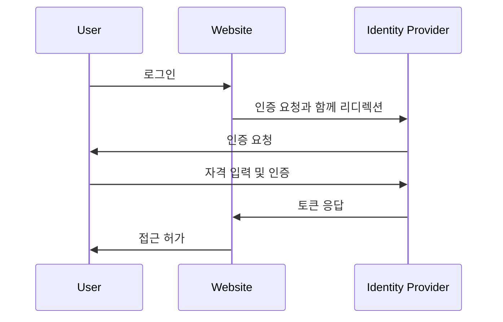

## ID 및 접근 관리 (IAM)란 무엇인가?

정의에서 제시된 것처럼, ID 및 접근 관리 (IAM)는 디지털 ID를 관리하고 <Ref slug="access-control" />을 수행하는 많은 측면을 포함하는 광범위한 개념입니다. 먼저 용어를 분해해 보겠습니다:

- **ID**: 사용자, 서비스 또는 장치의 디지털 표현입니다. ID는 식별자, 역할, 권한과 같은 속성을 포함할 수 있습니다.
- **접근**: 자원과 상호작용하고, 행동을 수행하고, 서비스를 사용하는 능력을 의미합니다. 요약하자면, 접근은 특정 자원에 대해 어떤 행동을 수행할 것인지에 관한 것입니다.

### ID 관리

ID 관리는 디지털 ID를 관리하고 인증하며 보안하는 과정입니다. 다음과 같은 주요 활동을 포함합니다:

- **ID 등록**: 사용자, 서비스 또는 장치에 대한 새로운 ID를 생성합니다.
- **ID 인증**: 비밀번호, 생체 인증 또는 다-factor 인증과 같은 다양한 메커니즘을 통해 ID의 소유를 검증합니다.
- **ID 보안**: 무단 접근, 오용 또는 노출로부터 ID를 보호합니다.

각 주제는 광범위하며 비밀번호 관리, ID 연합 및 ID 생명주기 관리와 같은 하위 주제로 나눌 수 있습니다.

### 접근 관리

접근 관리 (또는 <Ref slug="access-control" />)는 누가 특정 자원에 대해 어떤 행동을 할 수 있는지를 제어하는 과정입니다. 다음과 같은 주요 활동을 포함합니다:

- **접근 제어 정책**: 누가 어떤 자원에 접근할 수 있으며 어떤 행동을 할 수 있는지를 결정하는 규칙과 정책을 정의합니다.
- **접근 시행**: 인증, authorization 및 감사와 같은 메커니즘을 통해 접근 제어 정책을 시행합니다.
- **접근 거버넌스**: 규정 준수 및 보안 모범 사례를 보장하기 위해 접근 권한을 모니터링하고 관리합니다.

각 활동은 정의된 정책에 따라 권한 있는 ID (사용자, 서비스 또는 장치)만이 자원에 접근할 수 있도록 보장하는데 중요한 역할을 합니다.

## IAM의 구성 요소는 무엇인가?

응용에서 IAM은 소프트웨어, 서비스 및 모범 사례의 조합을 사용하여 구현됩니다. IAM의 중요한 두 가지 구성 요소는 다음과 같습니다:

- **<Ref slug="identity-provider" />**: 사용자 신원 및 인증을 관리하는 서비스입니다.
- **<Ref slug="service-provider" />**: authentication 및 authorization을 위해 ID 제공자에 의존하는 서비스입니다. 대부분의 경우, 이는 여러분이 개발 중인 애플리케이션 또는 서비스입니다.

ID 제공자와 서비스 제공자 간의 명확한 분리는 IAM을 애플리케이션 논리에서 분리하여 관리 및 확장을 용이하게 만듭니다.

## 실전에서의 ID 및 접근 관리

IAM이 어떻게 작동하는지 예를 들어보겠습니다: 여러분이 웹사이트에 로그인을 할 때, 여러분의 신원을 검증하고 접근을 부여하는 과정은 ID 및 접근 관리 프로세스로 볼 수 있습니다.

보통, IAM 프로세스는 두 가지 주요 단계로 구성됩니다: 인증과 authorization:

- <Ref slug="authentication" />은 "어떤 ID를 소유하고 있습니까?"라는 질문에 답합니다.
- <Ref slug="authorization" />은 "무엇을 할 수 있습니까?"라는 질문에 답합니다.

> 때때로, authentication은 "당신은 누구인가?"로 해석될 수도 있습니다. 그러나 디지털 ID를 논의할 때, authentication을 "ID 소유를 증명하는 것"으로 나타내는 것이 더 정확합니다.

게다가, ID 및 접근 관리 개념은 심지어 WIAM (Workforce IAM) 및 CIAM (Customer IAM)과 같은 새로운 개념을 만들어 내기도 합니다.

WIAM과 CIAM은 동일한 기반을 공유하지만, 서로 다른 사용 사례를 가지고 있습니다: WIAM은 일반적으로 내부 사용자에게 사용되며, CIAM은 외부 고객에게 사용됩니다. 몇 가지 예시:

- **WIAM**: 여러분의 회사는 직원들을 위한 통합 ID 시스템을 가지고 있어서 모든 사람이 동일한 계정을 사용해 소프트웨어 구독, 클라우드 컴퓨팅 서비스와 같은 회사 자원에 접근할 수 있습니다.
- **CIAM**: 여러분의 온라인 서점은 고객과 판매자를 위한 사용자 ID 시스템이 필요합니다. 로그인 경험은 전환 경로의 상단에 위치하므로 가입의 중요한 부분입니다.

CIAM과 관련된 주제를 더 알고 싶다면, [CIAM 101: Authentication, Identity, SSO](https://blog.logto.io/ciam-101-intro-authn-sso)를 참조할 수 있습니다.

### 인증

IAM에서 사용되는 일반적인 인증 방법은 다음과 같습니다:

- **비밀번호 기반 인증**: 가장 일반적인 방법으로, 사용자가 ID를 증명하기 위해 사용자 이름과 비밀번호를 제공합니다.
- **<Ref slug="passwordless" /> 인증**: 이메일 또는 전화로 전송된 일회용 코드를 사용하는 것과 같이 비밀번호 없이 사용자가 로그인할 수 있게 하는 방법입니다. passwordless 인증은 생체 인증과 같은 다른 방법을 지칭할 수도 있습니다.
- **소셜 로그인**: 사용자가 Google, Facebook 또는 Twitter와 같은 소셜 미디어 계정을 사용해 로그인할 수 있게 하는 방법입니다.
- **<Ref slug="passkey" /> (WebAuthn)**: USB 키나 WebAuthn을 지원하는 스마트폰과 같은 보안 키를 사용해 사용자가 로그인할 수 있게 하는 방법입니다.
- **생체 인증**: 지문, 안면 인식 또는 음성 인식과 같은 신체적 특성을 사용해 사용자의 ID를 검증하는 방법입니다.
- **<Ref slug="machine-to-machine" /> 인증**: 서비스 또는 장치가 API 키 또는 인증서를 사용하여 인간의 개입 없이 상호 인증할 수 있게 하는 방법입니다.

추가 보안 계층으로, <Ref slug="mfa" />는 이러한 인증 방법과 결합해 사용할 수 있습니다. MFA는 사용자가 ID를 증명하기 위해 두 개 이상의 요소를 제공해야 한다는 것으로, 예를 들어 알고 있는 것 (비밀번호), 소유한 것 (보안 키 또는 <Ref slug="totp" />), 또는 그 자신 (생체 데이터) 등을 의미합니다.

### 권한 부여

authentication이 설정되면, authorization은 ID가 수행할 수 있는 행동을 결정합니다. authorization은 ID의 역할, 그룹 멤버십, 권한, 속성, 정책 등 다양한 요소를 기반으로 할 수 있습니다. 몇 가지 일반적인 authorization 모델은 다음과 같습니다:

- **<Ref slug="rbac" />**: 권한을 역할에 할당하고, 그런 다음 역할을 ID에 할당하는 모델입니다. 예를 들어, 직원 역할은 특정 자원에 접근할 수 있으며, 관리자 역할은 모든 자원에 접근할 수 있습니다.
- **<Ref slug="abac" />**: ID, 자원 및 환경의 속성(속성)을 사용해 접근 제어 결정을 내리는 모델입니다. 예를 들어, "부서=엔지니어링"이라는 속성을 가진 ID는 엔지니어링 자원에 접근할 수 있습니다.
- **정책 기반 접근 제어 (PBAC)**: 정책을 사용해 접근 제어 규칙을 정의하는 모델입니다. 정책은 시간, 위치, 장치 유형 등 다양한 요소를 기반으로 할 수 있습니다.
- **세밀한 접근 제어**: 개별 자원 또는 행동 수준에서 권한을 설정할 수 있는 더 세부적인 접근 제어를 제공하는 모델입니다.

## IAM에 널리 사용되는 오픈 스탠더드는 무엇인가?

IAM에서 널리 사용되는 여러 오픈 스탠더드 및 프로토콜이 있습니다:

- **<Ref slug="oauth-2.0" />**: 사용자의 자격 증명을 공유하지 않고도 애플리케이션이 사용자를 대신해 자원에 접근할 수 있게 하는 프로토콜입니다. OAuth 2.0은 일반적으로 third-party 애플리케이션이 사용자의 Google 드라이브 파일에 접근하도록 허용하는 것과 같은 authorization에 사용됩니다.
- **<Ref slug="openid-connect" />**: OAuth 2.0 위에 구축된 신원 계층으로, 애플리케이션이 사용자의 신원을 확인하고 사용자에 대한 기본 프로필 정보를 획득할 수 있게 합니다. Single sign-on (SSO)은 OpenID Connect의 일반적인 사용 사례입니다. 현대 IAM에서는 OAuth 2.0과 OpenID Connect를 결합해 사용하는 것이 일반적입니다.
- **<Ref slug="saml" />**: ID 제공자와 서비스 제공자 간의 인증 및 authorization 데이터를 교환하기 위한 XML 기반 표준입니다. SAML은 엔터프라이즈 환경에서 SSO에 일반적으로 사용됩니다.
- **SCIM (System for Cross-domain Identity Management)**: ID 제공자와 서비스 제공자 간의 사용자 ID 정보 교환을 자동화하는 표준입니다. SCIM은 클라우드 기반 애플리케이션에서 사용자 프로비저닝 및 프로비저닝 해제에 일반적으로 사용됩니다.

## IAM 설계를 위한 주요 고려사항은 무엇인가?

IAM 시스템을 설계할 때 고려해야 할 몇 가지 주요 사항이 있습니다:

- **보안**: 보안은 IAM에서 가장 중요합니다. 강력한 비밀번호 해싱 사용, MFA 시행, 피싱 및 강제 공격과 같은 일반적인 공격으로부터 보호하는 것을 고려하며 인증 방법이 모범 사례를 따르고 있는지 확인합니다.
- **프라이버시**: 필요한 정보만 수집하고 필요할 때 사용자 동의를 얻어 사용자 프라이버시를 존중하십시오.
- **확장성**: 많은 수의 사용자와 애플리케이션을 처리할 수 있도록 IAM 시스템을 확장 가능하게 만들십시오. 확장성을 위해 클라우드 기반 ID 제공자를 사용하는 것을 고려하십시오.
- **상호 운용성**: 오픈 스탠더드를 사용하면 다양한 시스템 간의 상호 운용성을 허용하는 이점이 있습니다. 예를 들어, Google, Facebook, Microsoft와 같은 대부분의 인기 있는 ID 제공자는 OAuth 2.0 및 OpenID Connect를 지원합니다.
- **사용자 경험**: authentication 및 authorization을 위한 사용자 경험은 사용자 전환 및 유지에 크게 영향을 미칩니다. 보안과 사용 편의성의 균형을 맞추는 것은 IAM에서 예술입니다.

<SeeAlso slugs={['openid-connect', 'oauth-2.0', 'single-sign-on', 'enterprise-sso']} />

<Resources
  urls={[
    "https://blog.logto.io/ciam-101-intro-authn-sso",
    "https://blog.logto.io/ciam-102-authz-and-rbac"
  ]}
/>
