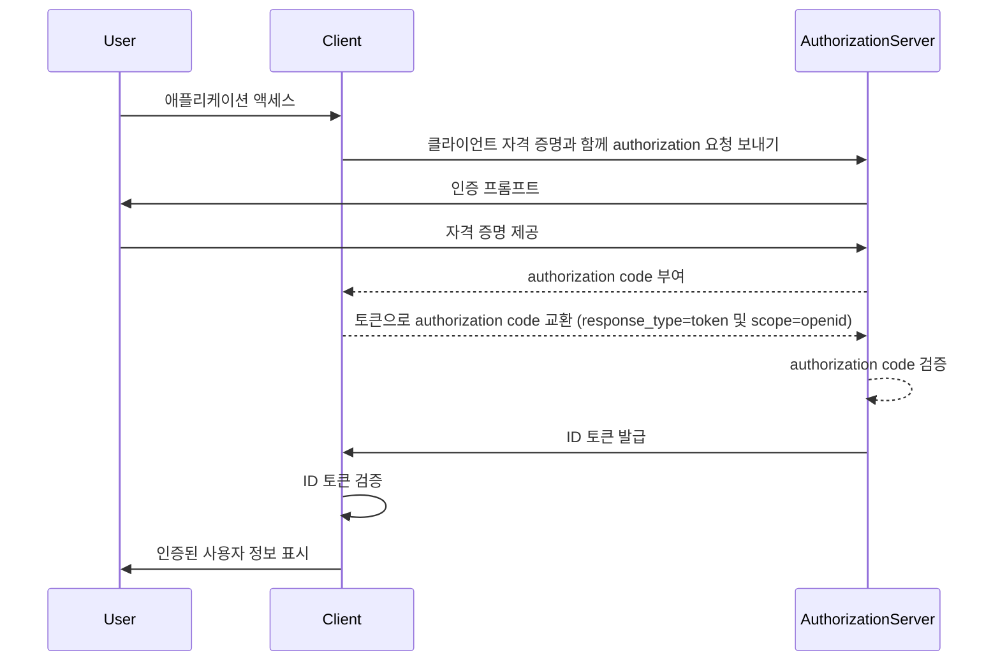

## ID 토큰이란?

ID 토큰은 인증된 사용자에 대한 정보를 포함하는 특정 유형의 보안 토큰으로, 성공적인 <Ref slug="authentication" /> 후 클라이언트 애플리케이션에 전달됩니다. ID 토큰은 <Ref slug="openid-connect" />를 <Ref slug="oauth-2.0" />과 구별하는 핵심 기능입니다. OAuth 2.0이 오로지 authorization에 초점을 맞추는 반면, OIDC는 ID 토큰을 도입하여 사용자 authentication을 추가하므로 이를 기반으로 구축됩니다.

OIDC 인증 프로세스에서 클라이언트 애플리케이션(신뢰 당사자)은 사용자를 authorization server로 리디렉션하여 인증을 시작합니다. 성공적인 인증 후, 서버는 <Ref slug="access-token" />과 같은 다른 토큰과 함께 ID 토큰을 응답합니다. ID 토큰은 일반적으로 <Ref slug="jwt" />로 인코딩되며 사용자의 식별자(sub), issuer(iss), audience(aud) 및 다른 사용자 관련 정보를 포함하는 주요 claim을 포함합니다.

ID 토큰의 주요 기능은 사용자의 신원을 확인하고 이 정보를 클라이언트 애플리케이션에 전송하는 것입니다. 이를 통해 애플리케이션은 자격 증명을 직접 처리하지 않고도 사용자를 인증할 수 있습니다. 클라이언트는 authorization server에 의해 사용자가 인증된 후에만 ID 토큰을 받기 때문에 ID 토큰은 사용자의 신원을 확인하는 안전한 방법으로 사용할 수 있습니다.

## ID 토큰은 어떻게 작동하나요?

클라이언트 애플리케이션은 사용자를 authorization server로 리디렉션하여 인증 프로세스를 시작합니다. 사용자는 서버에 인증하고 서버는 ID 토큰과 access token과 같은 다른 토큰을 발급합니다. ID 토큰은 클라이언트 애플리케이션으로 반환되며, 이는 사용자의 신원을 확인하는 데 사용할 수 있습니다.

OIDC는 인기 있고 표준화된 프로토콜이기 때문에, 많은 라이브러리와 프레임워크가 ID 토큰 처리를 위한 내장 지원을 제공합니다. 이는 클라이언트 애플리케이션에 ID 토큰을 쉽게 통합할 수 있도록 하며, <Ref slug="single-sign-on" /> 및 연합된 신원 시나리오에서 널리 사용됩니다.

## ID 토큰의 claim

ID 토큰은 인증된 사용자에 대한 <Ref slug="claim" /> 세트를 포함하는 JWT입니다. 이러한 claim은 [JWT 사양](https://datatracker.ietf.org/doc/html/rfc7519#section-4)에 정의된 표준 JWT claim과 사용자 신원 정보를 전달하는 데 사용되는 OIDC 전용 claim을 포함합니다.

JWT 표준 토큰 claim:

- **iss (Issuer)**: 필수. issuer claim은 ID 토큰의 발급자를 식별합니다. 이는 일반적으로 토큰을 발급한 authorization server의 URL입니다.
- **sub (Subject)**: 필수. subject claim은 ID 토큰이 참조하는 사용자를 식별합니다. 이는 일반적으로 사용자의 고유 식별자입니다.
- **aud (Audience)**: 필수. audience claim은 ID 토큰의 <Ref slug="audience" />를 식별합니다. 이는 일반적으로 토큰을 요청한 클라이언트 애플리케이션입니다.
- **exp (Expiration time)**: 필수. expiration time claim은 토큰이 만료되는 시간을 식별합니다. 이 시간 이후에는 토큰이 처리에 수락되어서는 안 됩니다.
- **iat (Issued at)**: 필수. issued at claim은 토큰이 발급된 시간을 식별합니다.
- **auth_time (Authentication time)**: 선택적. authentication time claim은 사용자가 인증된 시간을 식별합니다. 이 claim은 사용자가 현재 세션 중에 인증된 경우에만 존재합니다.
- **nonce**: 선택적. nonce claim은 ID 토큰과 클라이언트 세션을 연결하는 데 사용됩니다. 일반적으로 재실행 공격을 방지하기 위해 사용됩니다.

OIDC 표준 사용자 정보 claim:

- **name**: 사용자의 전체 이름.
- **given_name**: 사용자의 이름.
- **family_name**: 사용자의 성.
- **middle_name**: 사용자의 중간 이름.
- **nickname**: 사용자의 닉네임 또는 다른 짧은 이름.
- **preferred_username**: 사용자가 선호하는 사용자 이름.
- **profile**: 사용자 프로필 페이지로 연결되는 URL.
- **picture**: 사용자 프로필 사진으로 연결되는 URL.
- **website**: 사용자의 웹사이트로 연결되는 URL.
- **email**: 사용자의 이메일 주소.
- **email_verified**: 사용자의 이메일 주소가 인증되었는지를 나타내는 부울 값.
- **gender**: 사용자의 성별.
- **birthdate**: 사용자의 생년월일. YYYY-MM-DD 형식의 문자열로 표현됩니다.
- **zoneinfo**: 사용자의 시간대. [IANA 시간대 데이터베이스](https://www.iana.org/time-zones)의 문자열.
- **locale**: 사용자의 로케일. 날짜, 시간 및 숫자 형식을 위한 사용자의 선호 언어 및 지역을 나타냅니다.
- **phone_number**: 사용자의 전화번호.
- **phone_number_verified**: 사용자의 전화번호가 인증되었는지를 나타내는 부울 값.
- **address**: 사용자의 우편 주소. 값은 사용자의 주소 정보를 포함하는 JSON 객체입니다.
- **updated_at**: 사용자의 정보가 마지막으로 업데이트된 시간.

이러한 claim은 ID 토큰에 사용자 신원 정보를 전달하는 표준화된 방법을 제공합니다. 사양은 표준 claim 세트를 정의하는 것에만 제한되지만, 추가적인 사용자 특정 정보를 전달하기 위해 맞춤형 claim도 ID 토큰에 포함될 수 있습니다.

## ID 토큰 검증

클라이언트 애플리케이션이 ID 토큰을 받으면, 토큰의 신뢰성과 무결성을 보장하기 위해 이를 검증해야 합니다. 검증 과정은 일반적으로 다음 단계를 포함합니다:

1. **서명 검증**: 클라이언트는 authorization server의 공개 키를 사용하여 ID 토큰의 서명을 검증해야 합니다. 이를 통해 토큰이 변경되지 않았고 예상된 당사자가 발급했음을 보장합니다.
2. **발급자 확인**: 클라이언트는 ID 토큰의 `iss` claim이 토큰을 발급한 authorization server의 URL과 일치하는지 확인해야 합니다. 이는 토큰 대체 공격을 방지하는 데 도움이 됩니다.
3. **audience 확인**: 클라이언트는 ID 토큰의 `aud` claim이 클라이언트 애플리케이션의 `client_id`와 일치하는지 확인해야 합니다. 이는 토큰이 클라이언트 애플리케이션에 대해 발급되었음을 보장합니다.
4. **만료 시간 확인**: 클라이언트는 ID 토큰의 `exp` claim이 지나지 않았는지 확인해야 합니다. 토큰이 만료된 경우, 이는 수락되지 않아야 합니다. 구현에서는 시계 오차를 고려하여 약간의 여유를 제공할 수 있습니다.
5. **nonce 확인**: 클라이언트가 인증 요청에서 `nonce` 매개 변수를 포함한 경우, ID 토큰의 `nonce` claim이 `nonce` 매개 변수의 값과 일치하는지 확인해야 합니다. 이는 재실행 공격을 방지하는 데 도움이 됩니다.

## ID 토큰 대 access token

OIDC에서 ID 토큰과 access token 모두 널리 사용되지만, 이들은 다른 목적을 가지고 있으며 명확한 특징을 가지고 있습니다:

|              | ID 토큰                                                                               | Access token                                                                                                                 |
| ------------ | -------------------------------------------------------------------------------------- | ---------------------------------------------------------------------------------------------------------------------------- |
| **목적**  | 사용자의 신원을 확인하고 사용자 정보를 클라이언트 애플리케이션에 전송합니다. | 사용자를 대신하여 보호된 리소스에 대한 액세스를 제공합니다.                                                                |
| **형식**   | 일반적으로 사용자 신원 claim을 포함하는 JWT입니다.                                    | JWT 또는 <Ref slug="opaque-token" />일 수 있습니다.                                                                       |
| **Audience** | 토큰을 요청한 클라이언트 애플리케이션을 대상으로 합니다.                          | 보호된 리소스를 호스팅하는 리소스 서버를 대상으로 합니다.                                                         |
| **수명** | 일반적으로 몇 분 동안 유효한 단기 토큰입니다. 단일 사용만 가능합니다.        | 장기간 유효한 토큰으로, 장기간(예: 몇 시간) 동안 유효합니다. 유효 기간 내에서 여러 번 재사용할 수 있습니다. |
| **내용** | 이름, 이메일 및 기타 사용자 특정 데이터와 같은 사용자 신원 정보를 포함합니다.  | 특정 리소스에 대한 사용자의 권한(scope) 정보를 포함합니다.                                            |

## ID 토큰 사용을 위한 모범 사례

OIDC에서 ID 토큰을 사용할 때, 인증 프로세스의 보안과 무결성을 보장하기 위해 모범 사례를 따르는 것이 중요합니다. 몇 가지 주요 모범 사례는 다음과 같습니다:

1. **ID 토큰 검증**: authorization server에서 수신한 ID 토큰의 신뢰성과 무결성을 보장하기 위해 항상 검증하십시오. 이는 토큰 대체 공격 및 무단 액세스를 방지하는 데 도움이 됩니다.
2. **보안 채널 사용**: ID 토큰이 가로채이거나 변경되지 않도록 보안 채널(예: HTTPS)을 통해 전송되도록 합니다.
3. **민감한 정보 보호**: JWT는 일반적으로 인코딩되지만 암호화되지는 않아 콘텐츠가 투명합니다. 토큰 유출 시 민감한 데이터가 노출되지 않도록 ID 토큰 페이로드에 민감한 정보를 포함하지 마십시오.
4. **authorization에 사용하지 않음**: ID 토큰은 사용자 authentication을 위한 것이며 authorization 목적으로 사용해서는 안 됩니다. 보호된 리소스에 대한 authorization은 access token을 사용하십시오.
5. **단일 사용**: ID 토큰은 일반적으로 단일 사용을 의도합니다. 클라이언트 애플리케이션이 ID 토큰을 검증한 후에는 후속 요청이나 세션 상태 보존을 위해 재사용해서는 안 됩니다. 사용자 세션 상태를 유지하려면 클라이언트 애플리케이션이 <Ref slug="refresh-token" /> 및 토큰 교환 요청과 같은 메커니즘을 사용해야 합니다. (리프레시 토큰은 만료되면 새로운 access token과 ID 토큰을 얻기 위해 사용할 수 있는 장기 opaque token입니다.)

<SeeAlso slugs={["openid-connect", "jwt", "signing-key", "access-token"]} />
