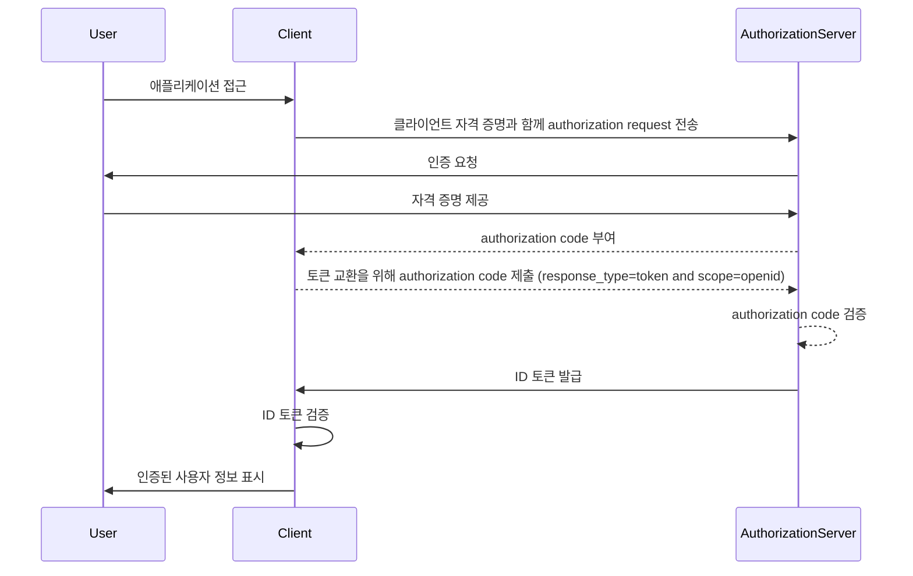

## ID 토큰이란?

ID 토큰은 인증된 사용자에 대한 정보를 포함하는 특정 유형의 보안 토큰으로, 성공적인 인증 후 클라이언트 애플리케이션에 전달됩니다. ID 토큰은 OpenID Connect (OIDC)와 OAuth 2.0을 구분하는 핵심 기능입니다. OAuth 2.0이 인증에 집중하는 반면, OIDC는 ID 토큰을 추가하여 사용자 인증을 제공합니다.

OIDC 인증 프로세스에서 클라이언트 애플리케이션 (신뢰 당사자)은 사용자를 인증 서버로 리디렉션하여 인증을 시작합니다. 성공적인 인증 후 서버는 ID 토큰과 함께 액세스 토큰 같은 다른 토큰들을 응답합니다. ID 토큰은 일반적으로 JWT (JSON Web Token)로 인코딩되며 사용자의 식별자 (sub), 발급자 (issuer), audience (aud) 및 기타 사용자 관련 정보를 포함하는 주요 클레임을 포함합니다.

ID 토큰의 주요 기능은 사용자의 신원을 확인하고 이 정보를 클라이언트 애플리케이션에 전송하는 것입니다. 이를 통해 애플리케이션은 자격 증명을 직접 관리하지 않고도 사용자를 인증할 수 있습니다. 클라이언트는 인증 서버에 의해 사용자가 이미 인증된 후 ID 토큰을 받으므로, ID 토큰은 사용자의 신원을 확인하는 안전한 방법으로 사용될 수 있습니다.

## ID 토큰은 어떻게 작동하나요?

클라이언트 애플리케이션은 사용자를 인증 서버로 리디렉션하여 인증 프로세스를 시작합니다. 사용자는 서버와 인증을 하고, 서버는 ID 토큰과 같은 여러 토큰을 발급합니다. 클라이언트 애플리케이션은 이를 받아 사용자의 신원을 확인할 수 있습니다.

OIDC는 인기 있고 표준화된 프로토콜이므로, 많은 라이브러리와 프레임워크에서 ID 토큰 처리를 위한 내장 지원을 제공합니다. 이는 ID 토큰을 클라이언트 애플리케이션에 손쉽게 통합할 수 있게 하며, SSO (single sign-on) 및 연합된 아이덴티티 시나리오에서 널리 사용됩니다.

## ID 토큰의 클레임

ID 토큰은 인증된 사용자에 대한 클레임 집합을 포함한 JWT (JSON Web Token)입니다. 이러한 클레임에는 [JWT 명세](https://datatracker.ietf.org/doc/html/rfc7519#section-4)에서 정의된 표준 JWT 클레임뿐만 아니라 사용자 아이덴티티 정보를 전달하는 OIDC 특정 클레임이 포함됩니다.

JWT 표준 토큰 클레임:

- **iss (Issuer)**: 필수. ID 토큰의 발급자를 식별하는 클레임. 일반적으로 토큰을 발급한 인증 서버의 URL입니다.
- **sub (Subject)**: 필수. ID 토큰이 가리키는 사용자를 식별하는 클레임. 일반적으로 사용자의 고유 식별자입니다.
- **aud (Audience)**: 필수. ID 토큰의 대상을 식별하는 클레임. 일반적으로 토큰을 요청한 클라이언트 애플리케이션입니다.
- **exp (Expiration time)**: 필수. 토큰의 만료 시간을 식별하는 클레임. 이 시간이 지나면 토큰은 처리에 사용되지 않아야 합니다.
- **iat (Issued at)**: 필수. 토큰 발급 시점을 식별하는 클레임.
- **auth_time (Authentication time)**: 선택 사항. 현재 세션 동안 사용자가 인증된 경우 인증 시점을 식별하는 클레임입니다.
- **nonce**: 선택 사항. ID 토큰과 클라이언트 세션을 연관시키는 클레임. 재생 공격을 방지하기 위해 사용됩니다.

OIDC 표준 사용자 정보 클레임:

- **name**: 사용자의 전체 이름.
- **given_name**: 사용자의 이름.
- **family_name**: 사용자의 성.
- **middle_name**: 사용자의 중간 이름.
- **nickname**: 사용자의 별명이나 다른 짧은 이름.
- **preferred_username**: 사용자가 선호하는 사용자 이름.
- **profile**: 사용자의 프로필 페이지로 연결되는 URL.
- **picture**: 사용자의 프로필 사진이 있는 URL.
- **website**: 사용자의 웹사이트로 연결되는 URL.
- **email**: 사용자의 이메일 주소.
- **email_verified**: 사용자의 이메일 주소가 인증되었는지를 나타내는 불리언 값.
- **gender**: 사용자의 성별.
- **birthdate**: 사용자의 출생일. YYYY-MM-DD 형식의 문자열로 나타냅니다.
- **zoneinfo**: 사용자의 시간대. [IANA 시간대 데이터베이스](https://www.iana.org/time-zones)의 문자열입니다.
- **locale**: 사용자의 로케일. 사용자에게 선호하는 언어 및 날짜, 시간, 숫자 형식을 나타냅니다.
- **phone_number**: 사용자의 전화번호.
- **phone_number_verified**: 사용자의 전화번호가 인증되었는지를 나타내는 불리언 값.
- **address**: 사용자의 우편 주소. 사용자의 주소 정보를 포함하는 JSON 객체입니다.
- **updated_at**: 사용자의 정보가 마지막으로 업데이트된 시간.

이러한 클레임은 ID 토큰 내에서 사용자 아이덴티티 정보를 전달하는 표준화된 방법을 제공합니다. 명세는 표준 클레임의 집합만 정의하지만, 사용자별 추가 정보를 전달하는 맞춤형 클레임도 ID 토큰에 포함될 수 있습니다.

## ID 토큰 검증

클라이언트 애플리케이션이 ID 토큰을 받으면, 해당 토큰의 진위성과 무결성을 검증해야 합니다. 검증 과정은 일반적으로 다음 단계를 포함합니다:

1. **서명 검증**: 클라이언트는 인증 서버의 공개 키를 사용하여 ID 토큰의 서명을 확인해야 합니다. 이는 토큰이 변조되지 않았고 예상된 당사자에 의해 발급되었음을 보장합니다.
2. **발급자 확인**: 클라이언트는 ID 토큰의 `iss` 클레임이 토큰을 발급한 인증 서버의 URL과 일치하는지 확인해야 합니다. 이는 토큰 대체 공격을 방지합니다.
3. **청중 확인**: 클라이언트는 ID 토큰의 `aud` 클레임이 클라이언트 애플리케이션의 `client_id`와 일치하는지 확인해야 합니다. 이는 해당 토큰이 클라이언트 애플리케이션을 위해 발급되었음을 보장합니다.
4. **만료 시간 확인**: 클라이언트는 ID 토큰의 `exp` 클레임이 지나지 않았는지 확인해야 합니다. 토큰이 만료되었으면 처리에 사용되지 않아야 합니다. 구현체는 시계 불일치를 고려하여 여유 시간을 제공할 수 있습니다.
5. **nonce 확인**: 클라이언트가 인증 요청에서 `nonce` 매개변수를 포함한 경우, ID 토큰의 `nonce` 클레임이 `nonce` 매개변수의 값과 일치하는지 확인해야 합니다. 이는 재생 공격을 방지합니다.

## ID 토큰 vs 액세스 토큰

ID 토큰과 액세스 토큰은 OIDC에서 널리 사용되지만, 각기 다른 목적을 가지고 있으며 고유한 특성을 가지고 있습니다:

|               | ID 토큰                                                                           | 액세스 토큰                                                                                                                          |
| ------------- | ---------------------------------------------------------------------------------- | ----------------------------------------------------------------------------------------------------------------------------------- |
| **목적**      | 사용자의 신원을 확인하고 사용자 정보를 클라이언트 애플리케이션에 전달합니다.       | 사용자 대신 보호된 자원에 접근할 수 있게 해줍니다.                                                                                  |
| **형식**      | 주로 사용자 아이덴티티 클레임을 포함하는 JWT입니다.                                 | JWT이거나 불투명 토큰 (임의의 문자열)일 수 있습니다.                                                                                |
| **대상**      | 토큰을 요청한 클라이언트 애플리케이션을 대상으로 합니다.                           | 보호된 자원을 제공하는 리소스 서버를 대상으로 합니다.                                                                               |
| **수명**      | 일반적으로 몇 분 동안 유효한 단기 토큰입니다. 한 번만 사용 가능합니다.               | 더 긴 기간 동안 유효한 장기 토큰입니다 (예: 몇 시간). 유효 기간 동안 여러 번 재사용할 수 있습니다.                                 |
| **내용**      | 이름, 이메일, 사용자에 대한 기타 사용자별 데이터를 포함한 사용자 아이덴티티 정보를 포함합니다. | 특정 자원에 대한 사용자의 권한 (scope) 정보를 포함합니다.                                                                            |

## ID 토큰 사용을 위한 모범 사례

OIDC에서 ID 토큰을 사용할 때, 인증 프로세스의 보안과 무결성을 보장하기 위해 모범 사례를 따르는 것이 중요합니다. 주요 모범 사례는 다음을 포함합니다:

1. **ID 토큰 검증**: 항상 인증 서버에서 수신한 ID 토큰을 검증하여 그 진위성과 무결성을 확인합니다. 이는 토큰 대체 공격 및 무단 접근을 방지합니다.
2. **보안 채널 사용**: ID 토큰이 보안 채널(예: HTTPS)을 통해 전송되도록 하여 교환 및 조작을 방지합니다.
3. **민감한 정보 보호**: JWT는 일반적으로 인코딩되어 있지만 암호화되지 않기 때문에 콘텐츠가 투명하게 보입니다. 토큰 누출 시 민감한 데이터의 노출을 방지하기 위해 ID 토큰 페이로드에 민감한 정보를 포함하지 않도록 합니다.
4. **인증 목적에 사용하지 않음**: ID 토큰은 사용자 인증을 위한 것이며 인증 목적으로 사용되지 않아야 합니다. 보호된 리소스에 접근하기 위해서는 인증을 위해 액세스 토큰을 사용합니다.
5. **단일 사용**: ID 토큰은 일반적으로 한 번만 사용하기 위한 것입니다. 클라이언트 애플리케이션이 ID 토큰을 검증한 후에는 후속 요청이나 세션 상태 보존을 위해 재사용하지 않아야 합니다. 사용자 세션 상태를 유지하려면 클라이언트 애플리케이션은 리프레시 토큰 및 토큰 교환 요청과 같은 메커니즘을 사용해야 합니다. (리프레시 토큰은 만료 시 새 액세스 토큰과 ID 토큰을 받을 수 있는 장기적인 불투명 토큰입니다.)

<SeeAlso slugs={["openid-connect", "jwt", "signing-key", "access-token"]} />
